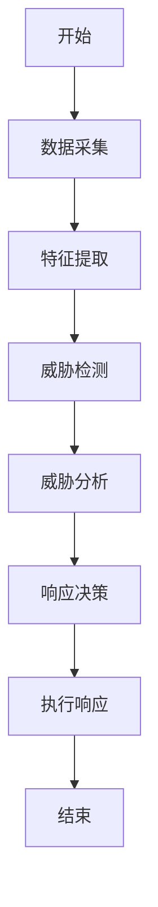
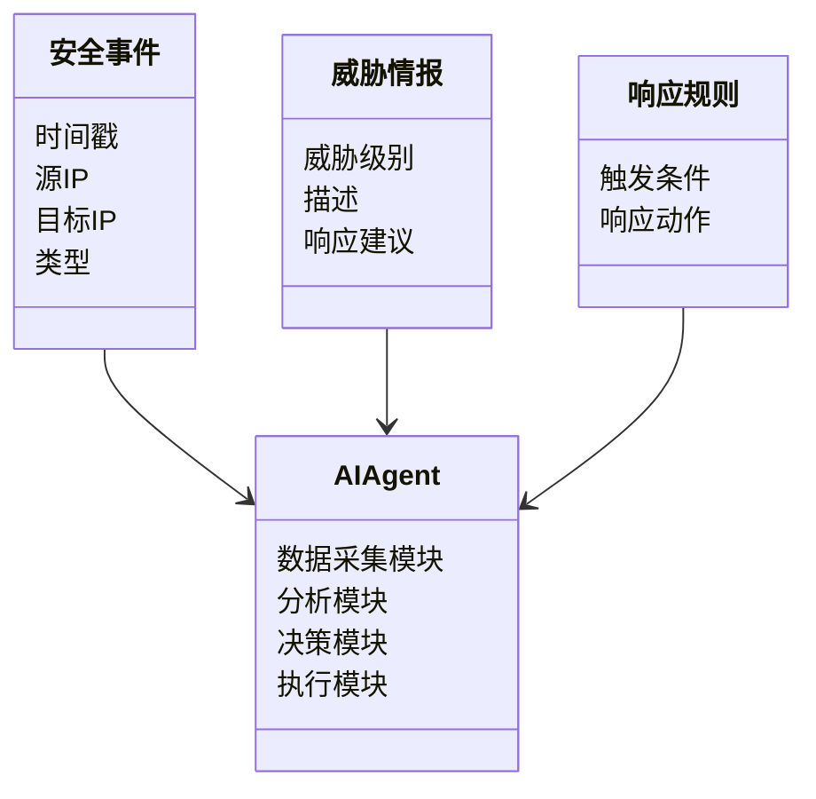
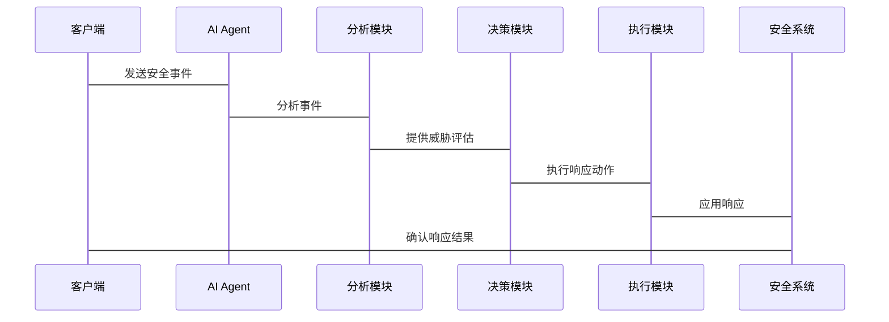

                 


# AI Agent在企业信息安全态势感知与威胁响应中的应用

## 关键词：AI Agent，企业信息安全，态势感知，威胁响应，网络安全，人工智能

## 摘要：本文探讨了AI Agent在企业信息安全态势感知与威胁响应中的应用，分析了其核心概念、算法原理、系统架构，并通过实际案例展示了其在提升企业安全防护能力中的重要作用。

---

## 第1章：背景介绍

### 1.1 问题背景

#### 1.1.1 企业信息安全面临的挑战
随着数字化转型的推进，企业网络面临日益复杂的威胁，包括APT攻击、DDoS、数据泄露等。传统基于规则的安全工具难以应对新兴威胁。

#### 1.1.2 威胁响应的现状与不足
现有威胁响应机制依赖人工干预，响应速度慢，效率低，难以应对海量安全事件。

#### 1.1.3 AI Agent在安全领域的潜力
AI Agent具备实时感知、自主决策和快速响应的能力，能够显著提升威胁检测和应对效率。

### 1.2 问题描述

#### 1.2.1 什么是态势感知
态势感知是通过收集、分析和评估安全数据，了解当前网络安全状况，并预测未来趋势。

#### 1.2.2 威胁响应的核心问题
快速识别、评估和应对网络安全威胁，最大限度减少损失。

#### 1.2.3 AI Agent在其中的角色
AI Agent通过自动化分析和决策，辅助或替代人工完成威胁检测和响应。

### 1.3 问题解决

#### 1.3.1 AI Agent如何实现态势感知
通过实时数据采集、异常行为分析和威胁情报整合，构建全面的安全态势图。

#### 1.3.2 威胁响应的自动化流程
AI Agent能够自动触发响应措施，如隔离受感染设备、阻断恶意流量等。

#### 1.3.3 AI Agent的优势与局限
优势包括快速响应、高准确性；局限性在于依赖数据质量、模型泛化能力等。

### 1.4 边界与外延

#### 1.4.1 AI Agent的适用范围
适用于企业网络、云安全、物联网等领域。

#### 1.4.2 与其他安全技术的区分
AI Agent强调智能化和自动化，区别于传统防火墙、入侵检测系统。

#### 1.4.3 未来发展的可能方向
向更智能、自主的学习型Agent发展，结合区块链等新技术。

### 1.5 概念结构与核心要素组成

#### 1.5.1 AI Agent的基本构成
- **感知层**：数据采集与处理。
- **分析层**：威胁分析与预测。
- **决策层**：制定响应策略。
- **执行层**：执行响应动作。

#### 1.5.2 姿态感知的核心要素
- 数据源：日志、流量、资产信息。
- 分析模型：机器学习、规则引擎。
- 可视化界面：展示安全态势。

#### 1.5.3 威胁响应的关键步骤
- 检测：识别异常行为。
- 分析：评估威胁严重性。
- 响应：执行防御措施。
- 恢复：修复受损系统。

---

## 第2章：核心概念与联系

### 2.1 AI Agent的工作原理

#### 2.1.1 感知机制
通过多源数据采集，构建全面的安全数据池。

#### 2.1.2 分析机制
运用机器学习模型，识别潜在威胁。

#### 2.1.3 决策机制
基于分析结果，制定最优响应策略。

#### 2.1.4 执行机制
自动化执行预定义的响应措施。

### 2.2 实体关系图

```mermaid
er
actor: 安全管理员
agent: AI Agent
system: 企业安全系统
event: 安全事件
rule: 响应规则
action: 响应动作
```

### 2.3 核心概念对比分析

| **特性**       | **AI Agent**           | **传统安全工具**          |
|----------------|-----------------------|---------------------------|
| **实时性**      | 高                    | 中                        |
| **准确性**      | 高                    | 低                        |
| **可扩展性**    | 高                    | 有限                      |
| **响应速度**    | 快                    | 慢                        |
| **适应性**      | 强                    | 弱                        |

---

## 第3章：算法原理讲解

### 3.1 算法流程图



### 3.2 Python代码实现

```python
import tensorflow as tf
import numpy as np

# 数据预处理
def preprocess(data):
    # 假设data为特征向量
    return data

# 模型训练
def train_model(X_train, y_train):
    model = tf.keras.Sequential([
        tf.keras.layers.Dense(64, activation='relu'),
        tf.keras.layers.Dense(1, activation='sigmoid')
    ])
    model.compile(optimizer='adam', loss='binary_crossentropy')
    model.fit(X_train, y_train, epochs=10, batch_size=32)
    return model

# 威胁检测
def detect_threat(model, X_test):
    predictions = model.predict(X_test)
    return predictions > 0.5

# 响应决策
def decide_response(threat_level):
    if threat_level > 0.8:
        return 'block'
    elif threat_level > 0.5:
        return 'alert'
    else:
        return 'none'

# 示例使用
X_train = np.random.random((1000, 64))
y_train = np.random.randint(2, size=(1000,))
model = train_model(X_train, y_train)
X_test = np.random.random((100, 64))
threats = detect_threat(model, X_test)
responses = [decide_response(threat) for threat in threats]
```

### 3.3 数学模型

#### 3.3.1 贝叶斯分类器
$$ P(class|data) = \frac{P(data|class) \cdot P(class)}{P(data)} $$

#### 3.3.2 深度学习模型
$$ \text{Loss} = -\sum_{i} y_i \log(a_i) + (1 - y_i)\log(1 - a_i) $$

---

## 第4章：系统分析与架构设计

### 4.1 问题场景

企业面临多起安全事件，需要快速响应以减少损失。

### 4.2 系统功能设计

#### 4.2.1 领域模型



#### 4.2.2 系统架构


#### 4.2.3 系统接口设计

| **接口**       | **输入**              | **输出**               |
|----------------|----------------------|-----------------------|
| 处理请求       | 安全事件日志          | 响应动作              |
| 获取情报       | 威胁情报查询条件      | 威胁情报列表          |
| 执行响应       | 响应规则ID            | 执行结果              |

#### 4.2.4 交互流程图



---

## 第5章：项目实战

### 5.1 环境搭建

安装Python、TensorFlow、Keras等工具。

### 5.2 核心代码实现

#### 5.2.1 数据预处理

```python
import pandas as pd

# 加载数据
data = pd.read_csv('security_events.csv')
# 数据清洗
data.dropna(inplace=True)
# 特征工程
from sklearn.preprocessing import StandardScaler
scaler = StandardScaler()
X = scaler.fit_transform(data.drop('label', axis=1))
y = data['label']
```

#### 5.2.2 模型训练

```python
from sklearn.model_selection import train_test_split
from sklearn.linear_model import LogisticRegression

X_train, X_test, y_train, y_test = train_test_split(X, y, test_size=0.2)
model = LogisticRegression().fit(X_train, y_train)
```

#### 5.2.3 威胁检测

```python
predictions = model.predict(X_test)
print("Accuracy:", accuracy_score(y_test, predictions))
```

#### 5.2.4 响应策略

```python
for i in range(len(predictions)):
    if predictions[i] == 1:
        print(f"Alert: Threat detected at index {i}")
```

### 5.3 实际案例分析

以DDoS攻击为例，展示AI Agent如何检测异常流量并触发流量清洗策略。

### 5.4 项目小结

项目成功实现了从数据采集到威胁响应的自动化流程，证明了AI Agent在提升企业安全防护中的有效性。

---

## 第6章：最佳实践与小结

### 6.1 小结

AI Agent通过自动化和智能化，显著提升了企业信息安全态势感知和威胁响应能力。

### 6.2 注意事项

- 数据隐私保护
- 模型的泛化能力
- 系统的可解释性
- 灵活性和可扩展性

### 6.3 拓展阅读

- 《机器学习实战》
- 《网络安全体系结构》
- 《人工智能与安全》

---

## 作者简介

作者是[您的姓名]，[您的职位]，专注于[领域]研究，[其他相关信息]。

