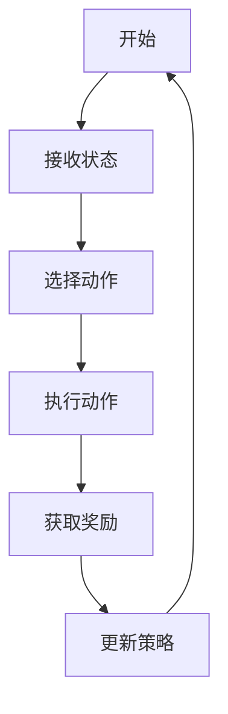
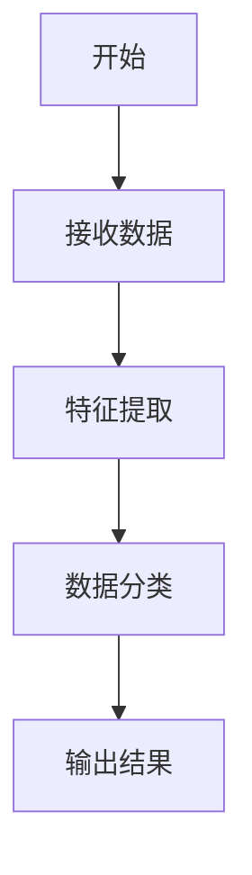
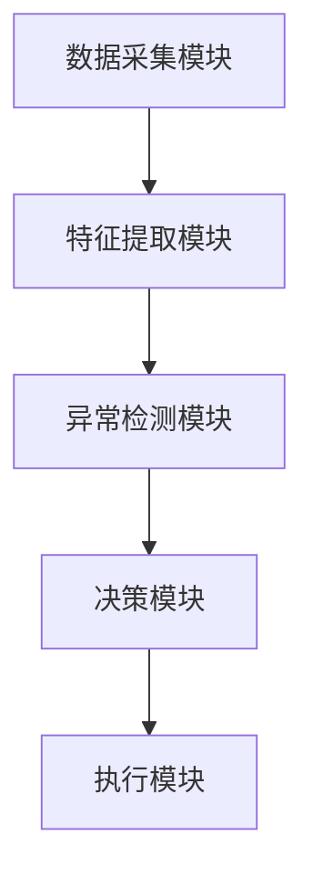
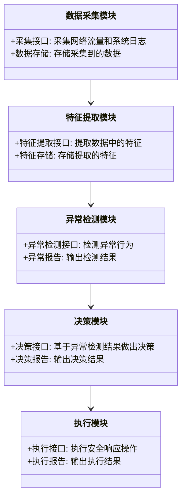
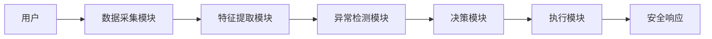
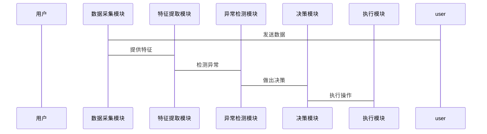

                 


# AI Agent在企业信息安全管理中的应用

> 关键词：AI Agent, 企业信息安全, 智能安全, 强化学习, 系统架构, 项目实战

> 摘要：随着企业数字化转型的推进，信息安全威胁日益复杂化和智能化。传统的信息安全管理模式已经难以应对新兴的安全威胁，而AI Agent作为一种智能化的安全管理工具，能够通过自主学习和决策，为企业提供更加高效、精准的安全防护。本文将从AI Agent的核心概念、算法原理、系统架构、项目实战等多个方面，详细探讨AI Agent在企业信息安全管理中的应用，并结合实际案例分析其优势和挑战。

---

# 第1章: 企业信息安全管理的挑战与AI Agent的引入

## 1.1 企业信息安全管理的现状与挑战

### 1.1.1 传统企业信息安全管理的痛点
企业在信息安全领域面临着多方面的挑战：
- **数据量激增**：企业每天生成海量数据，传统的基于规则的安全管理方式难以覆盖所有可能的威胁。
- **威胁复杂化**：攻击者利用AI技术进行攻击，传统的基于规则的安全工具难以应对未知威胁。
- **响应速度慢**：人工审核和响应速度较慢，难以应对实时的安全威胁。

### 1.1.2 数字化转型对企业信息安全的新要求
随着企业数字化转型的推进，信息安全需求也在发生变化：
- **实时性**：需要实时监控和响应安全威胁。
- **智能化**：需要智能化的工具来应对复杂的安全威胁。
- **自动化**：需要自动化处理部分安全问题，减少人工干预。

### 1.1.3 AI技术在信息安全领域的潜力
AI技术在信息安全领域的应用潜力主要体现在：
- **智能检测**：通过机器学习算法，能够发现传统方法难以识别的异常行为。
- **预测分析**：利用AI技术预测潜在的安全威胁，提前采取防御措施。
- **自动化响应**：通过AI Agent实现自动化的安全响应，提高应对速度。

## 1.2 AI Agent的核心概念与优势

### 1.2.1 AI Agent的定义与特点
AI Agent（人工智能代理）是一种能够感知环境、自主决策并执行任务的智能体。其特点包括：
- **自主性**：能够在没有人工干预的情况下独立运行。
- **反应性**：能够实时感知环境变化并做出响应。
- **学习能力**：能够通过学习不断优化自身的决策能力。

### 1.2.2 AI Agent在企业信息安全中的优势
AI Agent在企业信息安全中的优势主要体现在以下几个方面：
- **快速响应**：能够实时监控网络流量，发现异常行为后立即采取行动。
- **精准识别**：通过机器学习算法，能够精准识别潜在的安全威胁。
- **自动化处理**：能够自动执行安全响应操作，减少人工干预。

### 1.2.3 AI Agent与传统安全工具的对比
以下是AI Agent与传统安全工具的对比：

| 特性 | AI Agent | 传统安全工具 |
|------|-----------|---------------|
| 检测能力 | 强化学习驱动，能够发现未知威胁 | 基于规则，难以应对未知威胁 |
| 响应速度 | 实时响应，自动化处理 | 人工审核，响应速度较慢 |
| 可扩展性 | 能够适应复杂环境 | 扩展性有限 |

## 1.3 企业信息安全中引入AI Agent的必要性

### 1.3.1 提高安全威胁检测能力
AI Agent能够通过机器学习算法，发现传统安全工具难以识别的复杂威胁。

### 1.3.2 实现智能化的安全响应机制
AI Agent能够根据实时情况，动态调整安全策略，实现智能化的安全响应。

### 1.3.3 降低人为错误的影响
通过AI Agent的自动化处理，可以减少人为操作失误对安全造成的影响。

## 1.4 本章小结
本章主要介绍了企业信息安全管理面临的挑战以及引入AI Agent的必要性。通过对比分析，展示了AI Agent在提高检测能力、实现智能化响应以及降低人为错误方面的优势。

---

# 第2章: AI Agent的核心概念与原理

## 2.1 AI Agent的核心概念与原理

### 2.1.1 AI Agent的感知与决策机制
AI Agent的感知机制包括数据采集和特征提取两个部分：
- **数据采集**：通过网络日志、系统日志等数据源采集原始数据。
- **特征提取**：利用特征工程提取有用的特征，例如IP地址、时间戳、行为模式等。

决策机制基于强化学习算法，通过不断优化策略来实现最优决策。

### 2.1.2 AI Agent的自适应能力
AI Agent能够通过强化学习算法，不断优化自身的决策策略，从而实现自适应能力。

## 2.2 AI Agent的核心要素与属性特征

### 2.2.1 核心要素对比表格
以下是AI Agent的核心要素对比：

| 核心要素 | 描述 |
|----------|------|
| 感知能力 | 数据采集与特征提取能力 |
| 决策能力 | 基于强化学习的决策能力 |
| 执行能力 | 自动化执行安全操作的能力 |
| 学习能力 | 基于强化学习的自适应优化能力 |

### 2.2.2 ER实体关系图
以下是AI Agent的ER实体关系图：

```mermaid
er
  actor: 用户
  agent: AI Agent
  threat: 威胁
  action: 行动
  relation: 属于
  用户 -- 属于 --> 威胁
  用户 -- 属于 --> 行动
  AI Agent -- 监测 --> 威胁
  AI Agent -- 执行 --> 行动
```

## 2.3 本章小结
本章主要介绍了AI Agent的核心概念与原理，包括感知与决策机制、自适应能力以及核心要素与属性特征。通过对比分析，展示了AI Agent在企业信息安全中的重要作用。

---

# 第3章: AI Agent的算法原理

## 3.1 AI Agent的核心算法

### 3.1.1 基于强化学习的决策算法
以下是基于强化学习的决策算法流程图：



以下是一个简单的强化学习算法实现示例：

```python
import numpy as np
from collections import deque
import random

class AI_Agent:
    def __init__(self, state_space, action_space):
        self.state_space = state_space
        self.action_space = action_space
        self.memory = deque(maxlen=1000)
        self.gamma = 0.95  # 折扣因子
        self.epsilon = 1.0  # 探索率
        self.epsilon_min = 0.01
        self.learning_rate = 0.01
        self.model = self._build_model()

    def _build_model(self):
        # 构建神经网络模型
        import tensorflow as tf
        model = tf.keras.Sequential()
        model.add(tf.keras.layers.Dense(24, input_dim=self.state_space, activation='relu'))
        model.add(tf.keras.layers.Dense(self.action_space, activation='linear'))
        model.compile(loss='mean_squared_error', optimizer=tf.keras.optimizers.Adam(lr=self.learning_rate))
        return model

    def remember(self, state, action, reward, next_state):
        self.memory.append((state, action, reward, next_state))

    def act(self, state):
        if random.random() < self.epsilon:
            return random.randint(0, self.action_space - 1)
        return np.argmax(self.model.predict(np.array(state).reshape(1, -1)))

    def replay(self, batch_size):
        if len(self.memory) < batch_size:
            return
        minibatch = random.sample(self.memory, batch_size)
        states = np.array([t[0] for t in minibatch])
        actions = np.array([t[1] for t in minibatch])
        rewards = np.array([t[2] for t in minibatch])
        next_states = np.array([t[3] for t in minibatch])

        targets = self.model.predict(states)
        next_target = self.model.predict(next_states)
        targets[range(batch_size), actions] = rewards + self.gamma * np.max(next_target, axis=1)

        self.model.fit(states, targets, epochs=1, verbose=0)

    def decay_epsilon(self):
        self.epsilon = max(self.epsilon_min, self.epsilon * 0.995)

    def get_action_space(self):
        return self.action_space
```

### 3.1.2 基于监督学习的分类算法
以下是基于监督学习的分类算法流程图：



以下是一个简单的监督学习算法实现示例：

```python
import numpy as np
from sklearn import datasets
from sklearn.model_selection import train_test_split
from sklearn.linear_model import Logi

# 加载数据集
digits = datasets.load_digits()
X = digits.data
y = digits.target

# 划分训练集和测试集
X_train, X_test, y_train, y_test = train_test_split(X, y, test_size=0.2)

# 初始化逻辑回归模型
model = Logi()
model.fit(X_train, y_train)

# 预测
y_pred = model.predict(X_test)

# 输出准确率
print("准确率:", model.score(X_test, y_test))
```

### 3.2 本章小结
本章主要介绍了AI Agent的核心算法，包括基于强化学习的决策算法和基于监督学习的分类算法。通过代码示例和流程图，展示了AI Agent在企业信息安全中的具体实现方式。

---

# 第4章: AI Agent的系统架构设计

## 4.1 问题场景介绍
企业信息安全管理中的常见问题包括：网络安全威胁、数据泄露、内部员工误操作等。AI Agent可以通过实时监控网络流量、系统日志等信息，发现异常行为并采取相应措施。

## 4.2 系统功能设计

### 4.2.1 系统功能模块
以下是系统功能模块图：



### 4.2.2 领域模型类图
以下是领域模型类图：



## 4.3 系统架构设计

### 4.3.1 系统架构图
以下是系统架构图：



### 4.3.2 系统接口设计
以下是系统接口设计图：



## 4.4 本章小结
本章主要介绍了AI Agent的系统架构设计，包括功能模块、领域模型类图、系统架构图以及系统接口设计。通过这些设计，展示了AI Agent在企业信息安全中的具体实现方式。

---

# 第5章: AI Agent的项目实战

## 5.1 环境安装与配置

### 5.1.1 安装Python环境
建议使用Python 3.6及以上版本。

### 5.1.2 安装依赖库
需要安装以下依赖库：
- TensorFlow
- Keras
- scikit-learn
- Mermaid
- Jupyter Notebook

## 5.2 核心代码实现

### 5.2.1 数据采集模块
以下是数据采集模块的代码示例：

```python
import logging
import sys
import time
from socket import socket, AF_INET, SOCK_STREAM

class DataCollector:
    def __init__(self, host='localhost', port=9999):
        self.host = host
        self.port = port
        self.sock = None

    def start(self):
        try:
            self.sock = socket(AF_INET, SOCK_STREAM)
            self.sock.bind((self.host, self.port))
            self.sock.listen(5)
            logging.info(f"数据采集模块启动，监听地址：{self.host}:{self.port}")
            while True:
                conn, addr = self.sock.accept()
                logging.info(f"连接到来：{addr[0]}:{addr[1]}")
                while True:
                    data = conn.recv(1024)
                    if not data:
                        break
                    # 处理数据
                    self.process_data(data)
                conn.close()
            self.sock.close()
        except Exception as e:
            logging.error(f"数据采集模块启动失败：{str(e)}")
            sys.exit(1)

    def process_data(self, data):
        # 处理接收到的数据
        pass

if __name__ == "__main__":
    collector = DataCollector()
    collector.start()
```

### 5.2.2 异常检测模块
以下是异常检测模块的代码示例：

```python
import numpy as np
from sklearn.ensemble import IsolationForest

class AnomalyDetection:
    def __init__(self, contamination=0.01):
        self.model = IsolationForest(n_estimators=100, max_samples=256, contamination=contamination)
        self.data = []

    def add_data(self, new_data):
        self.data.append(new_data)

    def detect(self):
        if len(self.data) < 10:
            return False, None
        X = np.array(self.data)
        y_pred = self.model.fit_predict(X)
        anomaly_idx = np.where(y_pred == -1)[0]
        if len(anomaly_idx) > 0:
            return True, anomaly_idx[-1]
        return False, None

if __name__ == "__main__":
    detector = AnomalyDetection()
    # 添加数据
    for i in range(20):
        detector.add_data(i)
    # 检测异常
    is_anomaly, index = detector.detect()
    print(f"检测到异常：{is_anomaly}")
    if is_anomaly:
        print(f"异常索引：{index}")
```

### 5.2.3 决策与执行模块
以下是决策与执行模块的代码示例：

```python
import subprocess
import logging

class DecisionModule:
    def __init__(self):
        pass

    def make_decision(self, anomaly_info):
        # 假设anomaly_info是异常检测模块返回的信息
        if anomaly_info['type'] == 'network':
            return '隔离IP'
        elif anomaly_info['type'] == 'file':
            return '删除文件'
        else:
            return '记录日志'

class ExecutionModule:
    def __init__(self):
        pass

    def execute(self, decision):
        if decision == '隔离IP':
            subprocess.run(['iptables', '-A', 'INPUT', '-s', '恶意IP', '-j', 'DROP'])
        elif decision == '删除文件':
            subprocess.run(['rm', '-rf', '恶意文件路径'])
        elif decision == '记录日志':
            logging.info("检测到异常行为，已记录日志")

if __name__ == "__main__":
    decision_module = DecisionModule()
    execution_module = ExecutionModule()
    # 假设anomaly_info是异常检测模块返回的信息
    anomaly_info = {'type': 'network', 'details': '恶意IP: 192.168.1.100'}
    decision = decision_module.make_decision(anomaly_info)
    execution_module.execute(decision)
```

## 5.3 代码解读与分析
### 5.3.1 数据采集模块
数据采集模块通过TCP/IP协议监听网络流量，接收数据后进行处理。

### 5.3.2 异常检测模块
异常检测模块使用Isolation Forest算法对数据进行异常检测，能够发现异常行为。

### 5.3.3 决策与执行模块
决策模块根据异常检测结果做出决策，执行模块根据决策执行相应的安全操作。

## 5.4 实际案例分析
假设企业网络中检测到一个恶意IP的网络攻击行为，AI Agent会执行以下步骤：
1. 数据采集模块捕获网络流量数据。
2. 异常检测模块识别出异常行为，并标记出恶意IP。
3. 决策模块根据异常信息做出“隔离IP”的决策。
4. 执行模块执行iptables命令，隔离恶意IP。

## 5.5 项目小结
通过本章的实战案例，展示了AI Agent在企业信息安全中的具体应用。通过代码实现，读者可以理解AI Agent的核心功能和技术实现。

---

# 第6章: 总结与扩展阅读

## 6.1 最佳实践 tips
- **数据质量**：确保数据采集的完整性和准确性。
- **模型优化**：定期更新模型参数，提高检测精度。
- **日志管理**：建立完善的日志系统，便于后续分析和追溯。

## 6.2 本章小结
本章总结了AI Agent在企业信息安全中的应用，并提出了最佳实践建议。通过实际案例分析，展示了AI Agent在企业信息安全中的巨大潜力。

## 6.3 注意事项
- AI Agent的引入需要与企业现有的安全体系相结合，不能完全替代传统安全工具。
- 需要建立完善的监控和预警机制，确保AI Agent的正常运行。

## 6.4 拓展阅读
- 《Deep Learning for Malware Detection》
- 《Reinforcement Learning in Cybersecurity》
- 《Applied AI in Enterprise Security》

---

# 结语
AI Agent作为人工智能技术在企业信息安全领域的典型应用，正在改变企业信息安全管理模式。通过智能化的威胁检测和自动化的安全响应，AI Agent能够有效应对日益复杂的网络安全威胁。未来，随着AI技术的不断发展，AI Agent在企业信息安全中的应用将更加广泛和深入。

