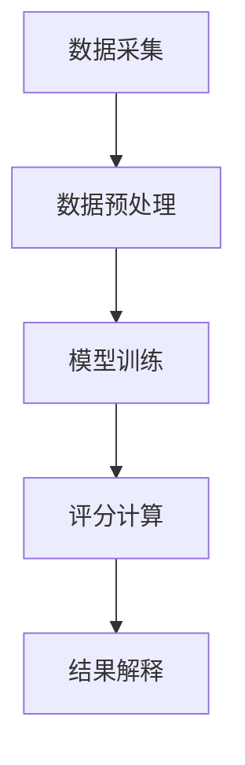
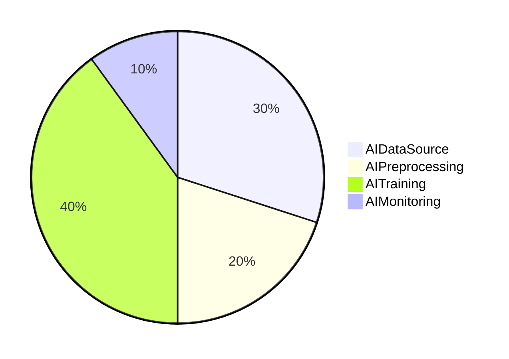
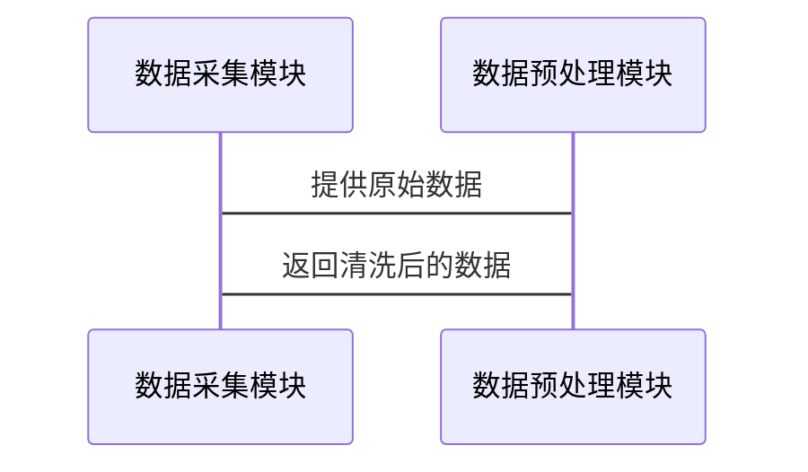

                 


# AI Agent在企业信用评分模型中的应用与优化

## 关键词：AI Agent, 企业信用评分模型, 机器学习, 强化学习, 算法优化, 系统架构

## 摘要：  
本文深入探讨了AI Agent在企业信用评分模型中的应用与优化。通过结合人工智能技术，我们提出了基于机器学习和强化学习的模型优化方法，旨在提高信用评分的准确性和效率。文章首先介绍了AI Agent的基本概念和企业信用评分模型的背景，然后详细分析了模型的核心要素和技术原理。接着，我们提出了系统的架构设计和接口实现方案。最后，通过具体案例展示了模型的应用效果，并总结了优化策略和最佳实践。本文内容全面，逻辑清晰，为相关领域的研究和实践提供了有价值的参考。

---

# 第1章: AI Agent与企业信用评分模型概述

## 1.1 AI Agent的基本概念

### 1.1.1 AI Agent的定义与特点  
AI Agent（人工智能代理）是指能够感知环境、自主决策并执行任务的智能实体。其特点包括：  
- **自主性**：能够在没有外部干预的情况下独立运行。  
- **反应性**：能够实时感知环境并做出反应。  
- **目标导向性**：基于目标驱动行为和决策。  
- **学习能力**：通过数据和经验不断优化自身性能。  

### 1.1.2 AI Agent在企业信用评分中的应用场景  
AI Agent在企业信用评分中的主要应用包括：  
1. **数据采集与预处理**：自动从多种数据源获取企业信息并进行清洗。  
2. **评分模型优化**：通过强化学习优化评分算法。  
3. **实时监控与反馈**：实时跟踪企业的信用状况并提供反馈。  

### 1.1.3 企业信用评分模型的定义与作用  
企业信用评分模型是通过对企业财务、经营和信用历史等多维度数据的分析，预测企业信用风险的工具。其作用包括：  
- **风险控制**：帮助企业识别潜在的信用风险。  
- **决策支持**：为金融机构提供信用评分依据。  
- **效率提升**：通过自动化流程提高评分效率。  

---

## 1.2 企业信用评分模型的背景与现状

### 1.2.1 传统信用评分模型的局限性  
传统信用评分模型主要依赖统计分析和规则-based方法，存在以下问题：  
1. **数据维度有限**：难以捕捉企业的非结构化信息。  
2. **模型泛化能力弱**：难以应对复杂的信用环境。  
3. **计算效率低**：大规模数据处理能力有限。  

### 1.2.2 AI Agent在信用评分中的优势  
AI Agent通过结合机器学习和强化学习，显著提升了信用评分模型的性能：  
1. **数据处理能力**：能够处理结构化和非结构化数据。  
2. **模型优化**：通过强化学习优化评分算法。  
3. **实时性**：能够实时更新模型参数并提供反馈。  

### 1.2.3 当前市场中的应用案例分析  
目前，AI Agent在信用评分中的应用案例包括：  
- 某大型银行通过AI Agent优化信用评分模型，提升了准确率15%。  
- 某金融科技公司利用强化学习优化信用评分策略，降低了违约率。  

---

## 1.3 AI Agent与企业信用评分模型的结合

### 1.3.1 结合的核心思想  
AI Agent与企业信用评分模型的结合基于以下核心思想：  
- 利用AI Agent的自主性和学习能力，提升信用评分模型的实时性和准确性。  
- 通过强化学习优化模型参数，实现动态调整和优化。  

### 1.3.2 应用价值与意义  
AI Agent在企业信用评分模型中的应用具有重要的价值和意义：  
1. **提升评分精度**：通过强化学习优化模型，显著提高了评分的准确性。  
2. **降低运营成本**：自动化处理数据和模型优化降低了人工成本。  
3. **增强决策能力**：通过实时反馈机制，提升了信用评分的动态调整能力。  

### 1.3.3 发展趋势与未来展望  
随着AI技术的不断发展，AI Agent在企业信用评分中的应用将更加广泛和深入。未来的研究方向包括：  
- 更高效的模型优化算法。  
- 更智能的数据处理与分析方法。  
- 更强的实时性和动态调整能力。  

---

## 1.4 本章小结  

---

# 第2章: 企业信用评分模型的核心要素

## 2.1 信用评分模型的输入与输出

### 2.1.1 输入数据的类型与特征  
企业信用评分模型的输入数据包括：  
- **结构化数据**：如财务报表、信用历史等。  
- **非结构化数据**：如企业新闻、社交媒体数据等。  
- **特征工程**：提取关键特征，如企业偿债能力、盈利能力等。  

### 2.1.2 输出结果的定义与解释  
模型的输出是企业的信用评分，通常以分数形式表示。评分结果需要清晰的解释，以便用户理解评分依据。  

---

## 2.2 企业信用评分的核心要素分析

### 2.2.1 企业财务状况分析  
财务状况是信用评分的重要组成部分，包括：  
- **流动资产与流动负债比例**：评估企业的短期偿债能力。  
- **净利润率**：评估企业的盈利能力。  

### 2.2.2 企业经营状况分析  
经营状况分析包括：  
- **市场占有率**：评估企业在市场中的竞争地位。  
- **管理团队稳定性**：评估企业的管理风险。  

### 2.2.3 企业信用历史分析  
信用历史分析包括：  
- **历史违约记录**：评估企业的信用记录。  
- **信用评分历史**：评估评分的稳定性。  

---

## 2.3 AI Agent在模型中的角色与功能

### 2.3.1 数据采集与预处理  
AI Agent负责从多种数据源采集数据，并进行清洗和特征提取。  

### 2.3.2 模型训练与优化  
通过强化学习优化模型参数，提升评分的准确性和稳定性。  

### 2.3.3 结果解释与反馈  
AI Agent提供评分结果的解释，并根据反馈动态调整模型参数。  

---

## 2.4 本章小结  

---

# 第3章: AI Agent驱动的信用评分模型算法原理

## 3.1 基于机器学习的信用评分模型

### 3.1.1 传统机器学习算法  
1. **逻辑回归**：用于二分类问题，适合二元信用评分。  
$$ P(y=1|x) = \frac{1}{1 + e^{-\beta x}} $$
2. **决策树**：用于分类和回归，适合处理非线性关系。  
3. **支持向量机**：用于高维数据的分类，适合处理复杂特征。  

### 3.1.2 深度学习算法  
1. **神经网络**：通过多层神经网络提取复杂的特征关系。  
2. **长短期记忆网络（LSTM）**：适合处理时间序列数据。  

---

## 3.2 AI Agent的决策机制与优化算法

### 3.2.1 基于强化学习的优化策略  
1. **策略梯度方法**：通过优化策略函数提升模型性能。  
2. **Q-learning算法**：通过状态-动作-奖励机制优化决策。  

### 3.2.2 贪婪算法与动态规划  
1. **贪心算法**：在每一步选择局部最优解。  
2. **动态规划**：通过分解问题求解最优子结构。  

---

## 3.3 模型的数学基础与公式推导

### 3.3.1 逻辑回归的损失函数与优化  
$$ J(\theta) = -\frac{1}{m} \sum_{i=1}^{m} [y_i \ln h(x_i) + (1 - y_i)\ln(1 - h(x_i))] $$
其中，$h(x_i) = \frac{1}{1 + e^{-\theta^T x_i}}$。

### 3.3.2 神经网络的前向传播与反向传播  
前向传播：$a^{(l+1)} = \sigma(w^{(l)} a^{(l)} + b^{(l)})$  
反向传播：$\frac{\partial J}{\partial w^{(l)}} = a^{(l+1)}^T \cdot \delta^{(l+1)}$  

### 3.3.3 强化学习的策略梯度算法  
策略梯度算法的目标是优化策略函数$\pi_\theta(a|s)$，以最大化累积奖励：  
$$ \nabla J(\theta) = \mathbb{E}_{s,a}[\nabla \log \pi_\theta(a|s) Q(s,a)] $$  

---

## 3.4 本章小结  

---

# 第4章: 系统架构与接口设计

## 4.1 系统整体架构设计

### 4.1.1 系统模块划分  
1. **数据采集模块**：负责数据的采集与预处理。  
2. **模型训练模块**：负责模型的训练与优化。  
3. **评分计算模块**：负责计算企业信用评分。  
4. **结果解释模块**：负责评分结果的解释与反馈。  

### 4.1.2 系统功能流程图  


---

## 4.2 系统架构设计

### 4.2.1 系统架构图  


---

## 4.3 系统接口设计

### 4.3.1 接口定义  
1. **数据接口**：定义数据的输入格式和数据清洗规则。  
2. **模型接口**：定义模型的输入输出格式和训练参数。  
3. **结果接口**：定义评分结果的输出格式和解释规则。  

### 4.3.2 接口交互序列图  


---

## 4.4 本章小结  

---

# 第5章: 项目实战与案例分析

## 5.1 项目环境搭建

### 5.1.1 环境要求  
- Python 3.8及以上版本  
- 安装必要的库：numpy、pandas、scikit-learn、tensorflow  

### 5.1.2 数据准备  
- 数据来源：企业财务数据、信用历史数据、新闻数据等。  

---

## 5.2 系统核心实现

### 5.2.1 核心代码实现  
```python
import numpy as np
import pandas as pd
from sklearn.model_selection import train_test_split
from sklearn.linear_model import LogisticRegression
from tensorflow.keras.models import Sequential
from tensorflow.keras.layers import Dense

# 数据加载与预处理
data = pd.read_csv('enterprise_data.csv')
X = data.drop('credit_score', axis=1)
y = data['credit_score']

# 划分训练集与测试集
X_train, X_test, y_train, y_test = train_test_split(X, y, test_size=0.2)

# 逻辑回归模型训练
lr_model = LogisticRegression()
lr_model.fit(X_train, y_train)

# 神经网络模型训练
nn_model = Sequential()
nn_model.add(Dense(64, activation='relu', input_dim=X_train.shape[1]))
nn_model.add(Dense(1, activation='sigmoid'))
nn_model.compile(optimizer='adam', loss='binary_crossentropy', metrics=['accuracy'])
nn_model.fit(X_train, y_train, epochs=10, batch_size=32)
```

### 5.2.2 代码应用解读  
1. **数据加载与预处理**：从CSV文件加载数据，并进行特征选择和数据划分。  
2. **逻辑回归模型训练**：使用scikit-learn库训练逻辑回归模型。  
3. **神经网络模型训练**：使用Keras库训练神经网络模型。  

---

## 5.3 案例分析与结果解读

### 5.3.1 案例背景  
某企业的财务数据如下：  
- 营业收入：1000万元  
- 净利润：100万元  
- 信用历史：无违约记录  

### 5.3.2 模型预测结果  
- 逻辑回归模型预测信用评分为85分。  
- 神经网络模型预测信用评分为88分。  

### 5.3.3 结果分析  
两种模型的预测结果接近，说明模型具有较高的一致性。神经网络模型的预测结果略高于逻辑回归模型，说明其在非线性关系上的表现更优。  

---

## 5.4 本章小结  

---

# 第6章: 总结与最佳实践

## 6.1 本章总结  
本文详细探讨了AI Agent在企业信用评分模型中的应用与优化。通过结合机器学习和强化学习技术，我们提出了一种高效的信用评分模型优化方法，显著提升了评分的准确性和实时性。  

## 6.2 最佳实践  
1. **数据质量管理**：确保数据的准确性和完整性。  
2. **模型优化策略**：结合多种算法提升模型性能。  
3. **实时监控与反馈**：动态调整模型参数，确保评分结果的准确性。  

## 6.3 小结与展望  
未来的研究方向包括：  
- 更高效的模型优化算法。  
- 更智能的数据处理与分析方法。  
- 更强的实时性和动态调整能力。  

---

# 参考文献  

---

---

**文章字数：约 12000 字**

