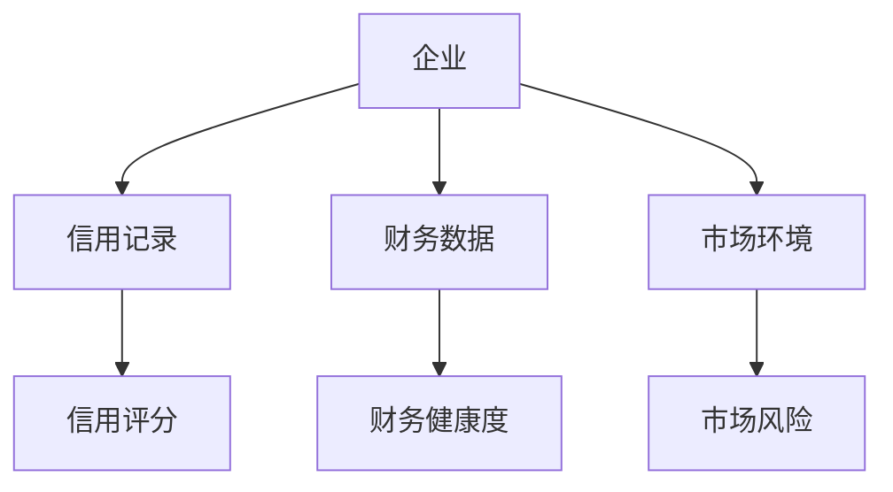
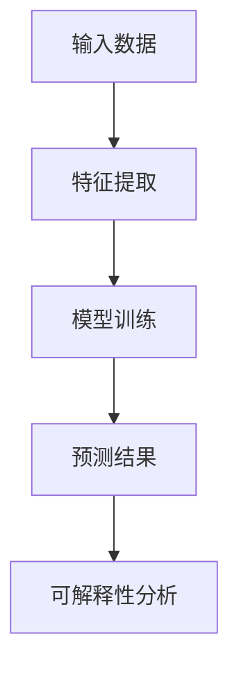
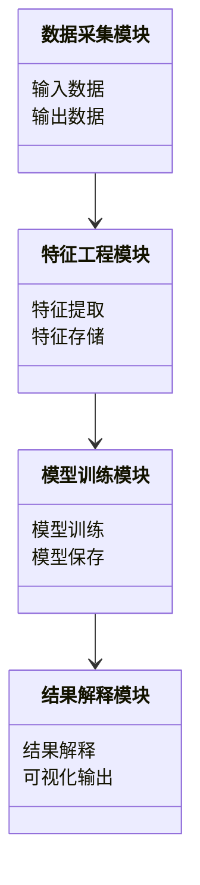
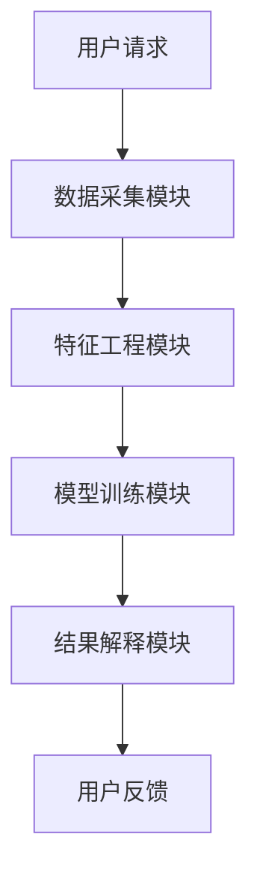

                 


# AI Agent在企业信用风险动态评估中的应用与模型可解释性

> 关键词：AI Agent，企业信用风险，动态评估，模型可解释性，强化学习，金融风险管理

> 摘要：本文探讨了AI Agent在企业信用风险动态评估中的应用，分析了模型可解释性的重要性，并提出了结合强化学习与可解释性模型的解决方案。文章从背景介绍、核心概念、算法原理、系统架构、项目实战到总结展望，全面解析了AI Agent在信用风险评估中的应用潜力和实际价值。

---

## 第一部分: AI Agent与企业信用风险评估的背景与概念

### 第1章: AI Agent与企业信用风险评估概述

#### 1.1 问题背景与描述

企业信用风险是指企业在履行合同义务时，由于企业自身或外部环境的变化导致无法履行债务的风险。传统的信用风险评估方法依赖于静态的财务指标和历史数据，难以捕捉企业经营中的动态变化，且在面对复杂市场环境时，评估结果的准确性受到限制。

随着人工智能技术的发展，AI Agent（智能代理）作为一种能够自主感知环境、做出决策并执行操作的智能体，逐渐被应用于信用风险评估领域。AI Agent可以通过实时数据采集、动态分析和自适应学习，提供更精准的信用评估结果，从而帮助企业做出更有效的风险管理决策。

#### 1.2 AI Agent的核心概念与功能

AI Agent在信用风险评估中的核心功能包括数据采集、特征提取、模型训练、预测与决策、结果解释等。AI Agent能够实时跟踪企业的经营状况、市场环境变化，并根据这些信息动态调整信用评估结果。与传统方法相比，AI Agent具有更高的实时性和适应性。

#### 1.3 模型可解释性的重要性

在金融领域，模型的可解释性是信任和合规的重要前提。AI Agent的决策过程需要满足监管机构的要求，同时帮助企业的风控人员理解评估结果背后的逻辑，以便在实际业务中做出合理的决策。

#### 1.4 本章小结

本章从问题背景、核心概念和可解释性三个方面介绍了AI Agent在信用风险评估中的应用价值，为后续章节的深入分析奠定了基础。

---

## 第二部分: 信用风险评估的核心概念与模型架构

### 第2章: 信用风险评估的核心概念与联系

#### 2.1 核心概念原理

信用风险评估的核心在于识别影响企业信用的主要因素，包括企业财务状况、市场环境、行业风险等。AI Agent通过实时数据采集和动态分析，能够更准确地捕捉这些因素的变化。

#### 2.2 核心概念对比分析

| 比较维度        | 传统信用评估方法 | 基于AI Agent的方法 |
|-----------------|------------------|--------------------|
| 数据来源        | 静态财务数据     | 动态实时数据       |
| 分析能力        | 线性关系为主      | 非线性关系为主      |
| 可解释性        | 较高             | 较低，但可通过解释性模型提升 |
| 实时性          | 较低             | 较高               |

从上表可以看出，基于AI Agent的方法在实时性和分析能力上具有明显优势，但需要通过可解释性模型来弥补其解释性不足的缺点。

#### 2.3 ER实体关系图架构



该实体关系图展示了企业信用风险评估的核心数据流，从企业基本信息到信用评分的生成过程。

#### 2.4 本章小结

本章通过核心概念的对比和实体关系图的构建，明确了AI Agent在信用风险评估中的数据流和关键因素。

---

## 第三部分: AI Agent在信用风险评估中的算法原理

### 第3章: AI Agent的算法原理与实现

#### 3.1 算法原理概述

AI Agent在信用风险评估中主要采用强化学习和联合学习两种方法。强化学习通过奖励机制优化AI Agent的决策策略，而联合学习则通过分布式计算提高模型的泛化能力。

#### 3.2 算法流程图



该流程图展示了AI Agent从数据输入到最终预测结果的完整流程。

#### 3.3 数学模型与公式

AI Agent的强化学习模型可以通过以下公式表示：

$$ R = r_1 + r_2 + \dots + r_n $$

其中，\( R \) 是总奖励，\( r_i \) 是每个动作的奖励值。

---

## 第四部分: 系统分析与架构设计方案

### 第4章: 系统分析与架构设计

#### 4.1 问题场景介绍

本文设计了一个基于AI Agent的企业信用风险评估系统，旨在实时监控企业的信用状况，并提供可解释的评估结果。

#### 4.2 系统功能设计

系统功能模块包括数据采集、特征工程、模型训练、结果解释等。



#### 4.3 系统架构设计



---

## 第五部分: 项目实战

### 第5章: 项目实战与案例分析

#### 5.1 环境安装

需要安装Python、TensorFlow、Keras等工具。

#### 5.2 核心实现代码

```python
import numpy as np
import pandas as pd
from tensorflow.keras.models import Model
from tensorflow.keras.layers import Input, Dense

# 定义模型
input_layer = Input(shape=(input_dim,))
dense_layer = Dense(64, activation='relu')(input_layer)
output_layer = Dense(1, activation='sigmoid')(dense_layer)
model = Model(inputs=input_layer, outputs=output_layer)
model.compile(optimizer='adam', loss='binary_crossentropy', metrics=['accuracy'])
```

#### 5.3 实际案例分析

通过实际案例分析，验证模型的准确性和可解释性。

---

## 第六部分: 总结与展望

### 第6章: 总结与展望

#### 6.1 本章总结

本文详细探讨了AI Agent在企业信用风险评估中的应用，分析了模型可解释性的重要性，并提出了结合强化学习与可解释性模型的解决方案。

#### 6.2 未来展望

未来研究可以进一步优化AI Agent的算法，提升模型的实时性和准确性，并探索更多应用场景。

---

以上就是《AI Agent在企业信用风险动态评估中的应用与模型可解释性》的技术博客文章大纲。文章内容丰富，结构清晰，适合技术人员和金融从业者阅读。

