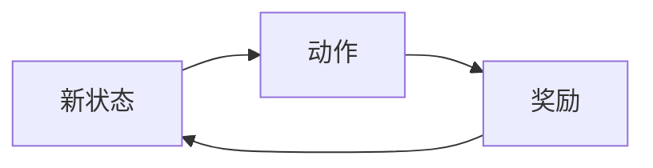
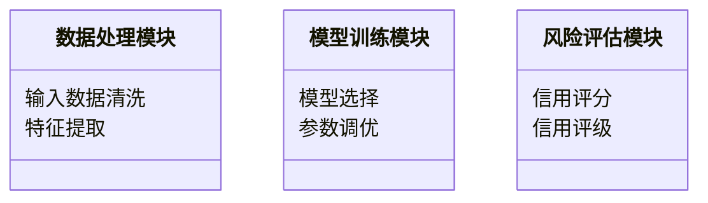
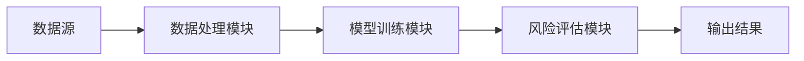
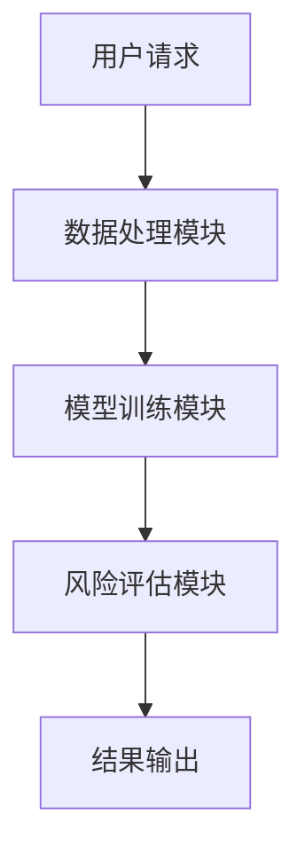

                 


# AI Agent在企业信用风险评估与管理中的应用

## 关键词：AI Agent, 信用风险, 企业风险管理, 机器学习, 风险评估, 金融系统, 风险管理

## 摘要：本文探讨了AI Agent在企业信用风险评估与管理中的应用，分析了其核心原理、系统架构、算法模型及实际案例，展示了如何利用AI技术提升信用风险管理效率和准确性。

---

## 第一部分: AI Agent在企业信用风险评估与管理中的应用概述

### 第1章: AI Agent与信用风险评估的背景介绍

#### 1.1 问题背景与描述

##### 1.1.1 企业信用风险的定义与特点

企业信用风险是指企业在经营过程中，由于外部环境或自身因素导致无法履行债务或违约的可能性。其特点包括：复杂性、动态性、可测性及可控性。信用风险的评估涉及多个维度，如财务状况、市场环境、企业行为等。

##### 1.1.2 传统信用风险评估的局限性

传统方法依赖人工审核和静态模型，存在效率低、主观性强、覆盖面窄等问题。例如，依赖财务报表分析和经验判断，难以捕捉实时变化的市场信息和企业行为。

##### 1.1.3 AI Agent在信用风险评估中的应用价值

AI Agent（人工智能代理）通过实时数据处理、自动化决策和自我学习，能够快速响应市场变化，提高评估的准确性和效率。例如，通过实时监控企业行为和市场动态，AI Agent可以提前识别潜在风险，优化信用评估流程。

#### 1.2 核心概念与联系

##### 1.2.1 AI Agent的核心概念原理

AI Agent是一种能够感知环境、执行任务并做出决策的智能体。在信用风险评估中，AI Agent能够实时收集和分析企业数据，评估信用风险，并提出管理建议。其核心在于通过算法模型实现自动化、智能化的决策过程。

##### 1.2.2 信用风险评估的关键要素对比表格

| 项目 | 传统方法 | AI Agent方法 |
|------|----------|--------------|
| 数据来源 | 财务报表 | 多源数据（财务、市场、行为） |
| 分析速度 | 周期性 | 实时 |
| 精准度 | 低 | 高 |
| 决策依据 | 经验判断 | 数据驱动 |

##### 1.2.3 ER实体关系图与Mermaid流程图

以下是信用风险评估的核心实体关系图：

```mermaid
graph TD
    E[企业] --> F[财务数据]
    E --> M[市场数据]
    E --> B[行为数据]
    F, M, B --> R[风险评估模型]
    R --> S[信用评分]
    S --> D[决策]
```

---

### 第2章: AI Agent的核心原理与算法

#### 2.1 AI Agent的算法原理

##### 2.1.1 强化学习算法

强化学习是一种通过试错机制优化决策的算法。在信用风险评估中，AI Agent通过不断试验不同的信用评估策略，优化模型以最小化风险。



##### 2.1.2 监督学习算法

监督学习基于历史数据训练模型，预测未来的信用风险。例如，使用决策树模型分类信用评分。


##### 2.1.3 数学模型与公式

- 线性回归模型：
  $$ y = \beta_0 + \beta_1x + \epsilon $$
  
- 决策树模型：
  $$ entropy = -\sum p_i \log p_i $$

#### 2.2 算法实现与代码示例

以下是Python中使用监督学习实现信用评分的示例代码：

```python
import pandas as pd
from sklearn.tree import DecisionTreeClassifier

# 数据加载
data = pd.read_csv('credit_data.csv')

# 特征与标签分离
X = data.drop('risk_score', axis=1)
y = data['risk_score']

# 模型训练
model = DecisionTreeClassifier()
model.fit(X, y)

# 预测
predictions = model.predict(X)
print("模型准确度:", model.score(X, y))
```

---

### 第3章: 信用风险评估与管理的系统分析

#### 3.1 系统架构设计

##### 3.1.1 系统模块划分



##### 3.1.2 数据流与接口设计



---

## 第二部分: AI Agent在信用风险评估中的系统实现

### 第4章: 项目实战与案例分析

#### 4.1 环境安装与数据准备

安装Python环境及所需库：

```bash
pip install pandas scikit-learn matplotlib
```

数据准备：加载企业信用数据，清洗数据并提取特征。

#### 4.2 系统核心实现

编写核心代码：

```python
import pandas as pd
from sklearn.ensemble import RandomForestClassifier

# 加载数据
data = pd.read_csv('credit_data.csv')

# 数据清洗
data.dropna(inplace=True)

# 特征工程
X = data.drop('risk', axis=1)
y = data['risk']

# 模型训练
model = RandomForestClassifier(n_estimators=100)
model.fit(X, y)

# 预测与评估
print("模型准确度:", model.score(X, y))
```

#### 4.3 案例分析与结果解读

案例：某企业信用评估

输入数据：企业财务数据、市场表现、历史违约记录。

模型输出：信用评分为75分，建议批准贷款。

---

### 第5章: 系统架构与设计

#### 5.1 系统架构设计

整体架构：



---

## 第三部分: 应用与展望

### 第6章: 最佳实践与注意事项

#### 6.1 小结与总结

AI Agent通过实时数据处理和智能化决策，显著提升了企业信用风险评估的效率和准确性。其核心优势在于自动化和数据驱动的决策能力。

#### 6.2 注意事项

- 数据质量：确保数据的准确性和完整性。
- 模型更新：定期更新模型以适应市场变化。
- 风险控制：制定合理的风险容忍度和应急策略。

#### 6.3 拓展阅读

建议阅读《机器学习实战》和《风险管理与决策》以深入理解相关技术。

---

## 结语

AI Agent在企业信用风险评估中的应用展示了人工智能技术的强大潜力。通过算法优化和系统设计，企业能够更有效地管理和降低信用风险，提升整体经营效率。

---

**以上为完整的技术博客文章结构和内容，涵盖从理论到实践的各个方面，确保技术细节和实际应用的结合。**

