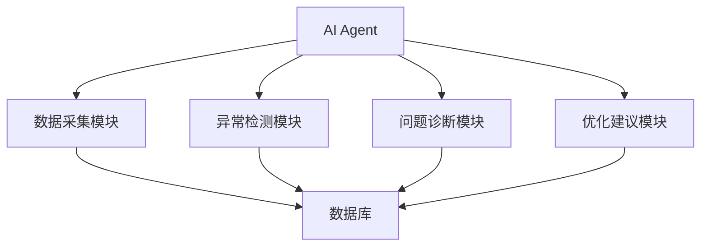
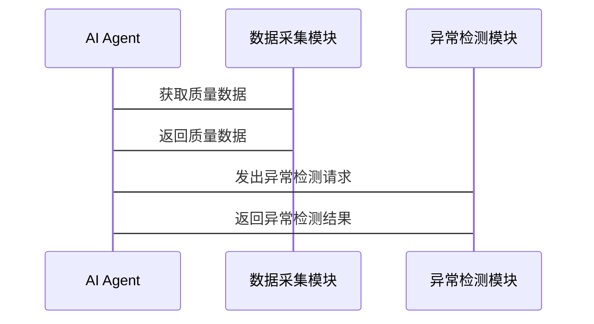

                 


# AI Agent在企业全面质量管理(TQM)中的应用

> 关键词：AI Agent，全面质量管理，TQM，企业质量管理，智能代理，质量管理优化

> 摘要：本文探讨了AI Agent在企业全面质量管理（TQM）中的应用，详细分析了AI Agent如何通过智能化手段提升质量管理的效率和效果。文章从TQM的基本概念、AI Agent的核心原理、算法实现、系统架构设计到实际项目案例，全面阐述了AI Agent在质量管理中的应用场景和优势。通过本文，读者可以深入了解AI Agent如何助力企业实现更高效的质量管理，并为未来的质量管理优化提供有价值的参考。

---

## 第一部分: AI Agent在企业全面质量管理(TQM)中的应用概述

### 第1章: 全面质量管理(TQM)概述

#### 1.1 全面质量管理的基本概念

全面质量管理（Total Quality Management，TQM）是一种系统化的管理方法，旨在通过持续改进企业内外部质量，以满足顾客需求并实现长期成功。TQM强调全员参与、全过程控制、数据驱动和客户导向，是企业追求卓越质量的基石。

- **全员参与**：TQM要求企业从上到下所有员工都参与到质量管理中，形成质量改进的合力。
- **全过程控制**：从产品设计、生产、交付到售后服务，TQM覆盖质量管理的每一个环节。
- **数据驱动**：通过数据分析和统计工具，TQM能够准确识别质量问题并制定改进措施。
- **客户导向**：TQM的核心目标是满足甚至超越客户期望，提升客户满意度。

#### 1.2 AI Agent的基本概念

AI Agent（人工智能代理）是一种能够感知环境、自主决策并执行任务的智能系统。AI Agent的核心能力包括数据处理、问题解决、学习和自适应，能够通过与环境的交互不断优化自身的行为。

- **数据处理**：AI Agent能够从大量数据中提取有用信息，识别模式和趋势。
- **问题解决**：AI Agent通过逻辑推理和优化算法，能够快速找到问题的解决方案。
- **学习与自适应**：AI Agent能够通过机器学习算法不断优化自身的决策模型。
- **自主执行**：AI Agent能够在没有人工干预的情况下，独立完成预定任务。

#### 1.3 TQM与AI Agent的结合意义

AI Agent的智能化能力与TQM的系统化方法相结合，能够显著提升企业的质量管理效率和效果。AI Agent能够实时监控质量数据，快速识别潜在问题，并提出优化建议，从而实现质量控制的智能化和自动化。

---

### 第2章: AI Agent在TQM中的核心作用

#### 2.1 AI Agent如何提升质量管理效率

AI Agent在质量管理中的应用主要体现在以下几个方面：

- **数据分析与预测**：AI Agent能够对历史质量数据进行深度分析，预测未来可能出现的质量问题，并提前制定预防措施。
- **实时监控与反馈**：通过物联网（IoT）设备，AI Agent可以实时采集生产过程中的质量数据，及时发现异常情况并发出警报。
- **智能决策支持**：AI Agent能够基于实时数据和历史经验，为质量管理决策提供科学支持，帮助企业在复杂情况下做出最优选择。

#### 2.2 AI Agent与TQM的结合优势

AI Agent与TQM的结合具有以下显著优势：

- **数据驱动的精准管理**：AI Agent通过数据分析和机器学习，能够精确识别质量问题的根源，并制定针对性的改进措施。
- **智能化问题解决**：AI Agent能够快速处理复杂质量问题，减少人为错误，提高问题解决效率。
- **提高企业竞争力**：通过AI Agent的智能化支持，企业能够实现更高效的质量管理，从而在市场中获得更大的竞争优势。

---

### 第3章: AI Agent在TQM中的核心概念与联系

#### 3.1 AI Agent的核心原理

AI Agent的核心原理包括知识表示与推理、问题求解与规划、学习与自适应。

- **知识表示与推理**：AI Agent通过构建知识库，将质量问题的相关信息进行结构化表示，并利用推理算法进行逻辑推理，得出解决方案。
- **问题求解与规划**：AI Agent通过问题建模和优化算法，制定最优的解决方案，并生成执行计划。
- **学习与自适应**：AI Agent通过监督学习、强化学习等机器学习方法，不断优化自身的决策模型，提高问题解决能力。

#### 3.2 TQM与AI Agent的关系

TQM与AI Agent的关系可以总结为以下几点：

- **系统性与智能化**：TQM的系统性管理方法与AI Agent的智能化能力相辅相成，前者提供管理框架，后者提供技术支撑。
- **角色定位**：AI Agent在TQM中扮演执行者和优化者的双重角色，既是问题解决者，也是持续改进的推动者。
- **协同优化**：AI Agent与TQM的结合能够实现质量管理的协同优化，推动企业质量管理水平的全面提升。

---

## 第4章: AI Agent在TQM中的算法原理

### 4.1 基于机器学习的质量预测模型

#### 4.1.1 数据预处理与特征提取

在构建质量预测模型之前，需要对数据进行预处理和特征提取。以下是一个示例：

```python
import pandas as pd
from sklearn.preprocessing import StandardScaler

# 数据预处理
data = pd.read_csv('quality_data.csv')
data = data.dropna()  # 删除缺失值
data = pd.get_dummies(data)  # 进行独热编码

# 特征提取
features = data.drop('quality_label', axis=1)
labels = data['quality_label']

# 标准化处理
scaler = StandardScaler()
features_scaled = scaler.fit_transform(features)
```

#### 4.1.2 算法选择与模型训练

选择适当的算法并进行模型训练是关键步骤。以下是一个基于随机森林的分类模型示例：

```python
from sklearn.ensemble import RandomForestClassifier
from sklearn.metrics import accuracy_score

# 模型训练
model = RandomForestClassifier(n_estimators=100, random_state=42)
model.fit(features_scaled, labels)

# 模型预测
预测_labels = model.predict(features_scaled)

# 模型评估
print(f'Accuracy: {accuracy_score(labels, 预测_labels)}')
```

#### 4.1.3 模型评估与优化

评估模型性能并进行优化是确保模型效果的关键。以下是一个交叉验证的示例：

```python
from sklearn.model_selection import GridSearchCV

# 参数优化
param_grid = {
    'n_estimators': [50, 100, 150],
    'max_depth': [None, 10, 20]
}

grid_search = GridSearchCV(RandomForestClassifier(), param_grid, cv=5)
grid_search.fit(features_scaled, labels)

print(f'Best Parameters: {grid_search.best_params_}')
print(f'Best Score: {grid_search.best_score_}')
```

---

### 4.2 基于强化学习的质量优化算法

#### 4.2.1 强化学习的基本原理

强化学习通过智能体与环境的交互，学习最优策略以最大化累积奖励。以下是一个简单的强化学习框架：

```python
# 强化学习框架
class Agent:
    def __init__(self, state_space, action_space):
        self.state_space = state_space
        self.action_space = action_space
        # 初始化策略网络

    def act(self, state):
        # 根据状态选择动作
        pass

    def learn(self, state, action, reward, next_state):
        # 更新策略网络
        pass
```

#### 4.2.2 强化学习在质量优化中的应用

将强化学习应用于质量优化，可以通过以下步骤实现：

1. **状态定义**：定义状态空间，例如当前质量数据的状态。
2. **动作定义**：定义可能的动作，例如调整生产参数。
3. **奖励机制**：定义奖励函数，例如质量提升带来奖励。
4. **策略优化**：通过强化学习算法优化策略，实现质量的最大化。

---

## 第5章: 系统分析与架构设计方案

### 5.1 问题场景介绍

假设我们有一个汽车制造企业，需要对生产过程中的质量问题进行实时监控和优化。企业的质量管理团队希望通过引入AI Agent来提升质量控制的效率和精度。

### 5.2 系统功能设计

以下是系统的功能设计：

- **数据采集**：实时采集生产过程中的质量数据。
- **异常检测**：通过AI Agent检测异常情况并发出警报。
- **问题诊断**：利用机器学习模型分析问题根源。
- **优化建议**：基于诊断结果，提出优化建议。

### 5.3 系统架构设计

以下是系统的架构设计：



### 5.4 系统交互设计

以下是系统的交互设计：



---

## 第6章: 项目实战

### 6.1 环境安装

以下是一个Python环境的安装示例：

```bash
# 安装所需的库
pip install pandas scikit-learn matplotlib
```

### 6.2 核心代码实现

以下是核心代码实现：

```python
import pandas as pd
from sklearn.ensemble import RandomForestClassifier
from sklearn.metrics import accuracy_score
from sklearn.preprocessing import StandardScaler

# 数据预处理
data = pd.read_csv('quality_data.csv')
data = data.dropna()
data = pd.get_dummies(data)

features = data.drop('quality_label', axis=1)
labels = data['quality_label']

# 标准化处理
scaler = StandardScaler()
features_scaled = scaler.fit_transform(features)

# 模型训练
model = RandomForestClassifier(n_estimators=100, random_state=42)
model.fit(features_scaled, labels)

# 模型预测
预测_labels = model.predict(features_scaled)

# 模型评估
print(f'Accuracy: {accuracy_score(labels, 预测_labels)}')
```

### 6.3 案例分析

以下是案例分析：

假设我们有一个制造企业，生产过程中存在原材料质量不稳定的问题。通过AI Agent的实时监控和预测，我们能够提前发现潜在的质量问题，并及时调整生产参数，从而显著降低质量缺陷率。

---

## 第7章: 总结与展望

### 7.1 总结

本文详细探讨了AI Agent在企业全面质量管理（TQM）中的应用，从理论到实践，全面分析了AI Agent如何提升质量管理的效率和效果。通过AI Agent的智能化支持，企业能够实现更高效的质量管理，从而在激烈的市场竞争中获得更大的优势。

### 7.2 未来展望

未来，随着AI技术的不断发展，AI Agent在TQM中的应用将更加广泛和深入。例如，通过与其他先进技术（如区块链、物联网）的结合，AI Agent能够实现更高效的质量追溯和协同管理。同时，随着算法的优化和计算能力的提升，AI Agent在复杂质量管理场景中的应用也将更加广泛。

---

## 最佳实践 Tips

- **数据质量管理**：确保数据的准确性和完整性，是AI Agent发挥效

