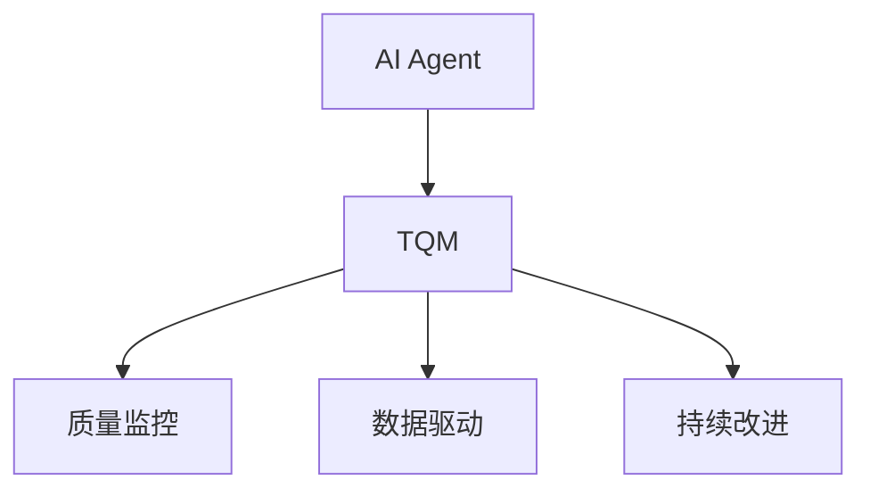
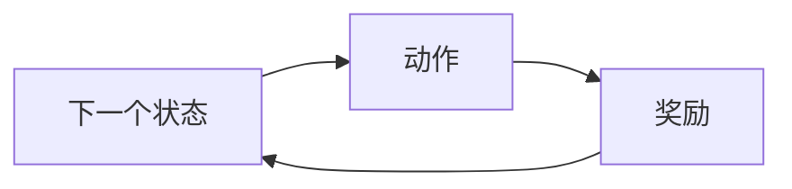
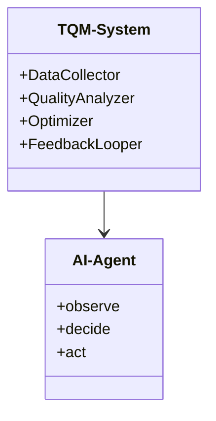
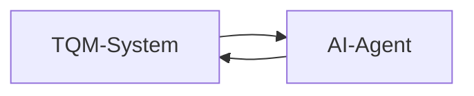
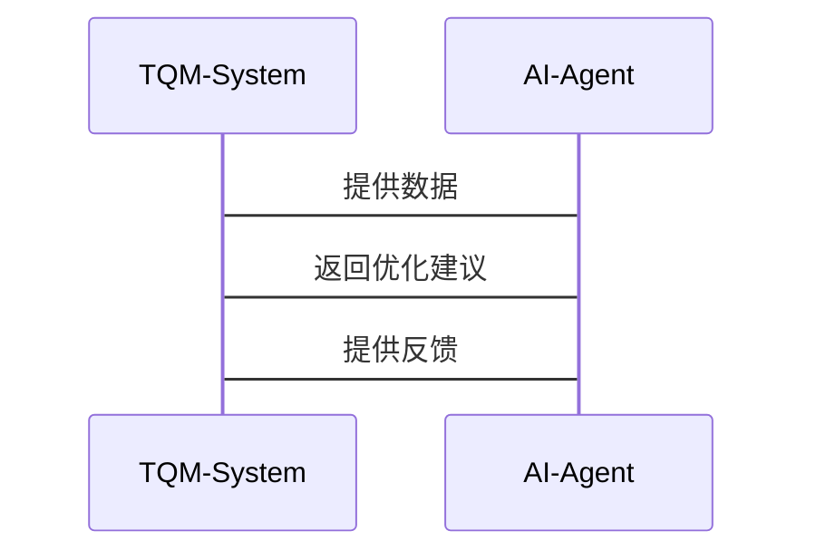

                 


# AI Agent在企业全面质量管理(TQM)中的深度应用

## 关键词
AI Agent, TQM, 全面质量管理, 质量优化, 智能优化

## 摘要
随着人工智能技术的快速发展，AI Agent（人工智能代理）在企业管理中的应用越来越广泛。本文深入探讨了AI Agent在企业全面质量管理（TQM）中的深度应用，从核心概念、算法原理到系统架构设计，再到实际项目案例，全面分析了AI Agent如何助力企业质量管理的智能化转型。文章通过详细的技术分析和实际案例，展示了AI Agent在TQM中的巨大潜力和实际应用价值。

---

## 正文

### 第一部分：全面质量管理（TQM）与AI Agent概述

#### 第1章：全面质量管理（TQM）概述

##### 1.1 TQM的基本概念
TQM是一种以顾客为中心的质量管理方法，强调企业内部所有成员的参与，通过持续改进来满足顾客需求。其核心理念包括全员参与、过程管理、数据分析和持续改进。

##### 1.2 AI Agent的基本概念
AI Agent是一种能够感知环境、自主决策并执行任务的智能体。它具备学习能力、自适应性和问题解决能力，能够处理复杂的企业管理任务。

##### 1.3 TQM与AI Agent的结合
AI Agent在TQM中的应用能够显著提升质量管理的效率和精度。通过实时数据分析、智能监控和自动化优化，AI Agent能够帮助企业实现质量管理的智能化转型。

---

### 第二部分：AI Agent与TQM的核心概念与联系

#### 第2章：AI Agent与TQM的核心概念

##### 2.1 AI Agent在TQM中的角色与功能
AI Agent在TQM中主要承担数据采集与分析、质量监控与预测、优化建议与决策支持三大功能。

##### 2.2 AI Agent与TQM的核心概念对比
通过对比分析，我们发现AI Agent在TQM中的应用能够显著提升质量管理的效率和精准度。



##### 2.3 AI Agent与TQM的实体关系图
通过Mermaid图展示AI Agent与TQM之间的关系，进一步明确AI Agent在质量管理中的作用。

---

### 第三部分：AI Agent在TQM中的算法原理

#### 第3章：AI Agent的算法原理

##### 3.1 强化学习算法在AI Agent中的应用
强化学习是一种通过试错机制优化决策的算法，广泛应用于AI Agent的质量优化任务中。



##### 3.2 算法的数学模型
强化学习的数学模型包括状态空间、动作空间、奖励函数和策略函数。

$$
Q(s, a) = r + \gamma \max_{a'} Q(s', a')
$$

##### 3.3 代码实现
通过Python代码实现强化学习算法，展示如何在质量管理场景中应用AI Agent。

```python
class AI-Agent:
    def __init__(self, state_space, action_space):
        self.state_space = state_space
        self.action_space = action_space
        self.gamma = 0.99
        self.epsilon = 0.1
        # 初始化Q表
        self.Q = defaultdict(lambda: np.zeros(len(action_space)))

    def get_action(self, state):
        if np.random.random() < self.epsilon:
            return np.random.randint(len(self.action_space))
        else:
            return np.argmax(self.Q[state])

    def update_Q(self, state, action, reward, next_state):
        self.Q[state][action] = reward + self.gamma * np.max(self.Q[next_state])
```

---

### 第四部分：系统分析与架构设计

#### 第4章：系统架构设计

##### 4.1 系统功能设计
系统功能包括数据采集、质量分析、优化建议和结果反馈。



##### 4.2 系统架构图
展示TQM-System与AI-Agent之间的交互关系。



##### 4.3 接口设计
系统接口包括数据输入接口、优化建议接口和反馈接口。

##### 4.4 交互流程
展示AI-Agent与TQM-System之间的交互流程。



---

### 第五部分：项目实战

#### 第5章：项目实战

##### 5.1 环境安装
介绍如何搭建AI-Agent在TQM中的运行环境，包括安装Python、TensorFlow等依赖库。

##### 5.2 核心代码实现
展示AI-Agent的核心代码实现，包括数据采集、模型训练和优化建议生成。

##### 5.3 项目总结
通过实际案例分析，总结AI-Agent在TQM中的应用效果和优化价值。

---

### 第六部分：总结与展望

#### 第6章：总结与展望

##### 6.1 总结
总结全文内容，强调AI-Agent在TQM中的重要应用价值。

##### 6.2 展望
展望未来，AI-Agent在TQM中的潜力和研究方向。

---

### 附录

#### 附录A：相关工具与库
列出实现AI-Agent所需的主要工具和库，如Python、TensorFlow等。

#### 附录B：术语表
解释文章中涉及的关键术语，确保读者能够理解核心概念。

---

通过本文的详细分析，我们可以看到AI-Agent在企业全面质量管理中的巨大潜力。未来，随着技术的不断进步，AI-Agent将为企业质量管理带来更多的创新和突破。

