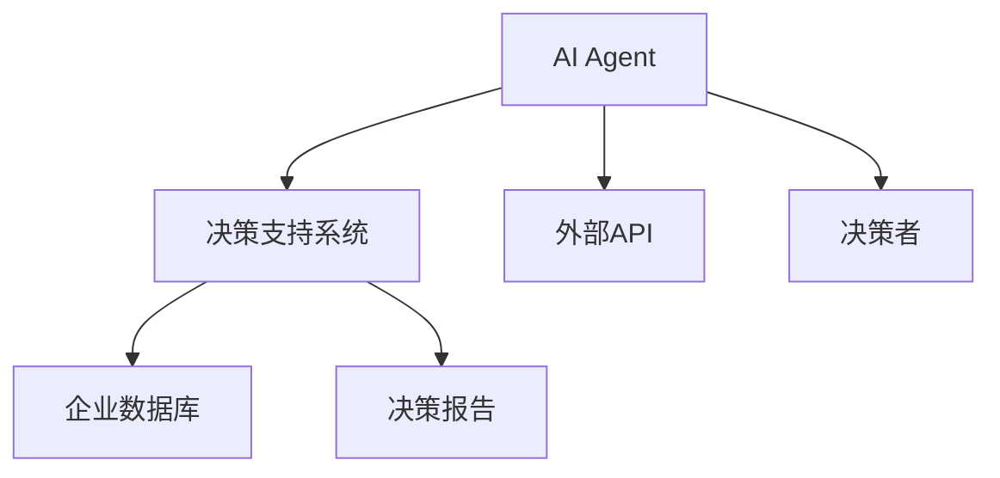
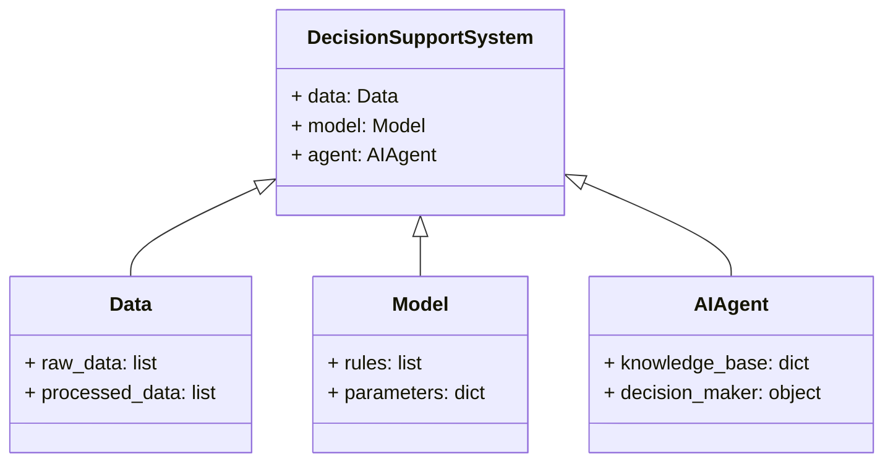
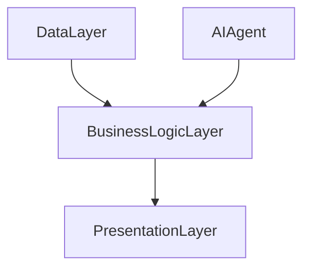
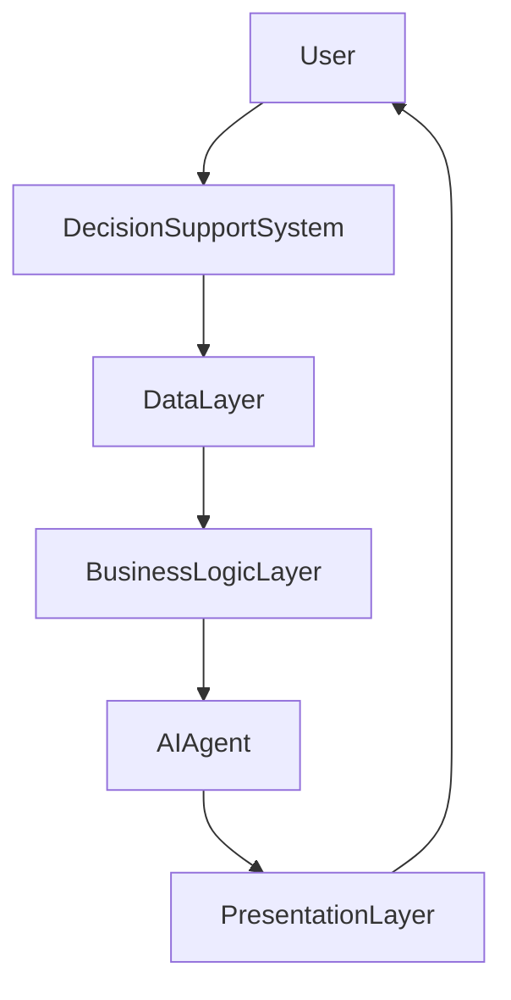

                 


# AI Agent在企业决策支持系统中的角色与实现

> 关键词：AI Agent，企业决策支持系统，决策优化，知识表示，多智能体协作

> 摘要：本文详细探讨了AI Agent在企业决策支持系统中的角色与实现。从AI Agent的基本概念到其在企业决策支持中的具体应用，从算法原理到系统架构设计，再到实际项目案例分析，全面解析了AI Agent如何赋能企业决策支持系统，为企业智能化转型提供理论和实践指导。

---

# 第1章 AI Agent与企业决策支持系统概述

## 1.1 AI Agent的基本概念

### 1.1.1 AI Agent的定义与特征

AI Agent（人工智能代理）是指能够感知环境、自主决策并执行任务的智能实体。它具有以下核心特征：

- **自主性**：AI Agent能够自主执行任务，无需外部干预。
- **反应性**：能够实时感知环境变化并做出响应。
- **推理能力**：具备逻辑推理和问题解决能力。
- **学习能力**：能够通过经验优化决策策略。

AI Agent可以是软件程序、机器人或其他智能系统，广泛应用于自动驾驶、智能助手、推荐系统等领域。

### 1.1.2 企业决策支持系统的核心功能

企业决策支持系统（DSS）是一种辅助企业决策的计算机系统，其核心功能包括：

- 数据处理：收集、整理和分析企业内外部数据。
- 模型构建：建立决策模型，模拟不同决策方案的效果。
- 信息呈现：通过可视化方式呈现分析结果，辅助决策者理解问题。
- 决策优化：提供优化建议，帮助决策者制定最佳策略。

### 1.1.3 AI Agent在企业决策支持中的角色定位

AI Agent在企业决策支持系统中扮演着多重角色：

- **数据分析师**：通过机器学习算法分析海量数据，提取有价值的信息。
- **决策顾问**：基于分析结果，提供最优决策建议。
- **执行者**：在某些场景下，AI Agent可以直接执行决策，例如自动化交易或流程优化。

## 1.2 AI Agent与企业决策支持系统的关系

### 1.2.1 企业决策支持系统的传统模式

传统的企业决策支持系统主要依赖于规则引擎和静态模型。决策者根据系统提供的分析结果做出判断，系统本身不具备自主决策能力。

### 1.2.2 AI Agent如何提升决策支持能力

AI Agent通过引入智能代理技术，显著提升了企业决策支持系统的能力：

- **实时决策**：AI Agent能够实时感知环境变化，快速做出响应。
- **动态优化**：基于实时数据和动态模型，持续优化决策方案。
- **多智能体协作**：多个AI Agent可以协同工作，共同完成复杂决策任务。

### 1.2.3 AI Agent与企业决策支持系统的整合方式

AI Agent可以通过以下方式与企业决策支持系统整合：

- **嵌入式集成**：将AI Agent作为系统的一部分，直接参与数据处理和决策过程。
- **接口调用**：通过API接口与决策支持系统交互，提供决策建议。
- **模块化设计**：将AI Agent设计为独立模块，灵活部署在决策支持系统中。

## 1.3 本章小结

本章介绍了AI Agent的基本概念及其在企业决策支持系统中的角色定位。通过对比传统决策支持系统，阐述了AI Agent如何通过智能代理技术提升决策支持能力，并提出了多种整合方式。

---

# 第2章 AI Agent的核心概念与原理

## 2.1 AI Agent的核心原理

### 2.1.1 知识表示与推理机制

知识表示是AI Agent理解世界的基础。常用的知识表示方法包括：

- **谓词逻辑**：通过谓词和事实表示知识。
- **语义网络**：通过节点和关系表示知识。
- **描述逻辑**：通过本体论描述知识。

推理机制是AI Agent基于知识库进行逻辑推理的能力。常用的推理方法包括：

- **逻辑推理**：基于谓词逻辑进行演绎推理。
- **概率推理**：基于概率论进行不确定性推理。
- **案例推理**：基于相似案例进行类比推理。

### 2.1.2 多智能体协作模型

多智能体协作是AI Agent实现复杂决策任务的核心机制。常用协作模型包括：

- **基于合同的协作**：通过签订合同明确协作任务和责任。
- **基于角色的协作**：根据角色分配任务和权限。
- **基于意图的协作**：通过意图理解实现动态协作。

### 2.1.3 动态决策优化算法

动态决策优化是AI Agent在复杂环境中的关键能力。常用算法包括：

- **遗传算法**：通过模拟自然选择优化决策方案。
- **模拟退火算法**：通过模拟热力学过程寻找全局最优解。
- **强化学习算法**：通过与环境交互学习最优策略。

## 2.2 AI Agent的属性特征对比

### 2.2.1 基于规则的AI Agent

基于规则的AI Agent通过预定义的规则进行推理和决策。优点是规则明确、易于理解；缺点是灵活性差，难以应对复杂场景。

### 2.2.2 基于模型的AI Agent

基于模型的AI Agent通过构建领域模型进行推理和决策。优点是模型可解释性高；缺点是模型构建复杂，需要大量领域知识。

### 2.2.3 基于学习的AI Agent

基于学习的AI Agent通过机器学习算法进行自主学习和优化。优点是适应性强，能够处理复杂场景；缺点是需要大量数据和计算资源。

## 2.3 AI Agent的实体关系图

以下是一个AI Agent在企业决策支持系统中的实体关系图：



从图中可以看出，AI Agent与决策支持系统、数据库、外部API和决策者之间存在密切关系。AI Agent通过与这些实体交互，完成数据处理、决策优化和结果呈现的任务。

## 2.4 本章小结

本章详细介绍了AI Agent的核心概念与原理，包括知识表示与推理机制、多智能体协作模型以及动态决策优化算法。通过对比不同类型的AI Agent，阐述了它们的优缺点和适用场景，并通过实体关系图展示了AI Agent在企业决策支持系统中的角色和关系。

---

# 第3章 AI Agent的算法原理与数学模型

## 3.1 基于规则的推理算法

### 3.1.1 规则表示与匹配

基于规则的推理算法通过预定义的规则进行推理。规则通常由前提和结论两部分组成，例如：

- 前提：如果温度 > 30度，则结论：建议开启空调。

规则匹配是通过模式匹配技术实现的，例如使用正向推理或反向推理。

### 3.1.2 推理过程的数学模型

基于规则的推理过程可以用以下数学模型表示：

$$ \text{结论} = \text{if } \text{前提} \text{成立，则 } \text{结论成立} $$

### 3.1.3 规则库的构建与优化

规则库的构建需要考虑以下因素：

- **规则覆盖率**：规则能够覆盖的场景范围。
- **规则冲突性**：规则之间的相互影响。
- **规则可解释性**：规则是否易于理解和解释。

## 3.2 基于模型的推理算法

### 3.2.1 马尔可夫决策过程（MDP）

马尔可夫决策过程是一种用于描述决策问题的数学模型。其核心要素包括：

- **状态**：系统的当前情况。
- **动作**：决策者可以采取的行动。
- **转移概率**：动作导致状态转移的概率。
- **奖励函数**：动作的奖励值。

### 3.2.2 Q-learning算法

Q-learning算法是一种常用的强化学习算法。其核心思想是通过更新Q值表来学习最优策略。Q值的更新公式为：

$$ Q(s, a) = Q(s, a) + \alpha [r + \gamma \max Q(s', a') - Q(s, a)] $$

其中，$\alpha$ 是学习率，$\gamma$ 是折扣因子。

### 3.2.3 状态转移矩阵的构建

状态转移矩阵用于描述状态之间的转移概率。例如，状态转移矩阵可以表示为：

$$ P = \begin{bmatrix}
    p_{11} & p_{12} & \cdots & p_{1n} \\
    p_{21} & p_{22} & \cdots & p_{2n} \\
    \vdots & \vdots & \ddots & \vdots \\
    p_{n1} & p_{n2} & \cdots & p_{nn}
\end{bmatrix} $$

## 3.3 基于学习的推理算法

### 3.3.1 深度强化学习模型

深度强化学习模型通过深度神经网络和强化学习算法相结合，实现端到端的决策优化。常用的模型包括：

- **DQN（Deep Q-Network）**：基于Q-learning算法的深度强化学习模型。
- **Actor-Critic**：通过两个网络分别估计策略和价值函数。

### 3.3.2 Transformer架构的应用

Transformer架构在自然语言处理领域取得了巨大成功，其核心思想是基于自注意力机制。在决策支持系统中，可以用于处理序列数据和长距离依赖关系。

### 3.3.3 模型训练的数学公式

Transformer模型的注意力机制可以通过以下公式表示：

$$ \text{Attention}(Q, K, V) = \text{softmax}\left( \frac{QK^T}{\sqrt{d_k}} \right)V $$

其中，$Q$ 是查询向量，$K$ 是键向量，$V$ 是值向量，$d_k$ 是键向量的维度。

## 3.4 算法的比较与选择

### 3.4.1 不同算法的优缺点对比

以下是对几种常用算法的优缺点对比：

| 算法类型 | 优点 | 缺点 |
|----------|------|------|
| 基于规则 | 易于理解和实现 | 灵活性差，难以应对复杂场景 |
| 基于模型 | 可解释性高 | 模型构建复杂，需要大量领域知识 |
| 基于学习 | 适应性强，能够处理复杂场景 | 需要大量数据和计算资源 |

### 3.4.2 适用场景的分析

- **基于规则**：适用于规则明确、场景简单的决策任务。
- **基于模型**：适用于可解释性要求高、领域知识丰富的场景。
- **基于学习**：适用于复杂度高、数据丰富的场景。

### 3.4.3 算法选择的策略

- **任务需求**：根据具体任务需求选择合适的算法。
- **数据特性**：根据数据特性选择适合的算法。
- **计算资源**：根据计算资源限制选择合适的算法。

## 3.5 本章小结

本章详细介绍了AI Agent的几种主要算法，包括基于规则的推理算法、基于模型的推理算法和基于学习的推理算法。通过对比不同算法的优缺点，提出了算法选择的策略，并通过数学公式和mermaid流程图详细描述了每种算法的实现过程。

---

# 第4章 系统分析与架构设计

## 4.1 系统分析

### 4.1.1 项目背景与目标

本项目旨在开发一个基于AI Agent的企业决策支持系统，目标是通过智能化的决策支持，帮助企业提高决策效率和准确性。

### 4.1.2 项目范围界定

项目范围包括：

- 数据采集与处理
- 决策模型构建
- AI Agent设计与实现
- 系统集成与测试

## 4.2 系统功能设计

### 4.2.1 领域模型类图

以下是企业决策支持系统的领域模型类图：



### 4.2.2 功能模块划分

系统功能模块包括：

- 数据采集模块：负责采集企业内外部数据。
- 数据处理模块：对数据进行清洗、转换和特征提取。
- 模型构建模块：构建决策模型并进行训练。
- AI Agent模块：实现AI Agent的核心功能。
- 结果呈现模块：将分析结果以可视化方式呈现给决策者。

## 4.3 系统架构设计

### 4.3.1 分层架构设计

系统架构采用分层设计，包括：

- **数据层**：负责数据的存储和管理。
- **业务逻辑层**：负责业务逻辑的实现。
- **表现层**：负责用户界面和结果呈现。

### 4.3.2 组件间交互关系

以下是组件间交互关系图：



### 4.3.3 架构优化策略

- **数据优化**：采用分布式存储和并行处理技术提高数据处理效率。
- **模型优化**：采用模型压缩和剪枝技术减少计算资源消耗。
- **算法优化**：采用增量学习和在线优化技术提高决策效率。

## 4.4 系统接口设计

### 4.4.1 接口定义与规范

系统接口主要包括：

- 数据接口：负责数据的输入和输出。
- 模型接口：负责模型的加载和训练。
- Agent接口：负责AI Agent的调用和控制。

### 4.4.2 接口实现方式

接口实现方式包括：

- **REST API**：基于HTTP协议的接口实现。
- **WebSocket**：基于实时通信协议的接口实现。
- **RPC**：基于远程过程调用的接口实现。

## 4.5 系统交互序列图

以下是系统交互序列图：

```mermaid
sequenceDiagram
    User -> DecisionSupportSystem: 提交决策请求
    DecisionSupportSystem -> DataLayer: 获取数据
    DataLayer --> BusinessLogicLayer: 数据处理
    BusinessLogicLayer -> AIAgent: 调用AI Agent
    AIAgent --> BusinessLogicLayer: 返回决策结果
    BusinessLogicLayer -> PresentationLayer: 展示结果
    User <-- PresentationLayer: 显示结果
```

## 4.6 本章小结

本章详细介绍了企业决策支持系统的系统分析与架构设计，包括项目背景与目标、系统功能设计、系统架构设计和系统接口设计。通过mermaid图展示了系统的整体架构和组件间交互关系。

---

# 第5章 项目实战：基于AI Agent的企业决策支持系统实现

## 5.1 环境安装与配置

### 5.1.1 环境需求

- **操作系统**：Windows/Mac/Linux
- **编程语言**：Python 3.6+
- **框架与库**：TensorFlow、Keras、Scikit-learn、Flask

### 5.1.2 安装依赖

```bash
pip install tensorflow scikit-learn flask
```

## 5.2 系统核心实现

### 5.2.1 数据采集与处理

数据采集代码示例：

```python
import requests

def get_data(api_url):
    response = requests.get(api_url)
    return response.json()
```

数据处理代码示例：

```python
import pandas as pd

def process_data(data):
    df = pd.DataFrame(data)
    df = df.dropna()
    return df
```

### 5.2.2 AI Agent实现

AI Agent实现代码示例：

```python
class AIAgent:
    def __init__(self, model):
        self.model = model

    def decide(self, input_data):
        return self.model.predict(input_data)
```

### 5.2.3 决策模型训练

决策模型训练代码示例：

```python
import tensorflow as tf
from tensorflow.keras import layers

def build_model(input_dim):
    model = tf.keras.Sequential()
    model.add(layers.Dense(64, activation='relu', input_dim=input_dim))
    model.add(layers.Dense(1, activation='sigmoid'))
    model.compile(optimizer='adam', loss='binary_crossentropy', metrics=['accuracy'])
    return model

model = build_model(10)
model.fit(X_train, y_train, epochs=10, batch_size=32)
```

## 5.3 系统集成与测试

### 5.3.1 系统集成

系统集成代码示例：

```python
from flask import Flask
from routes.data_route import data_route
from routes.agent_route import agent_route

app = Flask(__name__)
data_route(app)
agent_route(app)

if __name__ == '__main__':
    app.run()
```

### 5.3.2 功能测试

功能测试代码示例：

```python
import unittest

class TestAIAgent(unittest.TestCase):
    def test_decision(self):
        agent = AIAgent(model)
        result = agent.decide(input_data)
        self.assertEqual(len(result), 1)

if __name__ == '__main__':
    unittest.main()
```

## 5.4 实际案例分析

### 5.4.1 案例背景

假设某企业需要预测下一季度的销售额，可以通过AI Agent进行分析和预测。

### 5.4.2 案例分析

AI Agent通过分析历史销售数据、市场趋势和竞争对手信息，预测出下一季度的销售额，并提出优化建议。

### 5.4.3 项目总结

通过本项目，我们实现了基于AI Agent的企业决策支持系统，验证了AI Agent在企业决策支持中的有效性，并为企业智能化转型提供了参考。

## 5.5 本章小结

本章通过一个实际项目案例，详细介绍了基于AI Agent的企业决策支持系统的实现过程，包括环境安装、系统核心实现、系统集成与测试，以及实际案例分析。通过代码示例和mermaid图展示了系统的实现细节和运行流程。

---

# 第6章 最佳实践与总结

## 6.1 最佳实践

### 6.1.1 数据质量管理

- 数据清洗：确保数据的完整性和一致性。
- 数据标注：对数据进行标注和分类。
- 数据存储：采用分布式存储和归档策略。

### 6.1.2 模型优化

- 模型选择：根据任务需求选择合适的模型。
- 模型训练：采用交叉验证和超参数调优。
- 模型部署：采用模型压缩和轻量化部署。

### 6.1.3 系统维护

- 系统监控：实时监控系统运行状态。
- 日志管理：记录系统运行日志。
- 系统升级：定期更新系统和模型。

## 6.2 小结

本文详细探讨了AI Agent在企业决策支持系统中的角色与实现，从理论到实践，全面解析了AI Agent如何赋能企业决策支持系统。通过实际项目案例，验证了AI Agent在企业决策支持中的有效性。

## 6.3 注意事项

- 数据隐私：确保数据的安全性和隐私性。
- 系统稳定性：确保系统的高可用性和容错性。
- 人机协作：实现人机协同，避免过度依赖AI Agent。

## 6.4 拓展阅读

- 《强化学习导论》
- 《分布式系统设计与实现》
- 《机器学习实战》

---

# 结语

AI Agent作为企业决策支持系统的核心技术，正在为企业智能化转型提供强大支持。随着技术的不断发展，AI Agent将在企业决策支持系统中发挥越来越重要的作用。未来，我们需要进一步研究和探索，推动AI Agent技术在企业决策支持系统中的深度应用。

--- 

# 附录

## 附录A AI Agent相关数学公式

- 马尔可夫决策过程：$$ P = \begin{bmatrix} p_{11} & p_{12} & \cdots & p_{1n} \\ p_{21} & p_{22} & \cdots & p_{2n} \\ \vdots & \vdots & \ddots & \vdots \\ p_{n1} & p_{n2} & \cdots & p_{nn} \end{bmatrix} $$
- Q-learning算法：$$ Q(s, a) = Q(s, a) + \alpha [r + \gamma \max Q(s', a') - Q(s, a)] $$
- Transformer注意力机制：$$ \text{Attention}(Q, K, V) = \text{softmax}\left( \frac{QK^T}{\sqrt{d_k}} \right)V $$

## 附录B 系统架构图



---

通过本文的详细讲解，读者可以全面了解AI Agent在企业决策支持系统中的角色与实现，为企业智能化转型提供理论和实践指导。

