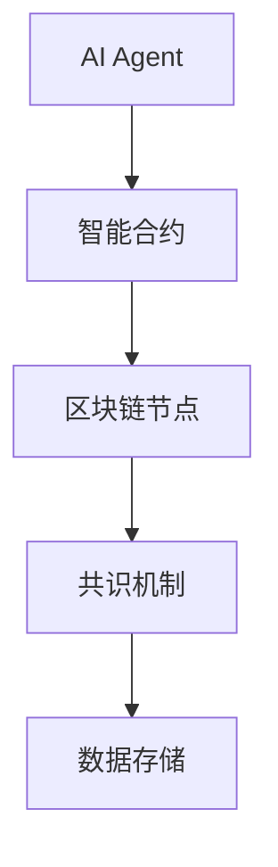
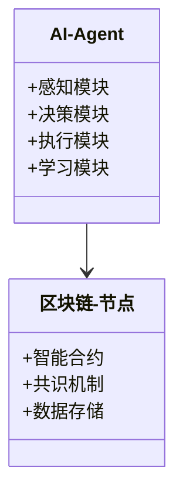
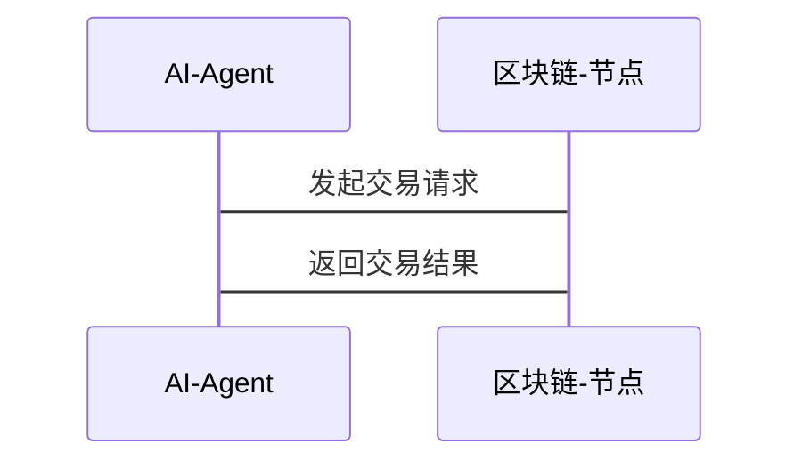
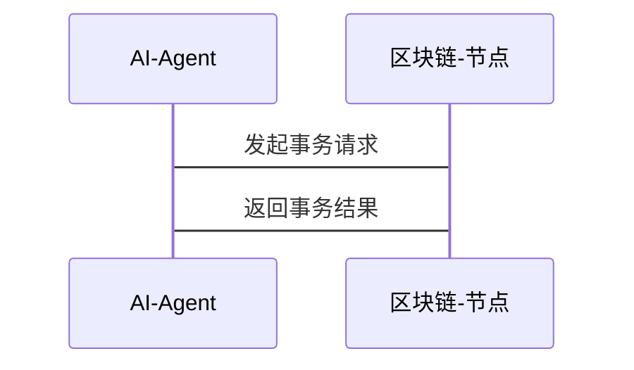

                 


# AI Agent在企业区块链应用中的集成与应用

## 关键词：AI Agent, 区块链, 企业应用, 集成, 智能合约, 区块链架构, 项目实战

## 摘要：  
本文详细探讨了AI Agent在企业区块链应用中的集成与应用，从AI Agent和区块链的核心概念出发，分析了它们的结合原理，详细讲解了系统架构设计、项目实战及优化方法。文章通过实际案例，展示了如何将AI Agent与区块链技术相结合，为企业数字化转型提供高效解决方案。

---

## 第1章: AI Agent与区块链概述

### 1.1 AI Agent的基本概念

#### 1.1.1 AI Agent的定义与特点
AI Agent（人工智能代理）是能够感知环境并采取行动以实现目标的智能实体。其特点包括自主性、反应性、目标导向和学习能力。AI Agent能够处理复杂任务，适应动态环境，并通过数据驱动的方法优化决策过程。

#### 1.1.2 AI Agent的核心功能与应用场景
AI Agent的核心功能包括数据采集与处理、决策制定、行动执行和反馈优化。应用场景广泛，如智能客服、供应链管理、金融交易等。

#### 1.1.3 企业级AI Agent的特殊需求
企业级AI Agent需要具备高可用性、可扩展性和安全性。它需要处理大规模数据，支持多任务并行，并与企业现有系统无缝集成。

### 1.2 区块链的基本概念

#### 1.2.1 区块链的定义与特点
区块链是一种分布式账本技术，通过去中心化、不可篡改和透明性等特点，确保数据的安全性和信任度。

#### 1.2.2 区块链的核心技术
- **分布式账本**：数据分散存储在多个节点，确保数据一致性。
- **共识机制**：通过算法确保所有节点达成一致。
- **智能合约**：自动执行预设条件的脚本，简化业务流程。

#### 1.2.3 区块链在企业中的应用现状
区块链在供应链管理、金融支付、版权保护等领域已得到广泛应用，为企业提供了高效、透明的解决方案。

### 1.3 AI Agent与区块链的结合背景

#### 1.3.1 当前企业数字化转型的趋势
企业数字化转型需要整合先进技术，提升效率和竞争力。AI和区块链作为关键技术，为企业提供了新的可能性。

#### 1.3.2 区块链与AI技术的互补性
区块链提供数据安全和信任机制，AI提供数据分析和决策能力。两者结合，能够实现数据驱动的智能决策。

#### 1.3.3 AI Agent在企业区块链中的潜在价值
AI Agent可以作为区块链节点的智能决策者，优化业务流程，提升系统效率。

---

## 第2章: AI Agent与区块链的核心原理

### 2.1 AI Agent的技术架构

#### 2.1.1 AI Agent的组成模块
AI Agent通常由感知模块、决策模块、执行模块和学习模块组成。感知模块负责数据采集，决策模块制定策略，执行模块完成操作，学习模块优化模型。

#### 2.1.2 AI Agent的决策机制
基于机器学习的决策树或深度学习模型，AI Agent能够根据输入数据生成最优决策。决策机制需要考虑数据的实时性、准确性和系统约束。

#### 2.1.3 AI Agent的学习与自适应能力
通过监督学习、强化学习或无监督学习，AI Agent能够不断优化自身的决策模型，适应新的环境变化。

### 2.2 区块链的核心技术

#### 2.2.1 区块链的共识机制
常见的共识机制包括工作量证明（PoW）、权益证明（PoS）和拜占庭容错（BFT）。共识机制确保所有节点达成一致，维护区块链的安全性。

#### 2.2.2 区块链的智能合约
智能合约是区块链上的自动化程序，能够根据预设条件自动执行操作。智能合约能够简化业务流程，减少人为干预。

#### 2.2.3 区块链的数据结构
区块链由区块和链组成，每个区块包含交易数据和哈希指针。区块通过链式结构连接，确保数据的不可篡改性。

### 2.3 AI Agent与区块链的结合原理

#### 2.3.1 数据共享与隐私保护
AI Agent需要访问区块链上的数据，但数据隐私是一个挑战。解决方案包括零知识证明和同态加密，确保数据安全共享。

#### 2.3.2 智能合约的自动化执行
AI Agent可以通过智能合约调用区块链上的操作，实现业务流程的自动化。智能合约的执行结果可以作为AI Agent的输入，进一步优化决策。

#### 2.3.3 去中心化决策与协调
在去中心化环境中，AI Agent需要协调多个节点的决策，确保系统的一致性和高效性。这需要设计合理的算法和协议，确保决策的正确性。

---

## 第3章: AI Agent与区块链的集成原理

### 3.1 数据结构与通信机制

#### 3.1.1 区块链中的数据结构
区块由交易数据和元数据组成，链式结构确保数据的不可篡改性。每个节点维护本地账本，并通过共识机制同步数据。

#### 3.1.2 AI Agent与区块链的通信接口
AI Agent需要与区块链进行交互，通常通过API接口实现。通信协议需要考虑数据格式、传输方式和安全性。

#### 3.1.3 智能合约的调用流程
AI Agent通过智能合约接口调用区块链上的函数，执行交易或查询数据。调用流程包括参数传递、签名验证和状态更新。

### 3.2 安全机制

#### 3.2.1 加密算法的应用
区块链使用椭圆曲线加密（ECC）和哈希函数确保数据的安全性。AI Agent需要使用加密签名进行身份验证。

#### 3.2.2 权限控制
通过访问控制列表（ACL）和角色权限管理（RBAC），确保AI Agent只能访问授权的数据和功能。

#### 3.2.3 共识机制的影响
共识机制决定了系统的安全性和效率。AI Agent需要适应不同的共识机制，优化自身的决策过程。

### 3.3 系统设计与优化

#### 3.3.1 高可用性设计
通过分布式部署和负载均衡，确保AI Agent和区块链系统的高可用性。冗余设计和故障恢复机制是关键。

#### 3.3.2 扩展性设计
系统需要支持节点的动态加入和退出，适应业务的扩展需求。模块化设计和接口标准化是实现扩展性的基础。

#### 3.3.3 性能优化
通过并行计算、缓存机制和数据压缩，优化AI Agent和区块链系统的性能，提升处理效率。

---

## 第4章: 企业级区块链平台的选择与设计

### 4.1 主流企业级区块链平台

#### 4.1.1 Hyperledger Fabric
Hyperledger Fabric是一个企业级区块链框架，支持模块化架构和可插拔共识机制。它适合复杂的业务流程管理。

#### 4.1.2 Ethereum
Ethereum是一个通用的智能合约平台，支持多种编程语言和去中心化应用开发。它适合金融和供应链管理等场景。

#### 4.1.3 Quorum
Quorum是基于Ethereum的私有区块链平台，支持企业级的隐私保护和高效交易。

### 4.2 平台选择的考虑因素

#### 4.2.1 业务需求
选择平台需要考虑业务流程的复杂性、数据隐私要求和性能需求。不同平台有不同的技术特点和适用场景。

#### 4.2.2 技术成熟度
选择经过验证的平台，确保系统的稳定性和可靠性。成熟的技术社区和丰富的文档是重要参考。

#### 4.2.3 集成难度
平台的易用性和与现有系统的兼容性是选择的重要因素。友好的开发接口和丰富的工具链能够降低集成成本。

### 4.3 区块链系统的架构设计

#### 4.3.1 模块划分
区块链系统通常划分为节点管理模块、智能合约模块、数据存储模块和共识机制模块。各模块之间通过接口通信。

#### 4.3.2 系统功能设计
系统功能包括数据上链、智能合约部署、交易处理和状态查询。功能设计需要考虑用户体验和系统性能。

#### 4.3.3 架构图展示
以下是区块链系统的架构图：



---

## 第5章: 系统架构与设计

### 5.1 系统模块划分

#### 5.1.1 AI Agent模块
负责数据采集、决策制定和智能合约调用。AI Agent模块需要与区块链节点进行通信，确保数据的准确性和及时性。

#### 5.1.2 区块链节点模块
负责维护区块链账本，处理交易和智能合约的执行。节点模块需要支持多种共识机制和数据存储方式。

### 5.2 系统功能设计

#### 5.2.1 数据流分析
数据从AI Agent出发，经过智能合约调用，进入区块链节点进行处理，最终存储在区块链账本中。数据流涉及请求、响应和状态更新。

#### 5.2.2 领域模型设计
以下是系统的领域模型图：



#### 5.2.3 系统架构设计
系统的架构采用微服务设计，AI Agent和区块链节点分别作为独立的服务运行。通过API网关实现服务间的通信和路由。

#### 5.2.4 接口设计
AI Agent通过REST API调用智能合约，区块链节点通过WebSocket进行实时通信。接口设计需要考虑认证、授权和数据格式。

#### 5.2.5 交互流程
以下是AI Agent与区块链节点的交互流程图：



---

## 第6章: 项目实战

### 6.1 环境搭建

#### 6.1.1 安装区块链平台
以Hyperledger Fabric为例，安装需要的依赖项，配置网络环境。安装命令如下：

```bash
curl -sSL https://goo.gl/GetSof | bash
```

#### 6.1.2 部署智能合约
编写智能合约代码并部署到区块链平台。以下是一个简单的智能合约示例：

```javascript
// 智能合约代码示例
function main() {
    // 业务逻辑实现
    return "Hello World";
}
```

#### 6.1.3 初始化AI Agent
配置AI Agent的参数，包括API密钥和区块链节点地址。初始化代码如下：

```python
import requests

class AIAgent:
    def __init__(self, endpoint):
        self.endpoint = endpoint
        self.token = self.get_auth_token()
    
    def get_auth_token(self):
        # 获取API访问令牌
        response = requests.post(f"{self.endpoint}/auth")
        return response.json()['token']
```

### 6.2 核心实现

#### 6.2.1 智能合约的调用
AI Agent通过HTTP请求调用智能合约。以下是调用代码示例：

```python
def invoke_contract(self, function_name, parameters):
    headers = {
        'Content-Type': 'application/json',
        'Authorization': f'Bearer {self.token}'
    }
    payload = {
        'function': function_name,
        'params': parameters
    }
    response = requests.post(f"{self.endpoint}/contract", headers=headers, json=payload)
    return response.json()
```

#### 6.2.2 事务处理
AI Agent发起事务请求，区块链节点处理交易并写入账本。以下是事务处理流程：



#### 6.2.3 实时监控
通过区块链节点的事件监听器，实时监控交易状态变化。AI Agent可以根据反馈优化决策策略。

### 6.3 实际案例分析

#### 6.3.1 项目背景
某企业希望利用AI Agent和区块链技术优化供应链管理，实现自动化的订单处理和库存监控。

#### 6.3.2 项目实现
AI Agent负责订单生成和库存预测，区块链节点处理订单确认和物流跟踪。智能合约自动触发支付和通知。

#### 6.3.3 项目成果
项目实现了高效的订单处理流程，库存准确率提升，订单处理时间缩短。AI Agent和区块链的结合显著提升了企业的运营效率。

---

## 第7章: 系统测试与优化

### 7.1 系统测试

#### 7.1.1 功能测试
测试AI Agent与区块链节点的交互功能，确保智能合约调用和事务处理的正确性。

#### 7.1.2 性能测试
通过负载测试工具（如JMeter）评估系统的处理能力，确保在高并发场景下的稳定性和响应时间。

#### 7.1.3 安全测试
测试系统的安全性，包括权限控制、加密算法和抗攻击能力。确保系统能够抵御常见的网络攻击。

### 7.2 性能优化

#### 7.2.1 并行计算
通过并行处理优化AI Agent的决策过程，提升系统的响应速度。使用多线程或分布式计算技术。

#### 7.2.2 数据压缩
在数据传输和存储过程中使用压缩算法，减少数据量，提升网络传输效率。

#### 7.2.3 系统调优
优化区块链节点的配置参数，如调整区块大小和共识间隔，提升系统的吞吐量和处理能力。

### 7.3 安全增强

#### 7.3.1 加密签名
在AI Agent与区块链节点的通信中引入加密签名，确保数据的完整性和真实性。

#### 7.3.2 权限管理
通过访问控制列表（ACL）和角色权限管理（RBAC），限制AI Agent的访问权限，确保系统的安全性。

---

## 第8章: 总结与展望

### 8.1 总结

#### 8.1.1 本章回顾
本文详细探讨了AI Agent在企业区块链应用中的集成与应用，从理论到实践，全面分析了系统的各个方面。

#### 8.1.2 核心收获
通过本文的学习，读者能够理解AI Agent与区块链的结合原理，掌握系统设计和优化的方法，并能够在实际项目中应用相关技术。

### 8.2 未来展望

#### 8.2.1 技术趋势
未来，AI Agent和区块链技术将更加深度融合，推动企业的智能化和数字化转型。

#### 8.2.2 拓展方向
进一步研究AI Agent在多链环境下的应用，探索新型共识机制和智能合约的优化方法。

### 8.3 最佳实践 Tips

- **数据安全**：在设计系统时，始终优先考虑数据的安全性和隐私保护。
- **模块化设计**：通过模块化设计，确保系统的可维护性和可扩展性。
- **性能优化**：定期进行系统性能评估，及时优化系统配置和算法。

---

## 结语

AI Agent与区块链的结合为企业应用带来了新的可能性。通过本文的系统介绍和实战分析，读者能够掌握相关技术的核心原理和应用方法。未来，随着技术的不断进步，AI Agent在企业区块链中的应用将更加广泛和深入，为企业创造更大的价值。

--- 

**全文完**。

