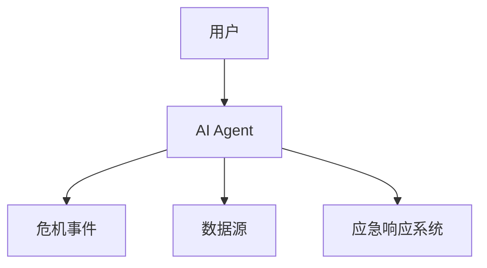

                 

# AI Agent在企业危机预警与应急响应中的关键作用

> 关键词：AI Agent, 企业危机预警, 应急响应, 异常检测, 自然语言处理

> 摘要：本文探讨了AI Agent在企业危机预警与应急响应中的关键作用，详细分析了其核心概念、算法原理、系统架构及实际应用，展示了AI Agent如何通过智能化手段提升企业的危机应对能力。

---

## 第一部分: AI Agent与企业危机管理概述

## 第1章: AI Agent的定义与核心概念

### 1.1 AI Agent的基本定义

#### 1.1.1 AI Agent的定义与特征
AI Agent（人工智能代理）是一种能够感知环境、自主决策并执行任务的智能体。其核心特征包括：

- **自主性**：能够在无外部干预的情况下独立运行。
- **反应性**：能够实时感知环境变化并做出响应。
- **目标导向**：具备明确的目标导向性，能够根据目标调整行为。

#### 1.1.2 AI Agent的核心要素
AI Agent由以下核心要素组成：

1. **感知模块**：负责从环境中获取信息（如传感器数据、日志文件等）。
2. **决策模块**：基于感知信息，利用算法进行分析和决策。
3. **执行模块**：根据决策结果，执行相应的操作（如触发告警、调整系统参数等）。
4. **学习模块**：通过机器学习算法不断优化自身的感知、决策和执行能力。

#### 1.1.3 AI Agent的分类与应用场景
AI Agent可以根据功能和应用场景分为以下几类：

1. **监控型AI Agent**：用于实时监控系统状态，如服务器故障预警。
2. **响应型AI Agent**：用于自动化响应，如火灾报警后的自动应急措施。
3. **预测型AI Agent**：基于历史数据预测潜在危机，如金融市场的风险预警。

---

### 1.2 企业危机管理的背景与挑战

#### 1.2.1 企业危机的定义与类型
企业危机是指对企业正常运营构成威胁的突发事件，主要包括：

- **自然灾害**：如地震、洪水等。
- **人为失误**：如操作不当引发的事故。
- **网络攻击**：如黑客攻击导致的数据泄露。
- **市场波动**：如突发的经济危机或政策变化。

#### 1.2.2 危机管理的传统方法与局限性
传统的危机管理方法主要依赖人工监控和事后响应，存在以下局限性：

1. **响应延迟**：人工监控难以实时发现潜在危机。
2. **资源浪费**：需要大量的人力投入。
3. **精度不足**：依赖经验判断，存在主观性和不确定性。

#### 1.2.3 企业危机管理的数字化转型需求
随着企业规模的扩大和复杂性增加，数字化转型已成为危机管理的必然趋势。通过引入AI Agent，企业可以实现：

- **实时监控**：快速发现潜在危机。
- **智能决策**：基于数据和模型进行精准判断。
- **自动化响应**：迅速采取行动，最大限度减少损失。

---

### 1.3 AI Agent在企业危机管理中的作用

#### 1.3.1 AI Agent如何赋能危机预警
AI Agent通过实时分析系统日志、传感器数据等信息，能够快速识别异常模式，提前发出预警。例如，在金融行业，AI Agent可以通过分析交易数据，识别潜在的欺诈行为。

#### 1.3.2 AI Agent在应急响应中的关键功能
在危机发生后，AI Agent能够根据预设的应急响应计划，自动化执行一系列响应措施。例如，在制造业，AI Agent可以在检测到设备故障后，立即触发维修流程。

#### 1.3.3 AI Agent对企业危机管理的创新价值
AI Agent的引入为企业危机管理带来了以下创新价值：

1. **提升效率**：通过自动化流程减少人工干预。
2. **提高精度**：基于数据和模型的决策更加准确。
3. **增强韧性**：通过持续学习和优化，提升企业应对危机的能力。

---

## 第2章: AI Agent的核心概念与联系

### 2.1 AI Agent的实体关系分析

#### 2.1.1 实体关系图（ER图）展示

上述图表展示了AI Agent在企业危机管理中的核心实体关系。AI Agent作为中心节点，连接着用户、危机事件、数据源和应急响应系统。

---

### 2.2 AI Agent的核心原理

#### 2.2.1 AI Agent的感知与决策机制
AI Agent的感知模块通过多种数据源（如日志文件、传感器数据、社交媒体信息等）收集环境信息。决策模块利用机器学习算法（如支持向量机、随机森林等）对信息进行分析，生成决策。

#### 2.2.2 AI Agent的行动执行流程
AI Agent在生成决策后，通过调用API或触发预设的响应机制，执行相应的操作。例如，在检测到网络攻击后，AI Agent可以自动隔离受感染的设备。

#### 2.2.3 AI Agent的自适应学习能力
AI Agent通过强化学习算法（如Q-learning）不断优化自身的感知、决策和执行能力。这使得AI Agent能够在复杂多变的环境中保持高效运作。

---

### 2.3 AI Agent与相关概念的对比分析

#### 2.3.1 AI Agent与传统软件的区别
| 特性                | AI Agent                | 传统软件              |
|---------------------|-------------------------|-----------------------|
| 自主性              | 高                     | 低                     |
| 反应性              | 高                     | 低                     |
| 学习能力            | 强                     | 无                     |

#### 2.3.2 AI Agent与规则引擎的对比
| 特性                | AI Agent                | 规则引擎              |
|---------------------|-------------------------|-----------------------|
| 决策方式            | 基于机器学习模型       | 基于预设规则          |
| 灵活性              | 高                     | 低                     |
| 适应性              | 强                     | 弱                     |

---

## 第3章: AI Agent的算法原理与数学模型

### 3.1 异常检测算法概述

#### 3.1.1 LOF算法
LOF（Local Outlier Factor）是一种基于密度的异常检测算法。其核心思想是：异常点的局部密度显著低于其周围区域。

#### 3.1.2 Isolation Forest
Isolation Forest是一种基于树结构的异常检测算法。它通过构建随机树，将数据点隔离到叶子节点，从而判断是否为异常点。

---

### 3.2 异常检测的数学模型

#### 3.2.1 LOF算法的数学公式
$$ LOF(x) = \frac{d(x, knn(x))}{d(knn(x), knn(knn(x)))} $$

其中：
- $x$ 是数据点。
- $knn(x)$ 是$x$的k近邻点。
- $d$ 表示距离。

---

## 总结

通过以上分析，我们可以看到AI Agent在企业危机预警与应急响应中的关键作用。AI Agent通过实时感知、智能决策和自动化响应，能够显著提升企业的危机应对能力。未来，随着人工智能技术的不断发展，AI Agent将在企业危机管理中发挥更加重要的作用。

