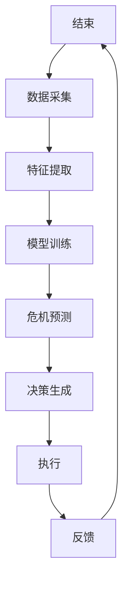

                 


# AI Agent在企业危机预警与应急响应中的应用

> 关键词：AI Agent, 企业危机预警, 应急响应, 危机管理, 人工智能

> 摘要：本文详细探讨了AI Agent在企业危机预警与应急响应中的应用。通过分析AI Agent的核心概念、算法原理、系统架构，以及实际项目中的应用案例，本文旨在为企业提供一种智能化的危机管理解决方案。文章从背景介绍、核心概念、算法原理、系统架构、项目实战到最佳实践，全面解析了AI Agent在企业危机管理中的潜力和价值。

---

# 第一部分: AI Agent与企业危机管理概述

## 第1章: AI Agent与企业危机管理概述

### 1.1 企业危机管理的背景与挑战

#### 1.1.1 企业危机的定义与分类
企业危机是指在企业运营过程中突然发生的、可能对企业声誉、财务状况、员工安全或业务连续性造成重大影响的事件。常见的企业危机包括：
- **声誉危机**：如负面新闻、产品质量问题。
- **财务危机**：如资金链断裂、重大财务亏损。
- **运营危机**：如供应链中断、生产事故。
- **法律危机**：如法律诉讼、合规性问题。

#### 1.1.2 危机对企业的影响与后果
危机对企业的影响是多方面的，可能包括：
- **经济损失**：直接经济损失、罚款、赔偿。
- **声誉损失**：企业形象受损，客户信任度下降。
- **运营中断**：生产中断、供应链中断。
- **法律责任**：可能面临法律诉讼和罚款。

#### 1.1.3 传统危机管理的局限性
传统的危机管理方法通常依赖于人工分析和事后反应，存在以下问题：
- **反应迟缓**：危机发生后才能采取行动，无法提前预警。
- **信息不全**：依赖人工收集和分析信息，效率低且可能遗漏重要信息。
- **决策失误**：缺乏数据支持，决策可能存在偏差。

---

### 1.2 AI Agent的基本概念与特点

#### 1.2.1 AI Agent的定义
AI Agent（人工智能代理）是指能够感知环境、自主决策并执行任务的智能实体。它能够通过传感器或数据源获取信息，利用算法进行分析，并根据结果采取相应的行动。

#### 1.2.2 AI Agent的核心特征
AI Agent的核心特征包括：
- **自主性**：能够自主决策和行动，无需人工干预。
- **反应性**：能够实时感知环境变化并做出反应。
- **学习能力**：能够通过数据和经验不断优化自身的算法和决策能力。
- **协作性**：能够与其他AI Agent或系统协同工作，共同完成任务。

#### 1.2.3 AI Agent与传统IT系统的区别
传统的IT系统通常基于固定的规则和程序运行，而AI Agent具备以下特点：
- **智能化**：能够理解和分析复杂的数据。
- **自适应性**：能够根据环境变化调整行为。
- **学习能力**：能够通过数据和经验不断优化。

---

### 1.3 AI Agent在企业危机管理中的应用前景

#### 1.3.1 AI Agent在危机预警中的潜在价值
AI Agent可以通过实时数据分析和模式识别，帮助企业提前发现潜在危机。例如：
- **舆情监控**：通过分析社交媒体和新闻媒体，识别潜在的声誉危机。
- **供应链监控**：通过分析供应链数据，识别可能的供应链中断风险。

#### 1.3.2 AI Agent在应急响应中的优势
在危机发生后，AI Agent可以快速启动应急响应机制，帮助企业在最短时间内采取有效措施。例如：
- **自动化决策**：基于实时数据和预设规则，快速生成应急响应方案。
- **多 Agent 协作**：多个AI Agent可以协同工作，分别负责不同的应急任务。

#### 1.3.3 企业采用AI Agent的挑战与机遇
- **挑战**：数据隐私、算法复杂性、系统集成难度。
- **机遇**：提升企业危机管理效率、降低损失、增强竞争力。

---

## 1.4 本章小结
本章介绍了企业危机管理的背景与挑战，详细阐述了AI Agent的基本概念和特点，并探讨了AI Agent在企业危机管理中的应用前景。通过对比传统危机管理方法与AI Agent的优势，为企业采用AI Agent提供了理论支持。

---

# 第2章: AI Agent的核心概念与原理

## 第2节: AI Agent的感知与决策机制

### 2.1.1 数据采集与分析
AI Agent通过多种数据源（如传感器、数据库、API等）采集实时数据，并利用机器学习算法对数据进行分析和处理。例如：
- **数据清洗**：去除噪声数据，确保数据质量。
- **特征提取**：从数据中提取关键特征，用于后续分析。

### 2.1.2 危机识别与评估
AI Agent通过分析数据，识别潜在危机并评估其影响。例如：
- **异常检测**：通过统计分析或机器学习算法，识别数据中的异常值。
- **影响评估**：基于历史数据和当前数据，评估危机可能带来的损失。

### 2.1.3 决策生成与优化
AI Agent根据分析结果生成应急响应方案，并通过优化算法不断改进决策。例如：
- **决策树算法**：用于生成可能的决策路径。
- **强化学习**：通过模拟环境，优化决策策略。

---

## 第2节: AI Agent的执行与反馈机制

### 2.2.1 行动计划的执行
AI Agent根据决策结果执行行动计划。例如：
- **自动化操作**：通过API调用其他系统，执行预设操作。
- **人机协作**：AI Agent与人类专家协同工作，共同完成任务。

### 2.2.2 反馈机制与学习
AI Agent通过反馈机制不断优化自身的算法和决策能力。例如：
- **在线学习**：在执行过程中不断更新模型。
- **经验积累**：记录每次危机的处理经验，用于未来的决策参考。

---

## 第2节: AI Agent的多 Agent 协作

### 2.3.1 多 Agent 系统的定义
多 Agent 系统是由多个AI Agent组成的协作系统，每个Agent负责不同的任务。例如：
- **分工协作**：不同的Agent分别负责数据采集、分析、决策和执行。

### 2.3.2 协作机制与通信协议
多 Agent 系统通过通信协议进行协作。例如：
- **通信协议**：定义Agent之间的通信规则和数据格式。
- **协作机制**：定义Agent之间的任务分配和协同方式。

### 2.3.3 协作中的冲突解决与协调
在多 Agent 系统中，可能会出现冲突。例如：
- **资源分配冲突**：多个Agent争夺同一资源。
- **决策冲突**：不同Agent的决策可能相互矛盾。

---

## 第2节: 核心概念对比分析

### 2.4.1 AI Agent与传统IT系统的对比
| 特性         | AI Agent             | 传统IT系统         |
|--------------|----------------------|--------------------|
| 自主性       | 高                   | 低                 |
| 反应性       | 高                   | 低                 |
| 学习能力     | 高                   | 无                 |
| 协作性       | 高                   | 低                 |

### 2.4.2 不同类型AI Agent的特征对比
| 类型         | 基于规则的Agent     | 基于模型的Agent    |
|--------------|----------------------|--------------------|
| 决策方式     | 基于预设规则         | 基于数据建模       |
| 灵活性       | 低                   | 高                 |
| 学习能力     | 无                   | 有                 |

---

## 第2节: 本章小结
本章详细阐述了AI Agent的核心概念与原理，包括感知与决策机制、执行与反馈机制，以及多 Agent 协作。通过对不同类型的AI Agent进行对比分析，为企业在选择和部署AI Agent时提供了参考。

---

# 第3章: AI Agent的算法原理与数学模型

## 第3节: AI Agent的核心算法

### 3.1.1 机器学习算法
机器学习算法是AI Agent的核心算法之一，常用的算法包括：
- **监督学习**：如线性回归、支持向量机（SVM）。
- **无监督学习**：如聚类分析（K-means）。
- **强化学习**：如Q-learning。

### 3.1.2 自然语言处理算法
自然语言处理算法用于文本分析和理解，常用的算法包括：
- **分词**：将文本分割成单词或短语。
- **情感分析**：分析文本的情感倾向。
- **实体识别**：识别文本中的实体。

### 3.1.3 实时数据分析算法
实时数据分析算法用于处理高速数据流，常用的算法包括：
- **流数据处理**：如基于滑动窗口的统计分析。
- **异常检测**：如基于统计的方法或机器学习模型。

---

## 第3节: 危机预警的数学模型

### 3.2.1 危机概率计算模型
危机概率计算模型用于评估危机发生的可能性。例如：
$$ P(\text{危机}) = \frac{\text{异常次数}}{\text{总样本数}} $$

### 3.2.2 危机影响评估模型
危机影响评估模型用于评估危机可能带来的损失。例如：
$$ \text{影响} = \alpha \times \text{经济损失} + \beta \times \text{声誉损失} $$

### 3.2.3 应急响应优先级排序模型
应急响应优先级排序模型用于确定应急响应的优先级。例如：
$$ \text{优先级} = \frac{\text{影响程度}}{\text{响应时间}} $$

---

## 第3节: 算法流程图


---

## 第3节: 算法实现代码
以下是一个简单的危机预警算法实现代码：
```python
import pandas as pd
from sklearn.svm import SVC
from sklearn.metrics import accuracy_score

# 数据加载
data = pd.read_csv('crisis_data.csv')

# 特征提取
X = data.drop('label', axis=1)
y = data['label']

# 模型训练
model = SVC()
model.fit(X, y)

# 预测
y_pred = model.predict(X)

# 评估
print(f"准确率: {accuracy_score(y, y_pred)}")
```

---

## 第3节: 本章小结
本章详细介绍了AI Agent的核心算法与数学模型，包括机器学习算法、自然语言处理算法和实时数据分析算法。通过流程图和代码示例，帮助读者更好地理解AI Agent的实现过程。

---

通过以上内容，我们可以看到AI Agent在企业危机预警与应急响应中的巨大潜力。AI Agent不仅能够帮助企业提前发现潜在危机，还能够快速响应，最大限度地减少损失。然而，企业在采用AI Agent时，也需要考虑数据隐私、算法复杂性和系统集成等挑战。未来，随着技术的不断发展，AI Agent将在企业危机管理中发挥越来越重要的作用。

