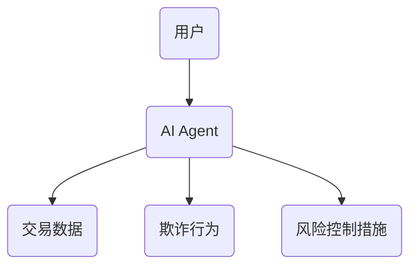
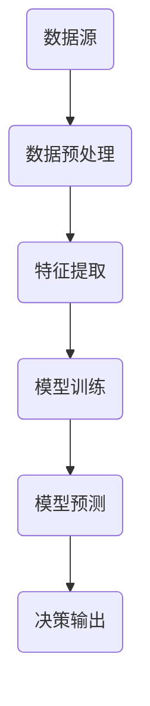
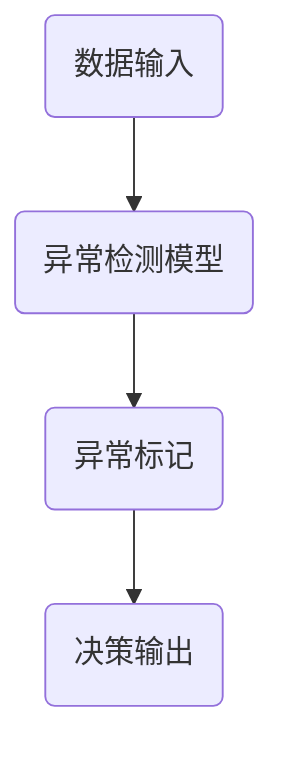
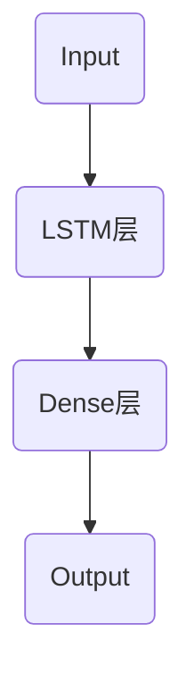
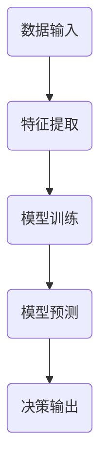
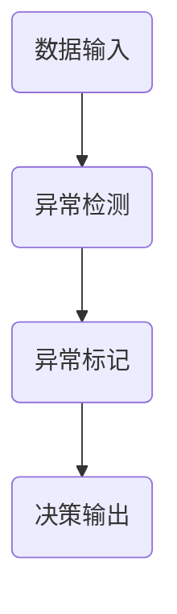
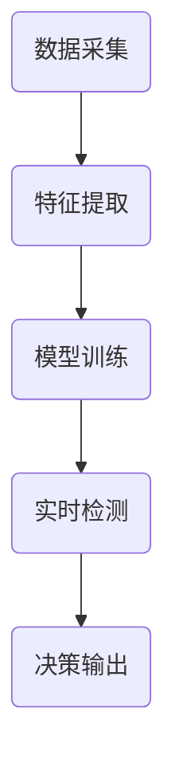
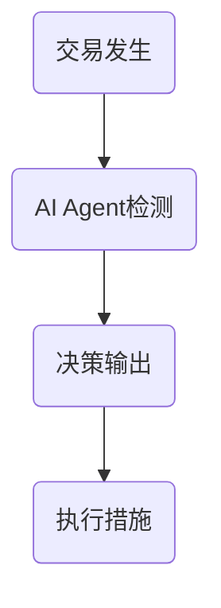
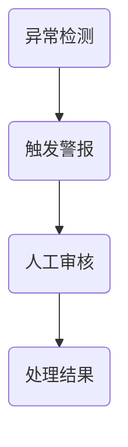

                 


# AI Agent在企业反欺诈与风险控制中的应用

> 关键词：AI Agent, 企业反欺诈, 风险控制, 机器学习, 自然语言处理, 算法原理, 系统架构

> 摘要：本文深入探讨了AI Agent在企业反欺诈与风险控制中的应用，从核心概念、算法原理到系统架构，再到实际项目案例，详细解析了AI Agent如何助力企业提升反欺诈能力。文章结合技术背景、理论基础、实践案例和未来展望，为企业应用AI Agent提供了全面的指导和参考。

---

# 第1章 AI Agent与反欺诈概述

## 1.1 AI Agent的基本概念
### 1.1.1 AI Agent的定义与特点
- AI Agent的定义：智能代理（AI Agent）是一种能够感知环境、自主决策并执行任务的智能体。
- 特点：自主性、反应性、目标导向、学习能力。

### 1.1.2 AI Agent在企业中的应用场景
- 实时监控：实时分析交易数据，识别异常行为。
- 异常检测：基于历史数据，预测潜在的欺诈行为。
- 自动响应：快速触发警报或拦截交易。

### 1.1.3 AI Agent与反欺诈的关联性
- AI Agent通过实时数据分析和决策，显著提高了反欺诈的效率和准确性。

## 1.2 企业反欺诈的背景与挑战
### 1.2.1 传统反欺诈手段的局限性
- 依赖规则：规则难以覆盖所有可能的欺诈模式。
- 人工审核：效率低，成本高。

### 1.2.2 现代企业反欺诈的需求
- 实时性：快速识别和响应。
- 精准性：减少误报和漏报。
- 智能化：利用AI技术提升检测能力。

### 1.2.3 AI Agent在反欺诈中的优势
- 自主学习：适应新的欺诈模式。
- 实时响应：快速决策。
- 多维度分析：结合行为、交易、设备等多个维度进行判断。

## 1.3 风险控制的核心要素
### 1.3.1 风险的定义与分类
- 风险的定义：可能对企业造成损失的不确定性。
- 分类：信用风险、市场风险、操作风险、欺诈风险。

### 1.3.2 风险控制的策略与方法
- 风险评估：识别潜在风险点。
- 风险 mitigation：通过技术手段降低风险。

### 1.3.3 AI Agent在风险控制中的作用
- 监测风险：实时监控风险因素。
- 评估风险：基于数据预测风险的可能性。
- 应对风险：制定和执行风险缓解策略。

## 1.4 本章小结
- 介绍了AI Agent的基本概念及其在反欺诈中的重要性。
- 分析了企业反欺诈的背景和挑战，强调了AI Agent的优势。

---

# 第2章 AI Agent的核心概念与原理

## 2.1 AI Agent的核心概念
### 2.1.1 AI Agent的类型
- 基于规则的AI Agent：根据预定义规则进行决策。
- 基于模型的AI Agent：利用机器学习模型进行预测和决策。

### 2.1.2 AI Agent的工作原理
- 数据输入：接收实时或历史数据。
- 数据处理：清洗、特征提取。
- 决策过程：基于模型或规则生成决策。
- 行动：执行决策，如触发警报或拦截交易。

### 2.1.3 AI Agent的属性特征对比表格
| 属性 | 基于规则的AI Agent | 基于模型的AI Agent |
|------|-------------------|-------------------|
| 决策方式 | 预定义规则       | 机器学习模型预测   |
| 灵活性 | 低                | 高                |
| 维护成本 | 低                | 高                |

## 2.2 AI Agent与企业业务的结合
### 2.2.1 AI Agent在企业反欺诈中的角色
- 数据分析师：实时分析交易数据。
- 预测器：预测潜在欺诈行为。
- 决策者：触发响应措施。

### 2.2.2 AI Agent与企业风险控制的协同关系
- 风险识别：AI Agent识别潜在风险。
- 风险评估：评估风险的可能性和影响。
- 风险应对：制定和执行风险控制策略。

### 2.2.3 AI Agent的实体关系图


---

## 2.3 AI Agent的核心原理
### 2.3.1 数据流与处理流程


### 2.3.2 基于监督学习的分类算法
- 模型：随机森林、支持向量机（SVM）、逻辑回归。
- 逻辑回归公式：$$P(y=1|x) = \frac{e^{w^T x + b}}{1 + e^{w^T x + b}}$$

### 2.3.3 基于无监督学习的异常检测
- 方法：聚类分析（K-means）、孤立林算法。
- 异常检测流程：


---

## 2.4 本章小结
- 详细介绍了AI Agent的核心概念和工作原理。
- 探讨了AI Agent在企业反欺诈中的具体应用。

---

# 第3章 AI Agent在反欺诈中的技术基础

## 3.1 机器学习在反欺诈中的应用
### 3.1.1 监督学习的应用
- 分类任务：欺诈行为识别。
- 模型：随机森林、XGBoost、神经网络。

### 3.1.2 无监督学习的应用
- 聚类分析：识别异常交易模式。
- 层次聚类与K-means对比：
| 方法 | 层次聚类 | K-means |
|------|----------|----------|
| 优点 | 全局视角 | 高效性    |
| 缺点 | 计算复杂 | 初始K选择困难 |

## 3.2 自然语言处理（NLP）在反欺诈中的应用
### 3.2.1 情感分析与文本挖掘
- 情感分析：识别用户评论中的欺诈倾向。
- 文本挖掘：提取关键词，识别潜在欺诈行为。

### 3.2.2 NLP在身份验证中的应用
- 基于文本的用户行为分析：识别异常登录行为。
- 示例代码：
```python
from sklearn.feature_extraction.text import TfidfVectorizer
vectorizer = TfidfVectorizer()
X = vectorizer.fit_transform(text_data)
```

## 3.3 其他技术在反欺诈中的应用
### 3.3.1 时间序列分析
- 模型：ARIMA、LSTM。
- LSTM网络结构：


### 3.3.2 图神经网络
- 应用场景：检测欺诈网络。
- 示例代码：
```python
import networkx as nx
G = nx.DiGraph()
G.add_edge('A', 'B')
G.add_edge('B', 'C')
```

---

## 3.4 本章小结
- 介绍了机器学习和NLP在反欺诈中的具体应用。
- 探讨了时间序列分析和图神经网络的应用潜力。

---

# 第4章 AI Agent的算法原理与实现

## 4.1 AI Agent的算法原理
### 4.1.1 基于监督学习的分类算法
- 算法流程：


### 4.1.2 基于无监督学习的异常检测
- 算法流程：


## 4.2 算法实现与优化
### 4.2.1 算法实现
- 示例代码：
```python
from sklearn.ensemble import RandomForestClassifier
model = RandomForestClassifier()
model.fit(X_train, y_train)
y_pred = model.predict(X_test)
```

### 4.2.2 模型优化
- 调参：网格搜索（Grid Search）。
- 优化目标：提高准确率、召回率。

## 4.3 算法的数学模型
### 4.3.1 监督学习的损失函数
- 逻辑回归损失函数：$$L(y, y_{pred}) = -y \log(y_{pred}) - (1-y) \log(1-y_{pred})$$

### 4.3.2 无监督学习的聚类评估
- 轮廓系数（Silhouette Score）：$$S = \frac{a + b}{2}$$，其中a是样本到最近簇中心的距离，b是样本到其他簇中心的平均距离。

---

## 4.4 本章小结
- 详细讲解了AI Agent的算法原理和实现方法。
- 探讨了模型优化和评估的数学基础。

---

# 第5章 系统架构与设计

## 5.1 系统架构设计
### 5.1.1 系统整体架构
- 模块划分：数据采集、特征提取、模型训练、实时检测。
- 系统架构图：


### 5.1.2 模块功能设计
- 数据采集：实时获取交易数据。
- 特征提取：提取交易金额、时间、用户行为等特征。
- 模型训练：训练分类器或聚类器。
- 实时检测：对新交易进行实时预测和决策。

## 5.2 系统接口设计
### 5.2.1 数据接口
- 数据输入接口：接收交易数据。
- 数据输出接口：输出预测结果和决策。

### 5.2.2 API设计
- API接口：提供预测结果和决策建议。
- 示例代码：
```python
from flask import Flask
app = Flask(__name__)
@app.route('/predict', methods=['POST'])
def predict():
    # 处理请求，返回预测结果
    return result
```

## 5.3 交互流程设计
### 5.3.1 交易监控流程


### 5.3.2 异常处理流程


---

## 5.4 本章小结
- 介绍了反欺诈系统的整体架构和模块设计。
- 探讨了系统接口和交互流程的具体实现。

---

# 第6章 项目实战：AI Agent在电商反欺诈中的应用

## 6.1 项目背景与目标
### 6.1.1 项目背景
- 电商平台面临的欺诈问题：虚假交易、恶意刷单、账户盗用。

### 6.1.2 项目目标
- 实时检测欺诈交易。
- 提高反欺诈的准确率和召回率。

## 6.2 环境搭建与数据准备
### 6.2.1 环境安装
- 安装Python、Pandas、Scikit-learn、Flask。
- 示例代码：
```bash
pip install numpy pandas scikit-learn flask
```

### 6.2.2 数据准备
- 数据来源：电商平台交易数据。
- 数据清洗：处理缺失值、异常值。
- 数据特征：交易金额、时间、用户IP、设备信息。

## 6.3 系统核心代码实现
### 6.3.1 数据预处理
```python
import pandas as pd
df = pd.read_csv('transactions.csv')
df = df.dropna()
```

### 6.3.2 模型训练
```python
from sklearn.model_selection import train_test_split
from sklearn.ensemble import RandomForestClassifier

X_train, X_test, y_train, y_test = train_test_split(df.drop('is_fraud', axis=1), df['is_fraud'])
model = RandomForestClassifier()
model.fit(X_train, y_train)
```

### 6.3.3 实时检测
```python
def predict_fraud(transaction):
    prediction = model.predict(transaction)
    return prediction[0]
```

## 6.4 案例分析与结果解读
### 6.4.1 案例分析
- 案例1：正常交易。
- 案例2：欺诈交易。

### 6.4.2 结果解读
- 正确率：模型预测的准确率。
- 召回率：模型识别的欺诈交易比例。

## 6.5 项目优化与总结
### 6.5.1 项目优化
- 调整模型参数。
- 引入更多的特征。
- 使用集成学习提升性能。

### 6.5.2 项目总结
- 项目成果：提高了反欺诈的准确率和效率。
- 经验教训：数据质量和特征选择对模型性能影响重大。

---

## 6.6 本章小结
- 通过具体案例展示了AI Agent在电商反欺诈中的应用。
- 探讨了项目实现的关键步骤和优化方法。

---

# 第7章 AI Agent的未来发展趋势与挑战

## 7.1 未来发展趋势
### 7.1.1 AI Agent与边缘计算的结合
- 边缘计算的优势：低延迟、高隐私。
- 应用场景：实时反欺诈。

### 7.1.2 AI Agent与5G技术的融合
- 5G的优势：高速数据传输。
- 应用场景：实时监控和快速响应。

### 7.1.3 AI Agent与其他技术的融合
- 与区块链技术的融合：提升数据安全。
- 与物联网的融合：实时监控更多设备和交易。

## 7.2 当前面临的挑战
### 7.2.1 数据隐私问题
- 数据收集与隐私保护的平衡。
- 数据加密与匿名化处理。

### 7.2.2 模型可解释性问题
- 提升模型的可解释性，增强用户信任。

### 7.2.3 模型的实时性和高效性
- 优化算法，提高处理速度。
- 利用分布式计算提升效率。

## 7.3 应对挑战的策略
### 7.3.1 数据隐私保护
- 使用联邦学习（Federated Learning）：在不共享数据的情况下训练模型。
- 数据加密和匿名化处理。

### 7.3.2 模型可解释性提升
- 使用可解释性模型，如线性回归、决策树。
- 解释模型预测结果，提供直观的解释。

### 7.3.3 模型优化与加速
- 使用更高效的算法。
- 优化代码，减少计算时间。

---

## 7.4 本章小结
- 探讨了AI Agent的未来发展趋势。
- 分析了当前面临的挑战及应对策略。

---

# 第8章 最佳实践与注意事项

## 8.1 最佳实践
### 8.1.1 数据质量管理
- 数据清洗：去除噪声数据。
- 数据标准化：统一数据格式。

### 8.1.2 模型选择与调优
- 选择合适的模型：根据数据类型和任务选择模型。
- 模型调优：使用交叉验证和网格搜索。

### 8.1.3 系统安全性
- 数据加密：保护用户隐私。
- 权限控制：限制访问权限。

## 8.2 注意事项
### 8.2.1 数据隐私与合规性
- 遵守相关法律法规，如GDPR。
- 获取用户同意，合法收集数据。

### 8.2.2 系统稳定性与容错性
- 设计容错机制，防止系统崩溃。
- 定期备份数据，防止数据丢失。

### 8.2.3 模型的持续优化
- 定期更新模型，适应新的欺诈模式。
- 监控模型性能，及时调整参数。

---

## 8.3 本章小结
- 总结了AI Agent在实际应用中的最佳实践。
- 提出了应用中的注意事项和建议。

---

# 第9章 结语

## 9.1 总结
- AI Agent在企业反欺诈与风险控制中具有重要作用。
- 通过机器学习和NLP技术，显著提升了反欺诈的效率和准确性。

## 9.2 展望
- 随着技术的进步，AI Agent将在反欺诈中发挥更大的作用。
- 结合边缘计算、5G等新技术，反欺诈能力将得到进一步提升。

---

# 参考文献
1. 书籍：《机器学习实战》
2. 论文：《基于深度学习的欺诈检测方法》
3. 网站：[AI Agent相关技术文档](https://example.com)

---

# 附录
## 附录A：常用机器学习算法对比表格
| 算法类型 | 监督学习 | 无监督学习 | 半监督学习 |
|---------|----------|------------|------------|
| 示例算法 | SVM、随机森林 | K-means、聚类 | 半监督分类器 |

## 附录B：AI Agent相关术语表
- AI Agent：智能代理。
- 模型训练：利用数据训练机器学习模型。
- 特征提取：从数据中提取有用的特征。

---

# END

