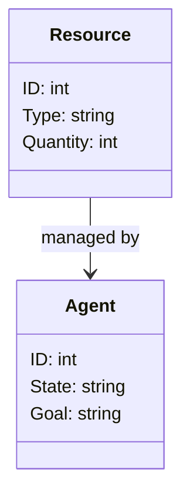
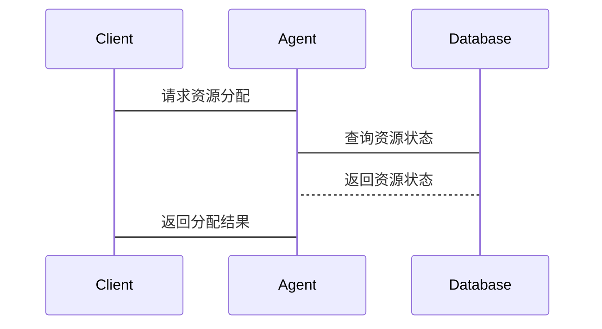

                 


# AI Agent在企业可持续发展战略中的应用

---

## 关键词：AI Agent, 可持续发展, 企业战略, 资源优化, 算法实现, 系统架构, 项目实战

---

## 摘要：  
随着全球对可持续发展的关注日益增加，企业需要在资源利用、环境保护和经济效益之间找到平衡。AI Agent作为一种智能代理技术，能够通过优化资源配置、提高运营效率和降低环境影响，为企业实现可持续发展目标提供强有力的支持。本文将从AI Agent的核心原理、技术实现、应用场景以及系统架构等方面，全面探讨其在企业可持续发展战略中的应用，为企业提供理论依据和实践指导。

---

# 第1章: AI Agent与可持续发展战略概述

## 1.1 AI Agent的基本概念

### 1.1.1 AI Agent的定义与分类  
AI Agent（人工智能代理）是指能够感知环境、自主决策并执行任务的智能系统。它可以分为简单反射型Agent、基于模型的反射型Agent、目标驱动型Agent和效用驱动型Agent四类。  

**关键词：AI Agent, 分类, 定义**

### 1.1.2 AI Agent的核心特征  
AI Agent的核心特征包括自主性、反应性、目标导向性和学习能力。这些特征使其能够适应动态变化的环境，并为企业提供智能化的解决方案。  

**关键词：核心特征, 自主性, 反应性**

### 1.1.3 可持续发展战略的定义与目标  
可持续发展战略是指在满足当前需求的同时，不损害后代满足其需求的能力。其核心目标包括资源高效利用、环境保护和经济效益最大化。  

**关键词：可持续发展, 资源利用, 环境保护**

## 1.2 AI Agent在企业可持续发展战略中的作用  

### 1.2.1 优化资源配置  
AI Agent可以通过智能算法优化企业的资源配置，减少浪费，提高效率。  

### 1.2.2 提高运营效率  
通过自动化和智能化的决策，AI Agent能够显著提高企业的运营效率。  

### 1.2.3 降低环境影响  
AI Agent可以通过预测和优化能源使用、减少碳排放等方式，降低企业的环境影响。  

**关键词：资源配置, 运营效率, 环境影响**

## 1.3 本章小结  
本章介绍了AI Agent的基本概念、核心特征以及在企业可持续发展战略中的作用，为后续章节的深入探讨奠定了基础。

---

# 第2章: AI Agent的核心原理

## 2.1 AI Agent的体系结构  

### 2.1.1 知识表示与推理  
知识表示是AI Agent的核心，通常采用知识图谱或逻辑规则的形式。推理过程包括演绎推理和归纳推理。  

**关键词：知识表示, 推理, 知识图谱**

### 2.1.2 行为规划与决策  
基于目标的规划和强化学习是行为规划与决策的两种主要方法。  

**关键词：行为规划, 强化学习, 目标驱动**

### 2.1.3 人机交互界面  
友好的人机交互界面是AI Agent与用户有效沟通的关键。  

**关键词：人机交互, 用户界面, 交互设计**

## 2.2 AI Agent的算法基础  

### 2.2.1 逻辑推理算法  
逻辑推理算法包括一阶逻辑推理和概率逻辑推理。  

**关键词：逻辑推理, 一阶逻辑, 概率推理**

### 2.2.2 强化学习算法  
强化学习算法如Q-Learning和Deep Q-Networks（DQN）常用于复杂决策问题。  

**关键词：强化学习, Q-Learning, DQN**

### 2.2.3 自然语言处理技术  
自然语言处理技术使AI Agent能够理解和生成人类语言，增强交互能力。  

**关键词：自然语言处理, NLP, 人机对话**

## 2.3 AI Agent与企业系统的集成  

### 2.3.1 数据接口设计  
API（应用程序编程接口）是AI Agent与企业系统集成的主要方式。  

**关键词：API, 数据接口, 系统集成**

### 2.3.2 系统集成方案  
系统集成方案需要考虑兼容性、安全性与可扩展性。  

**关键词：系统集成, 兼容性, 安全性**

### 2.3.3 安全与隐私保护  
数据加密和访问控制是确保AI Agent安全运行的关键措施。  

**关键词：数据安全, 隐私保护, 访问控制**

## 2.4 本章小结  
本章详细探讨了AI Agent的核心原理和技术实现，为企业应用提供了理论支持。

---

# 第3章: AI Agent在企业资源优化中的应用

## 3.1 资源分配与调度优化  

### 3.1.1 基于AI Agent的资源分配模型  
资源分配模型通常采用线性规划和整数规划方法。  

**关键词：资源分配, 线性规划, 整数规划**

### 3.1.2 实际案例分析  
以某制造企业为例，AI Agent通过优化生产线资源分配，提高了生产效率。  

**关键词：案例分析, 生产线优化, 生产效率**

## 3.2 供应链管理优化  

### 3.2.1 供应链中的AI Agent应用  
AI Agent可以优化供应商选择、库存管理和物流调度。  

**关键词：供应链管理, 供应商选择, 物流调度**

### 3.2.2 优化算法与实现  
使用遗传算法和模拟退火算法优化供应链成本。  

**关键词：遗传算法, 模拟退火, 供应链成本**

## 3.3 能源管理与碳足迹分析  

### 3.3.1 能源消耗预测  
基于时间序列分析的能源消耗预测模型。  

**关键词：能源消耗, 时间序列分析, 预测模型**

### 3.3.2 碳排放优化策略  
通过强化学习优化碳排放，实现绿色供应链。  

**关键词：碳排放, 强化学习, 绿色供应链**

## 3.4 本章小结  
本章通过多个实际案例展示了AI Agent在企业资源优化中的广泛应用。

---

# 第4章: AI Agent的算法实现与数学模型

## 4.1 逻辑推理算法  

### 4.1.1 基于知识图谱的推理  
知识图谱构建与推理的流程如下：  
1. 数据收集与预处理；  
2. 知识抽取与表示；  
3. 推理与验证。  

**关键词：知识图谱, 推理流程, 数据预处理**

### 4.1.2 逻辑规则的表示与推理  
逻辑规则表示通常采用谓词逻辑和一阶逻辑。  

**关键词：谓词逻辑, 一阶逻辑, 逻辑规则**

## 4.2 强化学习算法  

### 4.2.1 Q-Learning算法  
Q-Learning算法的伪代码如下：  
```python
初始化Q表为全零矩阵  
while True:  
    选择动作a  
    执行动作a，获得奖励r  
    更新Q值：Q[s][a] = Q[s][a] + α*(r + γ*max(Q[s'][a']))  
```

**关键词：Q-Learning, 伪代码, 动作选择**

### 4.2.2 Deep Q-Networks (DQN) 算法  
DQN算法的核心是使用深度神经网络近似Q值函数。  

**关键词：深度神经网络, Q值函数, DQN**

## 4.3 自然语言处理算法  

### 4.3.1 基于Transformer的模型  
Transformer模型通过自注意力机制实现高效的文本处理。  

**关键词：Transformer, 自注意力机制, 文本处理**

### 4.3.2 意图识别与对话生成  
意图识别采用词袋模型或TF-IDF方法，对话生成基于序列到序列模型。  

**关键词：意图识别, TF-IDF, 序列到序列模型**

## 4.4 算法实现的Python代码  

### 4.4.1 Q-Learning算法实现  
```python
import numpy as np

class QLearning:
    def __init__(self, state_space, action_space, learning_rate=0.1, gamma=0.9):
        self.q_table = np.zeros((state_space, action_space))
        self.lr = learning_rate
        self.gamma = gamma

    def choose_action(self, state, epsilon=0.1):
        if np.random.random() < epsilon:
            return np.random.randint(0, action_space)
        else:
            return np.argmax(self.q_table[state])

    def update_q_table(self, state, action, reward, next_state):
        self.q_table[state][action] = self.q_table[state][action] + self.lr * (reward + self.gamma * np.max(self.q_table[next_state]) - self.q_table[state][action])
```

**关键词：Python代码, Q-Learning实现, 代码示例**

## 4.5 本章小结  
本章通过具体的算法实现和数学模型，详细阐述了AI Agent的核心技术。

---

# 第5章: 系统分析与架构设计方案

## 5.1 项目介绍  

### 5.1.1 项目背景  
本项目旨在通过AI Agent优化某制造企业的资源分配和供应链管理。  

**关键词：制造企业, 资源分配, 供应链管理**

## 5.2 系统功能设计  

### 5.2.1 领域模型设计  
领域模型如下：  


**关键词：领域模型, 类图, 领域设计**

## 5.3 系统架构设计  

### 5.3.1 系统架构图  
系统架构如下：  
```mermaid
client --> API Gateway: 请求
API Gateway --> AI Agent: 请求处理
AI Agent --> Database: 数据查询
Database --> AI Agent: 返回结果
AI Agent --> Client: 返回响应
```

**关键词：系统架构, API网关, 数据库**

## 5.4 系统接口设计  

### 5.4.1 API接口定义  
主要API接口包括：  
- `/api/v1/agent/query`：查询资源状态  
- `/api/v1/agent/allocate`：分配资源  
- `/api/v1/agent/log`：获取日志  

**关键词：API接口, 接口定义, 接口设计**

## 5.5 系统交互设计  

### 5.5.1 交互流程图  
系统交互流程如下：  


**关键词：系统交互, 序列图, 交互流程**

## 5.6 本章小结  
本章详细设计了AI Agent系统的架构和接口，为实际应用提供了指导。

---

# 第6章: 项目实战

## 6.1 环境安装  

### 6.1.1 安装Python和相关库  
需要安装的库包括：  
- `numpy`  
- `pandas`  
- `scikit-learn`  
- `tensorflow`  

**关键词：环境搭建, Python库, 安装步骤**

## 6.2 系统核心实现  

### 6.2.1 资源分配模块  
资源分配模块代码如下：  
```python
def allocate_resources(resourcedemand):
    # 简单的贪心算法实现
    for resource in resourcedemand:
        if resource['type'] == 'CPU':
            allocate_CPU(resource['quantity'])
        elif resource['type'] == 'Memory':
            allocate_Memory(resource['quantity'])
```

**关键词：资源分配, 贪心算法, 模块实现**

## 6.3 代码应用解读与分析  

### 6.3.1 代码功能分析  
上述代码实现了一个简单的资源分配模块，采用贪心算法分配资源。  

**关键词：代码功能, 贪心算法, 资源分配**

## 6.4 实际案例分析  

### 6.4.1 案例介绍  
以某制造企业的资源分配问题为例，详细分析AI Agent的应用。  

**关键词：实际案例, 制造企业, 资源分配**

## 6.5 本章小结  
本章通过实际项目展示了AI Agent的应用过程，为读者提供了实践指导。

---

# 第7章: 最佳实践与未来展望

## 7.1 最佳实践  

### 7.1.1 系统设计  
系统设计应注重模块化和可扩展性。  

**关键词：系统设计, 模块化, 可扩展性**

### 7.1.2 数据安全  
数据安全是AI Agent系统运行的重要保障。  

**关键词：数据安全, 隐私保护, 安全措施**

## 7.2 小结  

### 7.2.1 项目总结  
本项目通过AI Agent优化了企业的资源分配和供应链管理，显著提高了运营效率。  

**关键词：项目总结, 运营效率, 资源分配**

## 7.3 未来展望  

### 7.3.1 技术发展  
未来，随着AI技术的不断发展，AI Agent在企业可持续发展战略中的应用将更加广泛和深入。  

**关键词：技术发展, 未来趋势, 应用前景**

---

# 第8章: 注意事项与拓展阅读

## 8.1 注意事项  

### 8.1.1 系统稳定性  
AI Agent系统的稳定性对企业运营至关重要。  

**关键词：系统稳定性, 系统维护, 稳定运行**

### 8.1.2 数据质量管理  
数据质量直接影响AI Agent的决策能力。  

**关键词：数据质量, 数据清洗, 数据管理**

## 8.2 拓展阅读  

### 8.2.1 相关书籍  
推荐阅读《AI Agent与企业应用》、《可持续发展战略与技术创新》等书籍。  

**关键词：拓展阅读, 相关书籍, 技术创新**

## 8.3 本章小结  
本章总结了AI Agent应用中的注意事项，并提供了拓展阅读的方向，帮助读者进一步深入学习。

---

# 附录: AI Agent算法实现的详细代码

## 附录A: Q-Learning算法实现  

```python
import numpy as np

class QLearning:
    def __init__(self, state_space, action_space, learning_rate=0.1, gamma=0.9):
        self.q_table = np.zeros((state_space, action_space))
        self.lr = learning_rate
        self.gamma = gamma

    def choose_action(self, state, epsilon=0.1):
        if np.random.random() < epsilon:
            return np.random.randint(0, action_space)
        else:
            return np.argmax(self.q_table[state])

    def update_q_table(self, state, action, reward, next_state):
        self.q_table[state][action] = self.q_table[state][action] + self.lr * (reward + self.gamma * np.max(self.q_table[next_state]) - self.q_table[state][action])
```

## 附录B: 资源分配模块实现  

```python
def allocate_resources(resourcedemand):
    for resource in resourcedemand:
        if resource['type'] == 'CPU':
            allocate_CPU(resource['quantity'])
        elif resource['type'] == 'Memory':
            allocate_Memory(resource['quantity'])
```

---

# 参考文献  

1. Russell, S., & Norvig, P. (2010). Artificial Intelligence: A Modern Approach.  
2. Goodfellow, I., Bengio, Y., & Courville, A. (2016). Deep Learning.  
3. 张钹. (2008). 人工智能导论. 清华大学出版社.  

---

# 结束语  

通过本文的深入探讨，我们可以看到AI Agent在企业可持续发展战略中的巨大潜力。随着技术的不断进步，AI Agent将在更多领域发挥重要作用，为企业创造更大的价值。

