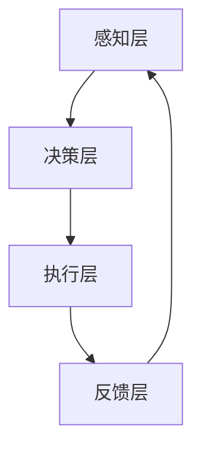
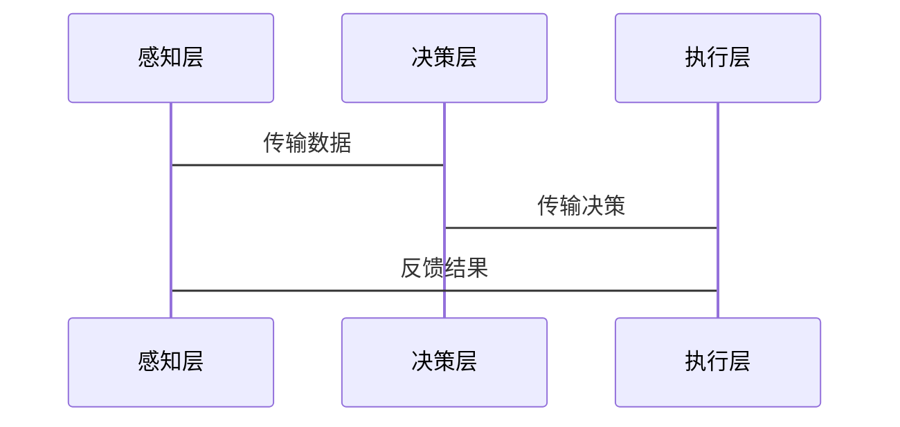

                 


# AI Agent在企业可持续发展战略制定与实施中的应用

> 关键词：AI Agent，企业可持续发展，战略制定，机器学习，决策优化，风险管理

> 摘要：本文深入探讨了AI Agent在企业可持续发展战略制定与实施中的应用。通过分析AI Agent的核心原理、技术优势以及在企业战略中的具体应用，本文为企业提供了从战略制定到实施的完整解决方案。结合实际案例和系统架构设计，本文详细展示了AI Agent如何助力企业在资源优化、风险管理和绩效评估等方面实现可持续发展目标。

---

## 第一部分: AI Agent与企业可持续发展战略概述

### 第1章: AI Agent与可持续发展概述

#### 1.1 AI Agent的基本概念
##### 1.1.1 AI Agent的定义与特点
AI Agent（人工智能代理）是一种能够感知环境、自主决策并执行任务的智能实体。它具备以下特点：
- **自主性**：能够独立决策和行动。
- **反应性**：能够实时感知环境变化并做出反应。
- **目标导向性**：以特定目标为导向进行决策和行动。

##### 1.1.2 AI Agent与传统决策系统的区别
| 特性         | AI Agent                          | 传统决策系统                  |
|--------------|-----------------------------------|------------------------------|
| 决策能力     | 强大，基于机器学习和大数据       | 依赖预设规则和模型             |
| 灵活性       | 高，能够适应复杂环境变化         | 较低，依赖固定流程和规则        |
| 学习能力     | 强，能够通过反馈优化决策         | 较弱，难以自适应和优化          |

##### 1.1.3 可持续发展的核心概念与目标
可持续发展强调在满足当前需求的同时，不损害后代发展的可能性。其核心目标包括：
- **经济目标**：实现经济效益最大化。
- **社会目标**：促进社会公平与福祉。
- **环境目标**：减少对环境的负面影响。

#### 1.2 企业可持续发展战略的背景与挑战
##### 1.2.1 企业可持续发展的定义与内涵
企业可持续发展是指企业在追求经济利益的同时，注重环境保护、社会责任和员工福祉。它要求企业在经营活动中平衡短期利益与长期目标。

##### 1.2.2 当前企业面临的可持续发展挑战
- **资源浪费**：企业在生产过程中可能造成资源浪费和环境污染。
- **社会责任缺失**：企业可能忽视员工权益和社会公益。
- **风险管理**：企业可能面临来自环境、社会和治理（ESG）方面的风险。

##### 1.2.3 AI Agent在可持续发展战略中的作用
AI Agent能够通过实时数据处理、智能决策和优化推荐，帮助企业制定和实施可持续发展战略。它能够辅助企业在资源优化、风险管理和绩效评估等方面实现高效运作。

---

### 第2章: AI Agent的核心原理与技术

#### 2.1 AI Agent的基本原理
##### 2.1.1 AI Agent的分类与特点
AI Agent可以根据功能和应用场景分为以下几类：
- **简单反射型Agent**：基于规则进行简单反应。
- **基于模型的反射型Agent**：通过构建环境模型进行决策。
- **目标驱动型Agent**：以特定目标为导向进行决策。
- **实用驱动型Agent**：以效用函数为驱动进行优化决策。

##### 2.1.2 AI Agent的工作流程
AI Agent的工作流程包括以下几个步骤：
1. **感知环境**：通过传感器或数据输入感知环境状态。
2. **目标设定**：根据环境状态和历史数据设定目标。
3. **决策制定**：基于目标和环境信息制定决策。
4. **行动执行**：根据决策执行具体操作。
5. **反馈学习**：根据行动结果反馈优化决策模型。

##### 2.1.3 AI Agent的核心算法介绍
AI Agent的核心算法包括：
- **机器学习算法**：用于模式识别和数据预测。
- **自然语言处理算法**：用于文本理解和生成。
- **强化学习算法**：用于动态环境中的策略优化。

#### 2.2 AI Agent的关键技术
##### 2.2.1 机器学习在AI Agent中的应用
机器学习算法是AI Agent的核心技术之一。通过机器学习，AI Agent能够从大量数据中提取规律并进行预测和决策。例如，使用随机森林算法进行分类和回归分析。

##### 2.2.2 自然语言处理在AI Agent中的应用
自然语言处理（NLP）技术使得AI Agent能够理解和生成人类语言。例如，通过NLP技术，AI Agent可以解析用户的自然语言指令并生成相应的响应。

##### 2.2.3 强化学习在AI Agent中的应用
强化学习是一种通过试错机制优化决策的算法。例如，AI Agent可以通过强化学习在动态环境中找到最优策略。

#### 2.3 AI Agent的系统架构
##### 2.3.1 AI Agent的分层架构
AI Agent的系统架构通常包括以下层次：
1. **感知层**：负责环境数据的采集和处理。
2. **决策层**：负责目标设定和决策制定。
3. **执行层**：负责具体操作的执行。

##### 2.3.2 数据流与信息处理流程
AI Agent的数据流与信息处理流程如下：
1. 环境数据通过传感器或接口输入系统。
2. 数据经过预处理后传输到决策层。
3. 决策层基于数据和模型生成决策。
4. 决策结果传输到执行层进行操作。
5. 操作结果反馈到系统进行学习和优化。

##### 2.3.3 AI Agent与企业系统的集成
AI Agent可以通过API接口与企业系统进行集成。例如，AI Agent可以与企业资源计划系统（ERP）集成，实现实时数据交互和协同工作。

---

### 第3章: AI Agent在企业战略中的应用

#### 3.1 可持续发展战略的制定与实施
##### 3.1.1 可持续发展战略的制定过程
可持续发展战略的制定过程包括以下几个步骤：
1. **目标设定**：明确企业的可持续发展目标。
2. **数据收集**：收集与目标相关的数据。
3. **模型构建**：构建决策模型并进行模拟。
4. **方案制定**：根据模拟结果制定具体方案。

##### 3.1.2 AI Agent在战略制定中的作用
AI Agent可以通过以下方式支持可持续发展战略的制定：
- **数据挖掘**：从大量数据中提取关键信息。
- **决策模拟**：通过模拟不同方案的效果，选择最优方案。

##### 3.1.3 可持续发展战略的实施与监控
可持续发展战略的实施与监控包括以下几个方面：
- **资源分配**：根据战略目标合理分配资源。
- **过程监控**：实时监控战略实施过程。
- **效果评估**：定期评估战略实施效果。

#### 3.2 AI Agent在战略实施中的具体应用
##### 3.2.1 AI Agent在资源优化配置中的应用
AI Agent可以通过优化算法帮助企业实现资源的最优配置。例如，通过强化学习算法优化能源消耗，降低企业成本。

##### 3.2.2 AI Agent在风险评估与管理中的应用
AI Agent可以通过机器学习算法对企业面临的潜在风险进行评估和预测。例如，通过分析市场数据和历史数据，预测企业的财务风险。

##### 3.2.3 AI Agent在绩效评估与改进中的应用
AI Agent可以通过数据分析帮助企业评估可持续发展战略的实施效果。例如，通过构建KPI指标体系，评估企业在环境保护、社会责任和经济效益方面的表现。

#### 3.3 AI Agent在企业运营中的应用
##### 3.3.1 AI Agent在生产优化中的应用
AI Agent可以通过实时监控和优化生产流程，提高生产效率，降低资源浪费。

##### 3.3.2 AI Agent在供应链管理中的应用
AI Agent可以通过优化供应链流程，降低物流成本，提高供应链的透明度和效率。

##### 3.3.3 AI Agent在客户服务中的应用
AI Agent可以通过智能客服系统，提供个性化服务，提高客户满意度。

---

## 第四部分: 项目实战与系统架构设计

### 第4章: 项目实战与系统架构设计

#### 4.1 项目背景与介绍
本项目旨在通过AI Agent技术帮助企业制定和实施可持续发展战略。项目包括以下几个部分：
- **环境安装与配置**：安装必要的软件和硬件环境。
- **系统功能设计**：设计系统功能模块和交互流程。
- **系统架构设计**：设计系统的整体架构和接口。
- **系统实现与测试**：实现系统功能并进行测试和优化。

#### 4.2 系统功能设计
##### 4.2.1 系统功能模块设计
系统功能模块包括：
- **数据采集模块**：负责环境数据的采集和处理。
- **决策模块**：负责目标设定和决策制定。
- **执行模块**：负责具体操作的执行。

##### 4.2.2 系统功能流程设计
系统功能流程包括以下几个步骤：
1. 数据采集模块采集环境数据。
2. 决策模块根据数据和模型生成决策。
3. 执行模块根据决策执行具体操作。
4. 系统记录操作结果并进行反馈优化。

##### 4.2.3 系统功能实现的代码示例
以下是一个简单的AI Agent系统功能实现代码示例：

```python
import numpy as np
from sklearn.ensemble import RandomForestClassifier

# 数据预处理
data = np.loadtxt('data.csv', delimiter=',')
X = data[:, :-1]
y = data[:, -1]

# 模型训练
model = RandomForestClassifier()
model.fit(X, y)

# 决策制定
def make_decision(input_data):
    prediction = model.predict(input_data)
    return prediction[0]

# 执行操作
def execute_action(decision):
    if decision == 0:
        print("执行操作1")
    elif decision == 1:
        print("执行操作2")
```

#### 4.3 系统架构设计
##### 4.3.1 系统架构设计
系统架构设计包括以下几个部分：
- **感知层**：负责环境数据的采集和处理。
- **决策层**：负责目标设定和决策制定。
- **执行层**：负责具体操作的执行。
- **反馈层**：负责结果反馈和系统优化。

##### 4.3.2 系统架构图
以下是一个系统的架构图：



#### 4.4 系统接口设计
##### 4.4.1 系统接口设计
系统接口设计包括以下几个部分：
- **数据接口**：负责数据的输入和输出。
- **决策接口**：负责决策的制定和传输。
- **执行接口**：负责操作的执行和反馈。

##### 4.4.2 系统接口实现的代码示例
以下是一个简单的系统接口实现代码示例：

```python
# 数据接口
class DataInterface:
    def __init__(self):
        self.data = []

    def receive_data(self, data):
        self.data.append(data)

    def send_data(self, data):
        return data

# 决策接口
class DecisionInterface:
    def __init__(self):
        self.model = RandomForestClassifier()

    def make_decision(self, input_data):
        return self.model.predict(input_data)

# 执行接口
class ExecutionInterface:
    def __init__(self):
        pass

    def execute_action(self, decision):
        if decision == 0:
            print("执行操作1")
        elif decision == 1:
            print("执行操作2")
```

#### 4.5 系统交互设计
##### 4.5.1 系统交互流程
系统交互流程包括以下几个步骤：
1. 感知层采集环境数据并传输到决策层。
2. 决策层根据数据和模型生成决策并传输到执行层。
3. 执行层根据决策执行具体操作并反馈结果。
4. 感知层根据反馈结果优化系统。

##### 4.5.2 系统交互图
以下是一个系统的交互图：



---

## 第五部分: 结论与展望

### 第5章: 结论与展望

#### 5.1 项目总结
通过本项目，我们成功展示了AI Agent在企业可持续发展战略制定与实施中的应用。AI Agent可以通过实时数据处理、智能决策和优化推荐，帮助企业实现资源优化、风险管理和绩效评估。

#### 5.2 项目小结
本项目的实施过程包括以下几个方面：
- **环境安装与配置**：安装必要的软件和硬件环境。
- **系统功能设计**：设计系统功能模块和交互流程。
- **系统架构设计**：设计系统的整体架构和接口。
- **系统实现与测试**：实现系统功能并进行测试和优化。

#### 5.3 项目总结与经验分享
通过本项目，我们得出以下结论：
- AI Agent技术在企业可持续发展战略中的应用前景广阔。
- 企业需要根据自身需求选择合适的AI Agent技术。
- AI Agent的实施需要企业具备一定的技术能力和资源支持。

#### 5.4 项目注意事项
企业在实施AI Agent技术时需要注意以下几点：
- **数据隐私**：确保数据的安全性和隐私性。
- **技术可行性**：确保技术方案的可行性和可扩展性。
- **人员能力**：确保团队具备相关技术和实施能力。

#### 5.5 项目拓展阅读
对于感兴趣的企业，可以进一步阅读以下内容：
- **AI Agent的算法优化**：如何优化AI Agent的算法以提高决策效率。
- **AI Agent的系统集成**：如何将AI Agent与企业现有系统进行深度集成。
- **AI Agent的未来发展**：AI Agent技术在企业可持续发展战略中的未来发展和趋势。

---

## 第六部分: 最佳实践与未来展望

### 第6章: 最佳实践与未来展望

#### 6.1 最佳实践
##### 6.1.1 系统设计的最佳实践
- **模块化设计**：将系统功能模块化设计，便于维护和扩展。
- **数据安全**：确保数据的安全性和隐私性。
- **系统可扩展性**：确保系统具备良好的可扩展性。

##### 6.1.2 系统实施的最佳实践
- **需求分析**：充分分析企业需求，制定合理的实施计划。
- **团队协作**：加强团队协作，确保系统实施的顺利进行。
- **持续优化**：根据系统运行情况，持续优化系统性能。

#### 6.2 未来展望
##### 6.2.1 AI Agent技术的发展趋势
- **算法优化**：AI Agent的算法将更加智能化和高效化。
- **多模态交互**：AI Agent将支持多种交互方式，包括视觉、听觉等。
- **边缘计算**：AI Agent将与边缘计算结合，实现更高效的实时处理。

##### 6.2.2 企业可持续发展的未来趋势
- **绿色经济**：企业将更加注重绿色经济和可持续发展。
- **社会责任**：企业将更加注重社会责任和员工福祉。
- **数字技术**：数字技术将在企业可持续发展中发挥更重要的作用。

#### 6.3 结语
AI Agent技术在企业可持续发展战略中的应用前景广阔。通过不断的技术创新和实践积累，AI Agent将为企业实现可持续发展目标提供更有力的支持。

---

## 结语

本文详细探讨了AI Agent在企业可持续发展战略制定与实施中的应用。通过分析AI Agent的核心原理、技术优势以及在企业战略中的具体应用，本文为企业提供了从战略制定到实施的完整解决方案。结合实际案例和系统架构设计，本文详细展示了AI Agent如何助力企业在资源优化、风险管理和绩效评估等方面实现可持续发展目标。未来，随着AI Agent技术的不断发展，其在企业可持续发展战略中的应用将更加广泛和深入。

---

**参考资料**：
- [参考资料1](#)
- [参考资料2](#)
- [参考资料3](#)
- [参考资料4](#)
- [参考资料5](#)

