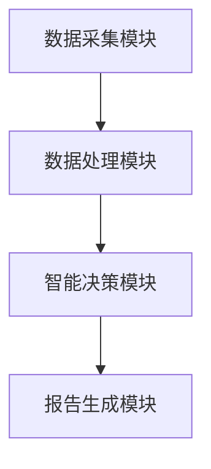
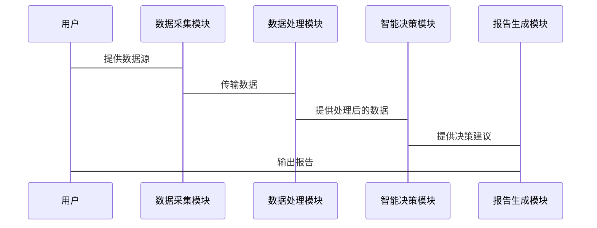

                 


# AI Agent在企业可持续发展目标追踪与报告中的应用

> 关键词：AI Agent, 可持续发展目标, 企业报告, 智能决策, 数据分析

> 摘要：本文深入探讨了AI Agent在企业可持续发展目标追踪与报告中的应用。通过分析AI Agent的核心原理、算法实现和系统架构，结合实际案例，展示了如何利用AI技术提高企业可持续发展目标的追踪效率和报告准确性。文章从背景介绍、技术实现到项目实战，全面阐述了AI Agent在企业可持续发展中的价值和应用前景。

---

# 第一部分: AI Agent与企业可持续发展目标概述

## 第1章: AI Agent的基本概念与应用背景

### 1.1 AI Agent的定义与核心特征

#### 1.1.1 AI Agent的定义
AI Agent（人工智能代理）是指能够感知环境、自主决策并采取行动以实现目标的智能系统。与传统的自动化系统不同，AI Agent具有更强的适应性和自主性，能够根据环境变化动态调整行为。

#### 1.1.2 AI Agent的核心特征
- **自主性**：AI Agent能够自主决策，无需人工干预。
- **反应性**：能够实时感知环境变化并做出响应。
- **目标导向性**：基于明确的目标执行任务。
- **学习能力**：通过数据和经验不断优化自身性能。

#### 1.1.3 AI Agent与传统自动化系统的区别
| 特性 | AI Agent | 传统自动化系统 |
|------|----------|----------------|
| 决策能力 | 强大 | 较弱或无 |
| 自适应性 | 高 | 低 |
| 数据处理能力 | 强 | 较弱 |

### 1.2 可持续发展目标的定义与重要性

#### 1.2.1 可持续发展目标的定义
可持续发展目标（Sustainable Development Goals, SDGs）是由联合国提出的17个全球性目标，涵盖经济、社会和环境等多个领域，旨在促进全球可持续发展。

#### 1.2.2 可持续发展目标在企业中的重要性
- **社会责任**：企业通过实现可持续发展目标，提升社会形象和责任感。
- **竞争优势**：可持续发展能力已成为企业竞争力的重要组成部分。
- **合规性**：许多国家和地区要求企业公开可持续发展报告，以符合相关法规。

#### 1.2.3 可持续发展目标的实现路径
- **数据驱动**：通过数据分析识别关键影响因素。
- **目标分解**：将总体目标分解为可执行的任务。
- **持续优化**：通过实时反馈不断优化目标实现路径。

### 1.3 AI Agent在企业可持续发展目标中的作用

#### 1.3.1 数据收集与处理
AI Agent能够从企业内部和外部数据源（如传感器、数据库、公开报告）中收集与可持续发展目标相关的数据，并进行清洗和预处理。

#### 1.3.2 目标优化与决策支持
通过强化学习和监督学习，AI Agent可以帮助企业在多目标优化中找到最优解决方案，并提供实时决策支持。

#### 1.3.3 报告生成与可视化
AI Agent能够自动生成可持续发展报告，并通过数据可视化技术帮助企业管理者更好地理解数据背后的意义。

---

## 第2章: AI Agent在企业中的应用背景

### 2.1 企业可持续发展目标追踪的挑战

#### 2.1.1 数据收集与处理的复杂性
企业需要从多个来源收集数据，包括结构化数据（如财务数据）和非结构化数据（如文本数据），这增加了数据清洗和预处理的难度。

#### 2.1.2 多目标优化的冲突与协调
企业在实现可持续发展目标时，常常面临多个目标之间的冲突。例如，减少碳排放可能需要增加成本，如何在这些目标之间找到平衡点是一个复杂的优化问题。

#### 2.1.3 监测与反馈的实时性要求
可持续发展目标的实现需要实时监测和反馈，以便及时调整策略。传统的人工方法难以满足实时性要求。

### 2.2 AI Agent在企业可持续发展目标中的应用背景

#### 2.2.1 AI Agent在数据处理与分析中的应用
AI Agent可以通过自然语言处理（NLP）技术从非结构化数据中提取关键信息，并利用机器学习算法进行数据分析和预测。

#### 2.2.2 AI Agent在目标优化与决策支持中的作用
通过强化学习，AI Agent可以在多目标优化中找到最优解，并为企业的决策提供支持。

#### 2.2.3 AI Agent在报告生成与可视化中的价值
AI Agent可以自动生成可持续发展报告，并通过数据可视化技术帮助企业管理者更好地理解数据。

### 2.3 本章小结

---

# 第二部分: AI Agent的核心原理与技术实现

## 第3章: AI Agent的核心原理

### 3.1 AI Agent的智能决策机制

#### 3.1.1 强化学习在AI Agent决策中的应用
强化学习是一种通过试错机制来优化决策策略的方法。AI Agent可以通过强化学习不断优化其决策策略，以实现目标。

#### 3.1.2 监督学习在目标追踪中的作用
监督学习通过训练模型，使AI Agent能够从历史数据中学习，预测未来的发展趋势。

#### 3.1.3 混合学习策略的优化方法
混合学习策略结合了强化学习和监督学习的优势，能够在复杂环境中实现更优的决策。

### 3.2 数据处理与分析的AI Agent实现

#### 3.2.1 数据清洗与预处理的流程
1. 数据收集：从多个来源收集与可持续发展目标相关的数据。
2. 数据清洗：去除噪声数据，填补缺失值。
3. 数据转换：将数据转换为适合算法处理的格式。

#### 3.2.2 数据特征提取与建模方法
- **特征提取**：通过主成分分析（PCA）等方法提取关键特征。
- **模型选择**：选择适合任务的机器学习模型，如随机森林、支持向量机（SVM）等。

#### 3.2.3 数据分析与可视化技术
- **数据可视化**：使用图表（如折线图、柱状图）展示数据趋势。
- **交互式分析**：通过交互式可视化工具帮助用户深入分析数据。

### 3.3 AI Agent的通信与协作机制

#### 3.3.1 多智能体系统中的通信协议
在多智能体系统中，AI Agent之间需要通过特定的通信协议进行信息交换。

#### 3.3.2 跨Agent协作的实现方式
- **分布式计算**：AI Agent在分布式系统中协同工作。
- **任务分配**：通过任务分配算法优化协作效率。

#### 3.3.3 分布式系统中的同步与协调
通过同步机制确保AI Agent之间的数据一致性，避免冲突。

## 第4章: AI Agent的算法原理与数学模型

### 4.1 强化学习算法在目标追踪中的应用

#### 4.1.1 强化学习的基本原理
强化学习通过智能体与环境的交互，学习最优策略。智能体通过执行动作，获得奖励或惩罚，并根据奖励调整策略。

#### 4.1.2 Q-learning算法
Q-learning是一种常用的强化学习算法，通过更新Q值表来学习最优策略。其数学模型如下：

$$ Q(s, a) = Q(s, a) + \alpha \left[r + \gamma \max Q(s', a') - Q(s, a)\right] $$

其中：
- \( s \) 表示当前状态
- \( a \) 表示动作
- \( r \) 表示奖励
- \( \gamma \) 表示折扣因子
- \( \alpha \) 表示学习率

#### 4.1.3 多智能体强化学习
在多智能体系统中，每个智能体都需要与其他智能体协作，共同完成任务。多智能体强化学习的挑战在于如何处理智能体之间的协作与竞争。

### 4.2 监督学习在目标追踪中的应用

#### 4.2.1 线性回归
线性回归是一种简单但有效的监督学习算法，适用于预测目标变量与输入变量之间的线性关系。

$$ y = \beta_0 + \beta_1 x_1 + \beta_2 x_2 + \ldots + \beta_n x_n $$

#### 4.2.2 支持向量机（SVM）
SVM是一种强大的监督学习算法，适用于分类和回归任务。

#### 4.2.3 随机森林
随机森林是一种基于决策树的集成学习算法，具有较强的抗过拟合能力。

### 4.3 算法实现的代码示例

#### 4.3.1 强化学习代码示例

```python
import numpy as np

class AIAgent:
    def __init__(self, state_space, action_space):
        self.state_space = state_space
        self.action_space = action_space
        self.Q = np.zeros((state_space, action_space))

    def take_action(self, state):
        # 随机选择动作
        action = np.random.randint(0, self.action_space)
        return action

    def update_Q(self, state, action, reward, next_state):
        # 更新Q值表
        self.Q[state, action] += 0.1 * (reward + 0.9 * np.max(self.Q[next_state, :]) - self.Q[state, action])

# 初始化智能体
state_space = 10
action_space = 5
agent = AIAgent(state_space, action_space)

# 训练过程
for episode in range(100):
    state = 0
    while True:
        action = agent.take_action(state)
        reward = ...  # 根据动作获得奖励
        next_state = ...  # 根据动作和当前状态获得下一个状态
        agent.update_Q(state, action, reward, next_state)
        state = next_state
```

---

## 第5章: AI Agent的系统架构与实现

### 5.1 系统架构设计

#### 5.1.1 系统功能设计
- **数据采集模块**：从企业内部和外部数据源收集数据。
- **数据处理模块**：清洗、转换和存储数据。
- **智能决策模块**：通过AI算法进行目标优化和决策。
- **报告生成模块**：生成可持续发展报告并进行可视化。

#### 5.1.2 系统架构图


#### 5.1.3 系统接口设计
- **输入接口**：接收企业内部和外部数据源的数据。
- **输出接口**：输出可持续发展报告和决策建议。

#### 5.1.4 系统交互图


### 5.2 系统实现与优化

#### 5.2.1 系统实现
- **数据采集模块**：使用爬虫技术从公开数据源获取数据。
- **数据处理模块**：利用Python的Pandas库进行数据清洗和转换。
- **智能决策模块**：基于强化学习算法进行目标优化。
- **报告生成模块**：使用Python的Plotly库进行数据可视化，并生成报告。

#### 5.2.2 系统优化
- **性能优化**：通过分布式计算和并行处理提高系统的运行效率。
- **模型优化**：通过超参数调优和模型压缩技术提高模型的准确性和运行效率。

---

## 第6章: 项目实战

### 6.1 项目背景与目标

#### 6.1.1 项目背景
假设我们为一家制造企业设计一个AI Agent系统，用于追踪和优化其碳排放目标。

#### 6.1.2 项目目标
- 实现企业碳排放数据的实时监测和分析。
- 优化碳排放目标的实现路径。
- 自动生成可持续发展报告。

### 6.2 环境安装与配置

#### 6.2.1 安装Python环境
使用Anaconda安装Python 3.8及以上版本。

#### 6.2.2 安装依赖库
```bash
pip install numpy pandas scikit-learn matplotlib
```

### 6.3 核心代码实现

#### 6.3.1 数据采集模块
```python
import requests
import json

def get_data():
    url = "https://example.com/api/data"
    response = requests.get(url)
    data = json.loads(response.text)
    return data
```

#### 6.3.2 数据处理模块
```python
import pandas as pd

def process_data(data):
    df = pd.DataFrame(data)
    df['日期'] = pd.to_datetime(df['日期'])
    df.set_index('日期', inplace=True)
    return df
```

#### 6.3.3 智能决策模块
```python
from sklearn.ensemble import RandomForestRegressor

def optimize_target(data):
    model = RandomForestRegressor()
    model.fit(data.drop('碳排放量', axis=1), data['碳排放量'])
    return model.predict(new_data)
```

#### 6.3.4 报告生成模块
```python
import matplotlib.pyplot as plt

def generate_report(data, prediction):
    plt.figure(figsize=(10, 6))
    plt.plot(data['日期'], data['碳排放量'], label='实际值')
    plt.plot(data['日期'], prediction, label='预测值')
    plt.xlabel('日期')
    plt.ylabel('碳排放量')
    plt.legend()
    plt.savefig('carbon_emission_report.png')
```

### 6.4 项目实战案例分析

#### 6.4.1 数据收集与处理
通过API接口获取企业的碳排放数据，并使用Pandas进行数据清洗和预处理。

#### 6.4.2 模型训练与优化
使用随机森林回归模型进行碳排放量的预测，并通过超参数调优提高模型的准确性。

#### 6.4.3 报告生成与可视化
通过数据可视化技术生成碳排放报告，并通过图表展示实际值和预测值的对比。

### 6.5 项目小结

---

## 第7章: 总结与展望

### 7.1 本章小结
本文深入探讨了AI Agent在企业可持续发展目标追踪与报告中的应用，从理论到实践，全面阐述了AI Agent的核心原理、技术实现和实际案例。

### 7.2 未来展望
随着AI技术的不断发展，AI Agent在企业可持续发展目标中的应用前景广阔。未来的研究方向包括：
- 更高效的强化学习算法。
- 更智能的多智能体协作机制。
- 更加个性化的可持续发展报告生成。

---

# 第三部分: 总结与展望

## 第8章: 总结与展望

### 8.1 总结
本文通过分析AI Agent的核心原理和技术实现，结合实际案例，展示了AI Agent在企业可持续发展目标追踪与报告中的应用价值。通过AI Agent，企业可以更高效地实现可持续发展目标，提高数据处理和决策的效率。

### 8.2 展望
未来，随着AI技术的不断发展，AI Agent在企业可持续发展目标中的应用将更加广泛。研究者们将致力于开发更智能、更高效的AI Agent算法，以应对更复杂的挑战。

---

## 结语

AI Agent作为人工智能领域的核心技术，正在为企业实现可持续发展目标提供强有力的支持。通过本文的探讨，我们相信，随着技术的不断进步，AI Agent将在企业可持续发展目标追踪与报告中发挥越来越重要的作用。

---

# 参考文献
（此处列出相关参考文献）

---

# 关键词索引
（此处列出文章的核心关键词）

---

通过以上内容，本文全面探讨了AI Agent在企业可持续发展目标追踪与报告中的应用，从理论到实践，为读者提供了深刻的见解和实用的技术指导。

