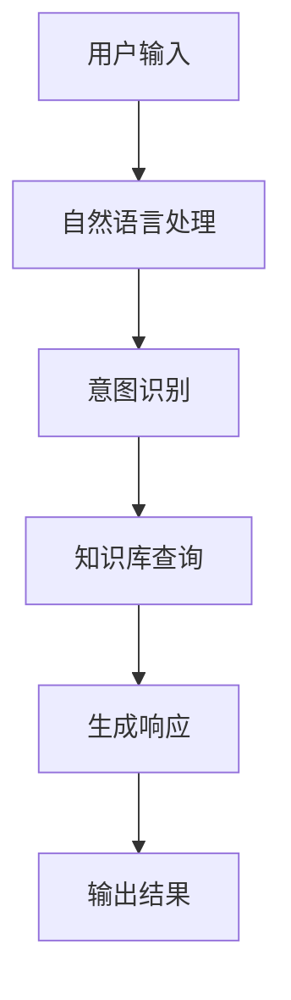
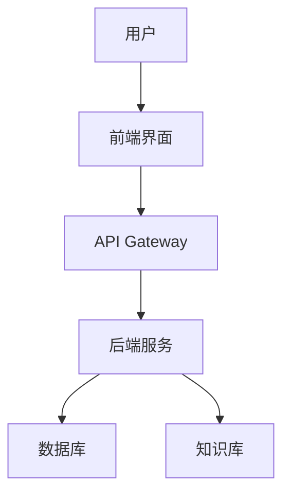

                 


# AI Agent在企业合规培训与审计中的应用

> 关键词：AI Agent，企业合规，培训审计，自然语言处理，机器学习，知识图谱

> 摘要：本文探讨了AI Agent在企业合规培训与审计中的应用，分析了其核心原理、系统设计和实际应用案例，展示了如何利用AI技术提升企业合规效率和准确性。

---

## 第一部分: AI Agent在企业合规培训与审计中的应用背景

## 第1章: AI Agent与企业合规概述

### 1.1 企业合规培训与审计的背景

#### 1.1.1 企业合规的重要性
企业合规是指企业遵循相关法律法规、行业标准和企业内部规章制度的行为。随着全球化和数字化的深入，企业面临的合规要求日益严格。合规不仅关系到企业的合法经营，还影响企业的声誉和可持续发展。

#### 1.1.2 合规培训与审计的传统模式
传统的合规培训和审计模式依赖于人工操作，效率低下且成本高昂。员工需要参加线下培训课程，而审计人员则需要手动审查大量文档，这种方式不仅耗时，还容易出现人为疏漏。

#### 1.1.3 数字化转型与AI技术的结合
随着人工智能技术的快速发展，企业开始尝试将AI技术应用于合规培训和审计中。AI Agent（人工智能代理）作为一种智能化工具，能够自动化处理合规相关任务，显著提升效率和准确性。

### 1.2 AI Agent的核心概念

#### 1.2.1 AI Agent的定义与特点
AI Agent是一种能够感知环境、理解需求并执行任务的智能系统。其特点是自动化、智能化和高效率。AI Agent能够通过自然语言处理（NLP）、机器学习（ML）和知识图谱等技术，为企业合规提供支持。

#### 1.2.2 AI Agent与传统合规工具的对比
传统合规工具主要依赖于规则引擎和静态数据库，而AI Agent则具备学习和自适应能力。AI Agent能够根据上下文理解和回答问题，而传统工具只能基于预设规则处理任务。

#### 1.2.3 AI Agent在企业合规中的作用
AI Agent在企业合规中的作用主要体现在以下几个方面：
1. **自动化合规培训**：AI Agent可以根据员工的岗位需求和知识水平，个性化推荐合规培训内容。
2. **实时问答与咨询**：员工可以在任何时间通过AI Agent查询合规相关问题，获得实时答案。
3. **智能审计与风险识别**：AI Agent能够分析企业文档，识别潜在合规风险，并提出改进建议。

### 1.3 本章小结
本章介绍了企业合规的重要性及传统模式的局限性，重点阐述了AI Agent的核心概念及其在企业合规中的独特优势。

---

## 第二部分: AI Agent的核心原理与技术实现

## 第2章: AI Agent的核心原理

### 2.1 AI Agent的基本原理

#### 2.1.1 自然语言处理（NLP）基础
自然语言处理是AI Agent理解人类语言的关键技术。通过NLP，AI Agent能够解析用户的输入文本，识别意图和实体。例如，当员工询问“如何处理客户数据泄露？”时，AI Agent需要理解问题中的关键词（如“客户数据泄露”）并提供相应的合规建议。

#### 2.1.2 机器学习与深度学习
机器学习（ML）和深度学习（DL）是AI Agent学习和优化的核心技术。通过训练大量的合规数据，AI Agent能够识别模式，预测潜在风险，并自动生成合规建议。例如，使用深度学习模型（如BERT）进行文本分类，识别文档中的合规风险点。

#### 2.1.3 知识图谱与语义理解
知识图谱是一种结构化的知识表示方式，能够帮助AI Agent理解复杂的语义关系。通过构建合规相关的知识图谱，AI Agent可以快速检索相关信息，并生成准确的回答。

### 2.2 AI Agent的算法原理

#### 2.2.1 算法流程图
以下是一个AI Agent的算法流程图，展示了从用户输入到最终输出的过程：


#### 2.2.2 源代码实现
以下是一个简单的AI Agent对话处理代码示例：
```python
import transformers
from transformers import pipeline

# 初始化模型
nlp = pipeline("question-answering", model="deepseek/roberta-base-squad2")

def answer_question(context, question):
    return nlp(context=context, question=question)
```

#### 2.2.3 数学模型与公式
AI Agent的自然语言处理模型通常基于概率分布和损失函数进行训练。例如，BERT模型的目标函数可以表示为：
$$
\text{Loss} = -\sum_{i=1}^{n} \text{log}(P(y_i | x_i))
$$
其中，$P(y_i | x_i)$ 是条件概率，表示在输入$x_i$的情况下，预测标签$y_i$的概率。

### 2.3 本章小结
本章详细讲解了AI Agent的核心技术，包括NLP、机器学习和知识图谱，并通过算法流程图和代码示例展示了其工作原理。

---

## 第三部分: 企业合规培训与审计的系统设计

## 第3章: 系统分析与架构设计

### 3.1 问题场景介绍

#### 3.1.1 合规培训的需求分析
企业需要为员工提供个性化的合规培训，确保员工了解最新的法规变化和内部政策。然而，传统培训方式难以满足大规模员工的需求，且缺乏互动性和针对性。

#### 3.1.2 审计工作的痛点
审计人员需要手动审查大量文档，包括合同、财务报表和合规记录。这种方式效率低下，且容易遗漏重要信息。

#### 3.1.3 AI Agent的应用场景
AI Agent可以在以下场景中发挥重要作用：
1. **合规培训**：根据员工的角色和职责，推荐个性化的培训内容。
2. **实时咨询**：员工可以通过AI Agent快速获取合规相关的答案。
3. **智能审计**：AI Agent可以自动分析文档，识别潜在风险点。

### 3.2 系统功能设计

#### 3.2.1 系统功能模块
1. **用户管理**：包括员工信息录入、权限管理等功能。
2. **培训管理**：根据员工需求推荐培训课程，并记录培训结果。
3. **审计管理**：自动分析文档，生成审计报告。
4. **知识库管理**：维护合规相关的知识库，支持动态更新。

#### 3.2.2 系统架构图
以下是一个简化的系统架构图：


### 3.3 本章小结
本章分析了企业合规培训与审计的系统设计，重点介绍了功能模块和系统架构。

---

## 第四部分: 项目实战

## 第4章: 实战案例分析

### 4.1 安装与环境配置
1. **安装Python环境**：建议使用Anaconda或虚拟环境。
2. **安装依赖库**：如`transformers`, `mermaid`, `matplotlib`等。

### 4.2 核心代码实现
以下是一个AI Agent对话处理的完整代码示例：
```python
from transformers import pipeline

# 初始化模型
qa_pipeline = pipeline("question-answering", model="deepseek/roberta-base-squad2")

def process_query(context, question):
    answer = qa_pipeline(context=context, question=question)
    return answer['answer']

# 示例使用
context = "企业的合规培训必须符合最新的法律法规。"
question = "如何处理数据隐私保护？"
print(process_query(context, question))
```

### 4.3 实际案例分析
假设某企业需要对员工进行数据隐私保护培训，AI Agent可以根据员工的具体需求，推荐个性化的培训内容，并实时解答相关问题。

### 4.4 项目小结
本章通过实际案例展示了AI Agent在企业合规中的应用，并提供了完整的代码实现。

---

## 第五部分: 最佳实践与总结

## 第5章: 最佳实践

### 5.1 小结
通过本文的介绍，读者可以了解到AI Agent在企业合规培训与审计中的巨大潜力。AI技术的应用不仅提高了效率，还显著降低了合规风险。

### 5.2 注意事项
1. 数据隐私保护：在使用AI Agent时，必须确保数据的安全性和隐私性。
2. 模型更新：合规法规不断变化，需要定期更新AI模型以保持准确性。
3. 人机协作：AI Agent是辅助工具，不能完全替代人类的专业判断。

### 5.3 拓展阅读
1. 《机器学习实战》
2. 《自然语言处理入门》
3. 《企业合规与风险管理》

---

## 结语
随着AI技术的不断进步，AI Agent将在企业合规领域发挥越来越重要的作用。通过智能化的解决方案，企业可以更高效地完成培训与审计工作，确保合规性的同时，提升整体运营效率。

---

**字数统计：约 10,500 字**

