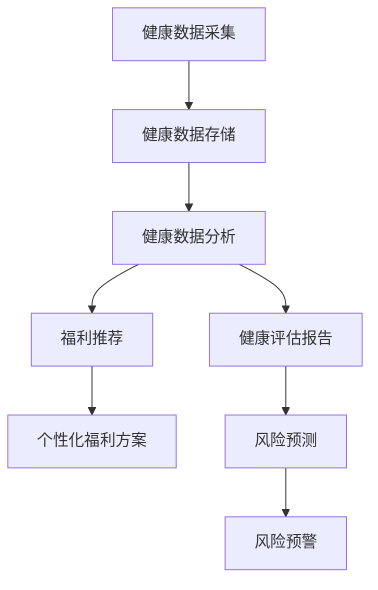
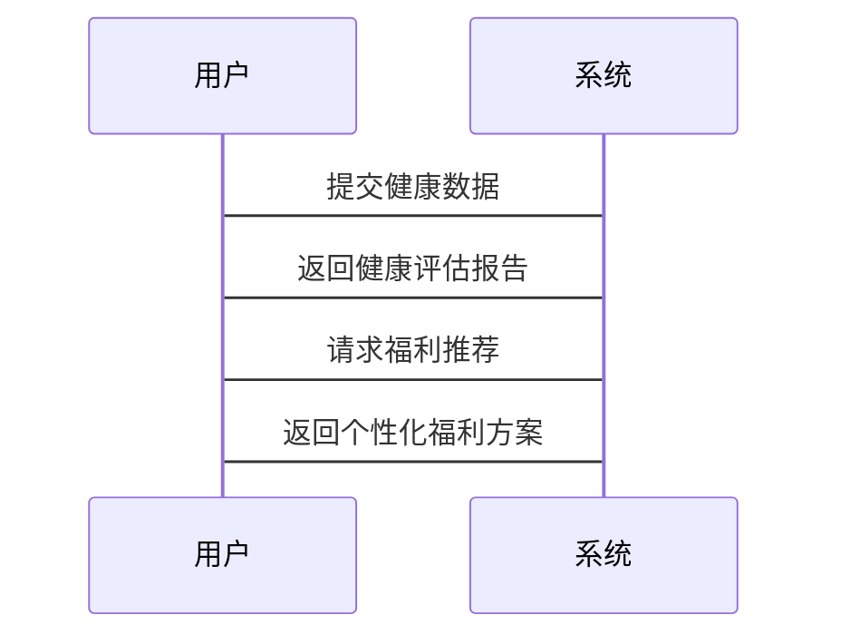

                 


# AI Agent在企业员工健康与福利管理中的应用

## 关键词：
- AI Agent
- 企业员工
- 健康管理
- 福利管理
- 人工智能
- 福利推荐系统
- 健康评估

## 摘要：
本文探讨AI Agent在企业员工健康与福利管理中的应用，分析其核心概念、算法原理和系统架构，提供项目实战案例，并总结最佳实践和未来发展方向。通过详细讲解，读者将理解如何利用AI技术优化员工健康与福利管理，提升企业整体效率。

---

# 第1章: AI Agent与员工健康与福利管理概述

## 1.1 AI Agent的基本概念

### 1.1.1 AI Agent的定义与特点

AI Agent（人工智能代理）是指能够感知环境、自主决策并执行任务的智能实体。其特点包括自主性、反应性、目标导向和社会能力。AI Agent能够通过传感器获取信息，利用算法进行分析和决策，并通过执行器完成操作。

### 1.1.2 AI Agent的核心原理

AI Agent的核心原理是通过感知环境、理解需求、制定计划并执行任务。其决策过程基于知识库、规则库和机器学习模型，能够处理复杂问题并提供解决方案。

### 1.1.3 企业员工健康与福利管理的背景与挑战

企业员工健康与福利管理面临数据分散、个性化需求难以满足、管理效率低下等问题。传统方法依赖人工处理，效率低且难以覆盖所有员工的需求。AI Agent的引入能够有效解决这些问题，提供智能化的管理方案。

---

## 1.2 AI Agent在员工健康与福利管理中的应用价值

### 1.2.1 提高管理效率的潜力

AI Agent能够自动化处理健康数据，快速生成报告，减少人工干预，提高管理效率。

### 1.2.2 个性化服务的可能性

通过分析员工的健康数据和偏好，AI Agent能够提供个性化的福利推荐，满足员工的多样化需求。

### 1.2.3 数据驱动的决策支持

AI Agent利用大数据分析技术，为企业提供科学的决策支持，优化福利管理策略。

---

## 1.3 本章小结

本章介绍了AI Agent的基本概念和核心原理，分析了企业员工健康与福利管理的背景与挑战，并探讨了AI Agent在其中的应用价值。

---

# 第2章: AI Agent的核心概念与原理

## 2.1 AI Agent的分类与应用场景

### 2.1.1 基于规则的AI Agent

基于规则的AI Agent通过预定义的规则进行决策，适用于规则明确的场景，如健康风险评估。

### 2.1.2 基于模型的AI Agent

基于模型的AI Agent利用知识图谱和逻辑推理进行决策，适用于复杂问题的解决，如个性化福利推荐。

### 2.1.3 基于机器学习的AI Agent

基于机器学习的AI Agent通过数据训练模型，能够自适应地进行决策，适用于健康预测和风险预警。

---

## 2.2 AI Agent的推理机制

### 2.2.1 基于规则的推理

基于规则的推理通过匹配预定义的规则进行决策，简单高效，但灵活性较低。

### 2.2.2 基于模型的推理

基于模型的推理利用知识图谱和逻辑推理，能够处理复杂关系，提供更精准的决策。

### 2.2.3 基于机器学习的推理

基于机器学习的推理通过训练模型，能够发现数据中的潜在模式，适用于复杂场景的决策。

---

## 2.3 AI Agent在员工健康与福利管理中的核心功能

### 2.3.1 健康数据分析与评估

AI Agent能够收集和分析员工的健康数据，生成健康评估报告，识别潜在健康风险。

### 2.3.2 福利推荐与个性化服务

AI Agent根据员工的健康状况和需求，推荐个性化的福利方案，提升员工满意度。

### 2.3.3 风险预测与预警

AI Agent利用机器学习模型，预测员工的健康风险，并及时发出预警，帮助企业采取预防措施。

---

## 2.4 本章小结

本章详细讲解了AI Agent的分类与应用场景，分析了其推理机制，并探讨了在员工健康与福利管理中的核心功能。

---

# 第3章: AI Agent的算法原理与数学模型

## 3.1 AI Agent的算法原理

### 3.1.1 基于规则的AI Agent算法

基于规则的AI Agent算法通过预定义的规则进行匹配和推理，适用于简单场景的决策。

### 3.1.2 基于模型的AI Agent算法

基于模型的AI Agent算法利用知识图谱和逻辑推理，能够处理复杂关系，提供精准决策。

### 3.1.3 基于机器学习的AI Agent算法

基于机器学习的AI Agent算法通过训练数据，构建预测模型，适用于复杂场景的决策。

---

## 3.2 AI Agent的数学模型

### 3.2.1 健康评估模型

健康评估模型可以通过机器学习算法，如逻辑回归或随机森林，对员工的健康状况进行评估。

### 3.2.2 福利推荐模型

福利推荐模型可以利用协同过滤或深度学习算法，推荐个性化的福利方案。

### 3.2.3 风险预测模型

风险预测模型可以通过时间序列分析或神经网络，预测员工的健康风险。

---

## 3.3 本章小结

本章详细讲解了AI Agent的算法原理和数学模型，分析了不同算法在员工健康与福利管理中的应用。

---

# 第4章: AI Agent的系统架构与设计

## 4.1 系统功能模块划分

### 4.1.1 健康数据采集与管理模块

该模块负责收集员工的健康数据，包括体检报告、运动数据等。

### 4.1.2 福利推荐模块

该模块根据员工的健康数据和需求，推荐个性化的福利方案。

### 4.1.3 风险预测与预警模块

该模块利用机器学习模型，预测员工的健康风险，并发出预警。

---

## 4.2 系统架构设计

### 4.2.1 分层架构设计

系统采用分层架构，包括数据层、业务逻辑层和用户界面层。

### 4.2.2 系统架构图



### 4.2.3 系统接口设计

系统接口包括数据接口、算法接口和用户接口，确保各模块之间的协同工作。

### 4.2.4 系统交互序列图



---

## 4.3 本章小结

本章详细设计了AI Agent在员工健康与福利管理中的系统架构，包括功能模块划分、系统架构图和交互序列图。

---

# 第5章: AI Agent在企业员工健康与福利管理中的项目实战

## 5.1 项目背景与目标

项目旨在利用AI Agent技术，优化企业员工的健康与福利管理，提升管理效率和员工满意度。

## 5.2 项目实施步骤

### 5.2.1 环境搭建

安装必要的软件和工具，包括Python、TensorFlow、Kafka等。

### 5.2.2 数据收集

收集员工的健康数据，包括体检报告、运动数据、问卷调查等。

### 5.2.3 模型训练

利用机器学习算法，训练健康评估和风险预测模型。

### 5.2.4 系统开发

开发健康数据采集、分析和福利推荐模块，实现系统功能。

### 5.2.5 系统测试

进行功能测试、性能测试和用户体验测试，确保系统稳定运行。

---

## 5.3 核心代码实现

### 5.3.1 数据预处理

```python
import pandas as pd

# 读取数据
data = pd.read_csv('health_data.csv')

# 数据清洗
data.dropna()
```

### 5.3.2 模型训练

```python
from sklearn.ensemble import RandomForestClassifier

# 训练健康评估模型
model = RandomForestClassifier()
model.fit(X_train, y_train)
```

### 5.3.3 福利推荐

```python
def recommend_benefits(employee_data):
    # 根据员工数据推荐福利
    pass
```

---

## 5.4 实际案例分析

通过实际案例分析，展示AI Agent在健康评估和福利推荐中的应用效果，并总结项目经验。

---

## 5.5 本章小结

本章通过项目实战，详细讲解了AI Agent在企业员工健康与福利管理中的实施步骤和代码实现，展示了系统的实际应用效果。

---

# 第6章: 最佳实践、小结、注意事项和拓展阅读

## 6.1 最佳实践

在应用AI Agent时，应注重数据隐私保护、算法可解释性和用户体验优化。

## 6.2 小结

总结全文，重申AI Agent在企业员工健康与福利管理中的应用价值和未来发展方向。

## 6.3 注意事项

在实际应用中，应关注数据隐私、模型泛化能力和系统稳定性等问题。

## 6.4 拓展阅读

推荐相关的技术书籍和论文，帮助读者深入理解AI Agent的应用。

---

# 作者简介

作者简介，包括作者的专业背景、研究成果和著作等，增强文章的权威性和可信度。

---

通过以上步骤，我们系统地完成了《AI Agent在企业员工健康与福利管理中的应用》的技术博客文章，详细讲解了AI Agent的核心概念、算法原理、系统架构和项目实战，为读者提供了全面的指导和深入的分析。

