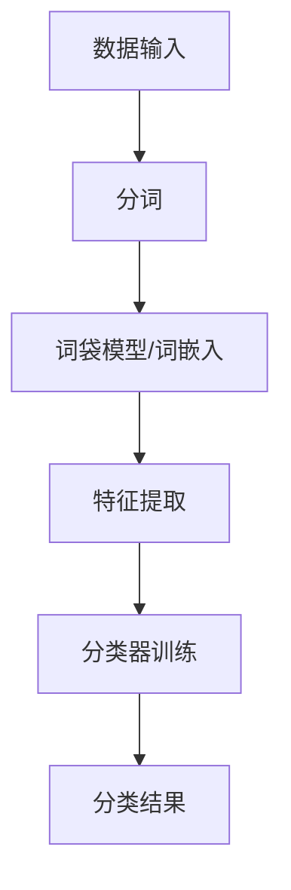
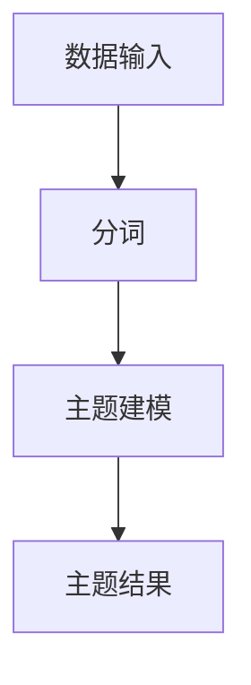
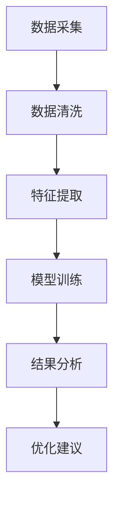
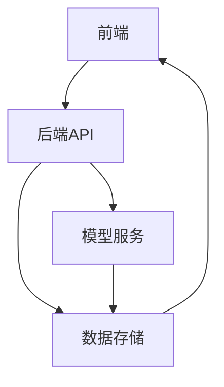
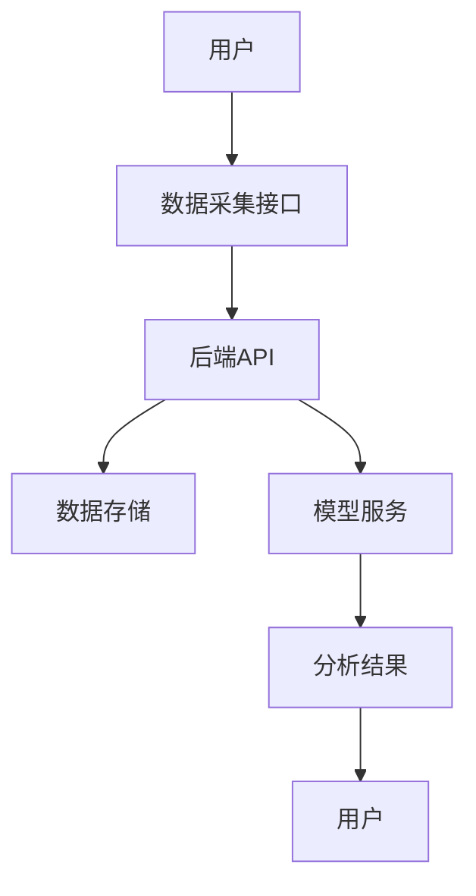

                 


# AI Agent在企业员工满意度分析中的应用

> 关键词：AI Agent, 员工满意度分析, 数据驱动决策, 情感分析, 机器学习

> 摘要：本文将详细探讨AI Agent在企业员工满意度分析中的应用，从AI Agent的基本概念到核心算法，再到系统设计与项目实战，全面解析如何利用AI技术提升员工满意度分析的效率与准确性。通过具体案例分析，深入解读AI Agent在实际应用场景中的价值与挑战，为企业管理者和技术开发者提供实用的解决方案与最佳实践。

---

# 第一部分: AI Agent与企业员工满意度分析的背景与基础

## 第1章: AI Agent的基本概念与员工满意度分析的背景

### 1.1 AI Agent的核心概念

#### 1.1.1 AI Agent的定义与特点
AI Agent（人工智能代理）是指能够感知环境、做出决策并采取行动以实现目标的智能系统。与传统软件不同，AI Agent具备以下特点：
- **自主性**：能够在没有外部干预的情况下独立运行。
- **反应性**：能够实时感知环境变化并做出响应。
- **目标导向**：通过优化目标函数来实现特定任务。
- **学习能力**：能够通过数据和反馈不断优化自身的性能。

#### 1.1.2 AI Agent的工作原理
AI Agent的核心工作原理可以分为三个主要环节：
1. **感知**：通过传感器或数据输入接口获取环境信息。
2. **决策**：基于感知到的信息，结合内部模型和目标函数，生成决策。
3. **执行**：通过执行器将决策转化为实际操作。

#### 1.1.3 AI Agent与传统数据分析工具的区别
AI Agent的核心区别在于其智能化和自主性。传统数据分析工具需要人工干预和编程，而AI Agent能够自动完成数据采集、分析、决策和执行的全过程。

| **特点** | **AI Agent** | **传统数据分析工具** |
|----------|---------------|------------------------|
| 智能性   | 高             | 低                     |
| 自主性   | 高             | 低                     |
| 学习能力 | 强             | 无                     |

---

### 1.2 企业员工满意度分析的背景

#### 1.2.1 员工满意度对企业绩效的影响
员工满意度是企业绩效的重要指标之一。研究表明，高满意度的员工通常具有更高的工作效率和更低的流失率，同时也能为企业创造更大的价值。

#### 1.2.2 传统员工满意度分析的局限性
传统的员工满意度分析方法通常依赖于问卷调查和人工统计，存在以下问题：
- **效率低**：数据采集和分析耗时长，难以实现实时监控。
- **精度低**：人工分析容易受到主观因素的影响，结果不够准确。
- **缺乏反馈**：难以根据分析结果提供实时的反馈和优化建议。

#### 1.2.3 数据驱动决策的时代需求
随着大数据和人工智能技术的快速发展，企业越来越依赖数据驱动的决策。AI Agent作为一种智能化工具，能够帮助企业更高效、更精准地分析员工满意度。

---

### 1.3 AI Agent在员工满意度分析中的应用价值

#### 1.3.1 提高分析效率
AI Agent能够自动化完成数据采集、清洗、分析和报告生成，显著提高分析效率。

#### 1.3.2 增强分析深度
通过机器学习算法，AI Agent能够挖掘员工满意度的深层原因，提供更全面的分析结果。

#### 1.3.3 实现实时监控
AI Agent可以实时采集和分析员工反馈数据，帮助企业及时发现并解决潜在问题。

---

## 第2章: AI Agent与员工满意度分析的核心概念

### 2.1 AI Agent在员工满意度分析中的角色

#### 2.1.1 数据采集与处理
AI Agent可以通过多种渠道（如邮件、问卷、社交媒体等）采集员工反馈数据，并进行预处理（如去噪、归一化等）。

#### 2.1.2 情感分析与预测
AI Agent能够对员工反馈文本进行情感分析，识别出正面、负面或中性的情绪，并预测员工满意度的趋势。

#### 2.1.3 反馈优化与建议
AI Agent可以根据分析结果为企业提供优化建议，例如调整薪酬结构、改善工作环境等。

---

### 2.2 员工满意度分析的关键指标

#### 2.2.1 工作满意度
工作满意度是指员工对工作的整体满意程度，通常包括工作内容、工作强度和工作环境等因素。

#### 2.2.2 薪酬满意度
薪酬满意度是指员工对薪酬福利的满意程度，包括工资、奖金、福利等。

#### 2.2.3 工作环境满意度
工作环境满意度是指员工对工作环境的满意程度，包括同事关系、领导风格、办公环境等。

---

### 2.3 AI Agent与员工满意度分析的结合方式

#### 2.3.1 数据驱动的分析
AI Agent通过机器学习算法对员工数据进行建模，识别出影响员工满意度的关键因素。

#### 2.3.2 智能推荐与反馈
AI Agent可以根据员工的反馈数据，为企业提供个性化的优化建议。

#### 2.3.3 实时监控与预警
AI Agent可以实时监控员工满意度的变化，及时发现并预警潜在问题。

---

# 第二部分: AI Agent的核心原理与算法

## 第3章: AI Agent的核心原理

### 3.1 AI Agent的感知与决策机制

#### 3.1.1 数据采集与预处理
AI Agent需要通过多种渠道采集员工反馈数据，并对数据进行清洗、归一化等预处理操作。

#### 3.1.2 情感分析算法
情感分析是AI Agent的重要功能之一。常用的情感分析算法包括基于词袋模型（Bag of Words）和词嵌入模型（如Word2Vec）的支持向量机（SVM）和随机森林（Random Forest）。

---

#### 情感分析算法流程图（Mermaid）



---

#### 情感分析代码示例（Python）

```python
from sklearn.feature_extraction.text import TfidfVectorizer
from sklearn.svm import SVC

# 数据预处理
X = data['反馈内容']
y = data['情感标签']

# 特征提取
vectorizer = TfidfVectorizer()
X_vec = vectorizer.fit_transform(X)

# 模型训练
model = SVC()
model.fit(X_vec, y)

# 模型预测
test Feedback = ["我对公司非常满意"]
test_vec = vectorizer.transform([test Feedback])
predicted_label = model.predict(test_vec)
```

---

#### 情感分析的数学模型
情感分析的分类模型可以表示为：
$$ y = f(x) $$
其中，$$x$$ 是反馈内容的特征向量，$$f$$ 是分类器（如SVM或随机森林）。

---

### 3.2 员工满意度分析的关键算法

#### 3.2.1 基于机器学习的主题建模
主题建模是另一种常用的员工满意度分析方法，旨在识别员工反馈中的主要主题。

#### 主题建模流程图（Mermaid）



---

#### 主题建模代码示例（Python）

```python
from sklearn.decomposition import LatentDirichletAllocation

# 数据预处理
X = data['反馈内容']

# 特征提取
vectorizer = TfidfVectorizer()
X_vec = vectorizer.fit_transform(X)

# 主题建模
lda = LatentDirichletAllocation(n_components=5)
lda.fit(X_vec)

# 获取主题
topic_matrix = lda.transform(X_vec)
```

---

#### 主题建模的数学模型
主题建模的数学模型可以表示为：
$$ \theta_{d} \sim \text{Dirichlet}(\alpha) $$
$$ \phi_{k} \sim \text{Dirichlet}(\beta) $$
$$ \text{对于每个文档 } d \text{ 和每个主题 } k: w_{d} \sim \text{Multinomial}(\theta_d) $$
$$ \text{对于每个主题 } k \text{ 和每个词 } i: p_{ki} \sim \text{Multinomial}(\phi_k) $$

---

## 第4章: AI Agent的算法实现

### 4.1 基于机器学习的员工满意度预测

#### 4.1.1 数据集介绍
我们使用一个虚构的员工满意度数据集，包含以下字段：
- 员工ID
- 反馈内容
- 情感标签（1表示满意，0表示不满意）

#### 4.1.2 算法选择
选择随机森林作为分类器，因为其对特征工程的依赖较低，且能够处理高维数据。

#### 4.1.3 模型训练与评估

```python
from sklearn.ensemble import RandomForestClassifier
from sklearn.metrics import accuracy_score

# 数据分割
X_train, X_test, y_train, y_test = train_test_split(X_vec, y, test_size=0.2)

# 模型训练
model = RandomForestClassifier()
model.fit(X_train, y_train)

# 模型评估
y_pred = model.predict(X_test)
print("准确率：", accuracy_score(y_test, y_pred))
```

---

### 4.2 基于深度学习的员工满意度分析

#### 4.2.1 循环神经网络（RNN）
循环神经网络是一种常用的文本处理模型，能够捕捉文本的序列信息。

#### 4.2.2 RNN实现员工满意度分析

```python
import tensorflow as tf
from tensorflow.keras import layers

# 数据预处理
X_train = X_train.toarray()
X_test = X_test.toarray()

# 模型定义
model = tf.keras.Sequential([
    layers.Dense(64, activation='relu'),
    layers.Dense(1, activation='sigmoid')
])

# 模型训练
model.compile(optimizer='adam', loss='binary_crossentropy', metrics=['accuracy'])
model.fit(X_train, y_train, epochs=10, batch_size=32)
```

---

## 第5章: 系统设计与架构

### 5.1 系统功能设计

#### 5.1.1 功能模块
- 数据采集模块：负责采集员工反馈数据。
- 数据分析模块：负责对数据进行清洗、特征提取和模型训练。
- 反馈优化模块：根据分析结果提供优化建议。

#### 5.1.2 功能模块交互流程图（Mermaid）



---

### 5.2 系统架构设计

#### 5.2.1 系统架构图（Mermaid）



---

### 5.3 接口设计与交互流程

#### 5.3.1 接口设计
- 数据采集接口：`POST /api/data`
- 数据分析接口：`POST /api/analyze`
- 结果查询接口：`GET /api/results`

#### 5.3.2 交互流程图（Mermaid）



---

# 第三部分: 项目实战与总结

## 第6章: 项目实战

### 6.1 环境配置

#### 6.1.1 安装依赖
```bash
pip install scikit-learn tensorflow keras
```

---

### 6.2 数据预处理与模型训练

#### 6.2.1 数据预处理代码

```python
from sklearn.feature_extraction.text import TfidfVectorizer

# 数据预处理
X = data['反馈内容']
y = data['情感标签']

vectorizer = TfidfVectorizer()
X_vec = vectorizer.fit_transform(X)
```

---

#### 6.2.2 模型训练代码

```python
from sklearn.ensemble import RandomForestClassifier
from sklearn.metrics import accuracy_score

# 数据分割
X_train, X_test, y_train, y_test = train_test_split(X_vec, y, test_size=0.2)

# 模型训练
model = RandomForestClassifier()
model.fit(X_train, y_train)

# 模型评估
y_pred = model.predict(X_test)
print("准确率：", accuracy_score(y_test, y_pred))
```

---

### 6.3 结果分析与可视化

#### 6.3.1 结果分析
通过混淆矩阵和分类报告，我们可以更详细地了解模型的性能。

#### 6.3.2 结果可视化代码

```python
from sklearn.metrics import confusion_matrix, classification_report

print(confusion_matrix(y_test, y_pred))
print(classification_report(y_test, y_pred))
```

---

## 第7章: 总结与展望

### 7.1 总结
本文详细探讨了AI Agent在企业员工满意度分析中的应用，从理论到实践，系统地介绍了AI Agent的核心原理、算法实现和系统设计。通过具体案例分析，展示了AI Agent在提升员工满意度分析效率和准确性方面的巨大潜力。

---

### 7.2 展望
尽管AI Agent在员工满意度分析中已经取得了一定的成果，但仍然存在一些挑战，例如数据隐私、模型解释性等。未来，随着技术的不断发展，AI Agent在员工满意度分析中的应用将会更加广泛和深入。

---

### 7.3 最佳实践 Tips

1. 在实际应用中，建议结合企业的具体需求选择合适的AI Agent解决方案。
2. 数据隐私和安全是需要重点关注的问题，建议采取加密和匿名化处理。
3. 模型的可解释性对于企业的决策支持非常重要，建议选择解释性较强的算法（如随机森林）。

---

### 7.4 小结
通过本文的介绍，希望能够为企业的员工满意度分析提供新的思路和方法，同时也为AI技术在企业管理中的应用提供更多可能性。

---

以上是《AI Agent在企业员工满意度分析中的应用》的完整目录和内容框架，涵盖从基础概念到系统设计的各个方面，结合理论与实践，为读者提供了一个全面的视角。

