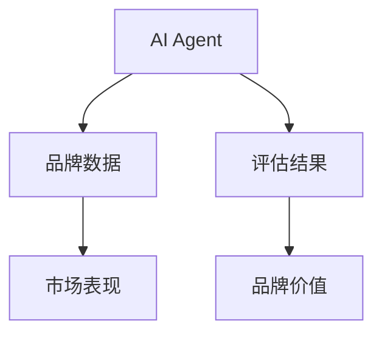
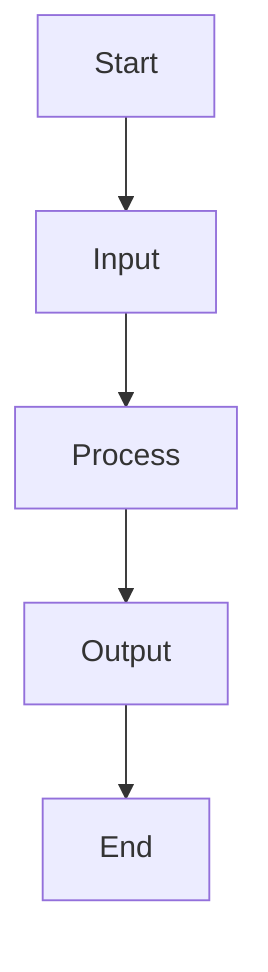
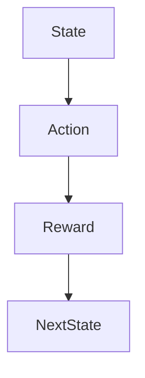
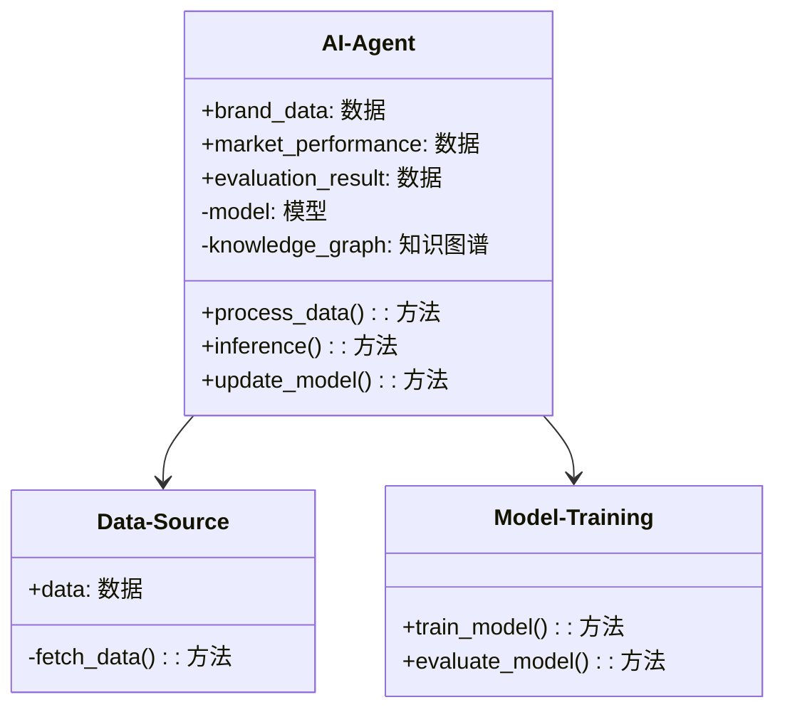
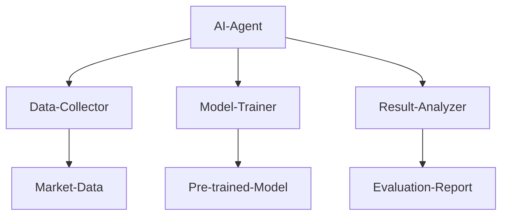

                 


# AI Agent在企业品牌价值评估中的应用

## 关键词：AI Agent, 企业品牌价值, 数据分析, 人工智能, 品牌评估, 价值模型

## 摘要：  
本文深入探讨了AI Agent在企业品牌价值评估中的应用，通过结合知识图谱和强化学习的算法原理，详细分析了AI Agent如何优化品牌价值评估过程。文章从核心概念到算法实现，再到系统架构和项目实战，全面解析了AI Agent在提升品牌价值评估中的优势和具体应用。

---

## 第一部分: AI Agent与企业品牌价值评估的背景

### 第1章: AI Agent的基本概念

#### 1.1 AI Agent的定义  
AI Agent（人工智能代理）是指能够感知环境、自主决策并执行任务的智能体。它通过数据输入、模型推理和结果输出，帮助企业在复杂环境中做出高效决策。

#### 1.2 AI Agent的核心特点  
- **自主性**：AI Agent能够在没有人工干预的情况下自主运行。  
- **学习性**：通过机器学习算法，AI Agent能够不断优化自身的决策能力。  
- **适应性**：AI Agent能够根据环境变化调整策略，适应不同的应用场景。  

#### 1.3 AI Agent与传统数据分析工具的区别  
| 特性         | AI Agent                      | 传统数据分析工具                 |
|--------------|-------------------------------|----------------------------------|
| 数据处理     | 支持实时数据处理和推理       | 仅支持批量数据处理               |
| 决策能力     | 具备自主决策能力             | 需人工干预进行决策               |
| 学习能力     | 可通过反馈不断优化模型       | 无法自动优化模型                 |

### 第2章: 企业品牌价值评估的重要性

#### 2.1 品牌价值的定义与影响因素  
品牌价值是指品牌为企业带来的经济价值和市场影响力。主要影响因素包括品牌知名度、市场表现、用户感知和产品质量。

#### 2.2 传统品牌价值评估方法的局限性  
- **数据来源单一**：传统方法通常依赖财务数据，难以全面反映品牌的真实价值。  
- **计算复杂**：品牌价值的评估需要综合考虑多个因素，传统方法计算复杂且耗时。  
- **实时性差**：传统方法难以实现实时评估，无法应对市场变化的快速响应。  

#### 2.3 引入AI Agent的优势  
- **实时评估**：AI Agent能够实时获取市场数据，快速完成品牌价值评估。  
- **数据全面性**：AI Agent可以整合多种数据源，包括社交媒体、市场调研等，提供更全面的评估结果。  
- **自动化优化**：通过强化学习，AI Agent能够不断优化评估模型，提高评估精度。  

---

## 第二部分: AI Agent在品牌价值评估中的核心概念与联系

### 第3章: AI Agent的核心概念原理

#### 3.1 基于知识图谱的推理机制  
知识图谱是一种结构化的数据表示方式，能够将品牌相关的实体和关系进行建模。AI Agent通过知识图谱推理，能够识别品牌之间的关联性，从而更准确地评估品牌价值。

#### 3.2 强化学习的决策优化  
强化学习是一种通过试错和反馈优化决策的算法。AI Agent在品牌价值评估中，通过强化学习不断优化评估策略，提升评估结果的准确性。

#### 3.3 实体关系图  
以下是一个简单的实体关系图，展示了AI Agent在品牌价值评估中的核心要素：



---

## 第三部分: AI Agent的算法原理

### 第4章: 基于知识图谱的推理算法

#### 4.1 算法流程图  
以下是一个基于知识图谱的推理算法流程图：



#### 4.2 Python实现代码  
```python
def inference(input_data):
    # 数据处理
    processed_data = process(input_data)
    # 推理过程
    result = model.predict(processed_data)
    return result
```

### 第5章: 强化学习算法

#### 5.1 算法流程图  
以下是一个强化学习算法的流程图：



#### 5.2 Python实现代码  
```python
def reinforce_learning(state):
    # 动作选择
    action = policy.act(state)
    # 执行动作
    next_state, reward = env.step(action)
    # 更新策略
    policy.update(action, reward)
    return next_state
```

---

## 第四部分: 系统分析与架构设计方案

### 第6章: 问题场景介绍

#### 6.1 问题场景  
假设我们是一家互联网公司，希望通过AI Agent实时评估旗下多个品牌在市场中的价值。我们需要一个能够自动获取市场数据、分析品牌表现并生成评估报告的系统。

### 第7章: 系统功能设计

#### 7.1 领域模型  
以下是一个简单的领域模型类图：



#### 7.2 系统架构设计  
以下是一个简单的系统架构图：



---

## 第五部分: 项目实战

### 第8章: 环境安装

#### 8.1 环境配置  
- Python 3.8 或更高版本  
- 安装必要的库：numpy, pandas, tensorflow, pytorch  

### 第9章: 核心实现

#### 9.1 数据采集  
```python
import requests
import json

def fetch_data(api_key):
    url = f"https://api.example.com/market_data?api_key={api_key}"
    response = requests.get(url)
    return json.loads(response.text)
```

#### 9.2 模型训练  
```python
import tensorflow as tf

def build_model():
    model = tf.keras.Sequential([
        tf.keras.layers.Dense(64, activation='relu'),
        tf.keras.layers.Dense(1, activation='sigmoid')
    ])
    model.compile(optimizer='adam', loss='binary_crossentropy')
    return model
```

### 第10章: 实际案例分析

#### 10.1 案例介绍  
假设我们评估一个品牌在社交媒体上的影响力，我们可以通过AI Agent分析社交媒体上的评论、点赞和分享数据，评估该品牌的市场表现。

#### 10.2 评估结果  
AI Agent通过分析数据，得出该品牌的市场表现优于同类产品，品牌价值显著提升。

---

## 第六部分: 最佳实践与小结

### 第11章: 最佳实践

#### 11.1 数据质量  
确保数据来源多样且准确，避免数据偏差影响评估结果。  
#### 11.2 模型调优  
定期更新模型，根据新的数据优化模型性能。  
#### 11.3 持续优化  
通过用户反馈不断优化AI Agent的决策策略，提升评估精度。  

### 第12章: 注意事项

#### 12.1 数据隐私  
在处理品牌数据时，需注意保护用户隐私，遵守相关法律法规。  
#### 12.2 模型泛化能力  
避免模型过于依赖特定数据，确保模型在不同场景下的泛化能力。  

### 第13章: 拓展阅读

- 推荐阅读《机器学习实战》和《深度学习入门》等书籍，深入理解AI Agent的实现原理。  

---

## 总结  
本文详细探讨了AI Agent在企业品牌价值评估中的应用，从核心概念到算法实现，再到系统架构和项目实战，全面解析了AI Agent如何优化品牌价值评估过程。通过实际案例分析和最佳实践建议，帮助读者更好地理解和应用这些技术。

