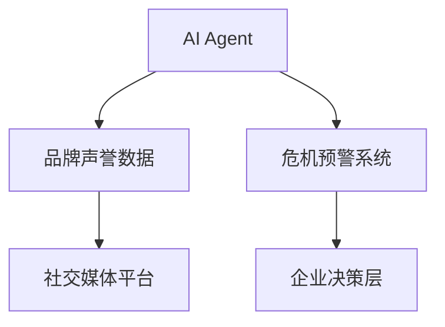
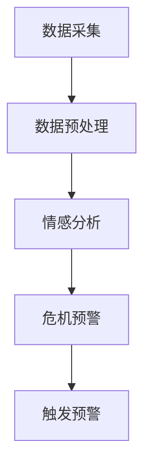
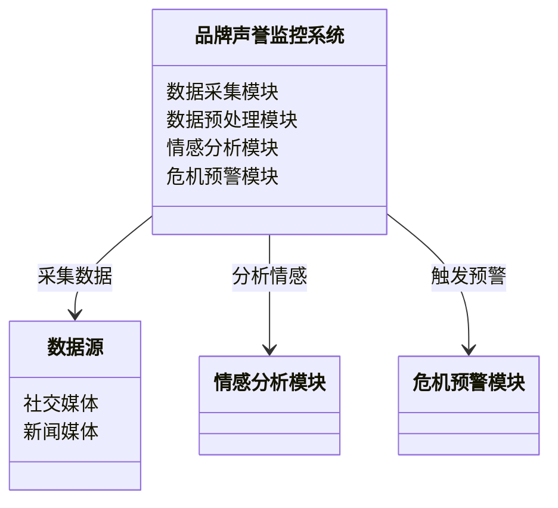
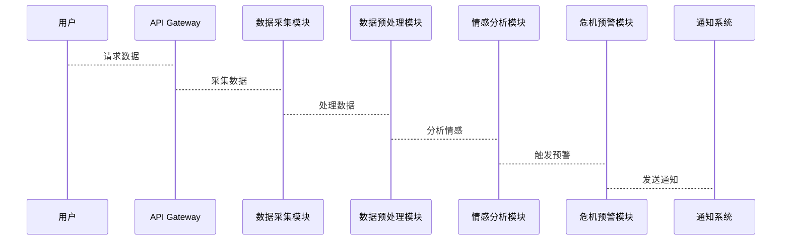

                 


# AI Agent在企业品牌声誉监控与危机预警中的应用

> 关键词：AI Agent, 企业品牌声誉, 危机预警, 自然语言处理, 情感分析, 实时监控

> 摘要：本文探讨了AI Agent在企业品牌声誉监控与危机预警中的应用，从问题背景、核心概念到算法原理、系统设计，再到项目实战和最佳实践，全面分析了如何利用AI技术提升品牌声誉管理的效率和准确性。

---

## 第一部分: 背景介绍

### 第1章: 背景介绍

#### 1.1 问题背景

##### 1.1.1 企业品牌声誉的重要性  
企业的品牌声誉是企业在市场中的核心竞争力之一。良好的声誉能够吸引客户、投资者和合作伙伴，而声誉受损则可能导致销售额下降、股价波动甚至品牌退市。在数字化时代，品牌形象的传播速度空前加快，负面信息可能在几小时内扩散至全球，这对企业的危机管理能力提出了更高的要求。

##### 1.1.2 当前品牌声誉管理的痛点  
传统的品牌声誉管理主要依赖人工监控和定期报告，这种方式存在效率低、覆盖面有限、响应不及时等问题。例如，企业难以实时捕捉社交媒体上的海量信息，也无法快速识别潜在的危机信号。此外，人工分析的主观性和情绪偏差也可能影响声誉评估的准确性。

##### 1.1.3 AI Agent的应用价值  
AI Agent（人工智能代理）能够实时监控海量数据，快速分析信息的情感倾向，并根据预设规则触发预警机制。通过自然语言处理（NLP）和机器学习技术，AI Agent可以帮助企业实现品牌声誉的自动化监控和智能化管理，显著提升危机预警的效率和准确性。

---

#### 1.2 问题描述

##### 1.2.1 品牌声誉监控的核心目标  
品牌声誉监控的核心目标是实时捕捉和分析与企业相关的所有信息，包括社交媒体、新闻媒体、用户评论等，评估这些信息的情感倾向（正面、中性、负面），并识别潜在的声誉风险。

##### 1.2.2 危机预警的紧迫性  
危机预警的紧迫性体现在对企业声誉的潜在威胁上。例如，负面评论的快速扩散可能导致品牌价值的大幅下降。因此，及时发现并应对危机是企业声誉管理的关键。

##### 1.2.3 传统方法的局限性  
传统方法依赖人工监控和定期报告，存在以下局限性：
- 数据覆盖面有限，难以捕捉所有相关信息。
- 响应速度慢，无法及时发现潜在危机。
- 分析结果依赖人工判断，存在主观性和情绪偏差。

---

#### 1.3 问题解决

##### 1.3.1 AI Agent的核心优势  
AI Agent的核心优势在于其自动化、智能化和实时性：
- **自动化**：能够不间断地监控海量数据。
- **智能化**：通过机器学习算法自动分析数据并生成预警。
- **实时性**：能够在事件发生后第一时间识别并响应。

##### 1.3.2 数据驱动的声誉管理  
通过AI Agent收集和分析数据，企业可以实现数据驱动的声誉管理。例如，利用自然语言处理技术分析用户评论的情感倾向，识别潜在的负面情绪，并根据情绪强度和传播速度评估危机的严重程度。

##### 1.3.3 实时监控与预警的实现路径  
实时监控与预警的实现路径包括：
1. 数据采集：从社交媒体、新闻媒体等渠道获取与企业相关的数据。
2. 数据预处理：清洗和标注数据，提取关键词和情感倾向。
3. 数据分析：利用机器学习算法分析数据，识别潜在危机。
4. 预警触发：根据预设规则，向企业决策层发送预警信息。

---

#### 1.4 边界与外延

##### 1.4.1 品牌声誉监控的边界  
品牌声誉监控的边界包括：
- 数据范围：仅限于与企业品牌相关的数据。
- 监控渠道：主要关注社交媒体、新闻媒体等公开渠道。
- 监控内容：仅限于文本数据，不包括图片、视频等其他形式。

##### 1.4.2 危机预警的范围  
危机预警的范围包括：
- 与企业品牌相关的负面评论。
- 可能对企业声誉造成影响的突发事件。
- 用户评论中隐含的负面情绪。

##### 1.4.3 与其他企业管理模块的关联  
品牌声誉监控与危机预警与其他企业管理模块的关联包括：
- **客户关系管理（CRM）**：通过声誉监控数据优化客户体验。
- **市场营销**：根据声誉数据调整营销策略。
- **危机管理**：根据预警信息制定应对策略。

---

#### 1.5 核心概念

##### 1.5.1 AI Agent的定义与特征  
AI Agent是一种能够执行特定任务的智能程序，具有以下特征：
- **自主性**：能够在没有人工干预的情况下执行任务。
- **反应性**：能够根据环境变化实时调整行为。
- **学习能力**：能够通过机器学习算法不断优化自身的分析能力。

##### 1.5.2 品牌声誉监控的实现要素  
品牌声誉监控的实现要素包括：
- 数据采集：从社交媒体、新闻媒体等渠道获取数据。
- 数据预处理：清洗和标注数据，提取关键词和情感倾向。
- 数据分析：利用自然语言处理技术分析数据，识别潜在危机。

##### 1.5.3 危机预警的触发机制  
危机预警的触发机制包括：
- **情绪强度**：负面评论的情感强度超过预设阈值。
- **传播速度**：负面评论在短时间内迅速扩散。
- **关键词匹配**：评论内容包含特定关键词或短语。

---

## 第二部分: 核心概念与联系

### 第2章: 核心概念与联系

#### 2.1 AI Agent的核心原理

##### 2.1.1 自然语言处理（NLP）基础  
自然语言处理（NLP）是AI Agent实现品牌声誉监控的核心技术之一。NLP技术能够理解人类语言，并对文本进行分类、情感分析等操作。

##### 2.1.2 情感分析算法  
情感分析算法用于判断文本的情感倾向。例如，可以利用词袋模型（Bag of Words）或词嵌入模型（Word Embedding）对文本进行表示，然后通过机器学习算法预测情感倾向。

##### 2.1.3 实时数据流处理  
AI Agent需要实时处理数据流，因此需要采用流处理技术（如Apache Kafka、Apache Flink）来实现实时监控和分析。

---

#### 2.2 品牌声誉监控的核心要素

##### 2.2.1 数据来源与类型  
数据来源包括社交媒体（如微博、Twitter）、新闻媒体（如新闻网站）、用户评论等。数据类型包括文本、图片、视频等。

##### 2.2.2 数据预处理方法  
数据预处理方法包括：
- **清洗**：去除噪音数据，如特殊符号、停用词等。
- **标注**：对数据进行分类，如正面、中性、负面。
- **提取**：提取关键词和情感倾向。

##### 2.2.3 监控指标体系  
监控指标体系包括：
- **情感倾向**：正面、中性、负面。
- **情绪强度**：情感倾向的强度，如非常负面、轻微负面。
- **传播速度**：信息的传播速度和范围。

---

#### 2.3 AI Agent与品牌声誉监控的实体关系

##### 2.3.1 实体关系图（Mermaid）



---

## 第三部分: 算法原理讲解

### 第3章: 算法原理讲解

#### 3.1 算法流程图（Mermaid）



#### 3.2 Python核心代码实现

```python
import nltk
from nltk.sentiment import SentimentIntensityAnalyzer

def analyze_sentiment(text):
    analyzer = SentimentIntensityAnalyzer()
    sentiment = analyzer.polarity_scores(text)
    if sentiment['compound'] > 0.5:
        return '正面'
    elif sentiment['compound'] < -0.5:
        return '负面'
    else:
        return '中性'

# 示例
text = "这家公司的产品非常差，根本不值得购买。"
print(analyze_sentiment(text))  # 输出：负面
```

#### 3.3 数学模型与公式

情感分析中常用的余弦相似度公式：

$$
\cos\theta = \frac{\sum_{i=1}^{n} w_i \cdot w'_i}{\sqrt{\sum_{i=1}^{n} w_i^2} \cdot \sqrt{\sum_{i=1}^{n} w'_i^2}}
$$

其中，$w_i$ 和 $w'_i$ 分别是两个词的词向量。

---

## 第四部分: 系统分析与架构设计

### 第4章: 系统分析与架构设计

#### 4.1 问题场景介绍

品牌声誉监控系统需要实时监控社交媒体、新闻媒体等渠道的数据，分析情感倾向，并在危机发生时触发预警。

#### 4.2 领域模型（Mermaid 类图）



#### 4.3 系统架构设计（Mermaid 架构图）

```mermaid
archi
    前端 --> API Gateway
    API Gateway --> 数据采集模块
    数据采集模块 --> 数据存储模块
    数据存储模块 --> 数据分析模块
    数据分析模块 --> 危机预警模块
    危机预警模块 --> 通知系统
```

#### 4.4 接口设计与交互流程图（Mermaid 序列图）



---

## 第五部分: 项目实战

### 第5章: 项目实战

#### 5.1 环境安装

安装Python和必要的库：
```bash
pip install nltk
pip install sentiment-analyzer
pip install kafka-python
```

#### 5.2 系统核心实现源代码

```python
import nltk
from kafka import KafkaProducer
import json

# 数据采集模块
def collect_data():
    # 示例：从社交媒体获取数据
    data = {"text": "这家公司的产品非常差，根本不值得购买。", "source": "微博"}
    producer = KafkaProducer(bootstrap_servers='localhost:9092')
    producer.send('reputation_topic', json.dumps(data))
    producer.close()

# 数据预处理模块
def preprocess_data(consumer):
    for message in consumer.messages():
        data = json.loads(message.value)
        # 提取关键词
        keywords = extract_keywords(data['text'])
        # 分类
        category = classify(data['text'])

# 情感分析模块
def analyze_sentiment(text):
    analyzer = SentimentIntensityAnalyzer()
    sentiment = analyzer.polarity_scores(text)
    return sentiment['compound']

# 危机预警模块
def trigger预警(threshold):
    if sentiment_score < threshold:
        send_notification()
```

#### 5.3 实际案例分析

假设某品牌收到大量负面评论，系统自动触发预警，并向企业决策层发送通知。

---

## 第六部分: 最佳实践

### 第6章: 最佳实践

#### 6.1 小结

通过AI Agent实现品牌声誉监控与危机预警，能够显著提升企业的声誉管理效率和准确性。然而，企业在实际应用中需要注意数据隐私、模型准确性等问题。

#### 6.2 注意事项

- 数据隐私：确保数据采集和处理符合相关法律法规。
- 模型准确性：定期更新模型，确保情感分析的准确性。
- 系统稳定性：确保系统的高可用性和数据的实时性。

#### 6.3 未来趋势

未来的趋势包括：
- 更智能化的算法：如深度学习和自监督学习。
- 更广泛的应用场景：如跨语言、跨平台的品牌声誉监控。
- 更强大的工具：如AI驱动的声誉管理平台。

#### 6.4 拓展阅读

推荐阅读以下内容：
- 自然语言处理（NLP）相关书籍。
- 机器学习与人工智能的经典论文。
- 品牌管理与危机公关的实践案例。

---

# 结语

通过本文的详细讲解，读者可以全面了解AI Agent在企业品牌声誉监控与危机预警中的应用。从算法原理到系统设计，再到项目实战，每一步都离不开AI技术的支持。希望本文能够为企业的品牌管理提供新的思路和解决方案。

--- 

**全文完**

