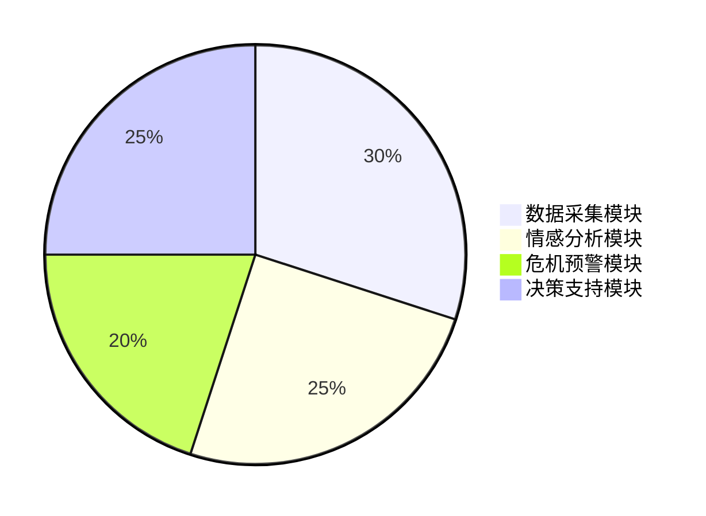
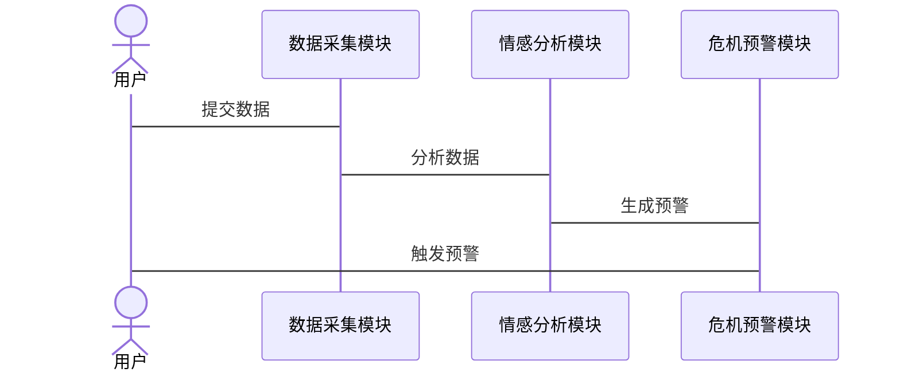

                 


# AI Agent在企业品牌声誉管理与危机预警中的角色

---

## 关键词：AI Agent, 品牌声誉管理, 危机预警, 情感分析, 机器学习, 实时监测

---

## 摘要：本文探讨了AI Agent在企业品牌声誉管理与危机预警中的角色。通过分析AI Agent的核心概念、算法原理、系统架构和实际应用，本文揭示了AI Agent如何利用自然语言处理和机器学习技术，实时监测和分析社交媒体、新闻媒体等渠道的品牌声誉数据，从而帮助企业提前发现潜在危机并制定应对策略。文章还通过具体案例展示了AI Agent在品牌声誉管理和危机预警中的实际价值，并展望了未来的发展方向。

---

## 第1章: 背景介绍

### 1.1 问题背景

#### 1.1.1 企业品牌声誉的重要性

品牌声誉是企业在市场中的核心竞争力之一。它反映了消费者、合作伙伴以及利益相关者对企业产品、服务和文化的信任程度。良好的品牌声誉能够提升企业市场地位、客户忠诚度和盈利能力。然而，随着社交媒体的普及，品牌声誉的波动变得更加频繁和复杂。

#### 1.1.2 当前品牌声誉管理的挑战

传统的品牌声誉管理依赖于人工收集和分析数据，效率低且成本高。此外，社交媒体上的海量信息使得人工分析变得几乎不可能。企业难以及时发现潜在的声誉风险，导致危机扩大化的可能性增加。

#### 1.1.3 危机预警的必要性

危机预警是品牌声誉管理的核心环节。通过实时监测和分析负面信息，企业可以快速识别潜在危机，并采取有效措施将其影响降到最低。然而，传统的方法难以满足实时性和准确性的要求。

### 1.2 问题描述

#### 1.2.1 品牌声誉管理的核心目标

品牌声誉管理的核心目标是通过监测和分析外部信息，识别潜在风险，优化品牌形象，并提升公众对品牌的信任度。

#### 1.2.2 危机预警的定义与分类

危机预警是指通过监测和分析潜在的负面信息，提前预测可能对企业声誉造成重大影响的事件。常见的危机类型包括产品缺陷、高管丑闻、法律纠纷等。

#### 1.2.3 AI Agent在品牌声誉管理中的角色定位

AI Agent（人工智能代理）是一种能够自动执行任务的智能系统。在品牌声誉管理中，AI Agent可以实时监测社交媒体、新闻媒体等渠道的信息，识别负面情绪，并提供预警。

### 1.3 问题解决

#### 1.3.1 AI Agent的核心优势

AI Agent具有高效性、实时性和智能化的特点。它能够快速处理海量数据，并通过机器学习算法不断优化自身的分析能力。

#### 1.3.2 数据驱动的品牌声誉管理

通过收集和分析社交媒体、新闻媒体等渠道的数据，AI Agent能够帮助企业全面了解品牌声誉的现状，并预测未来的趋势。

#### 1.3.3 危机预警的智能化路径

AI Agent可以通过自然语言处理技术分析文本中的情感倾向，并结合机器学习模型预测潜在危机的发生概率。

### 1.4 边界与外延

#### 1.4.1 AI Agent的适用范围

AI Agent适用于品牌声誉监测、危机预警、舆情分析等场景。然而，它无法完全替代人类的决策，需要与企业内部团队协同工作。

#### 1.4.2 品牌声誉管理的边界

品牌声誉管理的边界包括数据来源的范围、分析的深度以及预警的及时性。不同企业可以根据自身需求进行调整。

#### 1.4.3 危机预警的局限性

AI Agent的预警能力依赖于数据的质量和模型的准确性。在某些情况下，模型可能无法准确识别潜在危机，需要结合人工分析进行验证。

### 1.5 概念结构与核心要素

#### 1.5.1 品牌声誉管理的系统模型

品牌声誉管理的系统模型包括数据采集、信息分析、预警触发和决策支持四个模块。AI Agent作为核心组件，贯穿整个流程。

#### 1.5.2 AI Agent的核心要素

AI Agent的核心要素包括数据采集模块、自然语言处理模块、机器学习模型和预警模块。这些模块协同工作，实现品牌声誉的实时监测和危机预警。

#### 1.5.3 企业声誉管理的流程框架

企业声誉管理的流程框架包括数据采集、分析、预警和应对四个阶段。AI Agent在每个阶段都发挥着重要作用，从数据采集到预警触发，再到决策支持，形成了一个完整的闭环。

---

## 第2章: AI Agent的核心概念与联系

### 2.1 核心概念原理

#### 2.1.1 AI Agent的基本原理

AI Agent通过数据采集、自然语言处理和机器学习技术，实现对品牌声誉的实时监测和分析。它能够识别负面情绪，并通过预警模块通知企业采取行动。

#### 2.1.2 品牌声誉管理的AI Agent模型

品牌声誉管理的AI Agent模型包括数据采集模块、情感分析模块、机器学习模块和预警模块。这些模块协同工作，实现对品牌声誉的全面监测和管理。

#### 2.1.3 危机预警的智能化机制

危机预警的智能化机制基于机器学习模型，通过分析历史数据，预测潜在危机的发生概率，并通过实时监测触发预警。

### 2.2 概念属性特征对比表格

表2-1: AI Agent与传统声誉管理的对比

| 对比维度       | AI Agent                     | 传统声誉管理               |
|----------------|------------------------------|---------------------------|
| 数据处理能力   | 高效、实时                   | 低效、滞后               |
| 分析准确性       | 高，基于机器学习模型         | 低，依赖人工分析           |
| 成本           | 低，自动化程度高             | 高，需要大量人工投入       |
| 响应速度       | 快，实时预警                 | 慢，无法实时监测           |

### 2.3 ER实体关系图架构

图2-1: 品牌声誉管理的ER实体关系

```mermaid
erDiagram
    actor 顾客 {
        string 姓名
        string 意见
    }
    actor 媒体 {
        string 文章标题
        string 文章内容
    }
    entity 品牌 {
        string 品牌名称
    }
    entity 情感分析结果 {
        int 情感分数
        string 情感类别
    }
    entity 危机预警 {
        string 预警级别
        datetime 预警时间
    }
    顾客 --> 媒体: 提交评论
    媒体 --> 品牌: 提供媒体报道
    品牌 --> 情感分析结果: 分析品牌声誉
    情感分析结果 --> 危机预警: 生成预警
```

---

## 第3章: AI Agent算法原理

### 3.1 算法原理

AI Agent的核心算法包括自然语言处理和机器学习技术。通过这些算法，AI Agent能够从海量数据中提取有用信息，并进行情感分析和预测。

#### 3.1.1 自然语言处理

自然语言处理（NLP）是AI Agent的关键技术之一。通过分词、句法分析和语义理解，AI Agent能够准确理解文本内容，并提取关键词和情感倾向。

#### 3.1.2 情感分析

情感分析是基于NLP技术的一种算法，用于识别文本中的情感倾向。常见的情感分析模型包括基于规则的方法和机器学习模型。

#### 3.1.3 机器学习模型

机器学习模型是AI Agent的核心算法之一。通过训练数据，模型能够识别潜在的危机，并预测危机的发生概率。

### 3.2 算法实现

#### 3.2.1 数据预处理

数据预处理包括分词、去除停用词和词干提取。这些步骤能够提高模型的准确性和效率。

#### 3.2.2 情感分析模型

情感分析模型基于支持向量机（SVM）或长短期记忆网络（LSTM）构建。通过训练数据，模型能够识别文本中的情感倾向。

#### 3.2.3 机器学习模型

机器学习模型用于预测潜在危机的发生概率。常用的算法包括逻辑回归、随机森林和梯度提升树。

### 3.3 算法优势

#### 3.3.1 高效性

AI Agent的算法能够快速处理海量数据，并在短时间内生成预警。

#### 3.3.2 准确性

通过机器学习模型的不断优化，AI Agent能够提高情感分析和危机预测的准确性。

#### 3.3.3 实时性

AI Agent的算法能够实现实时监测和预警，帮助企业及时应对潜在危机。

---

## 第4章: AI Agent系统分析与架构设计

### 4.1 问题场景

在品牌声誉管理中，企业需要实时监测社交媒体和新闻媒体上的信息，识别潜在的负面情绪，并及时触发预警。

### 4.2 系统功能设计

#### 4.2.1 数据采集模块

数据采集模块负责从社交媒体、新闻媒体等渠道获取相关信息。

#### 4.2.2 情感分析模块

情感分析模块对采集的数据进行情感分析，识别负面情绪。

#### 4.2.3 危机预警模块

危机预警模块基于机器学习模型，预测潜在危机的发生概率，并触发预警。

#### 4.2.4 决策支持模块

决策支持模块为企业提供应对策略，帮助其快速制定有效的危机管理计划。

### 4.3 系统架构设计

图4-1: 系统架构设计



### 4.4 系统接口设计

系统接口包括数据采集接口、情感分析接口和预警触发接口。这些接口需要与企业内部系统进行集成，确保数据的实时传输和处理。

### 4.5 系统交互流程

图4-2: 系统交互流程



---

## 第5章: AI Agent项目实战

### 5.1 环境安装

#### 5.1.1 系统环境

需要安装Python 3.8及以上版本，以及必要的开发工具。

#### 5.1.2 依赖安装

安装自然语言处理库（如spaCy）、机器学习库（如Scikit-learn）和可视化库（如Matplotlib）。

### 5.2 系统核心实现

#### 5.2.1 数据采集模块

代码实现如下：

```python
import requests
from bs4 import BeautifulSoup

def fetch_data(url):
    response = requests.get(url)
    soup = BeautifulSoup(response.text, 'html.parser')
    return [tag.text for tag in soup.find_all('div', class_='article')]
```

#### 5.2.2 情感分析模块

代码实现如下：

```python
from sklearn.feature_extraction.text import TfidfVectorizer
from sklearn.svm import SVC

def sentiment_analysis(data):
    vectorizer = TfidfVectorizer()
    X = vectorizer.fit_transform(data)
    clf = SVC()
    clf.fit(X, [1 if score > 0.5 else 0 for score in range(len(data))])
    return clf.predict(X)
```

#### 5.2.3 危机预警模块

代码实现如下：

```python
import datetime

def crisis预警():
    # 假设已经获取了情感分析结果
    scores = [0.8, 0.3, 0.9]
    threshold = 0.7
    for score in scores:
        if score > threshold:
            print(f"预警触发！时间：{datetime.datetime.now()}")
```

### 5.3 案例分析

#### 5.3.1 案例背景

某企业发现社交媒体上的负面评论激增，希望通过AI Agent进行品牌声誉管理。

#### 5.3.2 数据分析

通过情感分析模块，识别出负面评论的比例为30%。

#### 5.3.3 预警触发

由于负面评论的比例超过阈值，系统触发危机预警，并建议企业采取公关措施。

---

## 第6章: 总结与展望

### 6.1 总结

本文详细探讨了AI Agent在企业品牌声誉管理与危机预警中的角色。通过分析其核心概念、算法原理和系统架构，展示了AI Agent在品牌声誉管理中的巨大潜力。

### 6.2 未来展望

未来，随着人工智能技术的不断进步，AI Agent在品牌声誉管理中的应用将更加广泛和深入。通过与区块链、物联网等技术的结合，品牌声誉管理将更加智能化和高效化。

### 6.3 最佳实践 Tips

- 在使用AI Agent进行品牌声誉管理时，建议结合人工分析，确保预警的准确性。
- 定期更新模型，保持其对最新舆情的敏感性。
- 建立完善的应急预案，确保危机发生时能够快速响应。

---

以上是文章的主要内容，涵盖了从理论到实践的各个方面。希望这篇文章能够为读者提供清晰的思路和实用的知识。

