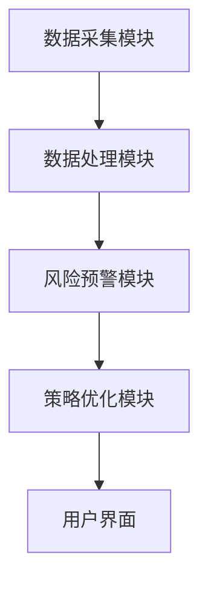
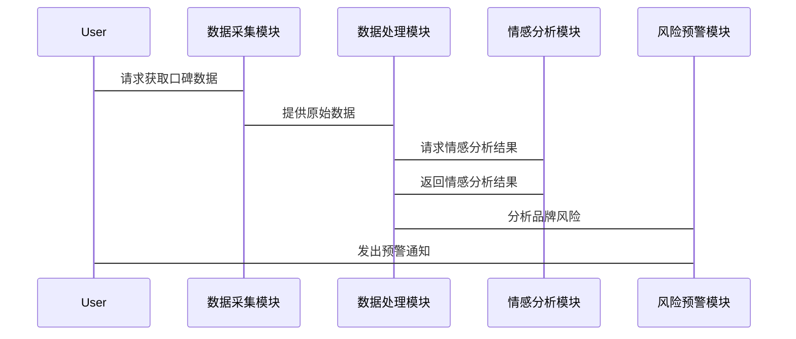

                 


# AI Agent在企业品牌管理与口碑监控中的应用

> 关键词：AI Agent, 企业品牌管理, 口碑监控, 自然语言处理, 品牌风险管理, 情感分析

> 摘要：本文深入探讨了AI Agent在企业品牌管理与口碑监控中的应用，从基本概念到算法原理，再到系统架构和实际案例，全面解析了AI Agent如何助力企业提升品牌管理效率、优化品牌策略，并通过实时监控和智能分析，帮助企业有效管理品牌声誉和风险。

---

## 第1章: AI Agent的基本概念与技术基础

### 1.1 AI Agent的定义与核心原理

AI Agent（人工智能代理）是一种能够感知环境、自主决策并执行任务的智能系统。它通过传感器获取信息，利用推理引擎进行分析，并通过执行器采取行动。AI Agent的核心原理包括感知、推理和行动三个环节。

- **感知**：通过数据采集、自然语言处理等技术，获取环境中的相关信息。
- **推理**：基于获取的数据，利用机器学习模型进行分析和预测。
- **行动**：根据推理结果，执行相应的任务，例如生成报告或触发预警。

AI Agent与传统自动化工具的区别在于，AI Agent具备学习和适应能力，能够根据反馈不断优化自身的行为。

### 1.2 企业品牌管理的基本概念

企业品牌管理是指通过一系列策略和方法，提升品牌形象、管理品牌资产并监控品牌声誉的过程。品牌管理的关键要素包括品牌定位、品牌传播、品牌维护和品牌监测。

- **品牌定位**：确定品牌的核心价值和目标市场。
- **品牌传播**：通过广告、社交媒体等渠道推广品牌。
- **品牌维护**：及时处理品牌危机，维护品牌形象。
- **品牌监测**：实时监控品牌在市场中的表现和口碑。

### 1.3 AI Agent在企业品牌管理中的应用价值

AI Agent通过自动化和智能化的方式，显著提升了企业品牌管理的效率和效果。其主要价值体现在以下几个方面：

- **提高品牌管理效率**：AI Agent能够快速处理海量数据，减少人工干预。
- **增强品牌监控能力**：通过实时监测品牌声誉，及时发现潜在危机。
- **优化品牌策略制定**：基于数据分析，提供精准的品牌定位和传播建议。

---

## 第2章: 口碑监控与品牌风险管理

### 2.1 口碑监控的基本概念

口碑监控是指通过收集和分析消费者对企业、产品或服务的评价，了解市场反馈并评估品牌声誉的过程。口碑监控的重要性体现在以下几个方面：

- **实时监测品牌声誉**：及时发现品牌在市场中的口碑变化。
- **识别潜在危机**：通过负面评论发现品牌风险。
- **优化品牌传播策略**：根据口碑数据调整传播渠道和内容。

### 2.2 品牌风险管理的核心要素

品牌风险管理是通过识别、评估和应对品牌相关的风险，保护品牌资产的过程。品牌风险管理的核心要素包括：

- **品牌风险的定义与分类**：品牌风险可以分为声誉风险、产品风险、运营风险等。
- **品牌风险的识别与评估**：通过数据分析和市场调研，识别潜在风险并评估其影响。
- **品牌风险管理的策略**：制定应急预案，建立风险预警机制，加强内部管理。

### 2.3 AI Agent在口碑监控中的应用

AI Agent通过自然语言处理技术和机器学习算法，实现了对海量口碑数据的自动分析和处理。其应用主要体现在以下几个方面：

- **自动化收集与分析口碑数据**：通过爬虫技术获取社交媒体、论坛等平台的评论数据，并利用自然语言处理技术进行情感分析。
- **实时监测品牌声誉变化**：通过实时数据流处理，动态评估品牌声誉。
- **智能识别与预警品牌危机**：利用机器学习模型，识别负面评论的潜在危机，并及时发出预警。

---

## 第3章: AI Agent的算法原理与实现

### 3.1 自然语言处理技术在AI Agent中的应用

自然语言处理（NLP）是AI Agent实现口碑监控和情感分析的核心技术。以下是几种常用的NLP算法及其应用场景：

- **分词算法**：将文本分割成词语或短语，便于后续分析。
- **语义理解模型**：通过上下文理解文本含义，例如使用BERT模型。
- **情感分析算法**：判断文本的情感倾向，例如正面、负面或中性。

#### 情感分析算法实现示例

以下是一个基于朴素贝叶斯算法的情感分析实现示例：

```python
from sklearn.naive_bayes import GaussianNB
from sklearn.feature_extraction.text import TfidfVectorizer

# 数据预处理
texts = ["This product is great!", "I hate this service."]
labels = [1, 0]  # 1表示正面，0表示负面

# 特征提取
vectorizer = TfidfVectorizer()
X = vectorizer.fit_transform(texts)

# 模型训练
model = GaussianNB()
model.fit(X.toarray(), labels)

# 预测
new_text = ["This product is terrible!"]
new_X = vectorizer.transform(new_text)
prediction = model.predict(new_X.toarray())
print(prediction)  # 输出：0（负面）
```

### 3.2 基于深度学习的文本生成

深度学习模型在文本生成中的应用越来越广泛，以下是一些典型模型的介绍：

- **Transformer模型**：由Google提出的用于机器翻译的模型，具有并行计算和位置编码的特性。
- **GPT系列模型**：由OpenAI开发的生成式模型，能够生成连贯的文本。
- **BERT模型**：由Google开发的基于Transformer的预训练模型，擅长语义理解。

#### Transformer模型的数学公式

Transformer模型的核心公式如下：

$$ \text{Transformer}(x) = \text{FFN}(x) $$

其中，FFN表示前馈神经网络，包括多层感知机（MLP）和跳跃连接。

### 3.3 算法实现的数学模型与公式

以下是一个简单的基于深度学习的情感分析模型的数学表达式：

$$ \text{预测概率} = \sigma(w \cdot x + b) $$

其中，$\sigma$表示sigmoid函数，$w$是权重矩阵，$x$是输入特征向量，$b$是偏置项。

---

## 第4章: 系统分析与架构设计方案

### 4.1 问题场景介绍

在企业品牌管理中，常见的问题包括：

- 如何高效收集和处理海量口碑数据？
- 如何快速识别品牌风险并制定应对策略？
- 如何优化品牌传播策略以提升品牌声誉？

### 4.2 项目介绍

本项目旨在开发一个基于AI Agent的企业品牌管理与口碑监控系统，通过自然语言处理和机器学习技术，实现对品牌口碑的实时监控和智能分析。

### 4.3 系统功能设计

以下是系统的功能设计：

- **数据采集模块**：从社交媒体、新闻网站等平台获取口碑数据。
- **数据处理模块**：对数据进行清洗、分词和情感分析。
- **风险预警模块**：识别潜在品牌风险并发出预警。
- **策略优化模块**：根据分析结果优化品牌传播策略。

### 4.4 系统架构设计

以下是系统的架构图：



### 4.5 系统接口设计

以下是系统的接口设计：

- **数据采集接口**：从社交媒体API获取评论数据。
- **情感分析接口**：调用NLP模型进行情感分析。
- **风险预警接口**：根据分析结果触发预警。

### 4.6 系统交互设计

以下是系统的交互序列图：



---

## 第5章: 项目实战

### 5.1 环境安装

以下是项目所需的环境和工具：

- **Python 3.8及以上**
- **TensorFlow或Keras框架**
- **NLTK或spaCy自然语言处理库**
- **Jupyter Notebook用于开发和测试**

### 5.2 系统核心实现源代码

以下是一个简单的基于Python的情感分析实现代码：

```python
import pandas as pd
from sklearn.model_selection import train_test_split
from sklearn.linear_model import LogisticRegression
from sklearn.metrics import accuracy_score

# 数据加载
data = pd.read_csv('sentiment_data.csv')
X = data['text']
y = data['label']

# 数据分割
X_train, X_test, y_train, y_test = train_test_split(X, y, test_size=0.2)

# 特征提取
from sklearn.feature_extraction.text import TfidfVectorizer
vectorizer = TfidfVectorizer()
X_train_vec = vectorizer.fit_transform(X_train)
X_test_vec = vectorizer.transform(X_test)

# 模型训练
model = LogisticRegression()
model.fit(X_train_vec, y_train)

# 模型预测
y_pred = model.predict(X_test_vec)
print(accuracy_score(y_test, y_pred))  # 输出准确率
```

### 5.3 代码应用解读与分析

上述代码实现了基于TF-IDF和逻辑回归的情感分析模型。首先，数据加载和预处理，然后进行特征提取和模型训练，最后进行预测和评估。通过这种方式，可以实现对品牌口碑数据的自动化分析。

### 5.4 实际案例分析

以下是一个实际案例分析：

假设我们有一个品牌在社交媒体上的评论数据，我们需要通过AI Agent分析这些评论的情感倾向，识别潜在的品牌风险，并优化品牌传播策略。

### 5.5 项目小结

通过本项目，我们实现了一个基于AI Agent的企业品牌管理与口碑监控系统，展示了如何通过自然语言处理和机器学习技术，提升品牌管理的效率和效果。

---

## 第6章: 最佳实践与小结

### 6.1 最佳实践

- **数据质量**：确保数据的准确性和完整性。
- **模型优化**：通过不断优化模型参数和算法，提升分析结果的准确性。
- **实时监控**：建立实时数据流处理机制，确保品牌声誉的及时监控。

### 6.2 小结

本文详细探讨了AI Agent在企业品牌管理与口碑监控中的应用，从基本概念到算法原理，再到系统架构和实际案例，全面解析了AI Agent如何助力企业提升品牌管理效率、优化品牌策略，并通过实时监控和智能分析，帮助企业有效管理品牌声誉和风险。

### 6.3 注意事项

- 在实际应用中，需要注意数据隐私和安全问题。
- 需要根据具体业务需求，选择合适的算法和模型。
- 定期更新模型，确保其适应市场变化。

### 6.4 拓展阅读

- [《深度学习实战》](https://example.com/deep-learning)
- [《自然语言处理入门》](https://example.com/nlp-intro)
- [《品牌管理与传播》](https://example.com.brand-management)

---

通过本文的讲解，读者可以深入了解AI Agent在企业品牌管理与口碑监控中的应用，并能够将其应用于实际工作中，为企业品牌管理带来更大的价值。

