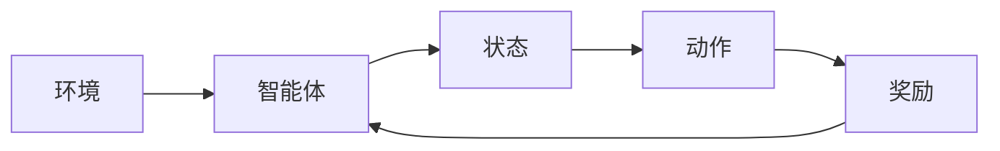
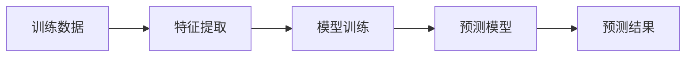
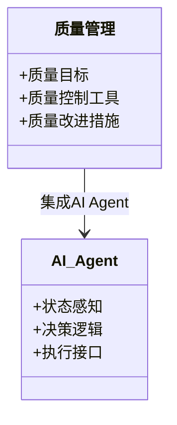
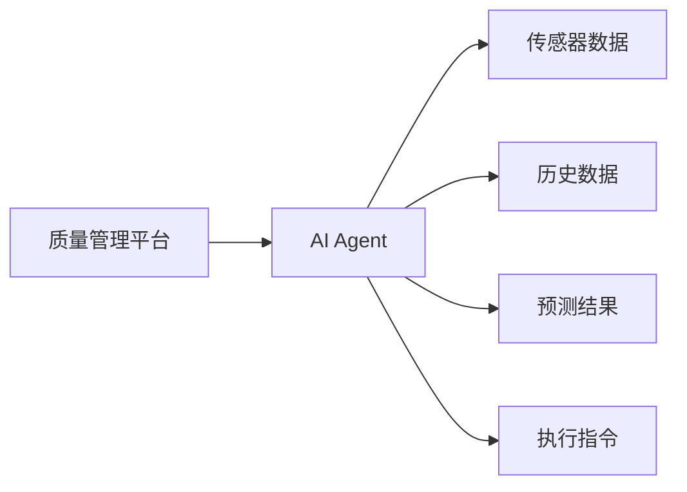
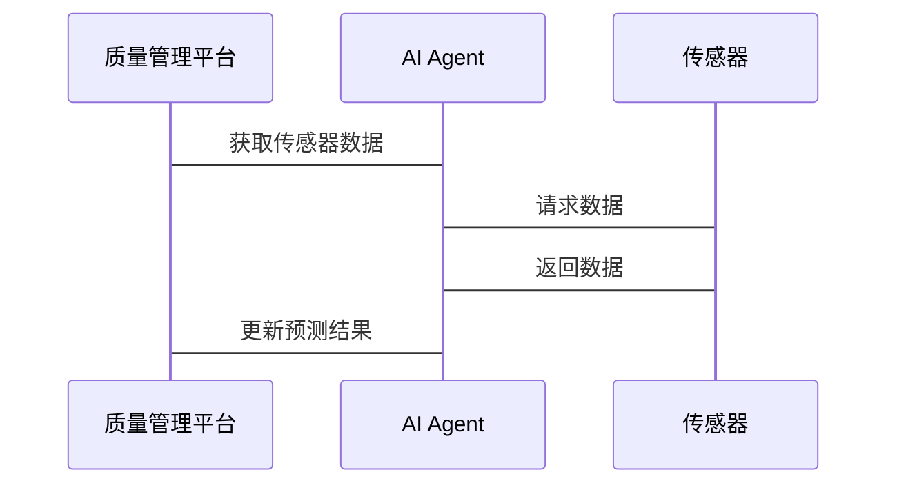

                 


# AI Agent在企业品质管理与持续改进中的应用

## 关键词：AI Agent, 企业质量管理, 持续改进, 强化学习, 监督学习, 系统架构设计

## 摘要：  
本文详细探讨了AI Agent在企业品质管理与持续改进中的应用。首先介绍了AI Agent的基本概念及其在质量管理中的潜力，接着分析了AI Agent的核心原理与企业质量管理的结合。然后通过强化学习和监督学习的算法原理、数学模型和公式，详细讲解了AI Agent在质量管理中的具体应用。最后通过系统架构设计和项目实战，展示了如何将AI Agent应用于实际的质量管理场景中，并总结了最佳实践和未来的发展方向。

---

# 第1章：AI Agent与企业质量管理概述

## 1.1 AI Agent的基本概念

### 1.1.1 AI Agent的定义与特征  
AI Agent（人工智能代理）是一种能够感知环境、自主决策并执行任务的智能体。它具备以下核心特征：  
1. **自主性**：能够独立运行，无需外部干预。  
2. **反应性**：能实时感知环境变化并做出反应。  
3. **目标导向**：具备明确的目标，以实现预定任务为驱动。  
4. **学习能力**：通过数据和经验不断优化自身的决策能力。  

### 1.1.2 AI Agent在企业中的应用场景  
AI Agent在企业中的应用广泛，包括：  
- **自动化流程管理**：优化企业内部流程，提高效率。  
- **质量监控**：实时监测生产过程中的异常情况。  
- **决策支持**：辅助管理层做出更明智的决策。  

## 1.2 企业质量管理与持续改进的背景

### 1.2.1 企业质量管理的核心概念  
企业质量管理（Quality Management）是通过系统化的管理方法，确保产品或服务符合质量标准的过程。其核心包括：  
- **质量控制**：通过检测和预防措施确保产品质量。  
- **质量保证**：通过过程管理和文档控制确保质量管理体系的有效性。  

### 1.2.2 持续改进的理论与实践  
持续改进（Continuous Improvement）是一种通过不断优化过程和方法，以提高效率和效果的管理理念。其核心工具包括：  
- **PDCA循环**：计划、执行、检查、处理。  
- **六西格玛（Six Sigma）**：通过消除缺陷提高产品质量。  

## 1.3 AI Agent在质量管理中的应用前景

### 1.3.1 质量管理中的问题与挑战  
传统质量管理方法面临以下问题：  
- **效率低下**：人工检查耗时且易出错。  
- **数据孤岛**：各部门间数据难以有效整合。  
- **缺乏预测性**：难以提前预测和预防质量问题。  

### 1.3.2 AI Agent如何解决这些问题  
AI Agent通过以下方式解决上述问题：  
- **实时监控**：利用传感器和物联网技术实时监测生产过程。  
- **数据分析**：通过机器学习算法分析海量数据，预测潜在质量问题。  
- **自动化处理**：自动触发纠正措施，减少人为干预。  

---

# 第2章：AI Agent的核心原理与企业质量管理的结合

## 2.1 AI Agent的核心原理

### 2.1.1 AI Agent的决策机制  
AI Agent的决策机制基于以下步骤：  
1. **感知环境**：通过传感器或数据库获取环境信息。  
2. **分析数据**：利用机器学习模型处理数据，识别模式。  
3. **制定决策**：根据分析结果选择最优行动方案。  
4. **执行行动**：通过执行机构或系统接口实现决策。  

### 2.1.2 AI Agent的学习与自适应能力  
AI Agent通过以下方式实现学习与自适应：  
- **监督学习**：通过标记数据进行训练，优化分类模型。  
- **强化学习**：通过试错机制，在奖励驱动下优化决策策略。  

## 2.2 企业质量管理中的关键概念

### 2.2.1 质量管理体系框架  
质量管理体系框架包括：  
- **质量管理计划**：明确质量管理目标和方法。  
- **质量控制工具**：如检查表、因果图等。  
- **质量改进措施**：如六西格玛、PDCA循环。  

### 2.2.2 持续改进的理论与实践  
持续改进的核心是通过不断优化过程来提高质量。其实现路径包括：  
1. **问题识别**：通过数据分析发现质量问题。  
2. **原因分析**：使用鱼骨图等工具分析问题根源。  
3. **制定改进计划**：设计改进方案并实施。  
4. **效果验证**：通过实验验证改进措施的有效性。  

## 2.3 AI Agent与质量管理的结合

### 2.3.1 AI Agent如何辅助质量监控  
AI Agent可以通过以下方式辅助质量监控：  
- **实时数据采集**：通过传感器实时采集生产数据。  
- **异常检测**：利用机器学习算法识别数据中的异常模式。  
- **预测性维护**：预测设备故障，提前安排维护。  

### 2.3.2 AI Agent在持续改进中的作用  
AI Agent在持续改进中的作用包括：  
- **数据驱动的决策支持**：通过分析历史数据，识别改进机会。  
- **自动化改进措施**：根据分析结果自动触发改进计划。  
- **效果评估**：通过数据对比验证改进措施的有效性。  

---

# 第3章：AI Agent算法原理

## 3.1 强化学习算法

### 3.1.1 强化学习的基本概念  
强化学习是一种通过试错机制，学习最优策略的算法。其核心要素包括：  
- **状态（State）**：环境的当前情况。  
- **动作（Action）**：智能体的决策行为。  
- **奖励（Reward）**：对决策行为的反馈。  
- **策略（Policy）**：决策规则的集合。  

### 3.1.2 强化学习算法流程图  



## 3.2 监督学习算法

### 3.2.1 监督学习的应用场景  
监督学习适用于以下场景：  
- **分类问题**：将数据分为不同的类别。  
- **回归问题**：预测连续型变量的值。  

### 3.2.2 监督学习算法流程图  



## 3.3 Python代码实现

### 3.3.1 强化学习代码示例  

```python
import numpy as np

class AI_Agent:
    def __init__(self, state_space, action_space):
        self.state_space = state_space
        self.action_space = action_space
        self.q_table = np.zeros((state_space, action_space))

    def take_action(self, state):
        # 随机选择一个动作
        action = np.random.randint(self.action_space)
        return action

    def update_q_table(self, state, action, reward):
        # 更新Q表
        self.q_table[state, action] += reward

# 初始化环境
state_space = 5
action_space = 3
agent = AI_Agent(state_space, action_space)

# 与环境交互
state = 2
action = agent.take_action(state)
reward = 1 if action == 1 else 0
agent.update_q_table(state, action, reward)
```

### 3.3.2 监督学习代码示例  

```python
from sklearn import tree

# 数据集
data = [[2, 0], [3, 1], [4, 1], [5, 1]]
target = [0, 0, 1, 1]

# 创建决策树模型
model = tree.DecisionTreeClassifier()
model.fit(data, target)

# 预测新数据
new_data = [[3, 0]]
print(model.predict(new_data))  # 输出：[0]
```

## 3.4 数学模型与公式

### 3.4.1 强化学习的数学模型  
强化学习的目标是通过最大化累积奖励来学习最优策略。其数学公式为：  
$$ Q(s, a) = Q(s, a) + \alpha (r + \gamma Q(s', a') - Q(s, a)) $$  
其中：  
- \( Q(s, a) \) 表示状态 \( s \) 下动作 \( a \) 的价值。  
- \( \alpha \) 是学习率。  
- \( r \) 是奖励。  
- \( \gamma \) 是折扣因子。  
- \( Q(s', a') \) 是下一个状态下的最优动作价值。  

### 3.4.2 监督学习的数学模型  
监督学习的损失函数通常使用均方误差：  
$$ \text{Loss} = \frac{1}{N} \sum_{i=1}^{N} (y_i - \hat{y}_i)^2 $$  
其中：  
- \( y_i \) 是真实标签。  
- \( \hat{y}_i \) 是模型预测值。  
- \( N \) 是样本数量。  

---

# 第4章：系统分析与架构设计

## 4.1 问题场景介绍  
假设我们正在优化一个汽车制造企业的质量管理系统，目标是通过AI Agent实时监控生产线，预测和预防质量问题。

## 4.2 系统功能设计

### 4.2.1 领域模型  



## 4.3 系统架构设计

### 4.3.1 系统架构  



## 4.4 接口设计

### 4.4.1 系统接口  

| 接口名称 | 输入 | 输出 |
|----------|------|------|
| getData  | 状态ID | 数据流 |
| sendAction | 动作ID | 执行结果 |

## 4.5 交互序列图



---

# 第5章：项目实战

## 5.1 环境安装

### 5.1.1 安装Python和必要的库  
安装Python 3.8及以上版本，并通过以下命令安装必要的库：  
```bash
pip install numpy scikit-learn matplotlib
```

## 5.2 核心实现

### 5.2.1 AI Agent核心代码  

```python
class AI_Quality_Management:
    def __init__(self, sensors):
        self.sensors = sensors
        self.q_table = {}  # 存储状态-动作价值

    def perceive(self):
        # 获取传感器数据
        data = [s感知() for s in self.sensors]
        return data

    def decide(self, state):
        # 根据状态选择动作
        if state not in self.q_table:
            self.q_table[state] = 0
        # 返回动作
        return 0  # 简单示例，实际应根据Q表选择最优动作

    def learn(self, state, action, reward):
        # 更新Q表
        if state not in self.q_table:
            self.q_table[state] = 0
        self.q_table[state] += reward
```

### 5.2.2 质量管理平台代码  

```python
class Quality_Management_Platform:
    def __init__(self, agent):
        self.agent = agent
        self.sensors = [Sensor(), Sensor(), Sensor()]

    def run(self):
        while True:
            state = self.agent.perceive()
            action = self.agent.decide(state)
            reward = self.evaluate_action(state, action)
            self.agent.learn(state, action, reward)

    def evaluate_action(self, state, action):
        # 根据实际效果返回奖励
        if action == 0:
            return 1  # 假设动作正确
        else:
            return 0  # 假设动作错误
```

## 5.3 案例分析

### 5.3.1 实际案例  
假设我们正在监控一条生产线上的温度传感器数据，目标是保持温度在20-25℃之间。AI Agent通过实时数据检测异常，并自动调整加热或冷却装置。通过算法优化，AI Agent能够提前预测温度异常，并采取纠正措施，减少废品率。

### 5.3.2 代码应用解读  
在上述代码中，AI Agent通过感知温度数据，决定是否调整设备。通过不断学习，AI Agent能够更准确地预测和纠正温度偏差，从而提高产品质量。

## 5.4 项目总结  
通过本项目，我们展示了AI Agent在质量管理中的实际应用，证明了其在提高效率和减少缺陷方面的能力。同时，也验证了强化学习和监督学习算法在实际场景中的有效性。

---

# 第6章：总结与展望

## 6.1 总结  
本文详细探讨了AI Agent在企业品质管理与持续改进中的应用。通过结合强化学习和监督学习算法，AI Agent能够实时监控生产过程，预测和预防质量问题，显著提高质量管理效率。

## 6.2 最佳实践Tips  
- 在实施AI Agent前，确保数据质量。  
- 定期更新模型，以适应变化的生产环境。  
- 结合人工审核，确保AI决策的准确性。  

## 6.3 未来展望  
随着AI技术的不断进步，AI Agent在质量管理中的应用将更加广泛。未来的挑战包括如何处理更复杂的数据和优化多智能体协作。同时，边缘计算和物联网技术的进步将为AI Agent的应用提供更强大的支持。

---

通过以上内容，我们系统地探讨了AI Agent在企业质量管理中的应用，从理论到实践，为读者提供了全面的指导。希望本文能为企业的质量管理创新提供新的思路和方向。

