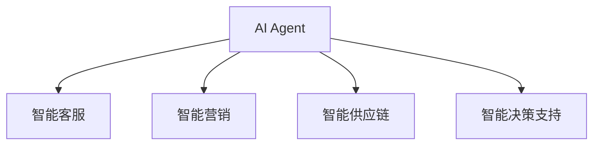
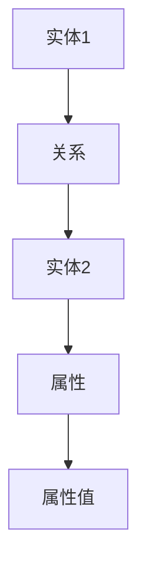
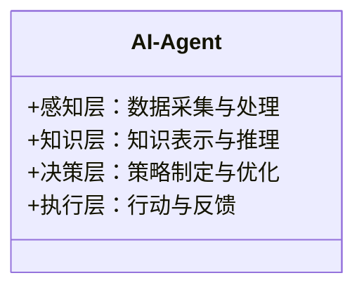
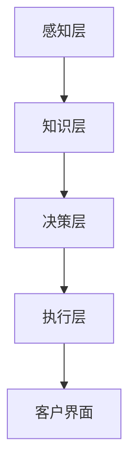

                 


# AI Agent在企业商业模式创新中的应用

> 关键词：AI Agent，企业商业模式，创新，人工智能，算法原理，系统架构

> 摘要：AI Agent作为一种新兴的人工智能技术，正在改变企业传统的商业模式。本文将从AI Agent的核心概念、技术原理、系统架构以及实际应用等多个方面，详细探讨AI Agent如何推动企业商业模式的创新与优化。通过分析具体案例和提供实战指导，本文为读者提供了一种全新的视角，帮助企业理解和应用AI Agent技术，从而在市场竞争中占据优势。

---

## 第一部分：AI Agent 的基本概念与企业商业模式创新背景

### 第1章：AI Agent 的基本概念与核心原理

#### 1.1 AI Agent 的定义与核心要素

##### 1.1.1 AI Agent 的定义
AI Agent（人工智能代理）是指能够感知环境、自主决策并执行任务的智能实体。它通过数据输入、知识推理和目标驱动的方式，为企业提供自动化、智能化的服务。

##### 1.1.2 AI Agent 的核心要素与属性
AI Agent的核心要素包括：
- **感知能力**：通过传感器、API等方式获取外部数据。
- **知识库**：存储结构化的知识和经验。
- **推理引擎**：基于知识库进行逻辑推理和决策。
- **执行能力**：通过API或自动化工具执行具体操作。
- **自适应能力**：根据反馈不断优化行为策略。

| 属性 | 描述 |
|------|------|
| 感知能力 | 数据采集与处理能力 |
| 知识库 | 结构化知识存储与管理 |
| 推理引擎 | 基于逻辑推理的决策能力 |
| 执行能力 | 自动化任务执行能力 |
| 自适应能力 | 根据反馈优化行为 |

##### 1.1.3 AI Agent 的分类与应用场景

AI Agent可以根据功能和应用场景分为以下几类：
- **智能客服**：用于在线客服、客户咨询等场景。
- **智能营销**：用于精准营销、客户推荐等场景。
- **智能供应链**：用于库存管理、物流优化等场景。
- **智能决策支持**：用于数据分析、决策优化等场景。

**示意图：AI Agent 的分类与应用场景**



---

#### 1.2 企业商业模式创新的背景与挑战

##### 1.2.1 传统企业商业模式的局限性
传统商业模式往往依赖于人工操作，效率低、成本高且难以快速响应市场变化。例如：
- 客户需求多样化，难以实现精准匹配。
- 供应链管理复杂，容易出现库存积压或缺货。
- 营销策略单一，难以适应市场竞争。

##### 1.2.2 数字化转型对企业商业模式的影响
随着数字化转型的推进，企业需要更加灵活和高效。AI Agent作为一种智能化工具，可以帮助企业实现以下转变：
- 从“人工驱动”转向“数据驱动”。
- 从“经验决策”转向“智能决策”。
- 从“被动响应”转向“主动服务”。

##### 1.2.3 AI Agent 在企业创新中的潜力与价值
AI Agent可以通过以下方式推动企业商业模式的创新：
- 提高客户体验：通过智能客服和个性化推荐，增强客户满意度。
- 优化运营效率：通过自动化任务和数据挖掘，降低运营成本。
- 创新业务模式：通过数据驱动的决策，探索新的业务领域。

---

## 第二部分：AI Agent 的核心概念与技术原理

### 第2章：AI Agent 的核心概念与原理

#### 2.1 AI Agent 的核心概念

##### 2.1.1 知识表示与推理
知识表示是AI Agent的核心技术之一。常见的知识表示方法包括：
- **谓词逻辑**：通过谓词和逻辑规则表示知识。
- **语义网络**：通过节点和边表示概念及其关系。
- **知识图谱**：通过实体和关系构建大规模的知识网络。

**示意图：知识图谱的构建与表示**



##### 2.1.2 感知与交互
AI Agent需要通过感知环境获取信息。常见的感知方式包括：
- **自然语言处理（NLP）**：通过文本分析理解用户需求。
- **语音识别**：通过语音输入获取信息。
- **图像识别**：通过图像分析获取视觉信息。

##### 2.1.3 决策与执行
AI Agent在感知环境后，需要通过推理和决策模型制定行动方案。常见的决策模型包括：
- **基于规则的决策**：通过预定义的规则进行决策。
- **基于机器学习的决策**：通过训练模型进行预测和决策。
- **基于强化学习的决策**：通过试错和反馈优化决策策略。

---

#### 2.2 AI Agent 的技术架构

##### 2.2.1 感知层：数据采集与处理
感知层是AI Agent与外部环境交互的第一步。常见的数据采集方式包括：
- **API接口**：通过调用外部服务获取数据。
- **传感器**：通过物联网设备采集实时数据。
- **数据库**：通过查询数据库获取历史数据。

##### 2.2.2 知识层：知识表示与推理
知识层是AI Agent的核心部分，负责存储和管理知识。常见的知识表示方法包括：
- **知识图谱**：通过实体和关系构建知识网络。
- **逻辑推理**：通过谓词逻辑和规则进行推理。

##### 2.2.3 决策层：策略制定与优化
决策层负责根据感知到的信息和知识层的推理结果，制定具体的行动方案。常见的决策算法包括：
- **监督学习**：通过标注数据训练分类器。
- **无监督学习**：通过聚类算法发现数据中的潜在模式。
- **强化学习**：通过试错和反馈优化决策策略。

##### 2.2.4 执行层：行动与反馈
执行层负责将决策层制定的方案转化为具体行动。常见的执行方式包括：
- **自动化工具**：通过脚本或自动化平台执行任务。
- **API调用**：通过调用外部服务执行任务。
- **用户交互**：通过界面与用户进行交互。

---

#### 2.3 AI Agent 的核心算法与技术

##### 2.3.1 知识表示与推理算法
知识表示与推理是AI Agent的核心技术之一。常见的算法包括：
- **谓词逻辑推理**：通过逻辑规则进行推理。
- **语义网络推理**：通过语义关系进行推理。
- **知识图谱推理**：通过知识图谱进行推理。

##### 2.3.2 自然语言处理（NLP）算法
自然语言处理是AI Agent与人类交互的重要技术。常见的NLP算法包括：
- **词嵌入**：通过Word2Vec等算法生成词向量。
- **句嵌入**：通过BERT等模型生成句向量。
- **文本分类**：通过机器学习算法对文本进行分类。

##### 2.3.3 机器学习与深度学习算法
机器学习与深度学习是AI Agent的核心算法之一。常见的算法包括：
- **监督学习**：通过标注数据训练模型。
- **无监督学习**：通过聚类算法发现数据中的潜在模式。
- **深度学习**：通过神经网络进行特征学习和预测。

##### 2.3.4 强化学习与决策优化
强化学习是优化AI Agent决策能力的重要技术。常见的强化学习算法包括：
- **Q-learning**：通过Q值更新策略。
- **Deep Q-Networks (DQN)**：通过深度神经网络进行决策。
- **Policy Gradient Methods**：通过策略梯度优化决策策略。

---

## 第三部分：AI Agent 的系统架构与实际应用

### 第3章：AI Agent 的系统架构与实际应用

#### 3.1 系统架构设计

##### 3.1.1 问题场景介绍
以智能客服为例，AI Agent需要实现以下功能：
- **客户咨询**：通过自然语言处理理解客户问题。
- **知识库查询**：通过知识图谱快速找到答案。
- **对话管理**：通过对话历史优化回复策略。

##### 3.1.2 系统功能设计
- **客户咨询**：通过NLP技术理解客户问题。
- **知识库查询**：通过知识图谱快速找到答案。
- **对话管理**：通过对话历史优化回复策略。

**示意图：系统功能设计（领域模型）**



##### 3.1.3 系统架构设计
- **感知层**：通过API接口获取客户咨询内容。
- **知识层**：通过知识图谱进行推理和匹配。
- **决策层**：通过机器学习算法生成回复内容。
- **执行层**：通过对话界面返回回复内容。

**示意图：系统架构设计**



#### 3.2 项目实战：AI Agent 在智能客服中的应用

##### 3.2.1 环境安装
- 安装Python和相关库（如NLTK、Spacy、TensorFlow）。
- 安装知识图谱构建工具（如Neo4j）。

##### 3.2.2 核心代码实现
以下是一个简单的智能客服实现示例：

```python
import spacy
from spacy.lang.zh import Chinese

# 加载中文模型
nlp = Chinese()
doc = nlp("我需要帮助找回我的订单")

# 提取关键词
keywords = [token.text for token in doc if token.pos_ in ['NOUN', 'VERB']]
print(keywords)
```

##### 3.2.3 实际案例分析
通过上述代码，AI Agent可以提取客户咨询中的关键词，并通过知识图谱匹配最相关的答案。例如：
- 客户咨询：“我需要帮助找回我的订单。”
- AI Agent提取关键词：“订单”、“找回”。
- AI Agent通过知识图谱匹配“订单找回”相关的知识节点。
- AI Agent生成回复：“请提供订单号，我们将帮助您找回订单。”

---

## 第四部分：AI Agent 的最佳实践与未来展望

### 第4章：AI Agent 的最佳实践与未来展望

#### 4.1 最佳实践
- **数据质量管理**：确保知识库的数据准确性和完整性。
- **模型优化**：通过持续反馈优化AI Agent的决策策略。
- **用户体验设计**：通过简洁明了的交互界面提升用户体验。

#### 4.2 小结
AI Agent作为一种新兴的人工智能技术，正在为企业商业模式的创新提供新的可能性。通过智能化的感知、推理和决策，AI Agent可以帮助企业实现更加高效和灵活的运营。

#### 4.3 注意事项
- AI Agent的性能依赖于数据质量和算法模型。
- 需要结合企业的实际需求进行定制化开发。
- 需要关注数据隐私和安全问题。

#### 4.4 拓展阅读
- 推荐阅读《AI Agent的原理与应用》（书籍）。
- 推荐学习“强化学习”和“知识图谱”相关课程。

---

## 总结

AI Agent作为一种智能化工具，正在帮助企业实现商业模式的创新与优化。通过感知环境、自主决策和执行任务，AI Agent可以提高企业的效率、降低成本，并为客户提供更加优质的服务。未来，随着技术的不断进步，AI Agent将在更多领域展现出其潜力和价值。

