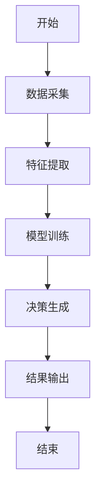
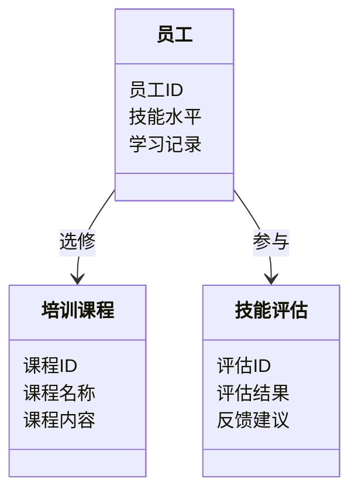
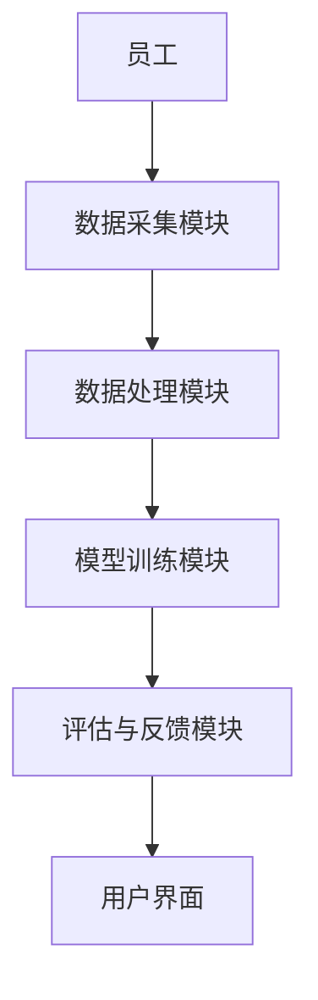
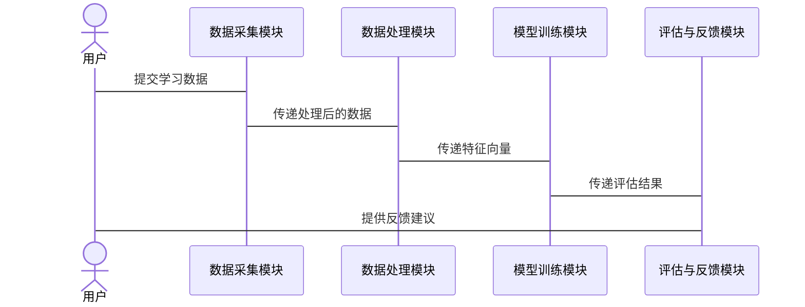

                 


# AI Agent在企业培训与技能评估中的应用

> 关键词：AI Agent, 企业培训, 技能评估, 人工智能, 机器学习, 智能系统

> 摘要：本文探讨了AI Agent在企业培训与技能评估中的应用，从背景、核心概念、算法原理、系统架构到项目实战，详细分析了AI Agent如何优化企业培训与技能评估流程，提升效率和效果。文章通过实例和代码展示，帮助读者理解并掌握AI Agent在这一领域的实际应用。

---

## 第一部分: AI Agent在企业培训与技能评估中的应用概述

## 第1章: AI Agent的基本概念与背景介绍

### 1.1 问题背景与问题描述

#### 1.1.1 传统企业培训与技能评估的痛点
- **传统培训方式的低效性**：企业培训通常依赖于固定课程和讲师，难以根据员工的具体需求和能力进行个性化调整。
- **技能评估的主观性**：传统评估方式容易受到评估者的主观影响，难以保证公平性和准确性。
- **数据孤岛问题**：员工的学习数据和评估数据分散在不同的系统中，难以形成闭环，无法有效支持后续的培训和决策。

#### 1.1.2 AI Agent如何解决这些问题
- **个性化学习路径**：AI Agent可以根据员工的学习进度和能力水平，动态调整培训内容和节奏。
- **精准评估与反馈**：通过机器学习算法，AI Agent可以实现更客观、更精准的技能评估，并提供针对性的反馈建议。
- **数据闭环优化**：AI Agent可以整合学习数据和评估数据，形成数据闭环，持续优化培训和评估流程。

#### 1.1.3 AI Agent在企业培训与技能评估中的边界与外延
- **边界**：AI Agent主要用于辅助培训和评估的决策过程，但最终的决策权仍由企业或管理者掌握。
- **外延**：AI Agent的应用可以扩展到企业内部的知识管理、员工绩效考核、职业发展规划等多个领域。

### 1.2 核心概念与问题解决

#### 1.2.1 AI Agent的核心要素组成
- **感知层**：通过数据采集和处理，获取员工的学习行为、技能水平等信息。
- **决策层**：基于感知层的数据，利用规则推理或机器学习模型，生成优化的培训计划和评估结果。
- **执行层**：将决策层的建议转化为具体的行动，例如推送个性化培训内容或调整评估标准。

#### 1.2.2 AI Agent在企业培训与技能评估中的应用场景
- **员工学习路径规划**：根据员工的历史学习数据和当前能力水平，推荐适合的学习资源和课程。
- **技能评估与反馈**：通过AI Agent分析员工的技能水平，提供精准的评估结果和改进建议。
- **培训效果跟踪**：利用AI Agent持续跟踪员工的学习进度和效果，优化培训计划。

#### 1.2.3 AI Agent如何优化企业培训与技能评估流程
- **自动化与智能化**：AI Agent可以自动处理大量的数据，减少人工干预，提高效率。
- **个性化与精准化**：通过AI技术，实现个性化和精准化的培训与评估，提升员工的学习效果和企业绩效。

---

## 第2章: AI Agent的核心概念与原理

### 2.1 AI Agent的感知、决策与执行

#### 2.1.1 感知层：数据采集与处理
- **数据来源**：员工的学习记录、测试成绩、行为数据等。
- **数据处理**：对收集到的数据进行清洗、特征提取和预处理，为后续的决策提供基础。

#### 2.1.2 决策层：基于规则与机器学习的推理
- **基于规则的推理**：通过预定义的规则，对员工的学习行为和技能水平进行分类和判断。
- **基于机器学习的决策模型**：利用监督学习、无监督学习等方法，训练模型进行预测和分类。

#### 2.1.3 执行层：行动与反馈
- **行动**：根据决策层的结果，执行具体的行动，例如推送学习资源、调整评估标准等。
- **反馈**：收集执行结果，更新数据，形成闭环。

### 2.2 AI Agent的核心原理

#### 2.2.1 AI Agent的感知与决策机制
- **感知**：AI Agent通过传感器或数据接口，获取外部环境中的信息。
- **决策**：基于感知到的信息，结合内部知识库和决策模型，生成行动建议。
- **执行**：将决策结果转化为具体的行动，并通过反馈机制不断优化决策过程。

#### 2.2.2 AI Agent的数学模型与公式
- **基于规则的推理**：例如，如果员工的测试成绩大于等于85分，则判定为“优秀”。
- **基于机器学习的决策模型**：例如，利用逻辑回归模型预测员工的技能水平。

#### 2.2.3 多智能体协作机制
- **多智能体系统**：由多个AI Agent组成，每个Agent负责不同的任务，协同完成复杂的决策任务。
- **协作机制**：通过通信和协调，确保各个Agent之间的信息共享和协同工作。

### 2.3 AI Agent的实体关系图

```mermaid
er
actor: 员工
actor: 培训系统
actor: 技能评估系统
```

---

## 第3章: AI Agent在企业培训与技能评估中的算法原理

### 3.1 算法原理概述

#### 3.1.1 基于规则的AI Agent算法
- **实现方式**：通过预定义的规则，对员工的行为和数据进行分类和判断。
- **优势**：简单易懂，适用于规则明确的场景。
- **劣势**：缺乏灵活性，难以应对复杂多变的情况。

#### 3.1.2 基于机器学习的AI Agent算法
- **实现方式**：利用监督学习、无监督学习等方法，训练模型进行预测和分类。
- **优势**：具有较强的适应性和灵活性，能够应对复杂的场景。
- **劣势**：需要大量的数据和计算资源，实现复杂。

#### 3.1.3 基于深度学习的AI Agent算法
- **实现方式**：利用深度学习模型（如神经网络），进行复杂的学习和推理。
- **优势**：能够处理非结构化数据，具有较强的表达能力。
- **劣势**：实现复杂，需要大量的计算资源。

### 3.2 算法流程图



### 3.3 算法实现代码示例

#### 基于规则的AI Agent实现
```python
def ai_agent_behavior(input_data):
    if input_data['score'] > 85:
        return "优秀"
    elif input_data['score'] > 70:
        return "良好"
    else:
        return "需要改进"
```

#### 基于机器学习的AI Agent实现
```python
from sklearn.linear_model import LogisticRegression

# 假设X是特征矩阵，y是标签
model = LogisticRegression()
model.fit(X, y)

def ai_agent_behavior(input_data):
    prediction = model.predict(input_data)
    return "优秀" if prediction == 1 else "良好"
```

---

## 第4章: AI Agent在企业培训与技能评估中的系统分析与架构设计

### 4.1 系统分析与架构设计方案

#### 4.1.1 系统功能设计
- **领域模型**：定义员工、培训课程、技能评估等核心概念及其关系。



#### 4.1.2 系统架构设计



#### 4.1.3 系统接口设计
- **API接口**：提供RESTful API，供其他系统调用AI Agent的服务。

#### 4.1.4 系统交互流程



---

## 第5章: AI Agent在企业培训与技能评估中的项目实战

### 5.1 项目环境搭建

#### 5.1.1 环境安装
- **安装Python**：确保安装了Python 3.6或更高版本。
- **安装依赖库**：安装numpy、pandas、scikit-learn等机器学习库。

```bash
pip install numpy pandas scikit-learn
```

#### 5.1.2 项目核心功能实现

##### 5.2.1 数据预处理

```python
import pandas as pd

# 读取数据
data = pd.read_csv('employee_training_data.csv')

# 数据清洗
data.dropna(inplace=True)
data = pd.get_dummies(data)
```

##### 5.2.2 模型训练

```python
from sklearn.model

