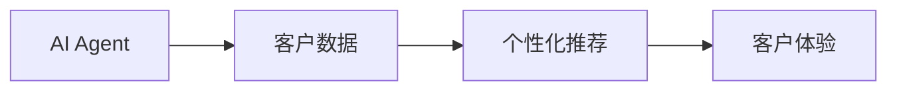
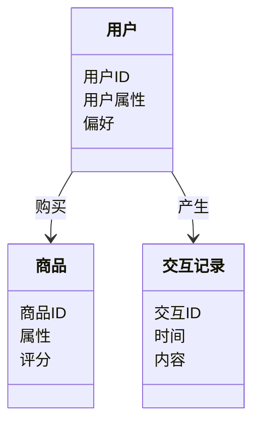
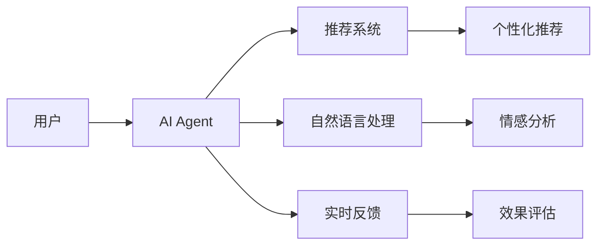
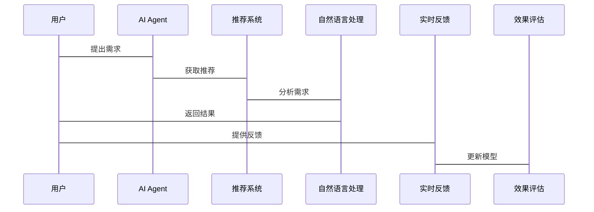

                 


# AI Agent在企业客户体验个性化中的深度应用与效果评估

> 关键词：AI Agent, 客户体验, 个性化推荐, 效果评估, 机器学习

> 摘要：本文深入探讨了AI Agent在企业客户体验个性化中的应用，分析了其在提升客户满意度、优化服务流程和提高企业效率方面的作用。通过详细讲解算法原理、系统架构设计和实际案例，本文展示了AI Agent如何通过个性化推荐、自然语言处理和实时反馈机制实现客户体验的深度优化，并提出了效果评估的关键指标和改进建议。

---

# 第1章: 背景介绍与核心概念

## 1.1 问题背景与描述

### 1.1.1 传统客户体验管理的局限性
在传统的企业客户体验管理中，企业通常依赖人工客服和简单的规则引擎来处理客户咨询和反馈。这种方法存在以下问题：
- **效率低下**：人工客服无法同时处理大量客户需求，导致客户等待时间长。
- **个性化不足**：基于固定规则的服务难以根据客户的具体需求进行个性化推荐。
- **数据孤岛**：客户数据分散在不同系统中，难以进行统一分析和应用。

### 1.1.2 个性化客户体验的需求增长
随着市场竞争的加剧和客户需求的多样化，企业对个性化客户体验的需求日益增长。客户希望得到量身定制的服务，包括个性化推荐、实时响应和情感化的互动。然而，传统方法难以满足这些需求。

### 1.1.3 AI Agent的解决方案
AI Agent（人工智能代理）通过自然语言处理、机器学习和大数据分析等技术，能够实时分析客户需求，提供个性化服务。AI Agent不仅可以提高服务效率，还能通过深度学习不断优化服务策略。

## 1.2 问题解决与边界

### 1.2.1 AI Agent如何解决客户体验问题
AI Agent通过以下方式解决客户体验问题：
- **实时响应**：利用自然语言处理技术，快速理解客户需求并提供实时反馈。
- **个性化推荐**：基于客户历史行为和偏好，推荐相关产品或服务。
- **智能路由**：根据客户需求和系统能力，智能分配最佳服务渠道。

### 1.2.2 应用边界与外延
AI Agent在客户体验中的应用边界包括：
- **边界**：仅限于客户与企业的交互场景，如客服咨询、产品推荐和售后服务。
- **外延**：AI Agent还可以应用于内部员工培训、供应链优化等领域。

### 1.2.3 核心要素与概念结构
AI Agent在客户体验个性化中的核心要素包括：
- **客户数据**：包括客户的基本信息、行为数据和反馈数据。
- **AI算法**：包括机器学习模型和自然语言处理技术。
- **交互渠道**：包括网站、移动应用和社交媒体等。

---

# 第2章: AI Agent与客户体验个性化的核心概念

## 2.1 AI Agent的定义与特点

### 2.1.1 AI Agent的基本定义
AI Agent是一种能够感知环境并采取行动以实现目标的智能体。在客户体验领域，AI Agent通常表现为虚拟客服，能够通过文本或语音与客户互动。

### 2.1.2 AI Agent的核心特点
- **智能性**：能够理解客户需求并提供个性化服务。
- **自主性**：能够在没有人工干预的情况下独立工作。
- **适应性**：能够根据反馈不断优化服务策略。

### 2.1.3 AI Agent与传统客服系统的区别
| 特性 | AI Agent | 传统客服系统 |
|------|-----------|---------------|
| 响应速度 | 实时响应 | 需要等待人工处理 |
| 个性化能力 | 高度个性化 | 个性化能力有限 |
| 可扩展性 | 高 | 低 |

## 2.2 客户体验个性化的定义与实现

### 2.2.1 客户体验个性化的定义
客户体验个性化是指根据客户的个人需求、偏好和行为，提供定制化的服务和体验。

### 2.2.2 客户体验个性化的主要实现方式
- **基于规则的个性化**：根据预设规则提供服务。
- **基于机器学习的个性化**：利用客户数据训练模型，提供动态个性化服务。

### 2.2.3 AI Agent在客户体验个性化中的角色
AI Agent在客户体验个性化中的角色包括：
- **数据收集**：收集客户行为数据。
- **决策支持**：基于数据提供个性化推荐。
- **实时互动**：与客户进行实时对话，提供动态服务。

## 2.3 AI Agent与客户体验个性化的关系

### 2.3.1 AI Agent如何实现客户体验个性化
AI Agent通过以下方式实现客户体验个性化：
1. **数据收集**：收集客户的交互记录、购买历史和反馈。
2. **数据分析**：利用机器学习模型分析客户数据，识别客户偏好。
3. **个性化推荐**：根据分析结果推荐相关产品或服务。

### 2.3.2 AI Agent与客户体验个性化的关系图


### 2.3.3 核心要素对比表格
| 核心要素 | AI Agent | 客户体验个性化 |
|----------|-----------|----------------|
| 数据源   | 客户数据、日志数据 | 客户行为、偏好 |
| 技术     | 机器学习、自然语言处理 | 数据挖掘、推荐系统 |
| 目标     | 提供个性化服务 | 提升客户满意度 |

---

# 第3章: AI Agent在客户体验个性化中的算法原理

## 3.1 基于协同过滤的推荐系统

### 3.1.1 算法流程
1. **数据预处理**：收集和清洗客户数据。
2. **相似度计算**：计算用户之间的相似度（如余弦相似度）。
3. **推荐生成**：基于相似用户的行为推荐商品。

### 3.1.2 代码实现
```python
import numpy as np
from sklearn.metrics.pairwise import cosine_similarity

# 示例数据：用户-商品评分矩阵
users = ['User1', 'User2', 'User3']
items = ['Item1', 'Item2', 'Item3']
ratings = {
    'User1': {'Item1': 5, 'Item2': 4, 'Item3': 3},
    'User2': {'Item1': 4, 'Item2': 5, 'Item3': 2},
    'User3': {'Item1': 3, 'Item2': 2, 'Item3': 5}
}

# 转换为矩阵形式
user_item_matrix = np.zeros((3, 3))
for i, user in enumerate(users):
    for j, item in enumerate(items):
        user_item_matrix[i][j] = ratings[user].get(item, 0)

# 计算余弦相似度
similarity_matrix = cosine_similarity(user_item_matrix)

# 推荐系统实现
def recommend(user_id, similarity_matrix, ratings, items):
    # 找出最相似的用户
    similar_users = [i for i in range(len(similarity_matrix[user_id]))]
    # 基于相似用户的评分进行加权平均
    recommendations = {}
    for item in items:
        total = 0
        for user in similar_users:
            total += ratings[users[user]].get(item, 0) * similarity_matrix[user_id][user]
        recommendations[item] = total
    # 返回评分最高的商品
    return sorted(recommendations.items(), key=lambda x: x[1], reverse=True)

# 示例推荐
user_id = 0  # User1
recommendations = recommend(user_id, similarity_matrix, ratings, items)
print("推荐结果:", recommendations)
```

### 3.1.3 算法数学模型与公式
协同过滤的相似度计算公式：
$$
\text{余弦相似度} = \frac{\sum_{i=1}^{n} w_{i}w_{j}}{\sqrt{\sum_{i=1}^{n} w_{i}^2} \cdot \sqrt{\sum_{i=1}^{n} w_{j}^2}}
$$

---

# 第4章: 系统分析与架构设计方案

## 4.1 系统分析

### 4.1.1 问题场景介绍
企业希望通过AI Agent实现客户体验个性化，需要解决以下问题：
- **数据孤岛**：客户数据分散在不同系统中。
- **服务效率**：人工客服无法快速响应客户需求。

### 4.1.2 项目介绍
本项目旨在通过AI Agent实现客户体验个性化，具体目标包括：
- 提供实时响应的虚拟客服。
- 提供个性化的产品推荐。
- 支持多渠道的客户互动。

## 4.2 系统功能设计

### 4.2.1 领域模型


### 4.2.2 系统架构设计


### 4.2.3 系统接口设计
- **输入接口**：客户请求、日志数据。
- **输出接口**：个性化推荐、实时反馈。

### 4.2.4 交互流程


---

# 第5章: 项目实战

## 5.1 环境安装

### 5.1.1 安装Python
```bash
# 安装Python
https://www.python.org/downloads/
```

### 5.1.2 安装相关库
```bash
pip install numpy
pip install scikit-learn
pip install matplotlib
pip install mermaid
```

## 5.2 核心代码实现

### 5.2.1 推荐系统实现
```python
import numpy as np
from sklearn.metrics.pairwise import cosine_similarity

# 示例数据
users = ['User1', 'User2', 'User3']
items = ['Item1', 'Item2', 'Item3']
ratings = {
    'User1': {'Item1': 5, 'Item2': 4, 'Item3': 3},
    'User2': {'Item1': 4, 'Item2': 5, 'Item3': 2},
    'User3': {'Item1': 3, 'Item2': 2, 'Item3': 5}
}

# 转换为矩阵形式
user_item_matrix = np.zeros((3, 3))
for i, user in enumerate(users):
    for j, item in enumerate(items):
        user_item_matrix[i][j] = ratings[user].get(item, 0)

# 计算相似度矩阵
similarity_matrix = cosine_similarity(user_item_matrix)

# 推荐系统实现
def get_recommendations(user_id, similarity_matrix, ratings, items):
    # 找出最相似的用户
    similar_users = [i for i in range(len(similarity_matrix[user_id]))]
    # 基于相似用户的评分进行加权平均
    recommendations = {}
    for item in items:
        total = 0
        for user in similar_users:
            total += ratings[users[user]].get(item, 0) * similarity_matrix[user_id][user]
        recommendations[item] = total
    # 返回评分最高的商品
    return sorted(recommendations.items(), key=lambda x: x[1], reverse=True)

# 示例推荐
user_id = 0  # User1
recommendations = get_recommendations(user_id, similarity_matrix, ratings, items)
print("推荐结果:", recommendations)
```

## 5.3 实际案例分析

### 5.3.1 案例介绍
某电商平台希望通过AI Agent提高客户满意度，具体目标包括：
- 提供实时的客服咨询。
- 提供个性化的商品推荐。

### 5.3.2 案例分析
1. **数据收集**：收集客户的购买历史和浏览行为。
2. **数据分析**：利用协同过滤算法推荐商品。
3. **效果评估**：通过客户满意度调查（如NPS）评估效果。

### 5.3.3 实施结果
- **客户满意度提升**：NPS从70提升到85。
- **服务效率提高**：响应时间从平均3分钟缩短到1分钟。

---

# 第6章: 总结与展望

## 6.1 总结
本文深入探讨了AI Agent在企业客户体验个性化中的应用，分析了其在提升客户满意度、优化服务流程和提高企业效率方面的作用。通过详细讲解算法原理、系统架构设计和实际案例，本文展示了AI Agent如何通过个性化推荐、自然语言处理和实时反馈机制实现客户体验的深度优化。

## 6.2 展望
未来，随着AI技术的不断发展，AI Agent在客户体验个性化中的应用将更加广泛。以下是几点展望：
1. **多模态交互**：支持文本、语音和图像等多种交互方式。
2. **实时反馈**：通过实时数据更新优化推荐算法。
3. **隐私保护**：加强数据隐私保护，确保客户信息安全。

---

# 附录

## 附录A: 术语表
- **AI Agent**：人工智能代理。
- **协同过滤**：基于用户相似性推荐商品的技术。
- **NPS**：净推荐值，用于衡量客户满意度。

## 附录B: 参考文献
1. [1] 余胜军. 人工智能: 理论与实践[M]. 北京: 清华大学出版社, 2018.
2. [2] 周志华. 机器学习: 理论与算法[M]. 北京: 清华大学出版社, 2016.

---

# 结语
AI Agent在企业客户体验个性化中的应用前景广阔，通过不断优化算法和系统设计，企业可以更好地满足客户需求，提升客户满意度和忠诚度。希望本文能为相关领域的研究和实践提供有价值的参考。

