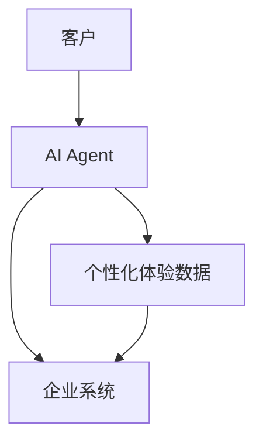
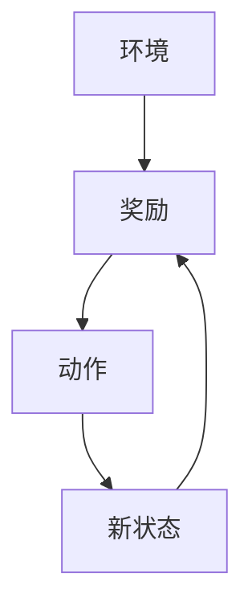
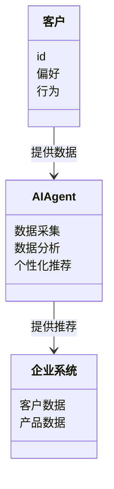
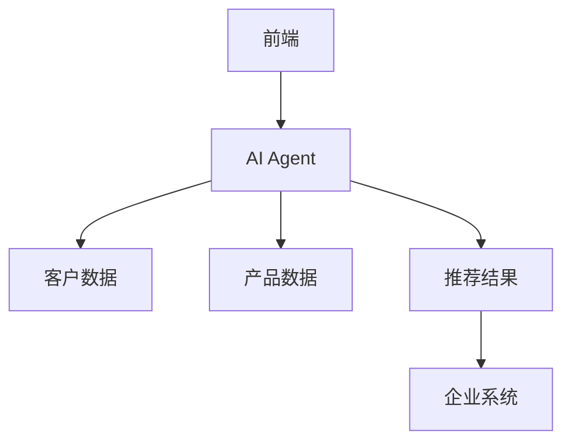
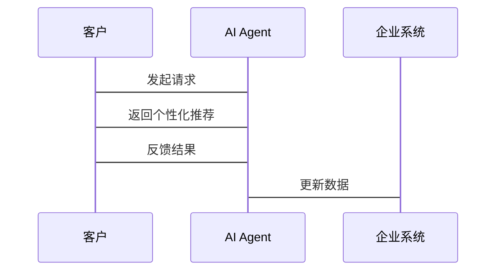

                 


# AI Agent在企业客户体验个性化中的角色

> 关键词：AI Agent, 个性化体验, 客户体验管理, 强化学习, 系统架构, 电商推荐系统

> 摘要：AI Agent在企业客户体验个性化中的应用是当前技术领域的热点。本文从问题背景出发，详细分析了AI Agent在个性化体验中的作用机制，并结合实际案例，探讨了AI Agent在企业客户体验管理中的具体应用场景和实现方法。通过算法原理、系统架构设计、项目实战等多方面的内容，深入剖析了AI Agent如何助力企业实现客户体验的个性化优化。

---

# 第一部分: AI Agent在企业客户体验个性化中的背景与概念

## 第1章: 问题背景与问题描述

### 1.1 问题背景

#### 1.1.1 企业客户体验管理的现状与挑战
- 当前企业客户体验管理的主要手段包括问卷调查、客服系统和数据分析，但存在效率低下、个性化不足的问题。
- 随着市场竞争加剧，客户对个性化体验的需求日益增长，传统方法难以满足。

#### 1.1.2 个性化客户体验的需求增长
- 客户期望从企业获得量身定制的服务，而不仅仅是标准化的产品或服务。
- 个性化体验能够提高客户满意度、忠诚度和企业的竞争力。

#### 1.1.3 AI Agent在客户体验中的潜在价值
- AI Agent能够实时分析客户需求，提供个性化建议和解决方案。
- 通过智能化的交互方式，AI Agent可以显著提升客户体验的个性化水平。

### 1.2 问题描述

#### 1.2.1 传统客户体验管理的局限性
- 传统方法依赖人工操作，效率低，难以满足大规模客户的需求。
- 数据分析滞后，无法实时响应客户需求。

#### 1.2.2 个性化体验实现的难点
- 需要整合多渠道数据，实时分析客户需求。
- 个性化体验需要动态调整，而传统系统难以快速响应。

#### 1.2.3 AI Agent在个性化体验中的角色定位
- AI Agent作为智能化工具，能够实时处理客户需求，提供个性化服务。
- AI Agent可以与其他企业系统集成，实现数据的实时共享和分析。

### 1.3 问题解决与边界

#### 1.3.1 AI Agent如何解决个性化体验问题
- AI Agent通过实时数据分析，能够快速识别客户需求。
- AI Agent可以与企业系统集成，实现个性化体验的自动化。

#### 1.3.2 AI Agent的应用边界与外延
- AI Agent主要用于客户交互和体验优化，不涉及企业的核心业务逻辑。
- AI Agent的应用范围包括客户支持、个性化推荐和体验优化。

#### 1.3.3 核心问题的边界条件与假设
- 假设企业已经具备一定的客户数据基础。
- 边界在于AI Agent的功能范围，不涉及企业的财务、生产等核心业务。

### 1.4 核心概念与核心要素

#### 1.4.1 AI Agent的核心概念
- AI Agent是一种能够感知环境、自主决策的智能体。
- AI Agent通过学习和优化，能够提供个性化的客户体验。

#### 1.4.2 个性化体验的核心要素
- 客户需求识别
- 个性化推荐
- 实时交互

#### 1.4.3 AI Agent与个性化体验的关系
- AI Agent是实现个性化体验的核心工具。
- 个性化体验是AI Agent在客户体验管理中的主要应用场景。

## 第2章: AI Agent的核心概念与联系

### 2.1 核心概念原理

#### 2.1.1 AI Agent的基本原理
- AI Agent通过感知环境和数据处理，生成个性化体验建议。
- AI Agent能够自主学习和优化，提升个性化体验的效果。

#### 2.1.2 个性化体验的实现机制
- 数据采集：收集客户的行为数据、偏好数据等。
- 数据分析：通过机器学习算法，分析客户需求。
- 个性化推荐：基于分析结果，生成个性化体验方案。

#### 2.1.3 AI Agent在个性化体验中的作用机制
- AI Agent通过实时数据分析，快速识别客户需求。
- AI Agent与企业系统集成，实现个性化体验的自动化。

### 2.2 核心概念属性特征对比

#### 2.2.1 AI Agent与传统客服系统对比

| 特性           | AI Agent                | 传统客服系统          |
|----------------|-------------------------|-----------------------|
| 智能性          | 高                     | 低                   |
| 响应速度        | 实时                   | 滞后                 |
| 个性化能力      | 强                     | 弱                   |
| 可扩展性        | 高                     | 低                   |

#### 2.2.2 个性化体验与标准化体验对比

| 特性           | 个性化体验             | 标准化体验             |
|----------------|-------------------------|-----------------------|
| 体验定制化      | 高                     | 低                   |
| 客户满意度      | 高                     | 一般                 |
| 企业成本        | 高                     | 低                   |

#### 2.2.3 不同AI Agent类型对比

| 类型            | 基于规则的AI Agent | 基于学习的AI Agent |
|-----------------|--------------------|---------------------|
| 决策方式        | 预设规则            | 自主学习            |
| 适应性          | 低                 | 高                 |
| 复杂性          | 低                 | 高                 |

### 2.3 实体关系图（ER图）



---

# 第三部分: 算法原理与数学模型

## 第3章: AI Agent的算法原理

### 3.1 算法原理概述

#### 3.1.1 强化学习算法
- 强化学习是一种通过试错机制优化决策的算法。
- 在客户体验优化中，强化学习可以用于动态调整推荐策略。

#### 3.1.2 监督学习算法
- 监督学习通过训练数据，预测客户行为。
- 监督学习可以用于客户偏好预测。

#### 3.1.3 无监督学习算法
- 无监督学习用于发现数据中的隐含模式。
- 无监督学习可以用于客户细分。

### 3.2 强化学习算法实现

#### 3.2.1 算法步骤
1. 初始化状态空间、动作空间和奖励函数。
2. 通过与环境交互，学习最优策略。
3. 根据奖励函数优化策略。

#### 3.2.2 mermaid流程图


#### 3.2.3 Python代码实现
```python
import numpy as np
import gym

# 定义环境
class CustomerExperienceEnv(gym.Env):
    def __init__(self):
        super(CustomerExperienceEnv, self).__init__()
        self.action_space = gym.spaces.Discrete(4)  # 动作空间：推荐产品、提供优惠、无动作、其他
        self.observation_space = gym.spaces.Discrete(5)  # 状态空间：客户偏好、购买历史等
        self.current_state = 0
        self.goal = 3  # 示例目标状态

    def step(self, action):
        # 根据动作和当前状态，计算新状态和奖励
        if action == 0:  # 推荐产品
            self.current_state = 1
            reward = 1
        elif action == 1:  # 提供优惠
            self.current_state = 2
            reward = 2
        elif action == 2:  # 无动作
            self.current_state = 3
            reward = 0
        else:  # 其他
            self.current_state = 4
            reward = -1
        done = self.current_state == self.goal
        return self.current_state, reward, done, {}

    def reset(self):
        self.current_state = 0
        return self.current_state
```

### 3.3 监督学习算法实现

#### 3.3.1 算法步骤
1. 收集客户行为数据。
2. 标注数据，训练模型。
3. 使用模型预测客户行为。

#### 3.3.2 代码实现
```python
from sklearn.tree import DecisionTreeClassifier
from sklearn.model_selection import train_test_split
from sklearn.metrics import accuracy_score

# 示例数据
X = [[1, 2, 3], [4, 5, 6], [7, 8, 9], [10, 11, 12]]
y = [0, 1, 0, 1]

# 数据分割
X_train, X_test, y_train, y_test = train_test_split(X, y, test_size=0.2)

# 模型训练
model = DecisionTreeClassifier()
model.fit(X_train, y_train)

# 模型预测
y_pred = model.predict(X_test)
print("准确率:", accuracy_score(y_test, y_pred))
```

### 3.4 数学模型与公式

#### 3.4.1 强化学习的Q-learning算法
- Q值更新公式：
  $$ Q(s, a) = Q(s, a) + \alpha \times (r + \gamma \times \max Q(s', a') - Q(s, a)) $$
- 其中，$\alpha$是学习率，$\gamma$是折扣率。

#### 3.4.2 个性化推荐模型
- 基于协同过滤的推荐公式：
  $$ \hat{r}_{u,i} = \frac{\sum_{k} \alpha_{u,k} \beta_{i,k}}{\sum_{k} \alpha_{u,k}} $$
- 其中，$\alpha_{u,k}$表示用户$u$和物品$k$的相关性，$\beta_{i,k}$表示物品$i$和$k$的相关性。

---

# 第四部分: 系统分析与架构设计

## 第4章: 系统分析与架构设计

### 4.1 问题场景介绍

#### 4.1.1 系统背景
- 企业需要通过AI Agent实现客户体验的个性化管理。
- 系统需要整合客户数据、推荐算法和实时交互功能。

#### 4.1.2 项目介绍
- 项目目标：通过AI Agent实现个性化客户体验管理。
- 项目范围：包括数据采集、分析、推荐和交互功能。

### 4.2 系统功能设计

#### 4.2.1 领域模型类图


#### 4.2.2 系统架构设计


#### 4.2.3 系统接口设计
- API接口：/api/recommend、/api/interact
- 数据格式：JSON

#### 4.2.4 系统交互设计


---

## 第5章: 项目实战

### 5.1 环境安装

#### 5.1.1 安装依赖
- Python 3.8+
- numpy、pandas、scikit-learn、gym

#### 5.1.2 安装命令
```bash
pip install numpy pandas scikit-learn gym
```

### 5.2 系统核心实现

#### 5.2.1 AI Agent实现
```python
class AIAssistant:
    def __init__(self):
        self.data = {}

    def collect_data(self, customer_id):
        # 数据采集逻辑
        pass

    def analyze_data(self):
        # 数据分析逻辑
        pass

    def generate_recommendation(self, customer_id):
        # 个性化推荐逻辑
        pass
```

#### 5.2.2 个性化推荐系统实现
```python
def personalized_recommendation(customer_id):
    # 数据加载
    customer_data = load_data(customer_id)
    # 模型预测
    recommendation = model.predict(customer_data)
    return recommendation
```

### 5.3 代码应用解读与分析

#### 5.3.1 数据采集模块
```python
import requests

def collect_customer_data(customer_id):
    response = requests.get(f'http://api.example.com/customers/{customer_id}')
    return response.json()
```

#### 5.3.2 数据分析模块
```python
from sklearn.cluster import KMeans

def analyze_data(customers):
    model = KMeans(n_clusters=3)
    model.fit(customers)
    return model.labels_
```

#### 5.3.3 个性化推荐模块
```python
def generate_recommendation(customer_id, clusters):
    cluster_id = clusters[customer_id]
    return recommended_products[cluster_id]
```

### 5.4 实际案例分析

#### 5.4.1 案例介绍
- 某电商企业希望通过AI Agent实现客户体验个性化。

#### 5.4.2 案例分析
- 数据采集：收集客户的行为数据、偏好数据。
- 数据分析：通过聚类分析，将客户分成不同群体。
- 个性化推荐：基于客户群体特征，生成个性化推荐。

#### 5.4.3 代码实现
```python
# 数据加载
customer_data = pd.read_csv('customer.csv')
# 数据分析
clusters = KMeans(n_clusters=5).fit(customer_data).labels_
# 个性化推荐
recommendations = generate_recommendation(clusters)
```

### 5.5 项目小结

#### 5.5.1 实战总结
- AI Agent能够有效提升客户体验的个性化水平。
- 通过系统集成和算法优化，企业可以显著提高客户满意度。

#### 5.5.2 实战经验
- 数据质量是个性化推荐的关键。
- 系统架构设计需要充分考虑可扩展性和可维护性。

---

## 第6章: 总结与展望

### 6.1 总结

#### 6.1.1 核心观点总结
- AI Agent在企业客户体验个性化中具有重要作用。
- 通过智能化的数据分析和实时交互，AI Agent能够显著提升客户体验。

#### 6.1.2 关键点回顾
- AI Agent的核心算法：强化学习和监督学习。
- 系统架构设计：数据采集、分析、推荐和交互。

### 6.2 展望

#### 6.2.1 未来研究方向
- 更复杂的强化学习算法在客户体验中的应用。
- 结合自然语言处理技术，提升交互体验。

#### 6.2.2 未来技术趋势
- AI Agent的自我学习能力将进一步提升。
- 个性化体验将更加智能化和个性化。

### 6.3 最佳实践 Tips

#### 6.3.1 实战经验分享
- 数据预处理是个性化推荐的关键步骤。
- 系统设计需要充分考虑可扩展性和可维护性。

#### 6.3.2 注意事项
- 数据隐私和安全是企业需要重点关注的问题。
- 系统上线前需要进行全面的测试和优化。

#### 6.3.3 拓展阅读
- 《强化学习：算法与应用》
- 《个性化推荐系统：原理与实践》

---

# 附录

## 附录A: AI Agent算法实现代码

### 附录A.1: 强化学习代码
```python
import gym
import numpy as np

class AIAssistant:
    def __init__(self, env):
        self.env = env
        self.Q = np.zeros((self.env.observation_space.n, self.env.action_space.n))

    def epsilon_greedy_policy(self, state, epsilon=0.1):
        if np.random.random() < epsilon:
            return self.env.action_space.sample()
        else:
            return np.argmax(self.Q[state, :])

    def q_learning(self, num_episodes=1000, gamma=0.99, alpha=0.1):
        for episode in range(num_episodes):
            state = self.env.reset()
            done = False
            while not done:
                action = self.epsilon_greedy_policy(state)
                next_state, reward, done, _ = self.env.step(action)
                self.Q[state, action] = self.Q[state, action] + alpha * (reward + gamma * np.max(self.Q[next_state, :]) - self.Q[state, action])
                state = next_state
```

### 附录A.2: 监督学习代码
```python
from sklearn.tree import DecisionTreeClassifier

class CustomerPredictor:
    def __init__(self):
        self.model = DecisionTreeClassifier()

    def train(self, X, y):
        self.model.fit(X, y)

    def predict(self, X_test):
        return self.model.predict(X_test)
```

---

## 附录B: 系统架构图

### 附录B.1: 系统架构图


---

## 附录C: 项目小结与反思

### 附录C.1: 项目小结
- 通过AI Agent实现客户体验个性化是当前企业的重要方向。
- 本项目通过算法实现和系统设计，展示了AI Agent在个性化体验中的巨大潜力。

### 附录C.2: 项目反思
- 数据质量是影响个性化推荐效果的关键因素。
- 系统设计需要充分考虑可扩展性和可维护性。
- 未来的研究方向包括更复杂的算法和多模态数据的整合。

---

# 结语

AI Agent在企业客户体验个性化中的应用前景广阔。通过本文的分析和实践，我们可以看到，AI Agent不仅能够提升客户体验的个性化水平，还能够显著提高企业的竞争力。未来，随着技术的不断发展，AI Agent将在企业客户体验管理中发挥更加重要的作用。

