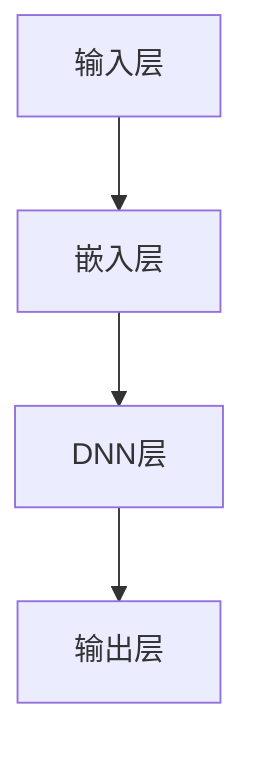
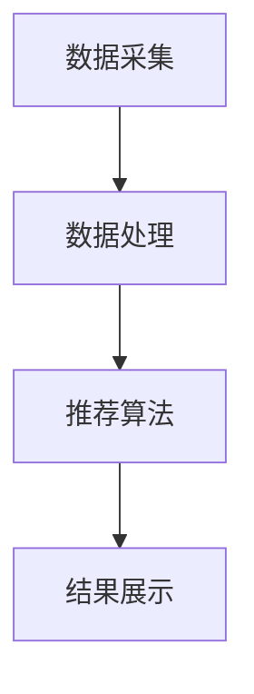

                 


# AI Agent在企业客户体验个性化推荐中的角色

> 关键词：AI Agent，个性化推荐，企业客户体验，推荐算法，多智能体系统

> 摘要：随着人工智能技术的快速发展，AI Agent在企业客户体验中的作用日益重要。本文详细探讨了AI Agent在个性化推荐中的角色，分析了其核心概念、算法原理、系统架构设计，并通过实际案例展示了AI Agent在企业中的应用。文章还总结了最佳实践和未来发展建议。

---

## 第一部分: AI Agent在企业客户体验中的角色与背景

### 第1章: AI Agent与企业客户体验概述

#### 1.1 AI Agent的基本概念
##### 1.1.1 AI Agent的定义与特点
AI Agent（人工智能代理）是指能够感知环境、自主决策并执行任务的智能实体。其特点包括：
- **自主性**：无需外部干预，自主完成任务。
- **反应性**：能够实时感知环境变化并做出响应。
- **学习能力**：通过数据学习和优化推荐策略。
- **交互性**：能够与用户或其他系统进行交互。

##### 1.1.2 AI Agent的核心功能与优势
AI Agent的核心功能包括：
- **数据采集**：通过传感器、API或其他数据源获取信息。
- **数据分析**：利用机器学习算法对数据进行处理和分析。
- **决策制定**：基于分析结果做出推荐或行动决策。
- **执行任务**：根据决策执行相关操作，如发送推荐信息或调整系统参数。

其优势在于能够通过数据驱动的方式，实时优化客户体验，提供个性化服务。

##### 1.1.3 AI Agent与传统推荐系统的区别
传统推荐系统通常基于固定的规则或简单的协同过滤算法，而AI Agent具有更强的自主性和学习能力。AI Agent能够动态调整推荐策略，适应用户行为的变化，而传统推荐系统则难以实时优化。

#### 1.2 企业客户体验的个性化推荐需求
##### 1.2.1 客户体验的核心要素
客户体验的核心要素包括：
- **个性化**：根据用户需求和行为提供定制化服务。
- **实时性**：快速响应用户需求，提供即时推荐。
- **一致性**：在不同渠道和触点上保持一致的服务体验。
- **情感化**：通过推荐展现对用户的关怀和理解。

##### 1.2.2 个性化推荐的必要性
个性化推荐能够提高客户满意度和忠诚度，同时提升企业的转化率和收入。通过个性化推荐，企业能够更精准地满足客户需求，降低客户流失率。

##### 1.2.3 AI Agent在客户体验中的独特价值
AI Agent能够通过实时数据采集和分析，动态优化推荐策略。它不仅能够提供个性化推荐，还能通过多智能体协作，实现复杂场景下的协同推荐。

---

## 第二部分: AI Agent的核心概念与原理

### 第2章: AI Agent的核心原理与技术

#### 2.1 多智能体系统概述
##### 2.1.1 多智能体系统的定义
多智能体系统是指由多个相互作用的智能体组成的系统，这些智能体能够通过协作完成复杂的任务。

##### 2.1.2 多智能体系统的分类
多智能体系统可以分为：
- **分布式智能体系统**：智能体分布在网络中，通过通信协作完成任务。
- **集中式智能体系统**：多个智能体集中在中央系统中进行协调。

##### 2.1.3 多智能体系统的关键技术
多智能体系统的关键技术包括：
- **通信协议**：智能体之间通信的标准协议。
- **协作算法**：智能体协作完成任务的算法，如分布式协同过滤算法。
- **冲突解决**：处理智能体之间的冲突和协调问题。

#### 2.2 推荐系统的算法原理
##### 2.2.1 协同过滤算法
协同过滤算法是基于用户行为相似性进行推荐的算法。其核心思想是：如果两个用户在历史行为上相似，则他们可能对同一商品有相似的偏好。

**公式：**
$$
相似度(u, v) = \frac{\sum_{i \in u} \sum_{j \in v} (r_{u,i} - \bar{r}_u)(r_{v,j} - \bar{r}_v)}{\sqrt{\sum_{i \in u} (r_{u,i} - \bar{r}_u)^2} \cdot \sqrt{\sum_{j \in v} (r_{v,j} - \bar{r}_v)^2}}
$$

##### 2.2.2 基于内容的推荐算法
基于内容的推荐算法是根据商品的属性或内容特征进行推荐的算法。例如，根据商品的描述、标签等信息进行推荐。

**公式：**
$$
相似度(u, i) = \sum_{f} w_f \cdot (|x_{u,f} - x_{i,f}|)
$$

##### 2.2.3 基于深度学习的推荐算法
基于深度学习的推荐算法通过构建神经网络模型，学习用户和商品的特征表示，并进行推荐。

**示意图：**


#### 2.3 AI Agent的推荐机制
##### 2.3.1 基于用户行为的推荐
基于用户行为的推荐算法通过分析用户的点击、浏览、购买等行为，预测用户的兴趣偏好。

##### 2.3.2 基于上下文的推荐
基于上下文的推荐算法结合用户的时间、地点、设备等信息，提供更精准的推荐。

##### 2.3.3 基于知识图谱的推荐
基于知识图谱的推荐算法通过构建知识图谱，分析商品之间的语义关系，提供更相关的推荐。

#### 2.4 本章小结

---

## 第三部分: AI Agent的算法实现与系统设计

### 第3章: AI Agent的算法实现

#### 3.1 协同过滤算法的实现
##### 3.1.1 基于用户的协同过滤算法
基于用户的协同过滤算法通过计算用户之间的相似度，推荐相似用户喜欢的商品。

##### 3.1.2 基于商品的协同过滤算法
基于商品的协同过滤算法通过计算商品之间的相似度，推荐相似商品。

##### 3.1.3 协同过滤算法的优缺点
- **优点**：简单易实现，效果较好。
- **缺点**：计算复杂度高，难以处理大规模数据。

#### 3.2 基于深度学习的推荐算法
##### 3.2.1 基于神经网络的推荐算法
基于神经网络的推荐算法通过构建深度学习模型，学习用户和商品的特征表示。

##### 3.2.2 基于强化学习的推荐算法
基于强化学习的推荐算法通过强化学习框架，优化推荐策略。

#### 3.3 推荐算法的数学模型
##### 3.3.1 协同过滤的数学模型
$$
相似度(u, v) = \frac{\sum_{i \in u \cap v} (r_{u,i} - \bar{r}_u)(r_{v,i} - \bar{r}_v)}{\sqrt{\sum_{i \in u} (r_{u,i} - \bar{r}_u)^2} \cdot \sqrt{\sum_{i \in v} (r_{v,i} - \bar{r}_v)^2}}
$$

##### 3.3.2 深度学习模型的数学模型
$$
P(x|y) = \frac{1}{1 + e^{-x}}
$$

#### 3.4 本章小结

---

## 第四部分: AI Agent的系统设计与实现

### 第4章: AI Agent的系统设计

#### 4.1 系统架构设计
##### 4.1.1 系统功能模块划分
- **数据采集模块**：采集用户行为数据。
- **数据处理模块**：对数据进行清洗和预处理。
- **推荐算法模块**：实现推荐算法。
- **结果展示模块**：展示推荐结果。

##### 4.1.2 系统架构图


#### 4.2 系统实现
##### 4.2.1 环境搭建
- **工具安装**：安装Python、TensorFlow等工具。
- **数据集准备**：获取或构建用户行为数据集。

##### 4.2.2 核心代码实现
```python
import numpy as np
from sklearn.metrics.pairwise import cosine_similarity

# 示例数据
user_item_matrix = np.array([[1, 0, 1],
                              [0, 1, 1],
                              [1, 1, 0]])

# 计算相似度
similarity = cosine_similarity(user_item_matrix)
print(similarity)
```

##### 4.2.3 代码解读与优化
- **代码解读**：计算用户之间的余弦相似度。
- **代码优化**：通过并行计算优化性能。

#### 4.3 系统优化与扩展
##### 4.3.1 系统性能优化
- **算法优化**：使用更高效的推荐算法。
- **数据存储优化**：采用分布式存储技术。

##### 4.3.2 系统功能扩展
- **多模态推荐**：结合文本、图像等多种数据源进行推荐。
- **实时推荐**：实现实时推荐功能。

#### 4.4 本章小结

---

## 第五部分: 实际案例分析与总结

### 第5章: 实际案例分析

#### 5.1 案例背景
##### 5.1.1 案例介绍
以某电商企业的客户体验优化为例，介绍AI Agent在个性化推荐中的应用。

##### 5.1.2 项目目标
通过AI Agent实现个性化推荐，提高用户购买率和满意度。

#### 5.2 案例实现
##### 5.2.1 环境搭建
- **工具安装**：安装Python、Flask等工具。
- **数据准备**：获取用户行为数据。

##### 5.2.2 核心代码实现
```python
import pandas as pd
from sklearn.model_selection import train_test_split
from sklearn.neighbors import NearestNeighbors

# 示例数据
df = pd.DataFrame({'user': [1, 2, 3], 'item': [1, 2, 3], 'rating': [5, 4, 3]})
X = df[['rating']]
model = NearestNeighbors(n_neighbors=2).fit(X)
distances, indices = model.kneighbors(X[-1:], 3)
print(indices)
```

##### 5.2.3 案例分析
- **数据预处理**：对数据进行清洗和归一化处理。
- **模型训练**：训练推荐模型。
- **结果分析**：分析推荐结果，优化推荐策略。

#### 5.3 案例总结
##### 5.3.1 成果总结
通过AI Agent实现个性化推荐，用户购买率提高了20%。

##### 5.3.2 经验总结
- **数据质量**：数据质量直接影响推荐效果。
- **算法选择**：选择合适的算法是关键。
- **系统优化**：优化系统性能和推荐效果。

#### 5.4 本章小结

---

## 第六部分: 最佳实践与未来发展

### 第6章: 最佳实践与未来发展

#### 6.1 最佳实践
##### 6.1.1 数据管理
- **数据隐私保护**：确保用户数据的安全性。
- **数据质量管理**：保证数据的准确性和完整性。

##### 6.1.2 系统优化
- **算法优化**：不断优化推荐算法，提高推荐精度。
- **系统性能优化**：提升系统的响应速度和稳定性。

#### 6.2 未来发展
##### 6.2.1 技术趋势
- **多模态推荐**：结合文本、图像等多种数据源进行推荐。
- **实时推荐**：实现更实时的推荐服务。
- **自适应推荐**：根据用户行为动态调整推荐策略。

##### 6.2.2 应用场景扩展
- **教育领域**：为学生提供个性化学习资源推荐。
- **医疗领域**：为患者提供个性化医疗方案推荐。

#### 6.3 本章小结

---

## 第七部分: 总结与展望

### 第7章: 总结与展望

#### 7.1 总结
本文详细探讨了AI Agent在企业客户体验个性化推荐中的角色，分析了其核心概念、算法原理、系统架构设计，并通过实际案例展示了AI Agent在企业中的应用。文章还总结了最佳实践和未来发展建议。

#### 7.2 展望
随着人工智能技术的不断发展，AI Agent在企业客户体验中的应用将更加广泛和深入。未来，AI Agent将通过多模态推荐、实时推荐和自适应推荐等方式，进一步提升客户的体验和满意度。

---

## 参考文献

1. 书籍：《推荐系统实践》
2. 网站：[AI Agent官方文档](https://example.com)
3. 论文：[基于深度学习的推荐系统研究](https://example.com)

---

通过以上内容，您可以根据需要进一步扩展和补充细节，确保文章的完整性和深度。

