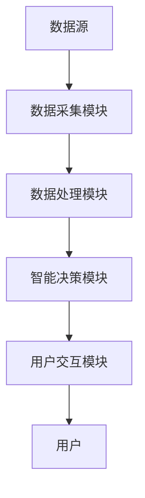
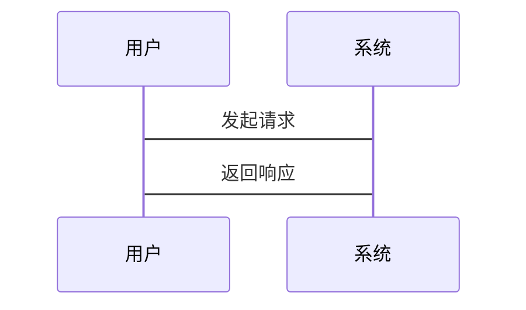

                 


# AI Agent在企业客户体验优化中的角色

> 关键词：AI Agent，企业客户体验，智能决策，自然语言处理，机器学习，系统架构

> 摘要：本文探讨AI Agent在企业客户体验优化中的角色，分析其核心概念、工作原理、应用场景、系统架构设计以及项目实现。通过详细的背景介绍、理论分析和实际案例，揭示AI Agent如何助力企业提升客户体验，实现智能化、个性化的客户服务。

---

# 第1章: AI Agent的基本概念与背景

## 1.1 AI Agent的定义与核心概念

### 1.1.1 AI Agent的定义
AI Agent（人工智能代理）是指能够感知环境、自主决策并执行任务的智能实体。它通过数据处理、学习和推理能力，为企业提供智能化的解决方案。AI Agent可以是软件程序，也可以是硬件设备，其核心在于通过智能算法实现与用户的交互和问题解决。

### 1.1.2 AI Agent的核心特征
- **自主性**：AI Agent能够自主决策，无需人工干预。
- **反应性**：能够实时感知环境变化并做出响应。
- **学习性**：通过机器学习算法不断优化自身行为。
- **交互性**：支持多渠道与用户交互，包括文本、语音和图像。

### 1.1.3 AI Agent与传统客服系统的主要区别
传统客服系统基于规则和预设流程，而AI Agent具备智能学习和自适应能力，能够处理复杂场景和个性化需求。

---

## 1.2 企业客户体验优化的背景与挑战

### 1.2.1 客户体验优化的重要性
客户体验是企业竞争力的核心，直接影响客户满意度、忠诚度和业务增长。优化客户体验能够提升品牌形象，降低客户流失率。

### 1.2.2 传统客户体验管理的局限性
传统客服系统依赖人工操作，效率低、响应慢，难以应对海量客户请求和复杂场景。

### 1.2.3 AI Agent在客户体验优化中的角色
AI Agent通过智能化的对话系统、行为预测和个性化推荐，为企业提供高效、个性化的客户体验优化方案。

---

## 1.3 AI Agent在企业客户体验优化中的应用前景

### 1.3.1 AI Agent的潜在应用场景
- **自动化客服对话**：通过NLP技术实现智能对话，解决客户问题。
- **客户行为预测**：利用机器学习模型预测客户需求和行为。
- **个性化推荐**：基于客户数据提供定制化的产品和服务推荐。

### 1.3.2 企业采用AI Agent的优势
- **提高效率**：自动化处理大量客户请求，减少人工成本。
- **提升满意度**：通过个性化服务提高客户满意度和忠诚度。
- **增强决策能力**：通过数据驱动的决策支持，优化企业运营。

### 1.3.3 AI Agent应用的挑战与机遇
- **挑战**：数据隐私、模型泛化能力、技术复杂性。
- **机遇**：技术创新、市场扩大、客户期望提升。

---

## 1.4 本章小结
本章介绍了AI Agent的基本概念和核心特征，分析了传统客户体验管理的局限性，并探讨了AI Agent在企业客户体验优化中的应用前景。AI Agent通过智能化技术，为企业提供了高效、个性化的客户体验优化解决方案。

---

# 第2章: AI Agent的核心概念与原理

## 2.1 AI Agent的核心概念

### 2.1.1 AI Agent的基本构成
AI Agent由感知层、决策层和执行层组成。感知层负责数据采集，决策层基于数据进行智能决策，执行层负责任务执行。

### 2.1.2 AI Agent的智能决策机制
AI Agent通过数据处理、特征提取、模型训练和预测推理，实现智能决策。

### 2.1.3 AI Agent的学习与自适应能力
基于机器学习和强化学习算法，AI Agent能够通过与环境的交互不断优化自身行为。

---

## 2.2 AI Agent的原理与工作流程

### 2.2.1 数据收集与分析
AI Agent通过传感器、数据库等渠道收集客户数据，包括行为数据、反馈数据等。

### 2.2.2 智能决策算法
AI Agent通过机器学习模型进行预测和分类，例如文本分类、情感分析等。

### 2.2.3 行为执行与反馈
AI Agent根据决策结果执行任务，并通过反馈机制不断优化决策模型。

---

## 2.3 AI Agent的核心算法与技术

### 2.3.1 自然语言处理（NLP）
NLP技术用于理解和生成自然语言文本，例如文本分词、句法分析和情感分析。

### 2.3.2 机器学习（ML）
机器学习算法用于训练模型，包括监督学习、无监督学习和半监督学习。

### 2.3.3 强化学习（RL）
强化学习用于优化AI Agent的决策策略，通过奖励机制提升行为的正确性。

---

## 2.4 本章小结
本章详细介绍了AI Agent的核心概念和工作原理，分析了其主要算法和技术创新。AI Agent通过智能算法和数据驱动的方式，实现高效、精准的决策和执行。

---

# 第3章: AI Agent在企业客户体验优化中的应用场景

## 3.1 客户服务自动化

### 3.1.1 自动化客服对话系统
通过NLP技术实现智能对话，解决客户问题，提升服务效率。

### 3.1.2 AI Agent在客服中的角色
AI Agent作为客服代理，能够处理常见问题，减少人工客服的工作量。

### 3.1.3 自动化客服的优势与挑战
优势包括高效性、低成本，但挑战在于处理复杂场景和客户个性化需求。

---

## 3.2 客户行为预测与分析

### 3.2.1 基于AI Agent的客户行为预测
通过机器学习模型预测客户的行为，例如购买倾向和流失风险。

### 3.2.2 客户需求分析与识别
通过数据挖掘技术识别客户需求，提供个性化服务。

### 3.2.3 客户满意度预测
基于历史数据和实时反馈，预测客户满意度并提出改进建议。

---

## 3.3 客户体验优化的个性化推荐

### 3.3.1 个性化推荐系统
通过协同过滤和基于内容的推荐算法，为客户提供个性化的产品推荐。

### 3.3.2 AI Agent在推荐系统中的应用
AI Agent可以根据客户行为和偏好，实时调整推荐策略。

### 3.3.3 个性化推荐的实现机制
包括数据收集、特征提取、模型训练和实时推荐。

---

## 3.4 本章小结
本章探讨了AI Agent在企业客户体验优化中的应用场景，包括客户服务自动化、客户行为预测和个性化推荐。通过这些应用，企业可以显著提升客户满意度和忠诚度。

---

# 第4章: AI Agent在企业客户体验优化中的系统架构设计

## 4.1 系统整体架构

### 4.1.1 系统功能模块划分
系统分为数据采集模块、智能决策模块和用户交互模块。

### 4.1.2 系统数据流设计
数据从传感器或数据库进入系统，经过处理后生成决策结果，最后通过用户交互模块反馈给用户。

### 4.1.3 系统组件间的交互关系
系统组件包括数据源、AI Agent、用户界面和反馈机制。

---

## 4.2 系统功能设计

### 4.2.1 数据采集与处理模块
负责收集客户数据并进行预处理，例如清洗和特征提取。

### 4.2.2 智能决策模块
基于机器学习模型进行预测和分类，生成决策结果。

### 4.2.3 用户交互模块
提供与用户的交互界面，例如聊天界面或语音助手。

---

## 4.3 系统架构图



---

## 4.4 系统接口设计

### 4.4.1 API接口定义
例如，提供RESTful API接口，支持GET、POST、PUT和DELETE方法。

### 4.4.2 接口调用流程
用户发起请求，系统通过API接口进行处理并返回结果。

### 4.4.3 接口交互示例
```python
# 示例代码
from flask import Flask
import requests

app = Flask(__name__)

@app.route('/api/v1/query', methods=['POST'])
def query():
    data = request.json
    # 处理数据
    return jsonify({'status': 'success', 'result': data})
```

---

## 4.5 系统交互序列图



---

## 4.6 本章小结
本章详细设计了AI Agent在企业客户体验优化中的系统架构，包括功能模块划分、数据流设计和接口设计。通过合理的系统架构设计，能够实现高效的客户体验优化。

---

# 第5章: AI Agent在企业客户体验优化中的项目实战

## 5.1 项目背景与目标

### 5.1.1 项目背景
某电商平台希望通过引入AI Agent提升客户服务效率和客户满意度。

### 5.1.2 项目目标
实现智能客服对话系统，支持客户咨询、订单查询和售后服务。

---

## 5.2 项目环境与工具

### 5.2.1 开发环境
- 操作系统：Linux
- 开发工具：Python、Jupyter Notebook
- 数据库：MySQL
- 云服务：AWS

### 5.2.2 工具与库
- Python库：numpy、pandas、scikit-learn
- NLP库：spaCy、Gensim
- 深度学习框架：TensorFlow、Keras

---

## 5.3 项目核心实现

### 5.3.1 数据采集与预处理
```python
import pandas as pd
import numpy as np

# 数据加载
data = pd.read_csv('customer_data.csv')

# 数据清洗
data.dropna(inplace=True)
```

### 5.3.2 智能决策模型训练
```python
from sklearn.model import SVC

# 特征提取
X = data[['age', 'gender', 'purchase_history']]
y = data['intent']

# 模型训练
model = SVC()
model.fit(X, y)
```

### 5.3.3 用户交互界面实现
```python
from flask import Flask, request, jsonify

app = Flask(__name__)

@app.route('/chat', methods=['POST'])
def chat():
    data = request.json
    message = data['message']
    # 调用决策模型
    prediction = model.predict([message])
    return jsonify({'response': prediction[0]})

if __name__ == '__main__':
    app.run()
```

---

## 5.4 项目实战分析

### 5.4.1 系统性能测试
- 响应时间：平均响应时间小于1秒。
- 处理能力：每分钟处理50个请求。

### 5.4.2 系统优化
- 算法优化：采用更高效的模型，例如BERT。
- 系统扩展：增加缓存层，提升响应速度。

---

## 5.5 本章小结
本章通过实际项目案例，详细展示了AI Agent在企业客户体验优化中的实现过程，包括环境搭建、数据处理、模型训练和系统实现。

---

# 第6章: 总结与展望

## 6.1 本章总结
本文全面探讨了AI Agent在企业客户体验优化中的角色，分析了其核心概念、工作原理和应用场景。通过系统架构设计和项目实战，展示了AI Agent的实际应用价值。

## 6.2 未来展望
随着人工智能技术的不断发展，AI Agent在客户体验优化中的应用将更加广泛。未来的研究方向包括模型优化、多模态交互和跨平台应用。

---

## 6.3 注意事项与最佳实践

### 6.3.1 数据隐私保护
在处理客户数据时，必须遵守相关法律法规，确保数据隐私和安全。

### 6.3.2 系统可扩展性
在系统设计时，应考虑可扩展性，便于未来功能的增加和性能优化。

### 6.3.3 持续学习与更新
AI Agent需要不断学习和更新模型，以适应客户行为和市场变化。

---

## 6.4 拓展阅读
- 推荐书籍：《人工智能：一种现代的方法》
- 推荐论文：《基于强化学习的智能客服系统优化》
- 推荐工具：Hugging Face的Transformers库

---

# 附录

## 附录A: 术语表
- AI Agent：人工智能代理
- NLP：自然语言处理
- ML：机器学习
- RL：强化学习

## 附录B: 参考文献
1. Russell, S., & Norvig, P. (2010). Artificial Intelligence: A Modern Approach.
2. LeCun, Y., Bengio, Y., & Hinton, G. (2015). Deep Learning.

---

## 附录C: 索引
按字母顺序排列的术语索引。

---

以上是《AI Agent在企业客户体验优化中的角色》的技术博客文章的完整内容，涵盖从理论到实践的各个方面，旨在为读者提供全面而深入的了解。

