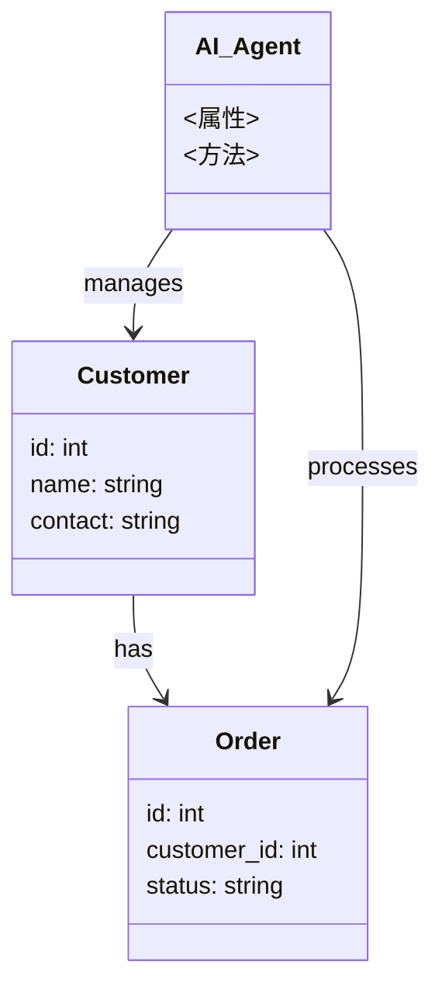
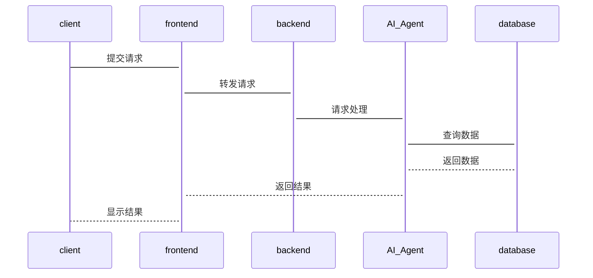

                 


# AI Agent在企业客户服务自动化中的角色

## 关键词：AI Agent, 企业客户, 服务自动化, 自然语言处理, 机器学习, 系统架构

## 摘要：  
随着人工智能技术的快速发展，AI Agent（人工智能代理）在企业客户服务自动化中的角色日益重要。本文将详细探讨AI Agent的核心概念、技术原理、系统架构及实际应用，揭示其在提升客户服务质量、降低企业运营成本和提高效率方面的重要价值。

---

# 第一部分：AI Agent在企业客户服务自动化中的背景与概念

## 第1章：AI Agent的基本概念与应用背景

### 1.1 AI Agent的定义与核心特征

#### 1.1.1 什么是AI Agent？
AI Agent是一种智能代理系统，能够通过感知环境、理解用户需求并执行相应操作来提供服务。它具备自主性、反应性、目标导向和社交能力等特征。

#### 1.1.2 AI Agent的核心特征
- **自主性**：AI Agent能够独立执行任务，无需人工干预。
- **反应性**：能够实时感知环境变化并做出响应。
- **目标导向**：以实现特定目标为导向，优化决策过程。
- **社交能力**：能够与人类或其他系统进行有效交互。

#### 1.1.3 AI Agent与传统自动化的区别
| 特性 | AI Agent | 传统自动化 |
|------|----------|------------|
| 决策能力 | 强大，基于数据和模型 | 简单，基于固定规则 |
| 学习能力 | 具备机器学习能力 | 无学习能力 |
| 适应性 | 能够自适应环境变化 | 固定流程，难以调整 |

### 1.2 企业客户服务自动化的现状与挑战

#### 1.2.1 传统客户服务模式的局限性
- 响应速度慢，人工成本高。
- 服务质量不稳定，受员工情绪影响。
- 难以实现个性化服务。

#### 1.2.2 企业客户服务自动化的必要性
- 提高客户满意度和忠诚度。
- 降低企业运营成本。
- 支持24/7的全天候服务。

#### 1.2.3 AI Agent在客户服务自动化中的优势
- 智能对话处理，提供个性化服务。
- 实时数据分析，快速响应客户需求。
- 自动处理复杂问题，减少人工干预。

## 第2章：AI Agent在企业客户服务中的角色与价值

### 2.1 AI Agent在客户服务中的主要角色

#### 2.1.1 客户支持自动化
AI Agent可以自动处理客户咨询、问题解决和投诉处理，减少人工客服的工作量。

#### 2.1.2 客户行为预测与分析
通过分析客户数据，AI Agent能够预测客户行为，提前预防潜在问题。

#### 2.1.3 客户关系管理优化
AI Agent帮助优化客户关系管理，提升客户满意度和忠诚度。

### 2.2 AI Agent对企业价值的影响

#### 2.2.1 提高客户满意度
通过智能化服务，客户能够获得更快捷、精准的支持。

#### 2.2.2 降低企业运营成本
自动化处理减少了人工成本，提高了服务效率。

#### 2.2.3 提升服务效率
AI Agent能够快速响应客户需求，显著提高服务效率。

---

# 第二部分：AI Agent的核心原理与技术实现

## 第3章：AI Agent的核心原理

### 3.1 AI Agent的感知机制

#### 3.1.1 数据采集与处理
AI Agent通过传感器、数据库等渠道采集数据，并进行预处理。

#### 3.1.2 自然语言处理技术
- **分词**：将文本分割成词语或短语。
- **句法分析**：分析句子的语法结构。
- **语义理解**：理解文本的含义。

#### 3.1.3 数据分析与模式识别
利用机器学习算法，分析数据中的模式和趋势。

### 3.2 AI Agent的决策机制

#### 3.2.1 问题分析与解决方案生成
AI Agent通过分析问题，生成多种解决方案，并评估其优劣。

#### 3.2.2 基于规则的决策系统
- 定义明确的规则，如“如果A，则B”。
- 适用于简单场景，规则易于维护。

#### 3.2.3 基于机器学习的决策系统
- 使用训练数据，学习决策模型。
- 适用于复杂场景，能够处理非结构化数据。

### 3.3 AI Agent的执行机制

#### 3.3.1 动作规划与执行
AI Agent根据决策结果，规划并执行相应动作。

#### 3.3.2 状态反馈与优化
通过反馈机制，优化AI Agent的行为策略。

#### 3.3.3 异常处理与容错机制
设计容错机制，处理执行过程中的异常情况。

## 第4章：AI Agent的关键技术与算法

### 4.1 自然语言处理技术

#### 4.1.1 词袋模型
将文本表示为词袋，忽略词语顺序。
示例代码：
```python
from sklearn.feature_extraction.text import CountVectorizer
vectorizer = CountVectorizer()
X = vectorizer.fit_transform(corpus)
```

#### 4.1.2 TF-IDF算法
计算词语在文档中的重要性。
公式：
$$TF-IDF(t, d) = TF(t, d) \times IDF(t)$$

#### 4.1.3 深度学习在NLP中的应用
使用神经网络模型，如LSTM和Transformer。
示例代码：
```python
import tensorflow as tf
model = tf.keras.Sequential([
    tf.keras.layers.Embedding(input_dim=10000, output_dim=50),
    tf.keras.layers.LSTM(64),
    tf.keras.layers.Dense(1, activation='sigmoid')
])
model.compile(optimizer='adam', loss='binary_crossentropy', metrics=['accuracy'])
```

### 4.2 机器学习算法

#### 4.2.1 监督学习
基于标记数据进行学习，如分类和回归。

#### 4.2.2 无监督学习
基于未标记数据进行学习，如聚类和降维。

#### 4.2.3 强化学习
通过试错机制，学习最优策略。

### 4.3 知识图谱与推理

#### 4.3.1 知识图谱构建
使用图结构表示知识，如实体和关系。
示例：
- 实体：Customer, Order
- 关系：Customer placed Order

#### 4.3.2 基于图的推理算法
通过图遍历进行推理，如深度优先搜索和广度优先搜索。

---

# 第三部分：AI Agent的系统分析与架构设计

## 第5章：系统分析与架构设计方案

### 5.1 问题场景介绍
企业客户服务平台需要高效处理大量客户需求，提升客户满意度。

### 5.2 项目介绍
设计一个基于AI Agent的企业客户服务平台，实现智能化客服支持。

### 5.3 系统功能设计（领域模型）



### 5.4 系统架构设计

```mermaid
docker
client
  frontend
  backend
    database
    AI_Agent
  notification
```

### 5.5 系统接口设计
- **客户请求接口**：API Gateway接收客户请求。
- **AI Agent接口**：处理请求并返回响应。
- **数据库接口**：存储和检索数据。

### 5.6 系统交互设计



---

# 第四部分：AI Agent的项目实战

## 第6章：项目实战

### 6.1 环境配置

#### 6.1.1 安装Python和必要的库
```bash
pip install numpy pandas scikit-learn tensorflow
```

### 6.2 核心代码实现

#### 6.2.1 自然语言处理部分
```python
import numpy as np
from sklearn.feature_extraction.text import TfidfVectorizer

texts = ["This is a sample text.", "Another example text."]
vectorizer = TfidfVectorizer()
X = vectorizer.fit_transform(texts)
print(X.toarray())
```

#### 6.2.2 机器学习模型训练
```python
from sklearn.model_selection import train_test_split
from sklearn.linear_model import LogisticRegression

X_train, X_test, y_train, y_test = train_test_split(X, labels)
model = LogisticRegression().fit(X_train, y_train)
print("Accuracy:", model.score(X_test, y_test))
```

### 6.3 案例分析与总结
通过实际案例，展示AI Agent在客户支持中的应用，分析其效果和改进空间。

---

# 第五部分：AI Agent的最佳实践与小结

## 第7章：最佳实践

### 7.1 小结
总结AI Agent在企业客户服务自动化中的应用价值和优势。

### 7.2 注意事项
- 数据质量对AI Agent性能至关重要。
- 需要定期更新模型，以适应环境变化。
- 设计容错机制，确保系统稳定性。

### 7.3 拓展阅读
推荐相关书籍和资源，供读者深入学习。

---

# 结语

通过本文的详细讲解，读者可以全面了解AI Agent在企业客户服务自动化中的角色与价值。AI Agent不仅能够提高客户满意度和企业效率，还能推动企业数字化转型，成为未来客户服务的重要工具。

