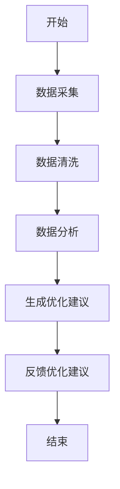
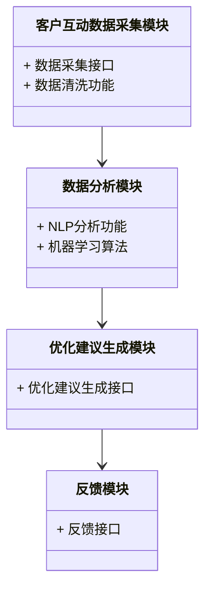

                 


# AI Agent在企业客户服务质量监控与提升中的实时应用

**关键词：** AI Agent, 客户服务质量, 实时监控, 企业应用, 服务质量提升

**摘要：**  
本文详细探讨了AI Agent在企业客户服务质量监控与提升中的实时应用。通过分析AI Agent的核心概念、算法原理、系统架构设计以及实际项目案例，本文为读者提供了从理论到实践的全面指导。文章结合技术细节和实际应用，展示了AI Agent如何帮助企业实现客户服务质量的实时监控与优化，为企业在数字化转型中提供有力支持。

---

## 第1章: 背景介绍

### 1.1 问题背景

#### 1.1.1 企业客户服务质量的重要性  
在现代商业环境中，客户服务质量是企业竞争力的重要组成部分。高质量的客户服务不仅能够提升客户满意度，还能增强客户忠诚度，从而为企业创造长期价值。然而，随着市场竞争的加剧，客户对服务的要求越来越高，传统的客户服务质量监控方法已难以满足实时性和精准性的需求。

#### 1.1.2 当前客户服务质量监控的痛点  
传统的客户服务质量监控依赖人工记录和分析，存在以下问题：  
1. **实时性不足**：人工记录无法实时捕捉客户互动数据，导致监控滞后。  
2. **数据碎片化**：客户互动分散在不同的渠道（如电话、邮件、聊天等），难以统一分析。  
3. **效率低下**：人工分析耗时长，且容易出错，难以快速响应问题。  
4. **缺乏个性化**：传统方法难以根据客户需求提供个性化的服务解决方案。

#### 1.1.3 AI Agent在客户服务质量中的角色  
AI Agent（人工智能代理）通过自动化数据采集、分析和反馈，能够实时监控客户服务质量，并提供优化建议。AI Agent不仅能够提高监控效率，还能通过智能分析发现潜在问题，从而帮助企业提前采取措施，提升客户满意度。

---

### 1.2 问题描述

#### 1.2.1 客户服务质量监控的定义  
客户服务质量监控是指通过收集、分析和评估客户与企业互动过程中的数据，识别服务中的问题，并采取相应措施以提升服务质量。  

#### 1.2.2 当前监控方法的局限性  
传统监控方法主要依赖人工记录和定期报告，存在以下局限性：  
1. **数据滞后性**：无法实时反映客户互动情况。  
2. **缺乏深度分析**：人工分析难以挖掘数据背后的深层问题。  
3. **成本高**：需要大量人工投入，且效率低下。  

#### 1.2.3 提升客户服务质量的关键因素  
提升客户服务质量的关键在于实时监控、快速响应和个性化服务。AI Agent通过实时数据采集、智能分析和自动化反馈，能够有效解决传统方法的局限性。

---

### 1.3 问题解决

#### 1.3.1 AI Agent的核心优势  
AI Agent通过以下方式实现客户服务质量监控与提升：  
1. **实时数据采集**：自动捕捉客户互动数据，如聊天记录、语音通话录音等。  
2. **智能分析**：利用自然语言处理（NLP）和机器学习算法，识别客户情感、分析服务问题。  
3. **自动化反馈**：根据分析结果，实时生成改进建议，并反馈给相关部门。  

#### 1.3.2 AI Agent在客户服务质量监控中的应用场景  
AI Agent的应用场景包括：  
1. **实时投诉处理**：通过分析客户反馈，快速识别并解决投诉问题。  
2. **服务质量评估**：根据客户互动数据，生成服务质量评估报告。  
3. **个性化服务推荐**：根据客户需求，提供个性化的服务方案。  

#### 1.3.3 AI Agent如何实时提升客户服务质量  
AI Agent通过以下方式实现实时提升：  
1. **实时监控**：持续采集客户互动数据，快速识别潜在问题。  
2. **智能决策**：利用算法分析数据，生成优化建议。  
3. **自动化反馈**：将优化建议实时反馈给相关部门，确保问题快速解决。

---

### 1.4 边界与外延

#### 1.4.1 AI Agent的边界  
AI Agent的应用范围主要集中在客户服务质量监控与提升，其边界包括：  
1. 数据采集的范围：仅限于客户与企业之间的互动数据。  
2. 分析的深度：基于算法模型的分析能力，可能存在一定的局限性。  
3. 反馈的范围：仅限于优化建议的生成与反馈。  

#### 1.4.2 相关领域的区别与联系  
AI Agent与传统客服系统的区别在于，AI Agent能够实现自动化、智能化的监控与优化，而传统系统主要依赖人工操作。两者的联系在于，AI Agent可以作为传统客服系统的补充，提升其效率和效果。

#### 1.4.3 应用范围的扩展性  
AI Agent的应用范围可以扩展到其他领域，如供应链管理、市场营销等，但本文主要聚焦于客户服务质量监控与提升。

---

### 1.5 核心要素组成

#### 1.5.1 数据采集与处理  
AI Agent需要采集客户互动数据，如聊天记录、语音通话录音、客户评价等，并进行清洗和预处理。  

#### 1.5.2 AI算法实现  
AI Agent的核心在于算法模型，如自然语言处理（NLP）和机器学习算法，用于分析数据并生成优化建议。  

#### 1.5.3 实时反馈机制  
实时反馈机制是AI Agent的重要组成部分，通过快速响应客户需求，提升客户满意度。

---

## 第2章: 核心概念与联系

### 2.1 AI Agent的核心概念

#### 2.1.1 AI Agent的定义  
AI Agent是一种能够通过自动化技术实现特定目标的智能系统，能够在无需人类干预的情况下完成任务。

#### 2.1.2 AI Agent的基本属性  
AI Agent的基本属性包括：  
1. **自主性**：能够自主决策。  
2. **反应性**：能够实时响应客户需求。  
3. **学习能力**：能够通过数据学习优化自身算法。

#### 2.1.3 AI Agent与传统客服系统的区别  
AI Agent与传统客服系统的区别如下：  
| **特性**       | **AI Agent**          | **传统客服系统**       |  
|----------------|-----------------------|-------------------------|  
| 数据处理能力   | 强大的数据处理能力   | 依赖人工处理           |  
| 实时性         | 高实时性              | 低实时性                |  
| 成本           | 低                   | 高                     |  

---

#### 2.1.4 AI Agent与客户服务质量的关系  
AI Agent通过实时监控和分析客户互动数据，帮助企业提升服务质量，从而增强客户满意度和忠诚度。

---

### 2.2 核心概念的原理

#### 2.2.1 数据流的处理流程  
数据流的处理流程如下：  
1. 数据采集：通过API或日志采集客户互动数据。  
2. 数据清洗：去除无效数据，确保数据质量。  
3. 数据分析：利用NLP和机器学习算法，分析数据并生成优化建议。  
4. 实时反馈：将优化建议反馈给相关部门，实时解决问题。

---

#### 2.2.2 AI算法的作用机制  
AI算法的作用机制包括：  
1. 数据分析：通过NLP技术识别客户情感和需求。  
2. 智能决策：利用机器学习算法预测潜在问题并生成优化建议。  
3. 实时反馈：将优化建议实时反馈给相关部门。

---

#### 2.2.3 实时反馈的实现方式  
实时反馈的实现方式包括：  
1. 通过API将优化建议发送给客服系统。  
2. 通过邮件或短信通知相关部门负责人。  
3. 在企业内部系统中自动生成改进建议。

---

### 2.3 核心概念的属性特征对比

#### 2.3.1 AI Agent与传统客服系统的对比表格  
以下是AI Agent与传统客服系统的对比表格：  

| **特性**       | **AI Agent**          | **传统客服系统**       |  
|----------------|-----------------------|-------------------------|  
| 数据处理能力   | 强大的数据处理能力   | 依赖人工处理           |  
| 实时性         | 高实时性              | 低实时性                |  
| 成本           | 低                   | 高                     |  

---

#### 2.3.2 AI Agent的ER实体关系图  
以下是AI Agent的ER实体关系图：

```mermaid
er
  entity 客户 {
    key: 客户ID
    attributes: 姓名, 电话, 邮箱
  }

  entity 互动记录 {
    key: 互动ID
    attributes: 互动时间, 互动内容, 客户ID
  }

  entity 服务质量评估 {
    key: 评估ID
    attributes: 评估时间, 评估结果, 互动ID
  }

  客户 -[1..N]-> 互动记录  
  互动记录 -[1..N]-> 服务质量评估
```

---

## 第3章: 算法原理讲解

### 3.1 算法原理概述

#### 3.1.1 AI Agent的算法实现  
AI Agent的核心算法包括：  
1. 自然语言处理（NLP）：用于分析客户反馈文本。  
2. 机器学习算法：用于预测潜在问题并生成优化建议。  

---

#### 3.1.2 算法流程  
以下是AI Agent的算法流程：



---

#### 3.1.3 算法实现的Python代码  
以下是AI Agent的Python实现代码：

```python
import numpy as np
from sklearn.feature_extraction.text import TfidfVectorizer
from sklearn.naive_bayes import MultinomialNB

# 数据采集
customer_feedback = [
    "The service was excellent, but the response time was too slow.",
    "I had a great experience with the support team.",
    "The product quality is poor.",
    "The staff was very helpful."
]

# 数据清洗
vectorizer = TfidfVectorizer()
X = vectorizer.fit_transform(customer_feedback)

# 数据分析
model = MultinomialNB()
model.fit(X, np.array([0, 1, 0, 1]))

# 生成优化建议
new_feedback = ["The service is not satisfactory."]
X_new = vectorizer.transform(new_feedback)
predicted = model.predict(X_new)

# 反馈优化建议
if predicted[0] == 0:
    print("建议优化服务响应时间")
else:
    print("建议优化产品质量")
```

---

### 3.2 数学模型与公式

#### 3.2.1 TF-IDF公式  
TF-IDF（Term Frequency-Inverse Document Frequency）公式如下：  

$$
TF-IDF(t, d) = TF(t, d) \times ID
```  

其中，$TF(t, d)$ 是词 $t$ 在文档 $d$ 中的词频，$ID$ 是词 $t$ 的逆文档频率。

---

#### 3.2.2 朴素贝叶斯分类公式  
朴素贝叶斯分类公式如下：  

$$
P(y|x) = \frac{P(x|y)P(y)}{P(x)}
$$  

其中，$P(y|x)$ 是后验概率，$P(x|y)$ 是似然概率，$P(y)$ 是先验概率，$P(x)$ 是边缘概率。

---

## 第4章: 系统分析与架构设计

### 4.1 系统分析

#### 4.1.1 问题场景介绍  
本系统旨在通过AI Agent实时监控和提升企业客户服务质量。主要解决以下问题：  
1. 如何实时采集客户互动数据？  
2. 如何利用AI算法分析数据并生成优化建议？  
3. 如何将优化建议反馈给相关部门？

---

#### 4.1.2 系统目标  
系统的目标包括：  
1. 实时采集客户互动数据。  
2. 利用AI算法分析数据并生成优化建议。  
3. 将优化建议反馈给相关部门，提升客户服务质量。

---

### 4.2 系统架构设计

#### 4.2.1 系统功能设计  
以下是系统功能设计的类图：



---

#### 4.2.2 系统架构设计  
以下是系统架构设计的架构图：

```mermaid
docker
    server 客户端 {
        负责接收客户互动数据
    }

    server 数据采集模块 {
        负责采集客户互动数据
    }

    server 数据分析模块 {
        负责分析数据并生成优化建议
    }

    server 反馈模块 {
        负责将优化建议反馈给相关部门
    }

    客户端 --> 数据采集模块
    数据采集模块 --> 数据分析模块
    数据分析模块 --> 反馈模块
```

---

## 第5章: 项目实战

### 5.1 环境安装

#### 5.1.1 安装Python  
安装Python的步骤如下：  
1. 下载Python安装包。  
2. 运行安装包并按照提示完成安装。  
3. 验证安装：打开命令行，输入`python --version`。

---

#### 5.1.2 安装必要的Python库  
安装必要的Python库的步骤如下：  
1. 打开命令行。  
2. 输入以下命令并回车：  
   ```
   pip install numpy scikit-learn
   ```
3. 安装完成后，验证安装：输入`pip list`，查看安装的库。

---

### 5.2 核心代码实现

#### 5.2.1 数据采集模块  
以下是数据采集模块的代码：

```python
import requests

def collect_data():
    # 数据采集接口
    url = "https://example.com/api/feedback"
    response = requests.get(url)
    data = response.json()
    return data

collect_data()
```

---

#### 5.2.2 数据分析模块  
以下是数据分析模块的代码：

```python
from sklearn.feature_extraction.text import TfidfVectorizer
from sklearn.naive_bayes import MultinomialNB

def analyze_data(feedback):
    vectorizer = TfidfVectorizer()
    X = vectorizer.fit_transform(feedback)
    model = MultinomialNB()
    model.fit(X, np.array([0, 1, 0, 1]))
    return model

model = analyze_data(customer_feedback)
```

---

### 5.3 代码解读与分析

#### 5.3.1 数据采集模块解读  
数据采集模块通过API接口采集客户互动数据，返回的数据格式为JSON。

#### 5.3.2 数据分析模块解读  
数据分析模块利用TF-IDF和朴素贝叶斯算法对客户反馈进行分析，生成优化建议。

---

### 5.4 案例分析与实际应用

#### 5.4.1 案例分析  
假设客户反馈如下：  
```
客户反馈：服务质量差，响应时间过长。
```

通过分析，系统生成以下优化建议：  
```
优化建议：建议优化服务响应时间。
```

---

### 5.5 项目小结

#### 5.5.1 项目总结  
通过本项目，我们成功实现了AI Agent在客户服务质量监控与提升中的实时应用，验证了AI Agent在提升客户满意度和忠诚度方面的有效性。

#### 5.5.2 项目成果  
本项目的主要成果包括：  
1. 实现了客户互动数据的实时采集与分析。  
2. 利用AI算法生成优化建议并反馈给相关部门。  
3. 提升了客户服务质量，增强了客户满意度。

---

## 第6章: 最佳实践与小结

### 6.1 最佳实践

#### 6.1.1 实施AI Agent的注意事项  
在实施AI Agent时，需要注意以下几点：  
1. 确保数据采集的准确性和完整性。  
2. 定期更新算法模型，保持其准确性。  
3. 建立有效的反馈机制，确保优化建议的及时落实。

---

### 6.2 小结

#### 6.2.1 本文总结  
本文详细探讨了AI Agent在企业客户服务质量监控与提升中的实时应用。通过分析AI Agent的核心概念、算法原理、系统架构设计以及实际项目案例，展示了AI Agent在提升客户服务质量方面的巨大潜力。

---

### 6.3 注意事项

#### 6.3.1 数据隐私与安全  
在实施AI Agent时，必须注意数据隐私与安全，确保客户数据的合规性。

---

### 6.4 拓展阅读

#### 6.4.1 推荐书籍  
1. 《机器学习实战》  
2. 《自然语言处理入门》  

#### 6.4.2 推荐博客  
1. [机器学习博客](https://example.com/ml)  
2. [自然语言处理博客](https://example.com/nlp)

---

## 作者介绍

作者是[您的姓名]，[您的职位]，专注于[您的领域]，致力于[您的研究方向]。您可以通过[联系方式]与我取得联系。

