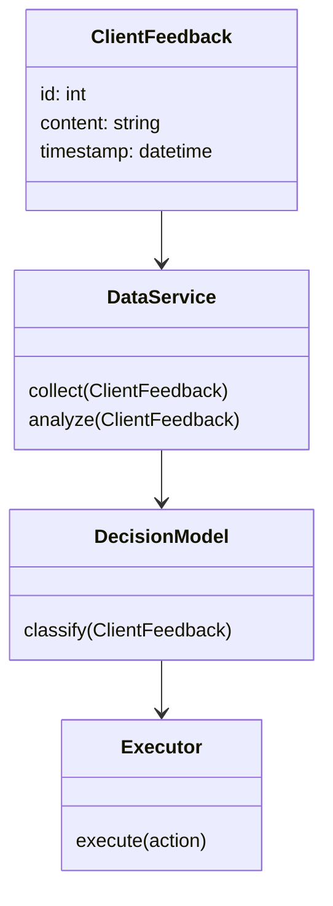
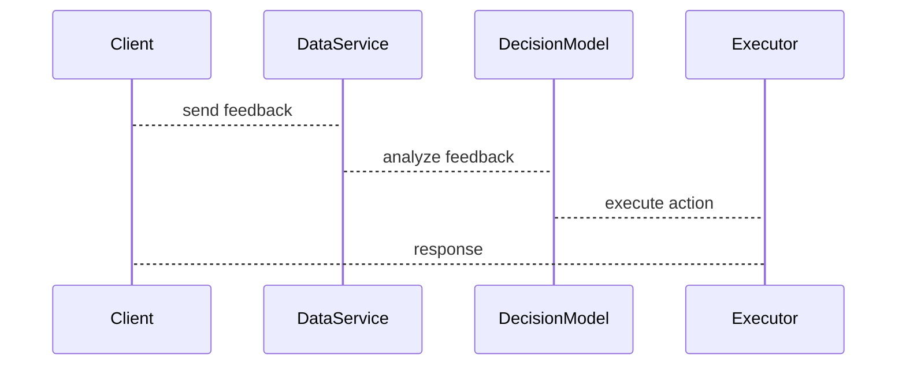

                 


# AI Agent在企业客户服务质量监控与提升中的角色

## 关键词：AI Agent，客户服务质量，企业，智能监控，服务质量提升，数据分析，智能优化

## 摘要：  
本文深入探讨了AI Agent在企业客户服务质量监控与提升中的核心作用。通过分析AI Agent的基本概念、核心原理、系统架构及实际应用场景，本文详细阐述了AI Agent如何通过智能化的数据分析、自动化的问题识别与解决，显著提升企业客户服务质量。同时，本文结合实际案例，展示了AI Agent在企业客户服务质量监控中的具体实现方法，并提出了未来的发展方向与优化建议。

---

# 第1章: AI Agent的定义与背景

## 1.1 AI Agent的基本概念

### 1.1.1 AI Agent的定义  
AI Agent（人工智能代理）是一种能够感知环境、自主决策并执行任务的智能实体。它能够通过数据输入、分析和处理，为企业的客户服务质量监控提供智能化支持。

### 1.1.2 AI Agent的核心属性  
AI Agent的核心属性包括：  
- **自主性**：能够在无需人工干预的情况下完成任务。  
- **反应性**：能够实时感知环境变化并做出响应。  
- **目标导向性**：以明确的目标为导向，优化客户服务质量。  
- **学习能力**：通过数据反馈不断优化自身的决策能力。  

### 1.1.3 AI Agent与传统客服系统的区别  
AI Agent与传统客服系统的主要区别在于：  
- **智能化程度**：AI Agent能够自主学习和优化，而传统客服系统依赖人工操作。  
- **效率**：AI Agent能够快速处理大量数据，显著提高效率。  
- **灵活性**：AI Agent能够适应复杂多变的客户需求，而传统客服系统灵活性较低。  

---

## 1.2 企业客户服务质量监控的现状与挑战

### 1.2.1 传统客户服务质量监控的痛点  
传统客户服务质量监控存在以下痛点：  
- **数据分散**：客户反馈数据分散在不同渠道，难以统一分析。  
- **效率低下**：人工监控需要大量时间，效率较低。  
- **缺乏智能化**：无法实时分析数据并提出优化建议。  

### 1.2.2 AI Agent在客户服务质量监控中的优势  
AI Agent在客户服务质量监控中的优势包括：  
- **实时性**：能够实时采集和分析客户反馈数据。  
- **精准性**：通过机器学习算法，能够精准识别客户问题并提出解决方案。  
- **可扩展性**：能够同时处理大量客户数据，并快速扩展至更多场景。  

### 1.2.3 企业客户服务质量监控的未来趋势  
未来的客户服务质量监控将更加依赖AI Agent技术，实现从被动响应到主动优化的转变。企业将通过AI Agent实现客户体验的全面提升，打造智能化的服务体系。

---

## 1.3 本章小结  

本章主要介绍了AI Agent的基本概念、核心属性及其与传统客服系统的区别，同时分析了企业客户服务质量监控的现状与挑战。通过对比，我们看到AI Agent在提升客户服务质量方面具有显著优势。

---

# 第2章: AI Agent的核心原理与算法

## 2.1 AI Agent的核心原理

### 2.1.1 数据采集与处理  
AI Agent通过多种渠道（如客服聊天记录、客户评价、投诉数据等）采集客户反馈数据，并进行清洗、归类和特征提取。

### 2.1.2 数据分析与特征提取  
通过自然语言处理（NLP）和机器学习算法，AI Agent能够从文本数据中提取情感倾向、关键词和问题类型等特征。

---

## 2.2 AI Agent的决策模块

### 2.2.1 基于规则的决策  
基于预设的规则（如关键词匹配），AI Agent能够快速识别客户问题类型并给出初步解决方案。

### 2.2.2 基于机器学习的决策  
通过训练分类模型，AI Agent能够从历史数据中学习客户问题的模式，从而更准确地识别问题并提出优化建议。

---

## 2.3 AI Agent的执行模块

### 2.3.1 动作规划与执行  
AI Agent根据决策结果生成相应的操作指令（如自动回复、派单处理等）。

### 2.3.2 执行结果的反馈与优化  
通过实时监控执行结果，AI Agent能够不断优化自身的决策模型，提高问题解决效率。

---

## 2.4 本章小结  

本章详细讲解了AI Agent的核心原理，包括数据采集与处理、数据分析与特征提取、基于规则和机器学习的决策过程，以及动作规划与执行的实现方式。

---

# 第3章: AI Agent的核心算法

## 3.1 状态空间与动作空间

### 3.1.1 状态空间的定义与表示  
状态空间表示AI Agent在某一时刻的所有可能状态，例如客户情绪、问题类型等。

### 3.1.2 动作空间的定义与表示  
动作空间表示AI Agent在给定状态下可以执行的所有动作，例如回复客户、派单处理等。

---

## 3.2 感知模型

### 3.2.1 感知模型的数学表达  
感知模型可以通过以下公式表示：  
$$ P(s) = f_{perception}(s) $$  
其中，$s$ 表示当前状态，$f_{perception}$ 表示感知函数。

### 3.2.2 感知模型的实现方式  
感知模型通过自然语言处理技术（如TF-IDF、Word2Vec）对客户反馈数据进行特征提取。

---

## 3.3 决策模型

### 3.3.1 基于规则的决策模型  
基于规则的决策模型通过预设规则对客户问题进行分类，例如：  
- 如果客户提到“延迟”，则标记为“物流问题”。  

### 3.3.2 基于机器学习的决策模型  
基于机器学习的决策模型通过训练分类器（如SVM、随机森林）对客户问题进行分类。

---

## 3.4 执行模型

### 3.4.1 执行模型的定义  
执行模型定义了AI Agent在给定状态下执行动作的具体策略。

### 3.4.2 执行模型的实现方式  
执行模型通过调用API或触发预设流程来执行动作，例如自动回复客户、派单给相关部门处理。

---

## 3.5 本章小结  

本章详细讲解了AI Agent的核心算法，包括状态空间、动作空间的定义与表示，感知模型、决策模型和执行模型的数学表达及实现方式。

---

# 第4章: AI Agent的系统架构与实现

## 4.1 系统需求分析

### 4.1.1 问题场景介绍  
本文以一家电商平台的客户服务质量监控为例，分析AI Agent的应用场景。

### 4.1.2 系统功能需求  
- 数据采集模块：采集客户反馈数据。  
- 数据分析模块：分析数据并提取特征。  
- 决策模块：根据特征提出优化建议。  
- 执行模块：根据建议执行相应操作。  

### 4.1.3 系统性能需求  
- 响应时间：≤ 5秒/请求。  
- 处理能力：支持每天10万条数据的处理。  

---

## 4.2 系统功能设计

### 4.2.1 领域模型  
领域模型是一个客户服务质量监控系统的类图，如图1所示：  



---

## 4.3 系统架构设计

### 4.3.1 系统架构  
系统架构采用分层设计，包括数据采集层、数据处理层、决策层和执行层。

### 4.3.2 系统架构图  
系统架构图如图2所示：  


---

## 4.4 系统接口设计

### 4.4.1 数据采集接口  
- 接口名称：`collect_feedback`  
- 请求参数：`client_id`, `content`, `timestamp`  
- 返回值：`status`  

### 4.4.2 决策接口  
- 接口名称：`classify_issue`  
- 请求参数：`content`  
- 返回值：`issue_type`  

---

## 4.5 系统交互流程

### 4.5.1 交互流程图  
系统交互流程图如图3所示：  



---

## 4.6 本章小结  

本章详细讲解了AI Agent的系统架构与实现，包括系统需求分析、功能设计、架构设计和接口设计等内容。

---

# 第5章: AI Agent的项目实战

## 5.1 环境安装

### 5.1.1 环境要求  
- 操作系统：Linux/Windows/MacOS  
- Python版本：3.6+  
- 依赖库：numpy、pandas、scikit-learn、tensorflow  

### 5.1.2 安装步骤  
1. 安装Python和pip。  
2. 执行命令：`pip install numpy pandas scikit-learn tensorflow`  

---

## 5.2 系统核心实现

### 5.2.1 数据采集模块  
```python
def collect_feedback(client_id, content, timestamp):
    # 实现数据采集逻辑
    pass
```

### 5.2.2 数据分析模块  
```python
def analyze_feedback(feedback_list):
    # 实现数据分析逻辑
    pass
```

### 5.2.3 决策模块  
```python
def classify_issue(feedback_content):
    # 实现分类逻辑
    pass
```

### 5.2.4 执行模块  
```python
def execute_action(action):
    # 实现执行逻辑
    pass
```

---

## 5.3 案例分析

### 5.3.1 案例背景  
某电商平台的客户反馈数据中，客户普遍反映“物流延迟”问题。

### 5.3.2 数据分析与决策  
通过数据分析模块，AI Agent识别出“物流延迟”问题占总投诉的40%。

### 5.3.3 动作执行  
AI Agent触发物流部门，优先处理相关订单。

---

## 5.4 项目总结  

本章通过实际案例展示了AI Agent在企业客户服务质量监控中的应用，详细讲解了系统核心功能的实现步骤和案例分析。

---

# 第6章: 最佳实践与未来展望

## 6.1 最佳实践

### 6.1.1 数据质量管理  
确保数据的完整性和准确性，避免因数据问题影响AI Agent的决策能力。

### 6.1.2 模型优化  
定期更新AI Agent的决策模型，确保其适应业务需求的变化。

### 6.1.3 人机协作  
AI Agent与人工客服结合使用，充分发挥各自的优点。

---

## 6.2 小结

AI Agent在企业客户服务质量监控与提升中具有巨大的潜力，通过不断优化算法和系统架构，AI Agent将为企业客户提供更高效、更智能的服务。

---

## 6.3 注意事项

- 数据隐私保护：确保客户数据的安全性和隐私性。  
- 系统稳定性：保证AI Agent系统的高可用性。  
- 人员培训：加强对AI Agent使用人员的培训，确保系统顺利运行。  

---

## 6.4 拓展阅读

- 《机器学习实战》  
- 《深度学习入门：基于Python的理论与实现》  
- 《自然语言处理入门：基于Python和TensorFlow》  

---

# 结语

通过本文的深入探讨，我们看到AI Agent在企业客户服务质量监控与提升中的重要作用。未来，随着AI技术的不断发展，AI Agent将为企业客户提供更智能化、更个性化的服务体验。

---

