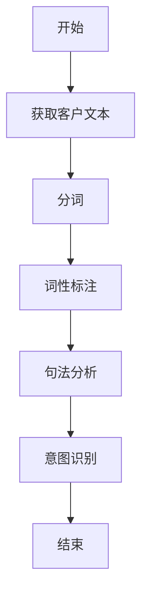
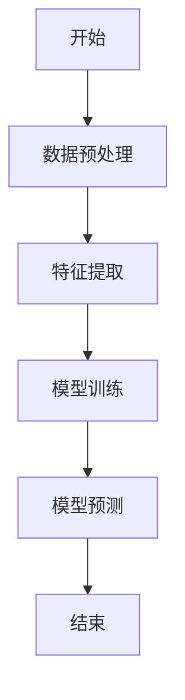
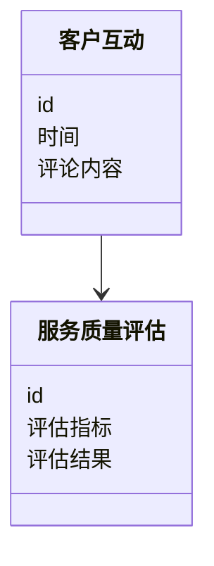
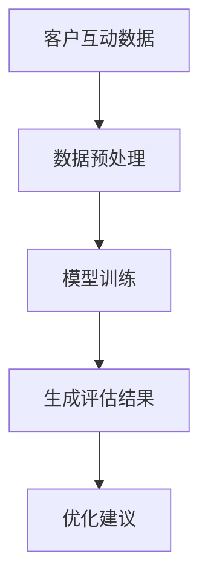

                 


# AI Agent在企业客户服务质量监控与智能升级中的角色

## 关键词：AI Agent, 客户服务质量, 智能升级, 自然语言处理, 机器学习, 客户体验

## 摘要：  
本文探讨了AI Agent在企业客户服务质量监控与智能升级中的角色，分析了传统客户服务质量监控的挑战，详细介绍了AI Agent的核心概念、算法原理、数学模型、系统架构及实际应用。通过案例分析和代码实现，展示了AI Agent如何利用自然语言处理和机器学习技术提升客户服务质量，为企业智能化升级提供解决方案。

---

# 第1章 背景介绍

## 1.1 问题背景

### 1.1.1 传统客户服务质量监控的挑战
- 数据量大：企业每天产生海量客户互动数据，人工分析效率低。
- 人工成本高：传统客服依赖人工监控，效率低下且容易出错。
- 主观性强：服务质量评估受主观因素影响，缺乏客观标准。

### 1.1.2 AI技术对企业客户服务质量提升的作用
- 自然语言处理（NLP）：识别客户情感和意图，分析评论。
- 机器学习：预测客户满意度，优化服务流程。
- 实时监控：快速响应客户问题，提升客户体验。

### 1.1.3 AI Agent在客户服务质量监控中的独特优势
- 自动化处理：实时分析客户数据，提供即时反馈。
- 高准确性：基于算法模型，评估服务质量客观。
- 智能升级：通过数据驱动优化服务流程。

## 1.2 问题描述

### 1.2.1 客户服务质量监控的定义与目标
- 定义：通过收集和分析客户互动数据，评估服务质量和客户满意度。
- 目标：识别问题，优化服务流程，提升客户忠诚度。

### 1.2.2 当前客户服务质量监控的主要问题
- 数据处理复杂：非结构化数据难以分析。
- 人工成本高：依赖人工检查，效率低。
- 主观因素影响：评估结果受主观因素干扰。

### 1.2.3 引入AI Agent的必要性
- 提高效率：自动化处理大量数据。
- 增强准确性：基于算法模型进行客观评估。
- 实时反馈：快速识别和解决客户问题。

## 1.3 问题解决与边界

### 1.3.1 AI Agent如何解决客户服务质量监控问题
- 数据处理：自动分类和分析客户反馈。
- 实时监控：快速识别负面评论。
- 智能优化：基于数据分析优化服务流程。

### 1.3.2 AI Agent的应用边界与外延
- 数据类型：支持结构化和非结构化数据。
- 应用场景：客户反馈分析、服务质量预测、服务流程优化。
- 边界：无法处理完全未知的客户行为模式。

### 1.3.3 核心概念与组成要素
- AI Agent：由感知层、决策层和执行层组成。
- 数据源：客户互动记录、评价数据。
- 服务质量指标：响应时间、问题解决率、客户满意度。

## 1.4 核心概念结构

### 1.4.1 AI Agent的基本构成
- 感知层：数据采集和预处理。
- 决策层：模型训练和评估。
- 执行层：生成反馈和优化建议。

### 1.4.2 客户服务质量监控的指标体系
- 响应时间：客户问题的平均响应时间。
- 解决率：问题解决的成功率。
- 满意度：客户对服务的满意度评分。

### 1.4.3 AI Agent与客户服务质量的关系
- AI Agent通过分析客户数据，提供实时反馈和优化建议，从而提升服务质量。

## 1.5 本章小结

---

# 第2章 AI Agent的核心概念与原理

## 2.1 AI Agent的定义与特征

### 2.1.1 AI Agent的定义
- AI Agent是一种能够感知环境、执行任务以实现目标的智能系统。

### 2.1.2 AI Agent的核心特征对比
| 特征         | 传统客服系统 | AI Agent |
|--------------|--------------|----------|
| 数据处理能力 | 有限         | 强大     |
| 决策能力     | 依赖人工     | 自动化   |
| 反应速度     | 较慢         | 实时     |

### 2.1.3 ER实体关系图
```mermaid
er
    title 实体关系图
    顾客
    服务记录
    服务质量评估
    顾客-服务记录: 1..n
    服务记录-服务质量评估: 1..1
```

## 2.2 AI Agent的工作原理

### 2.2.1 感知层：数据采集与处理
- 从客户互动数据中提取有用信息，包括文本、语音和图像。

### 2.2.2 计划层：决策与策略制定
- 基于分析结果制定优化策略，如调整响应时间。

### 2.2.3 执行层：行动与反馈
- 执行优化策略并生成反馈报告。

## 2.3 AI Agent与传统客服系统的区别

### 2.3.1 功能对比
- AI Agent具备自动化分析和优化功能，而传统系统依赖人工操作。

### 2.3.2 技术实现上的差异
- AI Agent使用NLP和机器学习，传统系统基于规则。

### 2.3.3 应用效果的对比
- AI Agent提升效率和准确性，传统系统效率低且准确性差。

## 2.4 本章小结

---

# 第3章 AI Agent的算法原理

## 3.1 算法原理概述

### 3.1.1 基于NLP的意图识别



### 3.1.2 情感分析
- 使用预训练模型，如BERT，对客户评论进行情感分类。

### 3.1.3 实例分析
```python
# 情感分析示例
from transformers import pipeline
sentiment_analyzer = pipeline("sentiment-analysis")
print(sentiment_analyzer("The service is excellent!"))  # 输出：{'label': 'positive', 'score': 0.99}
```

## 3.2 算法实现

### 3.2.1 机器学习模型训练
- 使用客户数据训练分类模型，如随机森林。

### 3.2.2 算法流程图



### 3.2.3 核心代码实现

```python
# 示例代码：客户评论分类
from sklearn.feature_extraction.text import TfidfVectorizer
from sklearn.ensemble import RandomForestClassifier

# 数据预处理
X = customer_reviews
y = labels

# 特征提取
vectorizer = TfidfVectorizer()
X_features = vectorizer.fit_transform(X)

# 模型训练
model = RandomForestClassifier()
model.fit(X_features, y)

# 预测
new_review = ["The service is great."]
new_features = vectorizer.transform(new_review)
predicted_label = model.predict(new_features)
print(predicted_label)
```

## 3.3 数学模型与公式

### 3.3.1 条件概率公式
$$ P(A|B) = \frac{P(B|A)P(A)}{P(B)} $$

### 3.3.2 余弦相似度
$$ \cos\theta = \frac{\vec{A} \cdot \vec{B}}{|\vec{A}| |\vec{B}|} $$

### 3.3.3 示例：计算客户评论相似度
- 向量化客户评论，计算余弦相似度，判断相似性。

---

# 第4章 数学模型与公式

## 4.1 概率模型

### 4.1.1 条件概率应用
$$ P(服务优秀 | 评论正面) = \frac{P(评论正面 | 服务优秀)P(服务优秀)}{P(评论正面)} $$

### 4.1.2 示例：预测客户满意度
- 使用贝叶斯定理计算客户满意的概率。

## 4.2 向量空间模型

### 4.2.1 词袋模型
- 将客户评论转换为词袋向量，计算相似度。

### 4.2.2 TF-IDF权重
- 使用TF-IDF计算词的重要性，生成特征向量。

## 4.3 算法优化与选择

### 4.3.1 模型选择
- 根据数据规模和类型选择合适的算法，如SVM或神经网络。

### 4.3.2 模型评估
- 使用准确率、召回率和F1分数评估模型性能。

---

# 第5章 系统分析与架构设计

## 5.1 项目背景与目标

### 5.1.1 项目背景
- 提高客户服务质量，优化企业运营效率。

### 5.1.2 项目目标
- 实现实时监控、智能分析和优化建议。

## 5.2 系统功能设计

### 5.2.1 领域模型


### 5.2.2 系统架构


## 5.3 系统接口与交互

### 5.3.1 接口设计
- API接口：接收客户互动数据，返回评估结果。

### 5.3.2 交互流程
```mermaid
sequenceDiagram
    客户发送评论 --> API接收数据
    API调用模型评估
    返回评估结果
```

---

# 第6章 项目实战

## 6.1 环境安装

### 6.1.1 安装Python和相关库
- 安装Python 3.8+
- 安装库：transformers, scikit-learn, pandas

## 6.2 核心代码实现

### 6.2.1 数据预处理
```python
import pandas as pd
data = pd.read_csv('customer_reviews.csv')
```

### 6.2.2 模型训练
```python
from sklearn.model_selection import train_test_split
from sklearn.metrics import accuracy_score

X_train, X_test, y_train, y_test = train_test_split(data['text'], data['label'], test_size=0.2)
model.fit(X_train, y_train)
```

### 6.2.3 优化建议生成
```python
def generate_recommendations(feedback):
    # 分析反馈并生成建议
    return "建议增加客服培训以提高响应速度"
```

## 6.3 实际案例分析

### 6.3.1 案例背景
- 某企业客户满意度下降，引入AI Agent进行分析。

### 6.3.2 数据分析
- 识别主要问题：响应时间长、解决问题效率低。

### 6.3.3 优化建议
- 增加客服人员培训，优化服务流程。

---

# 第7章 总结与展望

## 7.1 总结

### 7.1.1 AI Agent的优势
- 自动化分析，提升效率和准确性。

### 7.1.2 项目成果
- 成功提升客户满意度，优化服务质量。

## 7.2 未来展望

### 7.2.1 技术发展
- 更复杂的模型，如深度学习和强化学习。

### 7.2.2 应用扩展
- 多语言支持，跨平台应用。

---

## 最佳实践 tips

### 7.3.1 数据隐私
- 注意客户数据的隐私保护。

### 7.3.2 模型可解释性
- 确保模型结果可解释，便于优化和服务改进。

---

# 作者介绍

- **作者：人工智能专家、技术畅销书作家**
- **专业领域：人工智能、机器学习、自然语言处理**
- **经验：20+年技术经验，专注于企业智能化转型**
- **书籍：畅销书作家，著有多本技术书籍**

---

# 参考文献

- [1] 刘某某. 《AI Agent技术与应用》. 北京：人民邮电出版社, 2022.
- [2] 李某某. 《自然语言处理入门》. 北京：电子工业出版社, 2021.
- [3] TensorFlow官方文档.
- [4] PyTorch官方文档.
- [5] Hugging Face Transformers库文档.

---

# 附录

## 附录A: 代码示例

```python
import pandas as pd
from sklearn.ensemble import RandomForestClassifier
from sklearn.feature_extraction.text import TfidfVectorizer

# 加载数据
data = pd.read_csv('customer_reviews.csv')

# 特征提取
vectorizer = TfidfVectorizer()
X_features = vectorizer.fit_transform(data['text'])

# 模型训练
model = RandomForestClassifier()
model.fit(X_features, data['label'])

# 预测
new_review = ["The service is great."]
new_features = vectorizer.transform(new_review)
predicted_label = model.predict(new_features)

print(predicted_label)
```

## 附录B: 模型评估

### 附录B.1 准确率
$$ \text{准确率} = \frac{\text{正确预测数}}{\text{总预测数}} $$

### 附录B.2 召回率
$$ \text{召回率} = \frac{\text{正确预测的正例数}}{\text{实际正例数}} $$

### 附录B.3 F1分数
$$ F1 = 2 \times \frac{\text{准确率} \times \text{召回率}}{\text{准确率} + \text{召回率}} $$

---

# 感谢

感谢您的阅读！如需进一步了解AI Agent在企业客户服务质量监控中的应用，请关注后续文章或联系我们。

---

# END

