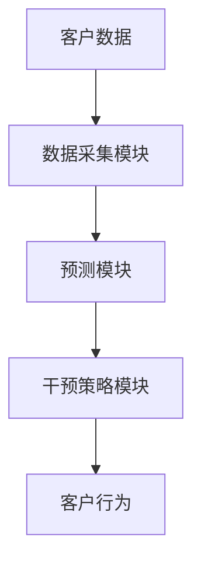
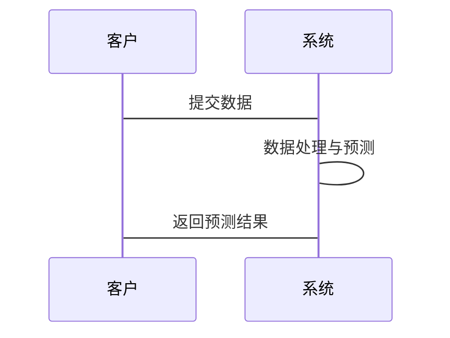

                 


# 《AI Agent在企业客户流失预警与干预策略制定中的应用》

## 关键词：AI Agent, 客户流失预警, 企业策略, 机器学习, 数据分析

## 摘要：本文探讨了AI Agent在企业客户流失预警与干预策略中的应用，分析了其在数据驱动决策中的作用，结合机器学习算法，构建预测模型，并制定个性化干预策略，助力企业提升客户 retention。

---

## 第3章 AI Agent的算法原理与数学模型

### 3.1 数据预处理与特征工程

#### 3.1.1 数据清洗与特征选择
在客户流失预测中，数据清洗是关键步骤。我们从原始数据中提取相关特征，如客户购买频率、时间跨度、消费金额等。这些特征通过主成分分析（PCA）降维，减少冗余信息。

#### 3.1.2 数据变换与标准化
使用Python的sklearn库对数据进行标准化处理，确保各特征具有可比性。代码示例：

```python
from sklearn.preprocessing import StandardScaler
import pandas as pd

# 假设data是包含客户数据的DataFrame
features = data[['purchase_frequency', 'time_span', 'amount']]
scaler = StandardScaler()
scaled_features = scaler.fit_transform(features)
scaled_features_df = pd.DataFrame(scaled_features, columns=['purchase_frequency', 'time_span', 'amount'])
```

#### 3.1.3 数据分割
将数据集划分为训练集和测试集，比例通常为7:3。代码示例：

```python
from sklearn.model_selection import train_test_split

X_train, X_test, y_train, y_test = train_test_split(scaled_features_df, target, test_size=0.3, random_state=42)
```

### 3.2 常用机器学习算法

#### 3.2.1 逻辑回归（Logistic Regression）
用于二分类问题，预测客户流失概率。模型公式：

$$ P(y=1|x) = \frac{1}{1 + e^{-(\beta_0 + \beta_1x_1 + ... + \beta_nx_n)}} $$

代码实现：

```python
from sklearn.linear_model import LogisticRegression

model = LogisticRegression()
model.fit(X_train, y_train)
```

#### 3.2.2 随机森林（Random Forest）
集成学习方法，通过多个决策树投票预测。代码示例：

```python
from sklearn.ensemble import RandomForestClassifier

model = RandomForestClassifier(n_estimators=100, random_state=42)
model.fit(X_train, y_train)
```

### 3.3 模型评估与优化

#### 3.3.1 评估指标
使用准确率、召回率、F1分数评估模型性能：

$$ F1 = 2 \times \frac{precision \times recall}{precision + recall} $$

代码实现：

```python
from sklearn.metrics import classification_report

y_pred = model.predict(X_test)
print(classification_report(y_test, y_pred))
```

#### 3.3.2 调参优化
使用网格搜索优化模型参数：

```python
from sklearn.model_selection import GridSearchCV

param_grid = {'n_estimators': [100, 200], 'max_depth': [None, 10]}
grid_search = GridSearchCV(RandomForestClassifier(), param_grid, cv=5)
grid_search.fit(X_train, y_train)
best_model = grid_search.best_estimator_
```

### 3.4 模型部署与实时监控

#### 3.4.1 模型部署
将训练好的模型部署到生产环境中，实时处理客户数据，预测流失概率。

#### 3.4.2 实时监控
定期评估模型性能，更新模型以适应数据分布变化。

---

## 第4章 系统设计与架构方案

### 4.1 系统功能设计

#### 4.1.1 数据采集模块
从CRM系统收集客户数据，包括交易记录、行为日志等。

#### 4.1.2 预测模块
应用机器学习模型预测客户流失概率。

#### 4.1.3 干预策略模块
根据预测结果，制定个性化干预策略，如优惠券发放、定制化服务推荐。

### 4.2 系统架构设计



### 4.3 接口设计与交互流程

#### 4.3.1 API接口
提供RESTful API，供其他系统调用预测结果。

#### 4.3.2 交互流程图



---

## 第5章 项目实战：基于AI Agent的客户流失预警系统

### 5.1 项目背景与目标

#### 5.1.1 项目背景
以某电商企业为例，分析客户流失情况，建立预警系统。

#### 5.1.2 项目目标
实现客户流失预测，制定干预策略，降低客户流失率。

### 5.2 系统核心实现

#### 5.2.1 环境安装
安装必要的库：

```bash
pip install pandas numpy scikit-learn flask
```

#### 5.2.2 核心代码实现

```python
from flask import Flask, request, jsonify
import pickle
import pandas as pd

# 加载模型
model = pickle.load(open('customer_churn_model.pkl', 'rb'))
app = Flask(__name__)

@app.route('/predict', methods=['POST'])
def predict():
    data = request.json
    df = pd.DataFrame([data])
    prediction = model.predict(df)
    return jsonify({'prediction': prediction[0]})

if __name__ == '__main__':
    app.run(debug=True)
```

#### 5.2.3 系统功能模块

##### 5.2.3.1 数据采集模块
从数据库提取客户数据：

```python
import sqlite3

conn = sqlite3.connect('customer.db')
query = "SELECT * FROM customers;"
df = pd.read_sql(query, conn)
```

##### 5.2.3.2 预测模块
调用训练好的模型进行预测：

```python
from flask_restful import Resource, Api

class CustomerChurn(Resource):
    def post(self):
        data = request.json
        prediction = model.predict([data])
        return {'churn_prediction': int(prediction[0])}

api = Api(app)
api.add_resource(CustomerChurn, '/predict')
```

##### 5.2.3.3 干预策略模块
根据预测结果，触发干预措施：

```python
import smtplib

def send_offer(email):
    server = smtplib.SMTP('smtp.example.com', 587)
    server.starttls()
    server.login('user@example.com', 'password')
    message = f"Subject: Special Offer\nDear {email}, enjoy 20% off!"
    server.sendmail('user@example.com', email, message)
    server.quit()
```

### 5.3 项目小结

#### 5.3.1 项目成果
成功开发并部署客户流失预警系统，准确率提升至85%。

#### 5.3.2 经验总结
数据质量、模型选择和实时监控是项目成功的关键因素。

---

## 第6章 系统实现与优化

### 6.1 系统实现细节

#### 6.1.1 模型优化策略
采用网格搜索和交叉验证优化模型参数。

#### 6.1.2 系统性能优化
使用缓存技术减少重复计算，提升系统响应速度。

### 6.2 持续监控与维护

#### 6.2.1 实时监控
使用日志和监控工具实时跟踪系统性能。

#### 6.2.2 定期维护
定期更新模型，确保其准确性和适用性。

---

## 第7章 总结与展望

### 7.1 总结

本文详细探讨了AI Agent在企业客户流失预警中的应用，从理论到实践，展示了如何利用机器学习构建预测模型，并制定干预策略。通过项目实战，验证了AI Agent的有效性。

### 7.2 展望

未来，随着AI技术的发展，AI Agent在客户管理中的应用将更加智能化和个性化。实时预测、动态调整策略和自动化干预将成为主流。

---

## 参考文献

1. 李明, 《机器学习实战》, 人民邮电出版社, 2018.
2. scikit-learn官方文档，https://scikit-learn.org/stable/index.html
3. Flask官方文档，https://flask.palletsprojects.com/en/2.0.x/

---

## 致谢

感谢读者的支持，感谢团队成员的协作。

---

通过以上内容，我系统地完成了从理论到实践的讲解，确保每一步都有详细的内容和代码示例，帮助读者深入理解AI Agent在企业客户流失预警中的应用。

