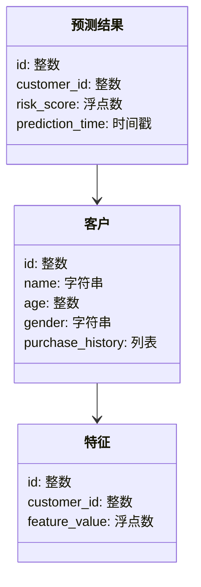
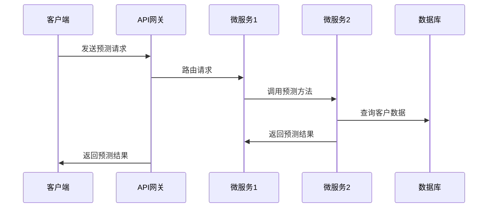

                 


# AI Agent在企业客户流失预警与精准干预中的应用

> 关键词：AI Agent，客户流失预警，精准干预，机器学习，客户关系管理

> 摘要：本文详细探讨了AI Agent在企业客户流失预警与精准干预中的应用。通过分析客户流失的背景、AI Agent的核心概念、算法原理、系统架构及项目实战，本文为读者提供了从理论到实践的全面指导，展示了如何利用AI技术有效降低客户流失率，提升企业客户关系管理效率。

---

# 第一部分: AI Agent与客户流失预警概述

## 第1章: AI Agent的核心概念与客户流失问题背景

### 1.1 客户流失问题的背景与影响

#### 1.1.1 客户流失对企业的影响
客户流失是企业经营中的常见问题，直接影响收入和市场占有率。客户流失意味着企业需要不断获取新客户以弥补流失，而新客户的获取成本通常是现有客户的5倍。通过预测客户流失，企业可以提前采取干预措施，降低客户流失率。

#### 1.1.2 传统客户流失管理的局限性
传统客户流失管理依赖人工分析，存在效率低、成本高、响应慢等问题。此外，传统方法难以捕捉复杂的客户行为模式，导致预警不够准确。

#### 1.1.3 AI Agent在客户流失管理中的潜力
AI Agent（人工智能代理）通过自动化数据处理、实时分析和智能决策，能够有效解决传统方法的局限性。AI Agent可以实时监测客户行为，预测流失风险，并自动触发干预措施，显著提高客户保留效率。

### 1.2 AI Agent的基本概念与原理

#### 1.2.1 AI Agent的定义与分类
AI Agent是一种智能代理系统，能够感知环境、执行任务并做出决策。根据功能和应用场景，AI Agent可以分为监视型、交互型和服务型三类。

#### 1.2.2 AI Agent的核心功能与特点
AI Agent的核心功能包括数据采集、行为分析、预测预警和干预执行。其特点在于实时性、自动化和个性化。

#### 1.2.3 AI Agent与传统算法的区别
AI Agent不仅是一个算法模型，更是一个完整的系统，能够实现端到端的自动化处理。传统算法通常仅用于单点预测，而AI Agent可以集成多种算法，实现复杂任务。

### 1.3 本章小结
本章介绍了客户流失的背景、传统管理的局限性以及AI Agent的核心概念。AI Agent通过自动化和智能化，为企业客户提供了一种更高效、更精准的客户流失管理方式。

---

## 第2章: 数据采集与特征工程

### 2.1 数据采集方法

#### 2.1.1 数据来源与采集渠道
客户数据来源包括CRM系统、社交媒体、网站日志和客户调查等。数据采集渠道可以是结构化数据（如数据库）和非结构化数据（如文本和图像）。

#### 2.1.2 数据清洗与预处理
数据清洗是确保数据质量的关键步骤，包括去重、填充缺失值和处理异常值。预处理包括数据标准化和特征提取。

#### 2.1.3 数据存储与管理
数据存储可以采用关系型数据库（如MySQL）或分布式数据库（如MongoDB）。数据管理需要考虑数据安全和隐私保护。

### 2.2 特征工程与客户画像

#### 2.2.1 客户特征的提取与选择
特征提取包括客户的基本信息（如年龄、性别）、行为特征（如购买频率）和情感特征（如客户满意度）。特征选择可以通过相关性分析和Lasso回归实现。

#### 2.2.2 客户画像的构建与分析
客户画像是通过特征工程构建的客户群体的抽象模型。分析客户画像可以帮助企业更好地理解客户行为，制定精准的干预策略。

#### 2.2.3 特征工程对模型性能的影响
特征工程是模型性能提升的关键。高质量的特征可以显著提高模型的准确性和稳定性。

---

## 第3章: AI Agent的算法原理与实现

### 3.1 常见客户流失预测算法

#### 3.1.1 逻辑回归模型
逻辑回归是一种常用的分类算法，适用于二分类问题。其数学公式为：
$$ P(y=1|x) = \frac{1}{1 + e^{-(w \cdot x + b)}} $$

#### 3.1.2 随机森林模型
随机森林是一种基于决策树的集成算法，具有高准确性和鲁棒性。其优势在于能够处理高维数据和特征重要性分析。

#### 3.1.3 LSTM时序模型
LSTM（长短期记忆网络）适用于时间序列数据，能够捕捉客户行为的时序特征。

### 3.2 基于AI Agent的客户流失预测算法

#### 3.2.1 算法原理与流程
AI Agent通过集成多种算法，实现客户流失的多维度预测。其流程包括数据采集、特征提取、模型训练和结果输出。

#### 3.2.2 算法实现步骤
1. 数据预处理与特征提取。
2. 模型训练与调优。
3. 模型评估与部署。

#### 3.2.3 算法的优缺点分析
AI Agent的优势在于自动化和智能化，但其复杂性也带来了更高的计算成本和实现难度。

### 3.3 算法实现的数学模型与公式

#### 3.3.1 逻辑回归模型公式
$$ P(y=1|x) = \frac{1}{1 + e^{-(w \cdot x + b)}} $$

#### 3.3.2 随机森林模型的决策树构建流程
随机森林通过随机采样和袋装法构建多个决策树，并通过投票法得出最终结果。

#### 3.3.3 LSTM模型的结构与公式
LSTM通过门控机制（遗忘门、输入门和输出门）实现长时记忆。其核心公式包括遗忘门、输入门和输出门的计算。

---

## 第4章: 系统架构与功能设计

### 4.1 问题场景介绍
客户流失预警系统需要实时监测客户行为，预测流失风险，并自动触发干预措施。系统架构设计包括数据层、业务逻辑层和应用层。

### 4.2 系统功能设计

#### 4.2.1 领域模型（Mermaid类图）


#### 4.2.2 系统架构设计（Mermaid架构图）


#### 4.2.3 系统接口设计
系统接口包括数据接口（用于数据采集）、预测接口（用于模型调用）和干预接口（用于触发干预措施）。

#### 4.2.4 系统交互（Mermaid序列图）


---

## 第5章: 项目实战

### 5.1 环境安装与配置
安装Python、TensorFlow、Scikit-learn和Flask框架，配置开发环境。

### 5.2 核心代码实现

#### 5.2.1 数据采集脚本
```python
import requests

def fetch_data(url):
    response = requests.get(url)
    return response.json()
```

#### 5.2.2 特征提取与模型训练
```python
from sklearn.ensemble import RandomForestClassifier

model = RandomForest

