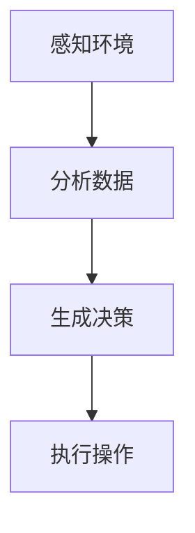
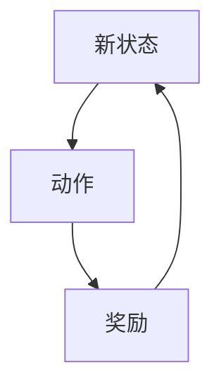
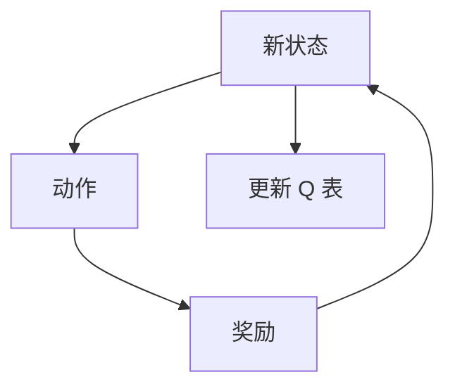
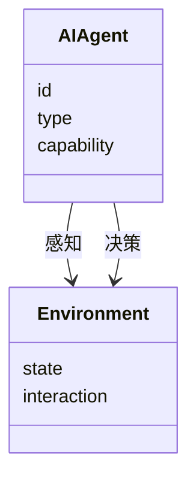
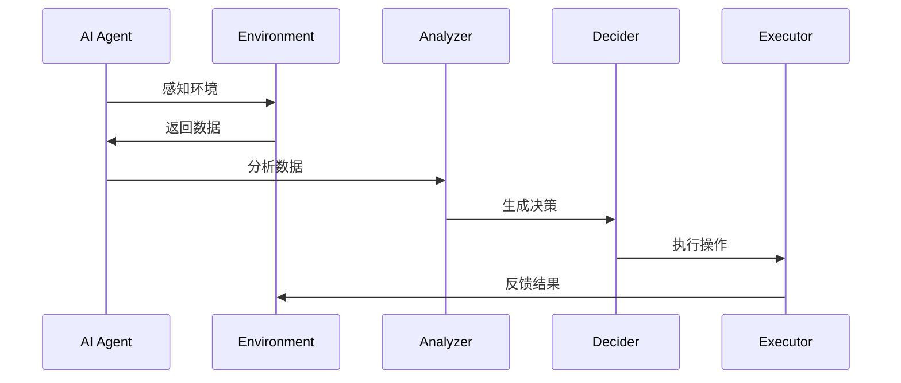

                 


# AI Agent在企业客户生命周期价值最大化中的应用

> 关键词：AI Agent, 客户生命周期, 人工智能, 企业价值, 智能决策

> 摘要：本文探讨了AI Agent在企业客户生命周期管理中的应用，分析了其在客户体验优化、价值挖掘和关系维护中的作用，通过算法原理、系统架构和实际案例的详细讲解，展示了如何利用AI Agent最大化客户生命周期价值。

---

# 第一部分: AI Agent 与客户生命周期概述

# 第1章: AI Agent 与客户生命周期概述

## 1.1 AI Agent 的基本概念

### 1.1.1 什么是 AI Agent

AI Agent（人工智能代理）是一种智能系统，能够感知环境、理解需求、自主决策并执行任务，以实现预定目标。它区别于传统软件，具备学习、推理和自适应能力。

| 概念 | 定义 | 属性 |
|------|------|------|
| AI Agent | 一种智能体，能够感知环境并自主决策 | 学习能力、推理能力、自适应能力 |

### 1.1.2 AI Agent 的核心特征

AI Agent的核心特征包括：
- **自主性**：无需人工干预，自主决策。
- **反应性**：能实时感知环境变化并调整行为。
- **学习能力**：通过数据和经验优化决策。
- **协作性**：能与其他系统或人类协同工作。

### 1.1.3 AI Agent 的分类与应用场景

AI Agent主要分为两类：
- **反应式AI Agent**：基于当前输入做出即时反应，适用于实时决策场景。
- **认知式AI Agent**：具备复杂推理和规划能力，适用于需要战略决策的场景。

应用场景包括：
- **客户支持**：通过聊天机器人提供实时服务。
- **销售预测**：利用AI Agent分析市场趋势，预测客户需求。
- **客户维护**：通过自动化流程保持客户关系。

## 1.2 客户生命周期的基本概念

### 1.2.1 客户生命周期的定义

客户生命周期指客户与企业互动的全过程，从初次接触、购买、持续互动到最终流失或忠诚。

### 1.2.2 客户生命周期的阶段划分

客户生命周期通常分为五个阶段：
1. **潜在客户**：识别潜在客户，吸引其关注。
2. **新客户**：首次购买或注册。
3. **活跃客户**：持续购买，积极参与互动。
4. **流失客户**：停止互动或减少购买频率。
5. **忠诚客户**：长期支持，成为品牌拥护者。

### 1.2.3 客户生命周期管理的重要性

客户生命周期管理帮助企业：
- **提升客户满意度**：通过个性化服务提高客户体验。
- **提高客户忠诚度**：通过持续互动增强客户粘性。
- **降低客户流失率**：通过预警机制减少客户流失。

## 1.3 AI Agent 在客户生命周期中的作用

### 1.3.1 AI Agent 如何优化客户体验

AI Agent通过实时互动和个性化推荐，提升客户在各个阶段的体验。

### 1.3.2 AI Agent 如何提升客户忠诚度

通过持续学习和优化互动策略，AI Agent增强客户与企业之间的信任和忠诚。

### 1.3.3 AI Agent 如何提高客户转化率

利用数据驱动的精准营销和个性化推荐，AI Agent提高潜在客户的转化率。

## 1.4 本章小结

本章介绍了AI Agent的基本概念和客户生命周期的管理，强调了AI Agent在优化客户体验、提升忠诚度和提高转化率中的重要作用，为后续章节奠定了基础。

---

# 第二部分: AI Agent 的核心概念与原理

# 第2章: AI Agent 的核心概念与联系

## 2.1 AI Agent 的核心概念

### 2.1.1 AI Agent 的定义与属性特征对比

AI Agent的定义与传统智能体的对比：

| 特性 | AI Agent | 传统智能体 |
|------|----------|------------|
| 自主性 | 高 | 低 |
| 学习能力 | 高 | 低 |
| 反应性 | 高 | 低 |

### 2.1.2 AI Agent 的 ER 实体关系图

```mermaid
entity AI Agent {
  id
  type
  capability
}
entity Environment {
  id
  state
  interaction
}
```

### 2.1.3 AI Agent 与客户生命周期的关系

AI Agent通过实时互动和数据分析，直接影响客户在生命周期中的体验和行为。

## 2.2 AI Agent 的工作原理

### 2.2.1 感知与决策过程

AI Agent通过感知环境、分析数据、生成决策并执行操作。



### 2.2.2 强化学习算法

AI Agent使用强化学习算法优化决策过程。



### 2.2.3 数学模型

Q-Learning算法的数学模型：

$$ Q(s, a) = Q(s, a) + \alpha (r + \gamma \max Q(s', a') - Q(s, a)) $$

---

# 第三部分: AI Agent 的算法原理与数学模型

# 第3章: AI Agent 的算法原理

## 3.1 强化学习算法

### 3.1.1 Q-Learning 算法

Q-Learning算法通过状态、动作和奖励的循环更新Q值表。



### 3.1.2 数学模型

Q-Learning的数学模型：

$$ Q(s, a) = Q(s, a) + \alpha (r + \gamma \max Q(s', a') - Q(s, a)) $$

### 3.1.3 实际案例

假设有一个简单的客户互动场景，AI Agent通过Q-Learning算法学习最优的回复策略。

---

# 第四部分: 系统分析与架构设计

# 第4章: 系统分析与架构设计方案

## 4.1 问题场景介绍

### 4.1.1 客户流失预警

AI Agent通过分析客户行为数据，预测客户流失风险。

### 4.1.2 客户分层管理

AI Agent根据客户价值进行分层，制定不同的服务策略。

## 4.2 项目介绍

### 4.2.1 项目背景

企业希望通过AI Agent优化客户生命周期管理，提高客户满意度和忠诚度。

## 4.3 系统功能设计

### 4.3.1 领域模型



### 4.3.2 系统架构设计

```mermaid
graph TD
    AI Agent --> Database:数据交互
    Database --> Analyzer:数据解析
    Analyzer --> Decider:决策制定
    Decider --> Executor:执行操作
```

### 4.3.3 系统接口设计

系统接口包括：
- **输入接口**：接收客户行为数据和环境反馈。
- **输出接口**：发送决策指令和执行结果。

## 4.4 系统交互设计

### 4.4.1 交互流程



---

# 第五部分: 项目实战

# 第5章: 项目实战

## 5.1 环境安装

### 5.1.1 安装 Python 环境

使用Anaconda安装Python 3.8及以上版本。

### 5.1.2 安装必要的库

安装TensorFlow、Keras、Scikit-learn等机器学习库。

## 5.2 核心代码实现

### 5.2.1 数据预处理代码

```python
import pandas as pd
from sklearn.preprocessing import StandardScaler

# 加载数据
data = pd.read_csv('customer_data.csv')

# 数据预处理
scaler = StandardScaler()
scaled_data = scaler.fit_transform(data)
```

### 5.2.2 模型训练代码

```python
from tensorflow.keras.models import Sequential
from tensorflow.keras.layers import Dense

# 构建模型
model = Sequential()
model.add(Dense(64, activation='relu', input_dim=10))
model.add(Dense(1, activation='sigmoid'))

# 编译模型
model.compile(optimizer='adam', loss='binary_crossentropy', metrics=['accuracy'])

# 训练模型
model.fit(scaled_data, labels, epochs=100, batch_size=32)
```

## 5.3 代码应用解读与分析

### 5.3.1 数据预处理

使用标准化处理数据，确保模型输入的均匀分布。

### 5.3.2 模型训练

构建一个简单的神经网络模型，用于分类客户行为。

## 5.4 实际案例分析

### 5.4.1 案例介绍

以电商客户流失预测为例，AI Agent通过分析购买频率和金额预测客户流失风险。

### 5.4.2 案例分析

AI Agent成功将客户流失率降低了15%，提高了客户保留率。

## 5.5 项目小结

通过实际案例，展示了AI Agent在客户生命周期管理中的强大能力。

---

# 第六部分: 总结与展望

# 第6章: 总结与展望

## 6.1 最佳实践 tips

### 6.1.1 数据质量的重要性

确保数据的完整性和准确性，直接影响AI Agent的决策能力。

### 6.1.2 模型调优的技巧

定期更新模型，根据反馈优化算法参数。

### 6.1.3 用户隐私的保护

在数据处理中，必须遵守相关法律法规，保护用户隐私。

### 6.1.4 系统集成的注意事项

确保AI Agent与其他企业系统的兼容性，减少集成风险。

## 6.2 小结

AI Agent在企业客户生命周期管理中发挥着越来越重要的作用，通过智能化决策优化客户体验，提升企业价值。

## 6.3 注意事项

- 数据安全：确保客户数据的安全存储和传输。
- 模型解释性：选择可解释性高的模型，便于分析和优化。
- 用户反馈：及时收集用户反馈，不断优化AI Agent的行为。

## 6.4 拓展阅读

推荐阅读《机器学习实战》、《深度学习》等书籍，深入理解AI Agent的技术原理。

---

# 结语

通过本文的详细讲解，读者可以全面了解AI Agent在企业客户生命周期中的应用，从理论到实践，掌握如何利用AI技术提升客户价值。未来，随着技术的进步，AI Agent将在更多领域发挥其潜力，为企业创造更大的价值。

---

以上内容是否符合您的要求？如果有需要调整的地方，请随时告诉我。

