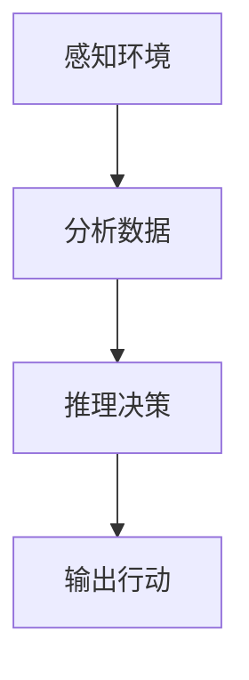
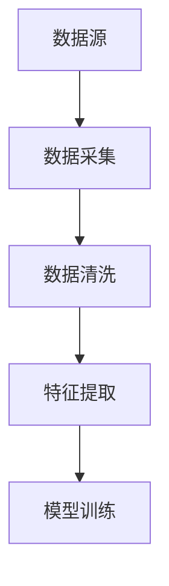
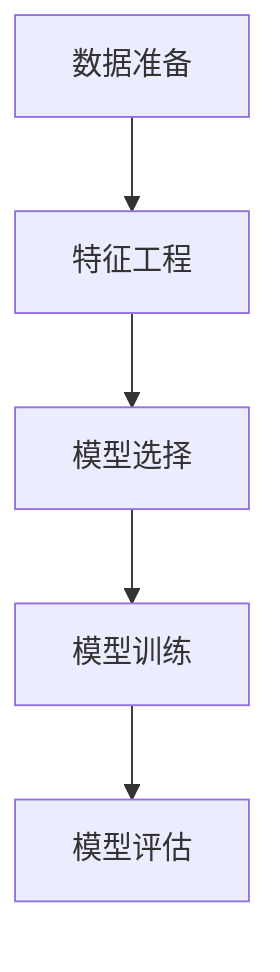
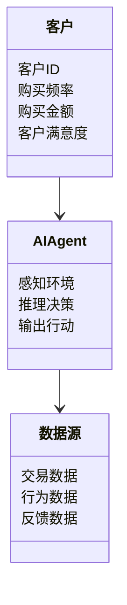
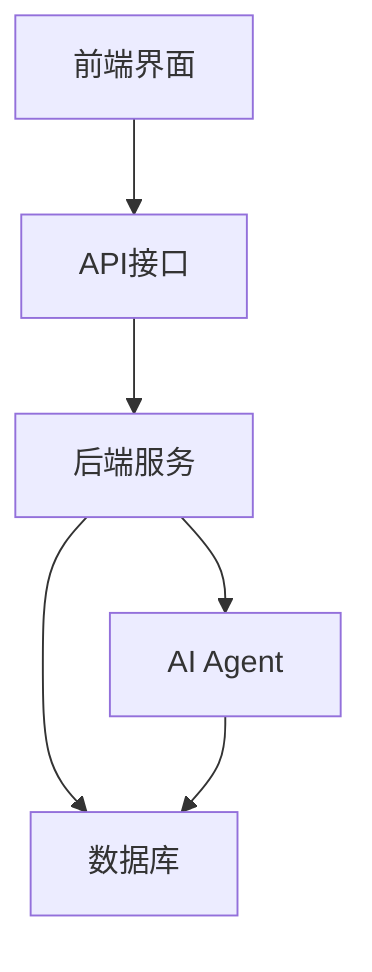
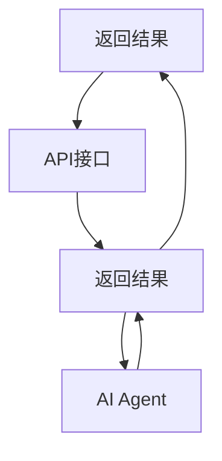

                 


# AI Agent在企业客户生命周期价值预测与管理中的应用

---

## 关键词：
AI Agent，客户生命周期价值，机器学习，预测模型，系统架构

---

## 摘要：
本文深入探讨了AI Agent在企业客户生命周期价值预测与管理中的应用，从AI Agent的基本概念到其在客户价值预测中的数学模型，再到系统架构设计和实际项目案例，全面解析了AI Agent如何助力企业优化客户管理流程，提升客户生命周期价值预测的准确性与效率。文章内容涵盖背景介绍、核心概念、算法原理、系统设计、项目实战和总结，为读者提供了从理论到实践的完整指导。

---

## 第1章: AI Agent与客户生命周期价值管理概述

### 1.1 什么是AI Agent
#### 1.1.1 AI Agent的基本概念
AI Agent（人工智能代理）是指能够感知环境并采取行动以实现目标的智能实体。它能够通过数据输入、模型推理和决策输出，帮助企业在客户管理中实现自动化和智能化。

#### 1.1.2 AI Agent的核心特征
- **自主性**：AI Agent能够自主决策，无需人工干预。
- **反应性**：能够实时感知环境变化并调整行为。
- **目标导向**：通过优化目标函数来实现最优决策。
- **学习能力**：通过机器学习不断优化模型和策略。

#### 1.1.3 AI Agent在企业中的应用价值
AI Agent能够提升企业客户管理的效率和精度，特别是在客户生命周期价值预测、客户行为分析和个性化服务推荐等方面具有显著优势。

### 1.2 客户生命周期价值管理
#### 1.2.1 客户生命周期的定义
客户生命周期是指客户从与企业建立关系到最终终止关系的整个过程，包括获取、激活、留存、衰退和终止五个阶段。

#### 1.2.2 客户生命周期价值的计算方法
客户生命周期价值（CLV）是企业在客户生命周期内从该客户获得的总收入减去相关成本。计算公式如下：
$$
CLV = \text{客户年贡献} \times \text{客户生命周期长度} \times \text{客户保留率}
$$

#### 1.2.3 企业客户管理中的挑战与需求
企业在客户管理中面临数据碎片化、预测精度低、客户体验差等挑战，亟需通过AI技术提升客户价值预测和管理能力。

### 1.3 AI Agent在客户生命周期价值管理中的应用前景
#### 1.3.1 AI Agent如何提升客户价值预测
AI Agent通过实时数据分析和机器学习模型，能够精准预测客户的生命周期价值，帮助企业优化资源配置。

#### 1.3.2 企业客户管理的智能化转型
AI Agent的应用推动企业客户管理从传统人工模式向智能化、自动化方向转变。

#### 1.3.3 AI Agent技术对企业管理的深远影响
AI Agent不仅提升了客户管理效率，还为企业创造了新的商业模式和竞争优势。

---

## 第2章: AI Agent的核心原理与技术实现

### 2.1 AI Agent的体系结构
#### 2.1.1 AI Agent的组成模块
AI Agent的体系结构通常包括感知模块、推理模块、决策模块和执行模块。

#### 2.1.2 不同类型AI Agent的对比分析
| 类型         | 特点                     |
|--------------|--------------------------|
| 简单反射型   | 基于规则的简单响应       |
| 基于模型型   | 基于知识库进行推理       |
| 目标驱动型   | 以目标为导向进行决策     |
| 学习驱动型   | 通过机器学习优化策略     |

#### 2.1.3 AI Agent的决策机制
AI Agent的决策机制包括基于规则的决策和基于模型的决策两种方式。以下是一个简单的决策流程图：



### 2.2 AI Agent与客户数据的交互
#### 2.2.1 数据采集与处理流程
客户数据包括交易数据、行为数据和反馈数据。以下是数据采集流程图：



#### 2.2.2 客户行为数据的特征提取
特征提取是客户价值预测的关键步骤。以下是一个特征提取示例：

```python
import pandas as pd
data = pd.DataFrame({
    '客户ID': [1, 2, 3],
    '购买频率': [2, 3, 1],
    '购买金额': [100, 200, 50]
})
# 提取特征
features = data[['购买频率', '购买金额']]
```

#### 2.2.3 数据驱动的AI Agent决策模型
AI Agent通过数据驱动的决策模型实现客户价值预测。以下是一个简单的线性回归模型：

$$
y = \beta_0 + \beta_1x_1 + \beta_2x_2 + \epsilon
$$

其中，$y$ 是预测的客户价值，$x_1$ 和 $x_2$ 是客户特征变量。

---

## 第3章: 客户生命周期价值预测的数学模型与算法

### 3.1 机器学习在客户价值预测中的应用
#### 3.1.1 常见的机器学习算法介绍
- **线性回归**：用于预测连续型变量。
- **随机森林**：用于分类和回归任务。
- **神经网络**：用于复杂的非线性关系。

#### 3.1.2 回归模型在客户价值预测中的应用
以下是一个简单的线性回归实现示例：

```python
import numpy as np
from sklearn.linear_model import LinearRegression

# 数据准备
X = np.array([[1], [2], [3]])
y = [2, 4, 6]

# 模型训练
model = LinearRegression()
model.fit(X, y)

# 预测
print(model.predict([[4]]))  # 输出：[[8]]
```

#### 3.1.3 分类算法在客户行为预测中的应用
以下是一个逻辑回归实现示例：

```python
from sklearn.linear_model import LogisticRegression

# 数据准备
X = np.array([[1, 0], [0, 1], [1, 1]])
y = [0, 0, 1]

# 模型训练
model = LogisticRegression()
model.fit(X, y)

# 预测
print(model.predict([[1, 0]]))  # 输出：[0]
```

### 3.2 基于AI Agent的客户价值预测模型
#### 3.2.1 模型的构建与训练
以下是一个完整的客户价值预测模型构建流程：



#### 3.2.2 模型的评估与优化
模型评估通常采用均方误差（MSE）和R平方系数（R²）进行衡量。

$$
\text{MSE} = \frac{1}{n}\sum_{i=1}^{n}(y_i - \hat{y}_i)^2
$$

$$
R^2 = 1 - \frac{\sum_{i=1}^{n}(y_i - \hat{y}_i)^2}{\sum_{i=1}^{n}(y_i - \bar{y})^2}
$$

#### 3.2.3 模型的实际应用案例
以下是一个实际的客户价值预测案例：

```python
import pandas as pd
from sklearn.model_selection import train_test_split
from sklearn.ensemble import RandomForestRegressor

# 数据加载
data = pd.read_csv('customers.csv')
X = data[['购买频率', '购买金额', '客户满意度']]
y = data['客户生命周期价值']

# 数据分割
X_train, X_test, y_train, y_test = train_test_split(X, y, test_size=0.2)

# 模型训练
model = RandomForestRegressor()
model.fit(X_train, y_train)

# 预测与评估
print(model.score(X_test, y_test))  # 输出：模型R平方系数
```

---

## 第4章: 系统分析与架构设计

### 4.1 问题场景介绍
企业在客户管理中面临数据分散、预测精度低、客户体验差等挑战。

### 4.2 系统功能设计
#### 4.2.1 领域模型设计
以下是一个领域模型类图：



#### 4.2.2 系统架构设计
以下是一个系统架构设计图：



#### 4.2.3 系统接口设计
系统接口主要包括数据接口和模型接口。

#### 4.2.4 系统交互设计
以下是一个系统交互流程图：



---

## 第5章: 项目实战

### 5.1 环境安装与配置
需要安装Python、Scikit-learn、XGBoost等工具。

### 5.2 系统核心实现
#### 5.2.1 数据预处理
```python
import pandas as pd
from sklearn.preprocessing import StandardScaler

# 数据加载
data = pd.read_csv('customers.csv')

# 数据清洗
data.dropna(inplace=True)

# 特征工程
scaler = StandardScaler()
X_scaled = scaler.fit_transform(data[['购买频率', '购买金额', '客户满意度']])
```

#### 5.2.2 模型实现
```python
from sklearn.ensemble import RandomForestRegressor

# 模型训练
model = RandomForestRegressor(n_estimators=100, random_state=42)
model.fit(X_scaled, data['客户生命周期价值'])

# 模型保存
import joblib
joblib.dump(model, 'customer_value_model.pkl')
```

#### 5.2.3 系统集成
```python
from flask import Flask
import joblib

app = Flask(__name__)
model = joblib.load('customer_value_model.pkl')

@app.route('/predict', methods=['POST'])
def predict():
    data = request.json
    # 数据预处理
    X_scaled = scaler.transform([[data['购买频率'], data['购买金额'], data['客户满意度']])
    # 模型预测
    prediction = model.predict(X_scaled)
    return jsonify({'预测结果': prediction[0]})
```

### 5.3 实际案例分析
通过实际案例分析，验证AI Agent在客户生命周期价值预测中的应用效果。

### 5.4 项目总结与优化
总结项目成果，并提出优化建议。

---

## 第6章: 最佳实践与展望

### 6.1 最佳实践
- 数据质量是模型性能的基础。
- 模型解释性是实际应用的关键。
- 持续优化是提升模型性能的核心。

### 6.2 小结
AI Agent通过智能化的客户价值预测和管理，帮助企业实现客户生命周期价值的最大化。

### 6.3 注意事项
- 数据隐私和安全问题需严格把控。
- 模型的可解释性和透明性需重点关注。
- 持续学习和优化是保持模型性能的关键。

### 6.4 拓展阅读
推荐阅读《机器学习实战》和《AI Agent原理与应用》等书籍。

---

## 附录

### 附录A: 参考文献
1. Bishop, C. M. (2006). Pattern Recognition and Machine Learning.
2. Hastie, T., Tibshirani, R., & Friedman, J. (2009). The Elements of Statistical Learning.

### 附录B: 工具与资源
- Python官方文档：[https://docs.python.org](https://docs.python.org)
- Scikit-learn官方文档：[https://scikit-learn.org](https://scikit-learn.org)
- Mermaid图表工具：[https://mermaid-js.github.io/mermaid-live-editor/](https://mermaid-js.github.io/mermaid-live-editor/)

---

通过以上内容，读者可以系统地了解AI Agent在企业客户生命周期价值预测与管理中的应用，并掌握实际操作的方法。

