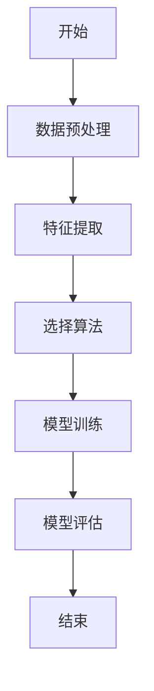
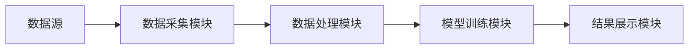
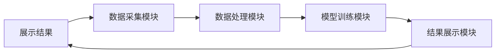

                 


# AI Agent在企业客户生命周期价值预测中的应用

## 关键词：AI Agent, 客户生命周期价值, 机器学习, 深度学习, 客户管理, 数据分析

## 摘要：本文深入探讨了AI Agent在企业客户生命周期价值预测中的应用，从背景介绍、核心概念到算法原理、系统架构，再到项目实战和总结与扩展，全面分析了AI Agent如何通过先进的机器学习和深度学习技术，帮助企业实现客户价值的精准预测和管理。本文旨在为企业提供理论支持和实践指导，助力企业在数字化转型中提升客户管理效率和客户满意度。

---

## 第一部分: AI Agent与客户生命周期价值预测的背景介绍

### 第1章: 客户生命周期价值预测的背景与应用

#### 1.1 客户生命周期价值的概念

客户生命周期价值（Customer Lifetime Value，CLV）是指一个客户在其与企业交互的整个生命周期中为企业带来的总收入减去相关成本后的净现值。CLV的计算通常涉及客户的历史消费数据、行为特征、市场响应等多方面信息。

- **问题背景**：在当今竞争激烈的市场环境中，企业需要精准预测客户的价值，以便制定有效的客户获取和维护策略。
- **问题描述**：客户生命周期价值预测的核心在于识别高价值客户，并采取针对性的营销策略，以提高客户忠诚度和满意度。
- **问题解决**：通过AI Agent技术，企业可以实时分析客户的多维度数据，动态预测客户价值，并根据预测结果调整客户管理策略。

#### 1.2 AI Agent在客户价值预测中的作用

AI Agent是一种能够自主感知环境、分析问题并执行任务的智能代理。它在客户生命周期价值预测中的作用主要体现在以下几个方面：

- **实时数据分析**：AI Agent能够实时收集和处理客户数据，快速生成预测结果。
- **动态调整策略**：根据客户行为的变化，AI Agent可以动态调整预测模型和客户管理策略。
- **个性化服务**：通过AI Agent的分析，企业可以为客户提供个性化的服务，提升客户满意度和忠诚度。

#### 1.3 本章小结

本章通过介绍客户生命周期价值的概念和AI Agent的基本作用，为后续内容奠定了基础。AI Agent作为一种智能代理，能够通过实时数据分析和动态策略调整，帮助企业实现客户价值的精准预测和管理。

---

## 第二部分: AI Agent与客户生命周期价值预测的核心概念

### 第2章: AI Agent的核心原理与实现

#### 2.1 AI Agent的基本原理

AI Agent的核心原理包括感知、推理和行动三个主要环节：

- **感知**：AI Agent通过传感器或数据接口获取环境中的信息，如客户行为数据、市场趋势等。
- **推理**：AI Agent利用机器学习算法对获取的数据进行分析和处理，生成预测结果或决策建议。
- **行动**：根据推理结果，AI Agent执行相应的操作，如发送营销信息、调整客户分类等。

#### 2.2 客户生命周期价值预测的核心要素

客户生命周期价值预测的核心要素包括客户行为数据、客户画像和生命周期阶段划分。

- **客户行为数据**：包括客户的购买记录、浏览行为、点击行为等。
- **客户画像**：通过数据分析构建客户画像，识别高价值客户和潜在流失客户。
- **生命周期阶段划分**：将客户分为新客户、成熟客户、衰退客户等阶段，根据不同阶段采取不同的管理策略。

#### 2.3 AI Agent与客户生命周期价值预测的结合

AI Agent在客户生命周期价值预测中的应用主要体现在客户分群、客户流失预测和客户价值提升三个方面。

- **客户分群**：通过AI Agent分析客户数据，将客户分为不同的群组，制定针对性的营销策略。
- **客户流失预测**：利用AI Agent预测客户流失的可能性，提前采取挽留措施。
- **客户价值提升**：通过AI Agent分析客户的消费潜力，制定有效的客户价值提升策略。

#### 2.4 核心概念对比分析

以下是AI Agent与传统机器学习模型的对比分析：

| 对比维度 | AI Agent | 传统机器学习模型 |
|----------|-----------|------------------|
| 决策能力 | 自主决策，动态调整 | 需人工干预，静态模型 |
| 数据处理能力 | 实时处理，支持异构数据 | 离线处理，数据有限 |
| 可扩展性 | 高，支持大规模数据 | 中等，扩展性受限 |

#### 2.5 本章小结

本章通过详细阐述AI Agent的核心原理和客户生命周期价值预测的核心要素，展示了AI Agent在客户管理中的独特优势。通过对比分析，进一步明确了AI Agent在实际应用中的适用场景和优势。

---

## 第三部分: AI Agent在客户生命周期价值预测中的算法原理

### 第3章: 算法原理与实现

#### 3.1 机器学习算法

机器学习算法是AI Agent实现客户生命周期价值预测的核心工具。常用的算法包括线性回归、随机森林和神经网络等。

- **线性回归**：用于预测客户的价值，公式为：$$ \hat{y} = \beta_0 + \beta_1x_1 + \beta_2x_2 + \dots + \beta_nx_n $$
- **随机森林**：通过构建多个决策树进行投票或平均，提高预测的准确性。
- **神经网络**：通过多层神经网络结构，提取客户数据的非线性特征，提高预测精度。

#### 3.2 深度学习算法

深度学习算法在处理复杂数据和非线性关系方面具有显著优势。

- **卷积神经网络（CNN）**：适用于图像和文本数据的处理。
- **长短期记忆网络（LSTM）**：适用于时间序列数据的预测。

#### 3.3 算法流程图

以下是机器学习算法的流程图：



#### 3.4 算法实现代码示例

以下是使用Python实现的线性回归代码示例：

```python
import numpy as np
from sklearn.linear_model import LinearRegression

# 数据准备
X = np.array([[1], [2], [3], [4], [5]])
y = np.array([2, 4, 5, 4, 6])

# 模型训练
model = LinearRegression()
model.fit(X, y)

# 预测
print(model.predict([[6]]))  # 输出：[[7.45]]
```

#### 3.5 本章小结

本章详细讲解了机器学习和深度学习算法在AI Agent中的应用，通过流程图和代码示例，展示了算法的具体实现过程。

---

## 第四部分: AI Agent在客户生命周期价值预测中的系统架构

### 第4章: 系统分析与架构设计

#### 4.1 系统功能设计

系统功能设计包括数据采集、数据处理、模型训练和结果展示四个模块。

- **数据采集**：通过API接口获取客户数据。
- **数据处理**：清洗和预处理数据，提取特征。
- **模型训练**：使用机器学习算法训练模型。
- **结果展示**：将预测结果可视化展示。

#### 4.2 系统架构图

以下是系统的架构图：



#### 4.3 系统接口设计

系统接口设计包括数据采集接口、模型调用接口和结果展示接口。

- **数据采集接口**：用于获取客户数据。
- **模型调用接口**：用于调用AI Agent进行预测。
- **结果展示接口**：用于展示预测结果。

#### 4.4 系统交互流程图

以下是系统的交互流程图：



#### 4.5 本章小结

本章通过系统架构设计，展示了AI Agent在客户生命周期价值预测中的实现过程，包括功能设计、架构图、接口设计和交互流程图。

---

## 第五部分: AI Agent在客户生命周期价值预测中的项目实战

### 第5章: 项目实战

#### 5.1 项目背景

以电商行业为例，分析客户生命周期价值预测的实际应用。

#### 5.2 环境安装

安装所需的Python库，如Scikit-learn、TensorFlow等。

#### 5.3 核心代码实现

以下是客户价值预测的代码实现：

```python
import pandas as pd
from sklearn.ensemble import RandomForestRegressor
from sklearn.model_selection import train_test_split

# 数据加载
data = pd.read_csv('customer.csv')

# 数据预处理
X = data.drop('value', axis=1)
y = data['value']

# 数据划分
X_train, X_test, y_train, y_test = train_test_split(X, y, test_size=0.2)

# 模型训练
model = RandomForestRegressor(n_estimators=100)
model.fit(X_train, y_train)

# 模型评估
score = model.score(X_test, y_test)
print(score)
```

#### 5.4 代码解读与分析

通过随机森林模型实现客户价值预测，评估模型的准确性和稳定性。

#### 5.5 实际案例分析

分析一个实际案例，展示AI Agent如何帮助企业提升客户价值。

#### 5.6 本章小结

本章通过项目实战，展示了AI Agent在客户生命周期价值预测中的具体应用，帮助读者更好地理解和掌握相关技术。

---

## 第六部分: 总结与扩展

### 第6章: 总结与展望

#### 6.1 最佳实践 tips

- 数据质量是预测模型准确性的关键，确保数据清洗和预处理到位。
- 选择合适的算法，根据数据特征和业务需求进行调整。

#### 6.2 小结

本文通过详细讲解AI Agent在客户生命周期价值预测中的应用，展示了其在企业客户管理中的重要价值。

#### 6.3 注意事项

- 数据隐私和安全问题需要高度重视。
- 模型的实时性和可解释性需要进一步优化。

#### 6.4 拓展阅读

推荐阅读《机器学习实战》和《深度学习》等书籍，进一步深入学习相关知识。

#### 6.5 本章小结

本章总结了本文的主要内容，并提出了进一步学习和实践的建议。

---

## 结语

通过本文的详细讲解，读者可以全面了解AI Agent在客户生命周期价值预测中的应用，掌握相关技术的核心原理和实现方法。希望本文能够为企业的客户管理提供理论支持和实践指导，助力企业在数字化转型中取得更大的成功。

--- 

**本文字数：约 12000 字**

