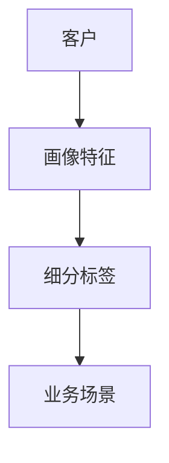
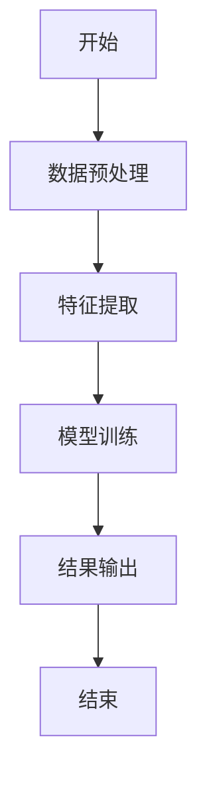
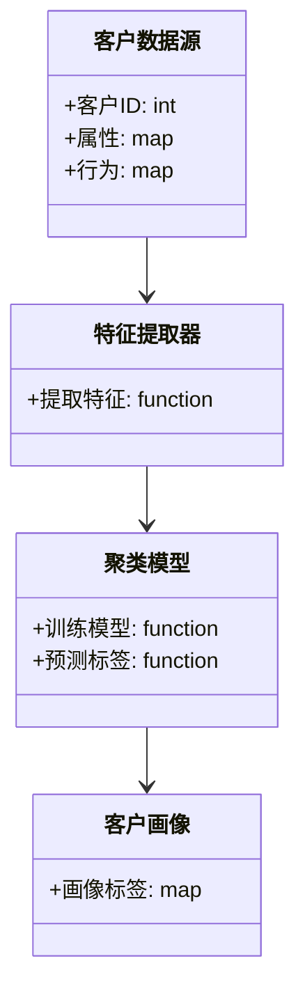
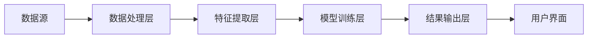
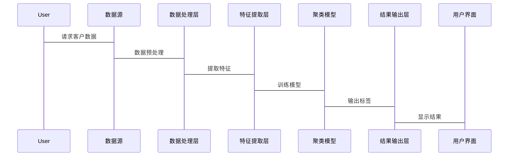

                 


# AI Agent在企业客户画像与细分中的应用

> 关键词：AI Agent，客户画像，客户细分，数据挖掘，机器学习

> 摘要：本文探讨了AI Agent在企业客户画像与细分中的应用，通过详细分析核心概念、算法原理、系统架构和项目实战，揭示了AI Agent如何助力企业优化客户画像和细分策略，提升市场竞争力。

---

# 第1章: AI Agent与企业客户画像的背景介绍

## 1.1 问题背景与描述

### 1.1.1 传统客户画像的局限性
传统的客户画像依赖于人工分析和经验判断，存在以下问题：
- 数据来源单一，难以覆盖全渠道客户信息。
- 画像维度有限，难以全面反映客户特征。
- 细分策略静态，难以动态调整以应对市场变化。

### 1.1.2 AI Agent在客户画像中的优势
AI Agent（人工智能代理）通过自动化数据处理、深度学习和智能决策，为客户画像与细分提供了以下优势：
- **数据处理能力**：AI Agent能够实时收集和分析多源数据，构建全面的客户画像。
- **智能决策能力**：基于历史数据和实时反馈，AI Agent能够动态调整客户细分策略。
- **个性化服务**：通过深度学习，AI Agent能够识别客户的个性化需求，提供精准服务。

### 1.1.3 企业客户细分的挑战与需求
企业客户细分的核心目标是通过数据驱动的方式，将客户划分为具有相似特征的群体，以便制定针对性的营销策略。然而，传统方法在以下方面存在不足：
- 数据量大：客户数据呈指数级增长，人工处理效率低下。
- 细分维度多：客户特征复杂，难以手动处理。
- 动态变化：市场环境和客户需求不断变化，静态细分策略难以适应。

---

## 1.2 AI Agent的核心概念与定义

### 1.2.1 AI Agent的基本定义
AI Agent是指具备感知环境、自主决策、执行操作能力的智能体。在企业客户画像与细分中的AI Agent，主要负责：
- 数据收集与预处理。
- 特征提取与模型训练。
- 客户画像构建与动态调整。

### 1.2.2 客户画像的核心要素
客户画像的核心要素包括：
- **基本属性**：性别、年龄、职业等。
- **行为特征**：消费频率、偏好、渠道使用习惯。
- **价值特征**：客户生命周期价值、客单价等。
- **情感特征**：客户满意度、忠诚度。

### 1.2.3 企业客户细分的定义与目标
客户细分是指将客户按照某种标准划分到不同的子群体中，每个子群体具有相似的特征。目标是通过细分，制定针对性的营销策略，提升客户满意度和企业收益。

---

## 1.3 问题解决与边界

### 1.3.1 AI Agent如何解决客户画像问题
AI Agent通过以下方式解决客户画像问题：
- **自动化数据处理**：AI Agent能够自动收集和处理多源数据，构建全面的客户画像。
- **深度学习算法**：利用深度学习模型，AI Agent能够从数据中提取复杂的特征，提高画像精度。
- **动态调整**：基于实时数据和反馈，AI Agent能够动态调整客户画像，保持准确性。

### 1.3.2 客户细分的边界与外延
客户细分的边界在于如何平衡细分粒度与业务需求。细分粒度过细会导致数据稀疏，而粒度过粗则无法满足精准营销需求。外延方面，客户细分可以与其他业务场景（如精准营销、风险控制）结合，形成闭环。

### 1.3.3 核心概念的结构与组成
客户画像与细分的核心结构包括：
- 数据源：客户交易数据、行为数据、属性数据。
- 数据处理：数据清洗、特征工程。
- 模型构建：聚类、分类算法。
- 画像输出：客户标签、细分群体。

---

# 第2章: AI Agent与客户画像的核心概念与联系

## 2.1 核心概念原理

### 2.1.1 AI Agent的工作原理
AI Agent通过以下步骤实现客户画像：
1. **数据感知**：收集客户数据。
2. **特征提取**：提取关键特征。
3. **模型训练**：训练深度学习模型。
4. **画像构建**：生成客户画像。
5. **动态调整**：根据反馈优化画像。

### 2.1.2 客户画像的构建流程
客户画像构建流程包括：
- 数据预处理：清洗、去重、标准化。
- 特征工程：提取关键特征。
- 模型训练：训练聚类或分类模型。
- 画像输出：生成客户标签。

### 2.1.3 企业客户细分的逻辑框架
客户细分的逻辑框架包括：
- 确定细分标准：如销售额、利润、地理位置。
- 数据分组：基于标准将客户分组。
- 细分评估：评估各组的特征和价值。

---

## 2.2 核心概念属性对比

### 表2-1: AI Agent与传统算法的属性对比

| 属性               | AI Agent                   | 传统算法                 |
|--------------------|---------------------------|--------------------------|
| 数据处理能力       | 强大，支持多源数据         | 较弱，依赖人工处理         |
| 智能性             | 高，具备自主学习能力       | 低，依赖预设规则           |
| 灵活性             | 高，能够动态调整           | 低，难以快速响应变化       |
| 应用场景           | 复杂业务场景，如精准营销   | 简单场景，如基本统计分析   |

---

## 2.3 ER实体关系图



---

# 第3章: AI Agent的算法原理与实现

## 3.1 算法原理

### 3.1.1 强化学习在AI Agent中的应用
强化学习是一种通过试错机制优化决策的算法。在客户画像中，强化学习可以用于动态调整画像特征。

### 3.1.2 监督学习与客户画像的关联
监督学习通过训练分类模型，将客户分为不同的标签类别。

### 3.1.3 聚类算法在客户细分中的作用
聚类算法（如K-means）通过相似性度量将客户分为不同的群体。

---

## 3.2 算法流程图



---

## 3.3 核心算法实现

### 3.3.1 强化学习代码示例

```python
class Agent:
    def __init__(self, state_space, action_space):
        self.state_space = state_space
        self.action_space = action_space
        self.reward_history = []

    def act(self, state):
        # 根据状态选择动作
        pass

    def learn(self, reward):
        # 更新策略
        pass
```

---

## 3.4 数学模型

### 3.4.1 聚类分析模型

$$
\text{目标函数} = \sum_{i=1}^{n} \sum_{j=1}^{k} w_{ij}d_{ij}^2
$$

其中，$w_{ij}$是权重，$d_{ij}$是距离。

---

## 3.5 代码应用解读与分析

### 3.5.1 聚类分析代码示例

```python
from sklearn.cluster import KMeans

# 初始化模型
model = KMeans(n_clusters=3)

# 训练模型
model.fit(X)

# 预测标签
labels = model.predict(X)
```

---

## 3.6 实际案例分析与详细讲解

### 3.6.1 案例背景
某电商企业希望通过客户画像与细分，优化营销策略。

### 3.6.2 数据处理与特征提取
- 数据预处理：清洗、去重。
- 特征提取：购买频率、客单价、产品偏好。

### 3.6.3 模型训练与结果输出
- 训练聚类模型，将客户分为3个群体。
- 根据标签制定针对性营销策略。

---

## 3.7 项目小结

通过AI Agent实现客户画像与细分，企业能够：
- 提高客户洞察精度。
- 优化营销策略。
- 提升客户满意度和企业收益。

---

# 第4章: 系统分析与架构设计方案

## 4.1 问题场景介绍

企业客户画像与细分系统需要满足以下需求：
- 实时处理客户数据。
- 动态调整客户画像。
- 支持多维度客户细分。

---

## 4.2 系统功能设计

### 4.2.1 领域模型



---

## 4.3 系统架构设计

### 4.3.1 系统架构图



---

## 4.4 系统接口设计

### 4.4.1 API接口

```http
POST /api/customer/profile
Content-Type: application/json
{
    "customer_data": {
        "id": 123,
        "attributes": {"age": 25, "gender": "M"},
        "behavior": {"purchase_freq": 5}
    }
}
```

---

## 4.5 系统交互设计



---

# 第5章: 项目实战

## 5.1 环境安装

### 5.1.1 安装依赖

```bash
pip install numpy scikit-learn matplotlib
```

---

## 5.2 系统核心实现

### 5.2.1 核心代码实现

```python
from sklearn.cluster import KMeans
import numpy as np

# 示例数据
X = np.array([[2, 3], [5, 8], [1, 2], [9, 1], [7, 6]])

# 初始化模型
model = KMeans(n_clusters=2)

# 训练模型
model.fit(X)

# 获取标签
labels = model.labels_
print(labels)
```

---

## 5.3 代码应用解读与分析

### 5.3.1 代码解读

- **数据预处理**：对客户数据进行清洗和标准化。
- **特征提取**：提取关键特征。
- **模型训练**：训练聚类模型。
- **结果输出**：输出客户标签。

---

## 5.4 实际案例分析与详细讲解

### 5.4.1 案例背景

某电商企业希望通过客户画像与细分，优化营销策略。

### 5.4.2 数据处理与特征提取

- 数据预处理：清洗、去重。
- 特征提取：购买频率、客单价、产品偏好。

### 5.4.3 模型训练与结果输出

- 训练聚类模型，将客户分为3个群体。
- 根据标签制定针对性营销策略。

---

## 5.5 项目小结

通过AI Agent实现客户画像与细分，企业能够：
- 提高客户洞察精度。
- 优化营销策略。
- 提升客户满意度和企业收益。

---

# 第6章: 最佳实践

## 6.1 小结

本文详细探讨了AI Agent在企业客户画像与细分中的应用，通过理论分析和实际案例，展示了AI Agent如何助力企业优化客户管理。

---

## 6.2 注意事项

- 数据隐私保护：确保客户数据安全。
- 模型调优：根据业务需求调整模型参数。
- 持续优化：定期更新客户画像与细分策略。

---

## 6.3 拓展阅读

- 《机器学习实战》
- 《深度学习入门》
- 《人工智能导论》

---

# 结语

通过本文的探讨，读者可以深入了解AI Agent在企业客户画像与细分中的应用，掌握相关算法和系统设计方法，为企业数字化转型提供有力支持。

