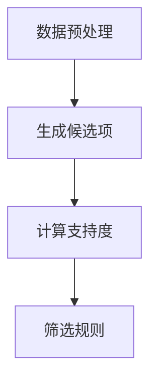
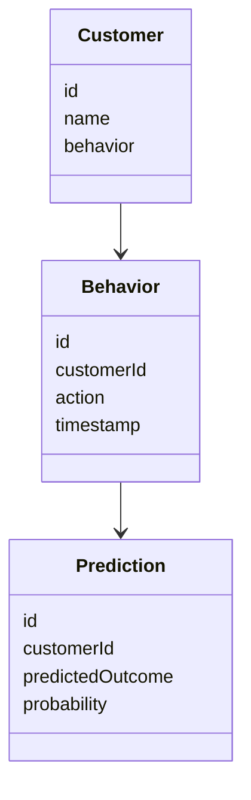
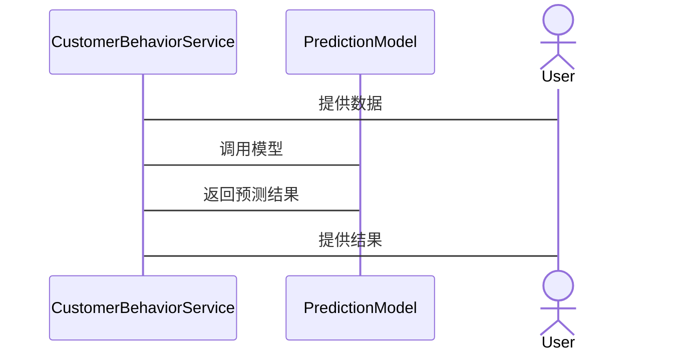

                 


```markdown
# AI Agent在企业客户行为分析与预测中的应用

## 关键词
- AI Agent
- 客户行为分析
- 数据分析
- 预测模型
- 机器学习
- 企业应用

## 摘要
本文详细探讨AI Agent在企业客户行为分析与预测中的应用。首先介绍背景和问题，接着分析核心概念和原理，再讲解算法，设计系统架构，提供项目实战案例，最后总结最佳实践和未来趋势。通过理论与实践结合，帮助读者理解AI Agent如何提升客户行为分析的效率和准确性。

---

# 第一部分: 背景介绍

## 第1章: 问题背景

### 1.1 企业客户行为分析的重要性
企业通过分析客户行为，可以优化市场策略、提升客户满意度和忠诚度。AI Agent通过自动化处理和分析数据，帮助企业更精准地预测客户需求和行为。

### 1.2 当前客户行为分析的挑战
传统方法依赖人工分析，效率低、成本高。数据量大、类型多样，需要更高效的方法。

### 1.3 AI Agent的应用价值
AI Agent能够实时处理数据，快速生成预测结果，帮助企业做出及时决策。

## 第2章: 问题描述

### 2.1 客户行为分析的目标
识别客户行为模式，预测未来行为，优化客户体验。

### 2.2 数据驱动的客户行为预测
通过数据分析，预测客户购买、流失等行为，帮助企业制定精准策略。

### 2.3 AI Agent在预测中的作用
AI Agent能够实时监控数据，自动调整预测模型，提供实时反馈。

## 第3章: 问题解决

### 3.1 AI Agent的核心功能
数据收集、分析、预测、反馈。

### 3.2 数据处理与分析的实现
数据清洗、特征提取、建模。

### 3.3 预测模型的构建与优化
选择合适的算法，训练模型，优化参数。

## 第4章: 边界与外延

### 4.1 AI Agent的应用边界
适用于结构化数据，不处理非结构化数据。

### 4.2 客户行为分析的范围界定
分析客户行为，不涉及隐私保护。

### 4.3 与其他技术的区分
AI Agent与机器学习模型的区别在于实时性和自主性。

---

# 第二部分: 核心概念与联系

## 第5章: AI Agent的基本原理

### 5.1 AI Agent的定义
AI Agent是能够感知环境并采取行动以实现目标的智能体。

### 5.2 AI Agent的核心属性
智能性、反应性、主动性、自主性。

### 5.3 AI Agent的工作流程
感知环境、分析数据、做出决策、执行行动。

## 第6章: 核心概念的特征对比

### 6.1 AI Agent与传统数据分析的对比
实时性、自主性、适应性。

## 第7章: ER实体关系图

### 7.1 实体关系图的构建
展示客户、行为、预测结果的关系。

### 7.2 实体关系图的分析
客户与行为的关系，行为与预测结果的关系。

### 7.3 实体关系图
```mermaid
erd
    table Customer {
        id,
        name,
        email,
        phone
    }
    table Behavior {
        id,
        customerId,
        action,
        timestamp
    }
    table Prediction {
        id,
        customerId,
        predictedOutcome,
        probability
    }
```

---

# 第三部分: 算法原理

## 第8章: 算法原理

### 8.1 关联规则挖掘
发现客户行为中的关联规则。



### 8.2 聚类分析
将客户分为不同群体。

### 8.3 序列分析
分析客户行为的序列模式。

### 8.4 预测模型
使用机器学习算法，如随机森林、神经网络。

### 8.5 数学模型
$$ \text{预测概率} = \sum_{i=1}^{n} w_i x_i + b $$

---

# 第四部分: 系统分析与架构设计

## 第9章: 系统分析

### 9.1 问题场景介绍
企业需要实时分析客户行为，预测未来行为。

### 9.2 项目介绍
开发一个AI Agent系统，实时处理客户行为数据，生成预测结果。

## 第10章: 系统功能设计

### 10.1 领域模型


### 10.2 系统架构设计
分层架构：数据层、业务逻辑层、用户界面层。

### 10.3 系统接口设计
API接口：数据输入、模型调用、结果输出。

### 10.4 系统交互流程


---

# 第五部分: 项目实战

## 第11章: 项目实战

### 11.1 环境安装
安装Python、机器学习库、Mermaid工具。

### 11.2 核心代码实现
```python
import pandas as pd
from sklearn.ensemble import RandomForestClassifier

# 数据加载
data = pd.read_csv('customer_behavior.csv')

# 特征提取
X = data.drop('predictedOutcome', axis=1)
y = data['predictedOutcome']

# 模型训练
model = RandomForestClassifier()
model.fit(X, y)

# 预测
new_customer = pd.DataFrame({'feature1': [value1], 'feature2': [value2]})
prediction = model.predict(new_customer)
```

### 11.3 代码应用解读
解释代码的功能和实现细节。

### 11.4 实际案例分析
分析一个实际案例，展示预测结果。

### 11.5 项目小结
总结项目实现的过程和成果。

---

# 第六部分: 最佳实践与小结

## 第12章: 最佳实践

### 12.1 实际应用中的注意事项
数据质量、模型选择、实时性要求。

### 12.2 小结
AI Agent在企业客户行为分析中的应用前景广阔，但需要综合考虑技术实现和业务需求。

### 12.3 注意事项
数据隐私、模型维护、系统性能。

### 12.4 拓展阅读
推荐相关书籍和论文，供读者深入学习。

## 第13章: 参考文献和索引

### 13.1 参考文献
列出参考的书籍、论文和网站。

### 13.2 索引
索引目录，方便读者查找内容。

---

# 结语

本文系统地介绍了AI Agent在企业客户行为分析与预测中的应用，从理论到实践，帮助读者全面理解并掌握相关技术。通过实际案例和详细分析，展示了AI Agent的强大功能和广泛的应用前景。未来，随着技术的发展，AI Agent将在更多领域发挥重要作用。
```

