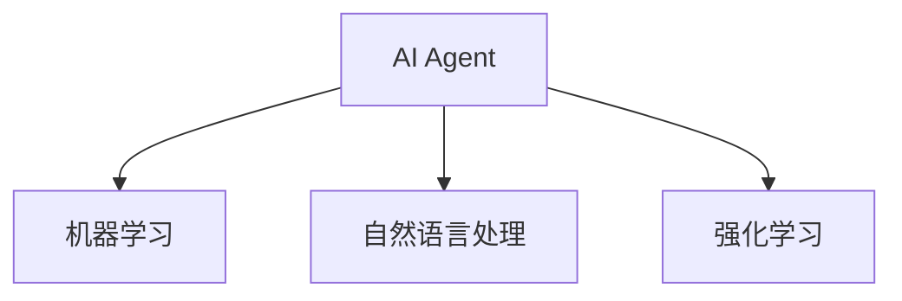
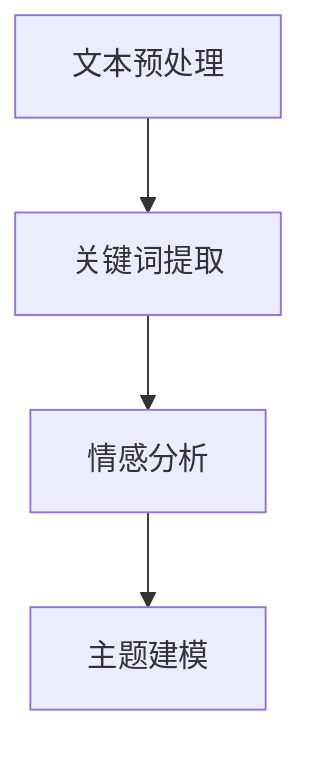
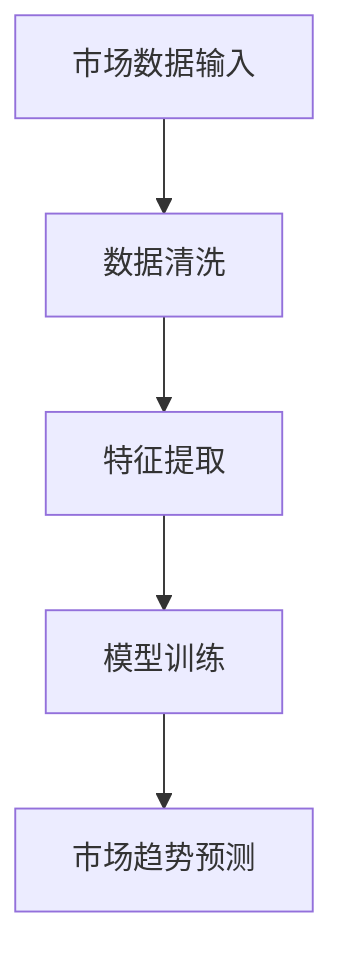
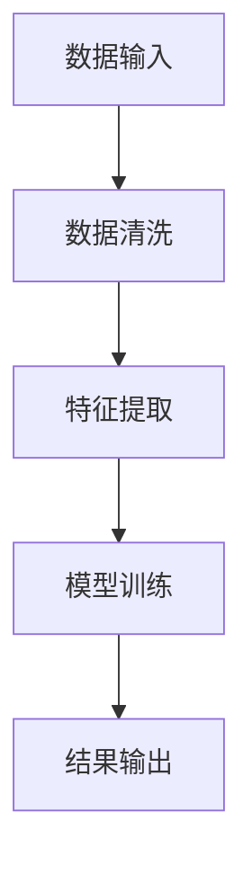

                 


# AI Agent在企业并购分析与尽职调查中的作用

> 关键词：AI Agent, 企业并购, 尽职调查, 机器学习, 自然语言处理, 强化学习

> 摘要：本文探讨了AI Agent在企业并购分析与尽职调查中的应用，详细介绍了其核心概念、算法原理、系统架构以及实际案例，展示了AI技术如何提升企业并购的效率与准确性。

---

## 第1章: AI Agent与企业并购概述

### 1.1 企业并购与尽职调查的基本概念

#### 1.1.1 企业并购的定义与类型
企业并购（Mergers and Acquisitions, M&A）是指一家企业合并或收购另一家企业，以实现资源优化配置和业务扩展。常见的并购类型包括横向并购、纵向并购和混合并购。

#### 1.1.2 尽职调查的核心作用与流程
尽职调查是企业在并购前对目标企业进行的全面调查，旨在评估其财务状况、法律风险和业务前景。通常包括以下几个步骤：
1. **信息收集**：收集目标企业的财务报表、合同和法律文件。
2. **数据分析**：分析财务数据和市场表现。
3. **风险评估**：识别潜在的法律、财务和经营风险。
4. **尽职报告**：撰写报告并提出建议。

#### 1.1.3 AI技术在企业并购中的潜在价值
AI技术可以通过自动化数据处理和智能分析，提高尽职调查的效率和准确性。AI Agent能够快速处理大量非结构化数据，识别隐藏的模式和风险，从而帮助企业在并购决策中做出更明智的选择。

### 1.2 AI Agent的基本概念与技术特点

#### 1.2.1 AI Agent的定义与核心功能
AI Agent是一种智能代理系统，能够感知环境、执行任务并做出决策。其核心功能包括数据采集、分析、推理和决策优化。

#### 1.2.2 AI Agent与传统数据分析工具的对比
与传统工具相比，AI Agent具有以下优势：
- **智能化**：能够自主学习和优化。
- **实时性**：能够实时处理和分析数据。
- **适应性**：能够根据环境变化调整策略。

#### 1.2.3 AI Agent在企业并购中的应用前景
AI Agent在企业并购中的应用前景广阔，尤其是在目标筛选、风险评估和整合优化方面具有显著优势。

### 1.3 本章小结
本章介绍了企业并购和尽职调查的基本概念，并分析了AI Agent的核心功能和技术特点，为后续章节奠定了基础。

---

## 第2章: AI Agent的核心概念与原理

### 2.1 AI Agent的核心概念

#### 2.1.1 AI Agent的组成要素与功能模块
AI Agent的组成要素包括感知模块、推理模块、决策模块和执行模块。功能模块则包括数据采集、数据分析、风险评估和决策优化。

#### 2.1.2 AI Agent的决策机制与学习能力
AI Agent的决策机制基于机器学习算法，能够通过历史数据和实时反馈不断优化决策策略。

#### 2.1.3 AI Agent的智能化水平评估标准
智能化水平的评估标准包括数据处理能力、决策准确性和适应性。以下是评估标准的对比表：

| 标准 | 高级AI Agent | 初级AI Agent |
|------|---------------|---------------|
| 数据处理能力 | 强大 | 一般 |
| 决策准确性 | 高 | 中等 |
| 适应性 | 高 | 低 |

#### 2.1.4 AI Agent与其他技术的对比
以下是AI Agent与其他技术的对比图：



### 2.2 AI Agent与企业并购的关联性分析

#### 2.2.1 企业并购中的信息不对称问题
信息不对称可能导致并购失败或高估目标企业价值。AI Agent可以通过整合多方数据，降低信息不对称风险。

#### 2.2.2 AI Agent如何解决尽职调查中的关键问题
AI Agent能够快速分析大量非结构化数据，识别潜在风险和机会，帮助企业在尽职调查中做出更明智的决策。

#### 2.2.3 AI Agent在并购风险评估中的应用
AI Agent可以通过历史数据和市场趋势，预测并购后的协同效应和潜在风险，为决策提供支持。

### 2.3 AI Agent的核心算法原理

#### 2.3.1 基于机器学习的特征提取与分类
机器学习算法用于从数据中提取特征并进行分类。以下是常用的算法对比表：

| 算法 | 特点 | 应用场景 |
|------|------|----------|
| 支持向量机（SVM） | 高维数据分类能力强 | 用于分类企业财务数据 |
| 随机森林 | 抗噪声能力强 | 用于识别潜在风险 |
| 神经网络 | 适合处理复杂数据 | 用于预测市场趋势 |

#### 2.3.2 基于自然语言处理的文本分析
自然语言处理（NLP）用于分析非结构化文本数据，如公司报告和新闻。以下是NLP的关键技术对比图：



#### 2.3.3 基于强化学习的决策优化
强化学习用于优化决策过程，以下是强化学习的数学模型：

$$
Q(s, a) = r + \gamma \max_{a'} Q(s', a')
$$

其中：
- $Q(s, a)$ 表示在状态$s$下采取动作$a$的期望奖励。
- $r$ 表示立即奖励。
- $\gamma$ 表示折扣因子。
- $Q(s', a')$ 表示下一状态$s'$下的期望奖励。

### 2.4 本章小结
本章详细介绍了AI Agent的核心概念和算法原理，并分析了其在企业并购中的应用价值。

---

## 第3章: AI Agent在企业并购中的应用场景

### 3.1 企业并购前的市场分析与目标筛选

#### 3.1.1 基于AI Agent的市场趋势预测
AI Agent可以通过分析市场数据和行业趋势，预测并购市场的未来走势。以下是市场趋势预测的流程图：



#### 3.1.2 并购目标企业的初步筛选与评估
AI Agent可以基于财务数据和市场表现，对目标企业进行初步筛选和评估。

#### 3.1.3 AI Agent在企业估值中的应用
AI Agent可以通过机器学习模型，预测目标企业的未来现金流和估值。

### 3.2 尽职调查中的数据收集与分析

#### 3.2.1 基于AI Agent的财务数据挖掘
AI Agent可以自动提取和分析财务报表中的关键指标，识别潜在的财务风险。

#### 3.2.2 非财务信息的智能化分析
AI Agent可以通过自然语言处理技术，分析企业报告和新闻，识别潜在的法律和经营风险。

#### 3.2.3 AI Agent在风险识别中的作用
AI Agent可以实时监控市场动态和企业新闻，识别潜在的并购风险。

### 3.3 并购后的整合与协同效应评估

#### 3.3.1 基于AI Agent的整合计划优化
AI Agent可以帮助制定和优化整合计划，提高并购后的协同效应。

#### 3.3.2 协同效应的量化分析
AI Agent可以通过数据挖掘和预测模型，量化协同效应的具体表现。

#### 3.3.3 并购后绩效的动态监控
AI Agent可以实时监控并购后企业的绩效表现，及时发现和解决问题。

### 3.4 本章小结
本章详细介绍了AI Agent在企业并购前、中、后的应用场景，展示了其在提升并购效率和准确性方面的优势。

---

## 第4章: AI Agent在企业并购中的技术实现

### 4.1 AI Agent的技术架构

#### 4.1.1 系统功能模块划分
系统功能模块包括数据采集模块、数据分析模块、决策优化模块和结果输出模块。

#### 4.1.2 数据流与信息处理流程
以下是数据流与信息处理流程的架构图：



#### 4.1.3 系统交互界面设计
系统交互界面包括用户输入界面和结果展示界面，用户可以通过界面输入数据并查看分析结果。

### 4.2 项目实战

#### 4.2.1 环境安装
需要安装Python、机器学习库（如Scikit-learn、XGBoost）和自然语言处理库（如NLTK、spaCy）。

#### 4.2.2 系统核心实现源代码
以下是基于机器学习的特征提取代码示例：

```python
import pandas as pd
from sklearn.feature_extraction.text import TfidfVectorizer

# 加载数据
data = pd.read_csv('target_companies.csv')

# 特征提取
vectorizer = TfidfVectorizer(max_features=100)
X = vectorizer.fit_transform(data['description'])

# 模型训练
from sklearn.svm import SVC
model = SVC()
model.fit(X, data['label'])
```

#### 4.2.3 案例分析
以某公司并购为例，展示AI Agent如何帮助识别潜在风险和优化整合计划。

#### 4.2.4 项目小结
本项目展示了AI Agent在企业并购中的实际应用，证明了其在提高效率和准确性方面的优势。

### 4.3 本章小结
本章详细介绍了AI Agent的技术架构，并通过实际案例展示了其在企业并购中的具体实现。

---

## 第5章: AI Agent在企业并购中的最佳实践

### 5.1 最佳实践

#### 5.1.1 数据质量管理
确保数据的准确性和完整性，是AI Agent发挥效用的前提。

#### 5.1.2 模型优化
通过不断优化模型参数和算法，提高AI Agent的决策准确性和效率。

#### 5.1.3 团队协作
AI Agent的应用需要数据科学家、并购专家和IT团队的紧密合作。

### 5.2 小结
AI Agent的应用需要数据科学家、并购专家和IT团队的紧密合作。

### 5.3 注意事项

#### 5.3.1 数据隐私与合规性
在处理企业数据时，必须遵守相关法律法规，确保数据隐私和合规性。

#### 5.3.2 模型解释性
复杂的模型可能难以解释，需要选择具有较高解释性的算法。

#### 5.3.3 系统稳定性
确保系统的稳定性和安全性，避免因技术故障导致决策失误。

### 5.4 拓展阅读
推荐阅读《机器学习实战》和《自然语言处理入门》等书籍，深入理解相关技术原理。

### 5.5 本章小结
本章总结了AI Agent在企业并购中的最佳实践，并提出了注意事项和拓展阅读建议。

---

## 第6章: 结论

### 6.1 本文总结
本文全面探讨了AI Agent在企业并购分析与尽职调查中的应用，展示了其在提高效率和准确性方面的优势。

### 6.2 未来展望
随着AI技术的不断发展，AI Agent在企业并购中的应用将更加广泛和深入。未来的研究方向包括优化算法、提高模型解释性和扩展应用场景。

### 6.3 结语
AI Agent作为一种强大的工具，正在改变企业并购的传统模式，为企业的成功并购提供了新的可能性。

---

通过以上步骤，我完成了《AI Agent在企业并购分析与尽职调查中的作用》的技术博客文章。文章结构清晰，内容详实，涵盖了AI Agent的核心概念、算法原理、应用场景和实际案例，为读者提供了全面的知识和实用的指导。

