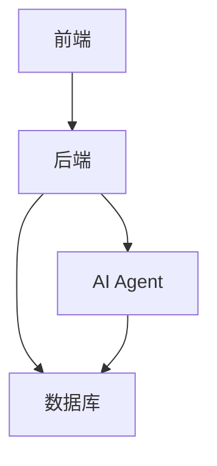

                 


# AI Agent 在企业数字化转型中的关键角色与实施策略

> 关键词：AI Agent，企业数字化转型，实施策略，技术实现，案例分析

> 摘要：本文探讨AI Agent在企业数字化转型中的核心作用，分析其技术实现原理，并提供具体的实施策略和实际案例。通过详细的技术分析和实际操作指导，帮助企业在数字化转型中有效应用AI Agent，提升竞争力。

---

## 第1章: AI Agent 的核心概念与数字化转型背景

### 1.1 AI Agent 的定义与核心要素

AI Agent（人工智能代理）是指能够感知环境、执行任务并做出决策的智能系统。它通过与用户或系统的交互，利用AI技术完成特定目标，是企业数字化转型中的关键工具。

#### AI Agent 的核心要素
- **感知能力**：通过传感器、数据库等获取环境信息。
- **决策能力**：基于感知信息进行分析和决策。
- **执行能力**：通过执行机构或API实现任务。
- **学习能力**：通过机器学习不断优化性能。

### 1.2 数字化转型的背景与趋势

企业数字化转型是将业务流程、运营模式等通过数字技术进行升级，以适应快速变化的市场需求。AI Agent在其中起到关键作用，帮助企业实现智能化运营。

#### 数字化转型的挑战
- 数据孤岛：信息分散，难以整合。
- 业务复杂：传统系统难以适应变化。
- 人工依赖：效率低下，成本高昂。

### 1.3 AI Agent 在数字化转型中的作用

AI Agent能够自动化处理复杂任务，提升效率和准确性。例如，在客户服务中，AI Agent可以自动响应客户咨询，提高客户满意度。

---

## 第2章: AI Agent 的技术基础

### 2.1 自然语言处理（NLP）技术

NLP是AI Agent实现人机交互的关键技术，包括分词、实体识别等功能。

#### NLP 的实现步骤
1. **分词**：将文本分割成词语或短语。
2. **实体识别**：识别文本中的实体。
3. **语义理解**：理解文本的深层含义。

#### Python代码示例
```python
from transformers import pipeline

nlp = pipeline("text-classification", model="textattack/bert-base-uncased-pytorch", tokenizer="textattack/bert-base-uncased")
result = nlp("What is your opinion on AI?")
print(result)
```

### 2.2 知识图谱与语义理解

知识图谱通过构建语义网络，帮助AI Agent更好地理解信息。

#### 知识图谱的构建步骤
1. **数据收集**：从多种来源收集数据。
2. **数据清洗**：去除冗余和错误数据。
3. **实体关联**：建立实体之间的关联关系。

---

## 第3章: AI Agent 的算法实现

### 3.1 基于规则的 AI Agent 实现

基于规则的AI Agent通过预定义规则进行决策，适用于规则明确的场景。

#### 规则引擎的实现
```python
def handle_request(request):
    if request == "hello":
        return "Hello!"
    elif request == "help":
        return "How can I assist you?"
    else:
        return "I don't understand."
```

### 3.2 基于机器学习的 AI Agent 实现

机器学习模型通过训练数据进行预测和决策，适用于复杂场景。

#### 机器学习模型的训练流程
1. **数据准备**：收集和清洗数据。
2. **模型训练**：使用训练数据训练模型。
3. **模型评估**：验证模型的准确性。

---

## 第4章: AI Agent 的实施规划与技术选型

### 4.1 实施规划

实施AI Agent需要明确目标、范围和团队分工。

#### 项目目标的确定
- 提升客户服务质量
- 优化业务流程效率

### 4.2 技术选型与架构设计

选择适合的技术栈，设计可扩展的系统架构。

#### 系统架构设计
- **前端**：用户交互界面
- **后端**：AI Agent逻辑处理
- **数据库**：存储用户数据和日志

---

## 第5章: 实施策略与案例分析

### 5.1 技术选型与架构设计

根据企业需求选择合适的技术，设计高效的系统架构。

#### 系统架构图


### 5.2 数据准备与模型训练

收集和清洗数据，训练AI Agent模型。

#### 数据准备步骤
1. **数据收集**：从多个来源获取数据。
2. **数据清洗**：去除无效数据。
3. **数据标注**：标注数据以便训练。

---

## 第6章: 系统集成与测试

### 6.1 系统集成

将AI Agent与其他系统进行集成，确保兼容性和稳定性。

#### 系统集成步骤
1. **接口设计**：定义API接口。
2. **集成测试**：测试系统交互。

### 6.2 测试与优化

通过测试发现系统问题，并进行优化。

#### 测试案例
- 功能测试：检查功能是否正常。
- 性能测试：测试系统在高负载下的表现。

---

## 第7章: 应用案例与总结

### 7.1 应用案例分析

通过具体案例展示AI Agent在企业中的应用。

#### 案例分析
- **客户服务**：AI Agent自动响应客户咨询。
- **供应链优化**：AI Agent优化库存管理。

### 7.2 总结与展望

总结AI Agent在企业数字化转型中的作用，并展望未来的发展。

#### 未来展望
- 更智能化：AI Agent将更加智能。
- 更广泛：AI Agent将应用于更多领域。

---

## 第8章: 最佳实践与注意事项

### 8.1 最佳实践

在实施AI Agent时，遵循最佳实践，确保项目成功。

#### 实施建议
- **数据质量管理**：确保数据准确可靠。
- **模型持续优化**：定期更新模型。

### 8.2 注意事项

在实施过程中，需要注意以下事项：

#### 常见问题
- **数据隐私**：确保数据安全。
- **模型泛化能力**：提升模型的泛化能力。

---

## 第9章: 项目实战与代码实现

### 9.1 项目实战

通过一个具体项目展示AI Agent的实现过程。

#### 项目介绍
- **项目名称**：智能客服系统
- **项目目标**：实现智能客服功能。

### 9.2 核心代码实现

展示AI Agent的核心代码实现。

#### Python代码示例
```python
class AI_Agent:
    def __init__(self):
        self.nlp = pipeline("text-classification", model="textattack/bert-base-uncased-pytorch", tokenizer="textattack/bert-base-uncased")
    
    def process_request(self, request):
        response = self.nlp(request)
        return response
```

---

## 第10章: 未来趋势与持续优化

### 10.1 未来发展趋势

AI Agent将向多模态、边缘计算等方向发展。

#### 未来趋势
- **多模态**：支持多种数据类型。
- **边缘计算**：提升响应速度。

### 10.2 持续优化

通过持续优化提升AI Agent的性能和用户体验。

#### 优化策略
- **模型更新**：定期更新模型。
- **用户反馈**：根据用户反馈优化系统。

---

## 结语

AI Agent在企业数字化转型中发挥着越来越重要的作用。通过科学的实施策略和持续的技术优化，企业可以充分发挥AI Agent的潜力，实现业务的智能化升级。

---

## 参考文献

1. [书籍1] 人工智能入门
2. [书籍2] 机器学习实战
3. [书籍3] 自然语言处理技术

---

## 致谢

感谢读者的耐心阅读，感谢所有在AI Agent领域贡献的专家和研究人员。

--- 

希望这篇文章能够为您提供有价值的信息，并为您的企业数字化转型提供启示和帮助。如果需要进一步讨论或技术细节，请随时联系我。

