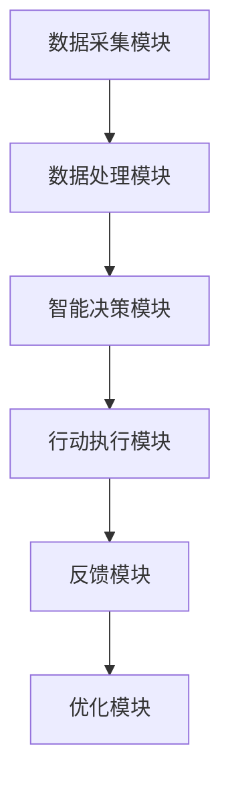

                 


# AI Agent在企业数字化转型中的核心驱动作用

## 关键词：
AI Agent，企业数字化转型，智能化决策，系统架构设计，算法实现，数字化创新

## 摘要：
在企业数字化转型的浪潮中，AI Agent作为一种智能实体，正在发挥着越来越重要的作用。本文将从AI Agent的基本概念出发，深入探讨其在企业数字化转型中的核心驱动作用，详细分析其技术原理、系统架构设计、算法实现，以及在实际项目中的应用。通过本篇文章，读者将全面了解AI Agent如何赋能企业数字化转型，为企业智能化决策和业务创新提供新的思路。

---

# 第一部分：AI Agent的基本概念与背景

## 第1章：AI Agent的基本概念与背景

### 1.1 AI Agent的定义与特点
#### 1.1.1 什么是AI Agent
AI Agent（人工智能代理）是一种能够感知环境、自主决策并执行任务的智能实体。它通过传感器获取信息，利用算法进行分析和决策，并通过执行器与环境交互。AI Agent可以是软件程序、机器人或其他智能设备。

| **特点**       | **描述**                                                                 |
|----------------|--------------------------------------------------------------------------|
| 智能性          | 能够理解和处理复杂信息，具备学习和推理能力。                              |
| 自主性          | 可以在没有人工干预的情况下独立完成任务。                                  |
| 适应性          | 能够根据环境变化调整行为和决策策略。                                      |
| 交互性          | 能够与人类或其他系统进行有效沟通和协作。                                  |

#### 1.1.2 AI Agent的核心特点
AI Agent的核心特点在于其智能性和自主性。智能性体现在其能够处理复杂信息并做出合理决策；自主性则体现在其能够在没有外部干预的情况下完成任务。例如，在企业中，AI Agent可以自动处理订单、优化供应链或预测市场需求。

#### 1.1.3 AI Agent与传统技术的区别
与传统技术相比，AI Agent的最大区别在于其具备智能性和自主性。传统技术通常依赖于固定的规则和流程，而AI Agent能够根据环境变化动态调整行为。例如，传统订单处理系统需要人工干预，而AI Agent可以自动完成从订单接收、库存检查到发货的整个流程。

### 1.2 AI Agent在企业数字化转型中的作用
#### 1.2.1 数字化转型的背景与挑战
企业数字化转型的核心目标是通过技术手段提升效率、优化流程并创造新的价值。然而，在转型过程中，企业面临诸多挑战，如数据孤岛、业务复杂性和决策滞后等。AI Agent作为一种智能化工具，能够有效解决这些问题。

#### 1.2.2 AI Agent在转型中的核心驱动作用
AI Agent通过智能化决策和自动化执行，帮助企业实现业务流程的优化和创新。例如，在供应链管理中，AI Agent可以实时监控库存变化，预测需求并优化采购计划，从而降低运营成本。

#### 1.2.3 AI Agent的应用场景与价值
AI Agent的应用场景广泛，包括客户服务、供应链管理、市场营销、风险管理等。其价值体现在提高效率、降低成本、增强决策能力和提升客户体验等方面。

---

## 第2章：AI Agent的核心原理与技术

### 2.1 AI Agent的感知机制
#### 2.1.1 数据采集与处理
AI Agent通过传感器或API获取环境中的数据，如订单信息、库存数据和市场趋势。数据采集后需要进行清洗、转换和存储，以便后续处理。

#### 2.1.2 信息分析与理解
通过自然语言处理（NLP）和机器学习（ML）技术，AI Agent能够理解数据中的潜在含义。例如，通过对客户评论的分析，AI Agent可以识别客户情感并预测市场需求。

#### 2.1.3 感知模型的构建
感知模型通常基于深度学习算法构建，如卷积神经网络（CNN）和循环神经网络（RNN）。这些模型能够从数据中提取特征并识别模式。

### 2.2 AI Agent的决策机制
#### 2.2.1 决策算法与模型
AI Agent的决策算法包括基于规则的算法和基于模型的算法。基于规则的算法通过预定义的规则进行决策，而基于模型的算法则利用机器学习模型进行预测和优化。

#### 2.2.2 多目标优化与权衡
在复杂环境中，AI Agent需要在多个目标之间进行权衡。例如，在供应链管理中，AI Agent需要在库存成本和交付时间之间找到最优解。

#### 2.2.3 决策的可解释性
AI Agent的决策需要具备可解释性，以便企业能够理解并信任其决策过程。例如，当AI Agent建议采购某种产品时，需要能够解释其背后的逻辑和依据。

### 2.3 AI Agent的执行机制
#### 2.3.1 行动规划与执行
AI Agent根据决策结果制定行动计划，并通过执行器或API调用相关服务。例如，在客户服务中，AI Agent可以自动发送邮件或安排回访。

#### 2.3.2 执行效果的反馈与优化
执行后，AI Agent需要收集反馈信息并进行优化。例如，如果AI Agent的决策导致库存过剩，系统会调整采购策略以避免类似问题。

#### 2.3.3 执行过程中的异常处理
AI Agent需要具备异常检测和处理能力，以应对突发情况。例如，当供应链中断时，AI Agent可以迅速调整生产计划或寻找替代供应商。

---

## 第3章：AI Agent的系统架构与设计

### 3.1 系统架构概述
AI Agent的系统架构通常采用分层设计，包括感知层、决策层和执行层。感知层负责数据采集与处理，决策层负责分析与决策，执行层负责任务执行与反馈。

### 3.2 系统功能设计
#### 3.2.1 数据采集与处理模块
- 数据采集：通过传感器或API获取环境数据。
- 数据清洗：去除噪声数据，确保数据质量。
- 数据存储：将数据存储到数据库中，以便后续处理。

#### 3.2.2 智能决策模块
- 数据分析：利用机器学习模型对数据进行分析和预测。
- 决策制定：基于分析结果制定最优决策。
- 可解释性：提供决策的解释和依据。

#### 3.2.3 行动执行模块
- 行动规划：根据决策结果制定行动计划。
- 任务执行：通过执行器或API调用相关服务。
- 反馈收集：收集执行结果并反馈给系统。

### 3.3 系统架构图


### 3.4 系统接口设计
#### 3.4.1 数据接口
- 输入接口：接收外部数据，如订单信息和市场数据。
- 输出接口：将处理后的数据发送到其他系统或存储到数据库。

#### 3.4.2 服务接口
- 决策接口：接收决策请求并返回决策结果。
- 执行接口：接收执行指令并调用相关服务。

#### 3.4.3 用户接口
- 输入接口：接收用户的输入指令。
- 输出接口：将决策结果以用户友好的方式展示。

### 3.5 本章小结
本章详细介绍了AI Agent的系统架构与设计，包括感知层、决策层和执行层的功能模块，以及系统的接口设计。通过合理的系统架构设计，AI Agent能够高效地完成任务并适应复杂环境。

---

## 第4章：AI Agent的算法原理与实现

### 4.1 算法原理概述
AI Agent的核心算法包括感知算法和决策算法。感知算法用于数据处理和特征提取，决策算法用于分析和预测。

### 4.2 算法实现流程
#### 4.2.1 数据预处理
- 数据清洗：去除噪声数据。
- 数据转换：将数据转换为适合算法处理的形式。
- 数据归约：降低数据维度，减少计算量。

#### 4.2.2 模型训练
- 特征选择：选择对任务最重要的特征。
- 模型训练：利用训练数据训练机器学习模型。
- 模型评估：通过测试数据评估模型的性能。

#### 4.2.3 算法优化
- 超参数调优：通过网格搜索或随机搜索优化模型参数。
- 模型集成：通过集成学习提升模型性能。
- 模型部署：将训练好的模型部署到生产环境。

### 4.3 算法实现的数学模型
#### 4.3.1 感知模型的数学表达
感知模型通常基于深度学习算法构建，例如卷积神经网络（CNN）和循环神经网络（RNN）。以CNN为例，其数学表达如下：

$$
f(x) = \text{ReLU}(W \cdot x + b)
$$

其中，$W$ 是权重矩阵，$b$ 是偏置项，$\text{ReLU}$ 是激活函数。

#### 4.3.2 决策模型的数学表达
决策模型通常基于回归或分类算法构建。以线性回归为例，其数学表达如下：

$$
y = \beta_0 + \beta_1 x + \epsilon
$$

其中，$\beta_0$ 是截距，$\beta_1$ 是回归系数，$\epsilon$ 是误差项。

---

## 第5章：AI Agent的项目实战

### 5.1 项目背景与目标
假设我们正在开发一个AI Agent，用于优化企业的供应链管理。项目的目标是通过AI Agent实时监控库存、预测需求并优化采购计划。

### 5.2 环境配置
- 操作系统：Linux
- 开发工具：PyCharm
- 依赖库：Python 3.8+, TensorFlow 2.0+, Pandas 1.0+, Scikit-learn 0.24+

### 5.3 核心代码实现
#### 5.3.1 数据采集与处理
```python
import pandas as pd

# 读取订单数据
orders = pd.read_csv('orders.csv')

# 读取库存数据
inventory = pd.read_csv('inventory.csv')

# 合并数据
data = pd.merge(orders, inventory, on='product_id')
```

#### 5.3.2 模型训练与部署
```python
from sklearn.tree import DecisionTreeRegressor

# 训练模型
model = DecisionTreeRegressor(max_depth=5)
model.fit(X_train, y_train)

# 预测需求
y_pred = model.predict(X_test)
```

#### 5.3.3 任务执行与反馈
```python
def execute_action(action):
    if action == 'procure':
        # 下采购订单
        send采购订单()
    elif action == 'adjust':
        # 调整库存
        调整库存()
```

### 5.4 案例分析与详细解读
以供应链管理为例，AI Agent通过实时监控库存和预测需求，优化采购计划。例如，当预测到某产品需求将增加时，AI Agent会自动下采购订单，确保库存充足。

### 5.5 本章小结
本章通过一个实际案例展示了AI Agent的项目实战，包括环境配置、核心代码实现和案例分析。通过实际操作，读者可以更好地理解AI Agent在企业数字化转型中的应用价值。

---

## 第6章：总结与展望

### 6.1 总结
本文详细探讨了AI Agent在企业数字化转型中的核心驱动作用，从基本概念到系统架构设计，再到算法实现和项目实战，全面介绍了AI Agent的技术细节和应用场景。通过AI Agent，企业可以实现智能化决策和自动化执行，显著提升效率和竞争力。

### 6.2 展望
随着人工智能技术的不断发展，AI Agent将在企业数字化转型中发挥越来越重要的作用。未来，AI Agent将更加智能化和个性化，能够更好地适应复杂环境并为企业创造更大的价值。

---

通过本文的深入探讨，读者可以全面理解AI Agent在企业数字化转型中的核心作用，并能够将其应用于实际项目中。

