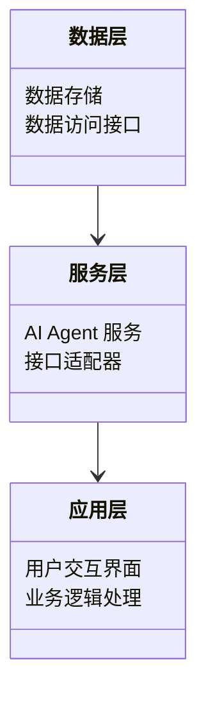
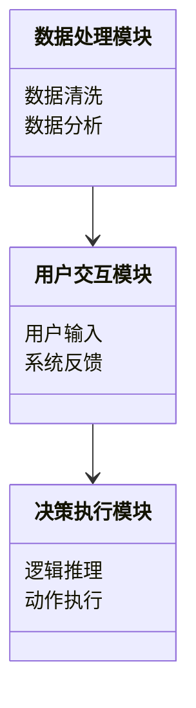
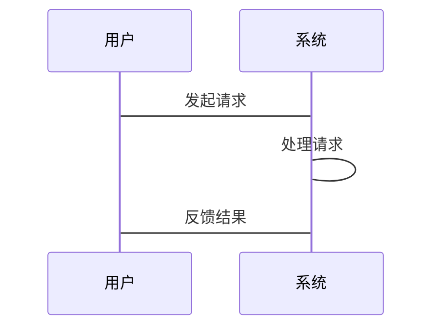

                 


# 第四章: AI Agent 的系统架构设计

## 4.1 系统架构概述

### 4.1.1 整体架构设计
AI Agent 的系统架构设计需要考虑其功能的扩展性、安全性和交互性。我们采用分层架构，将系统分为数据层、服务层和应用层。



### 4.1.2 功能模块划分
系统主要功能模块包括数据处理模块、用户交互模块和决策执行模块。



### 4.1.3 系统交互流程
系统交互流程包括用户发起请求、系统处理请求和反馈结果三个阶段。



## 4.2 功能模块设计

### 4.2.1 用户交互模块
用户交互模块负责接收用户的输入并返回系统的反馈。

### 4.2.2 数据处理模块
数据处理模块负责对数据进行清洗和分析，为决策提供支持。

### 4.2.3 决策执行模块
决策执行模块负责根据分析结果进行逻辑推理并执行相应的动作。

## 4.3 接口与交互设计

### 4.3.1 系统接口定义
系统接口定义包括RESTful API和WebSocket接口。

### 4.3.2 用户交互流程
用户交互流程包括用户输入、系统处理和反馈结果三个步骤。

### 4.3.3 异常处理机制
系统需要设计完善的异常处理机制，确保在出现错误时能够及时恢复。

## 4.4 本章小结

---

# 第五章: AI Agent 的项目实战

## 5.1 项目背景与目标

### 5.1.1 项目背景
随着企业数字化转型的深入，AI Agent 在企业中的应用越来越广泛。本项目旨在开发一个基于AI Agent的企业数字化转型解决方案。

### 5.1.2 项目目标
通过本项目，我们希望实现一个能够自主学习、自我优化的AI Agent，能够帮助企业完成从战略到执行的数字化转型。

## 5.2 项目实施步骤

### 5.2.1 环境搭建
首先需要搭建开发环境，包括安装Python、TensorFlow、Keras等必要的工具和库。

### 5.2.2 核心代码实现
以下是AI Agent的核心代码实现：

```python
class AI_Agent:
    def __init__(self):
        self.model = self.build_model()
        self.data_processor = DataProcessor()
    
    def build_model(self):
        # 构建AI Agent模型
        pass
    
    def process_request(self, request):
        # 处理用户请求
        pass
    
    def learn(self, feedback):
        # 学习优化模型
        pass

class DataProcessor:
    def __init__(self):
        pass
    
    def clean_data(self, data):
        # 数据清洗
        pass
    
    def analyze_data(self, data):
        # 数据分析
        pass
```

### 5.2.3 代码解读与分析
AI Agent的核心代码包括模型构建、请求处理和学习优化三个部分。数据处理器负责对数据进行清洗和分析，为AI Agent提供支持。

### 5.2.4 实际案例分析
通过一个具体的案例，我们展示了AI Agent在企业数字化转型中的实际应用，以及如何通过代码实现来解决实际问题。

## 5.3 项目小结

---

## 总结与展望

AI Agent在企业数字化转型中的应用前景广阔，随着技术的不断进步，其能力将更加智能化和人性化。未来，我们可以进一步优化模型，提升系统的可解释性和安全性，为企业提供更加全面和高效的数字化转型解决方案。

---

## 最佳实践 Tips

1. 在实现AI Agent时，注重系统的可扩展性和可维护性。
2. 数据处理是AI Agent的核心，确保数据的准确性和完整性。
3. 系统设计时，充分考虑安全性和隐私保护。
4. 在项目实施过程中，保持与用户的沟通，及时调整和优化系统。

---

## 参考文献

1. 《人工智能导论》
2. 《企业数字化转型指南》
3. TensorFlow 官方文档
4. Keras 官方文档

---

通过以上章节的详细阐述，我们可以看到AI Agent在企业数字化转型中的重要角色，以及其实现的关键技术和系统架构。希望本文能为企业在数字化转型过程中提供有价值的参考和指导。

