                 


# AI Agent在企业数字营销中的全渠道应用

> 关键词：AI Agent，企业数字营销，全渠道应用，人工智能，营销自动化，数据驱动

> 摘要：本文详细探讨了AI Agent在企业数字营销中的全渠道应用，从核心概念到算法原理，从系统架构到项目实战，全面解析了AI Agent如何助力企业实现智能化、个性化、全渠道的数字营销策略。

---

# 第1章: AI Agent与企业数字营销的背景

## 1.1 AI Agent的基本概念与特征

### 1.1.1 AI Agent的定义
AI Agent（人工智能代理）是指能够感知环境、自主决策并执行任务的智能体。在企业数字营销中，AI Agent通常表现为一种自动化工具，能够根据实时数据和用户行为，动态调整营销策略和内容。

### 1.1.2 AI Agent的核心特征
| 特征维度 | 描述 |
|----------|------|
| 智能性    | 基于机器学习和深度学习技术，能够自我学习和优化。 |
| 自主性    | 能够在没有人工干预的情况下独立完成任务。 |
| 实时性    | 可以实时分析数据并做出快速反应。 |
| 个性化    | 根据用户行为和偏好，提供个性化的内容和服务。 |

### 1.1.3 AI Agent与传统营销工具的区别
- **传统营销工具**：基于规则的自动化工具，例如简单的自动回复邮件或广告投放。
- **AI Agent**：基于机器学习和数据驱动的智能工具，能够动态调整策略并优化效果。

**图1-1 AI Agent与传统营销工具的对比**
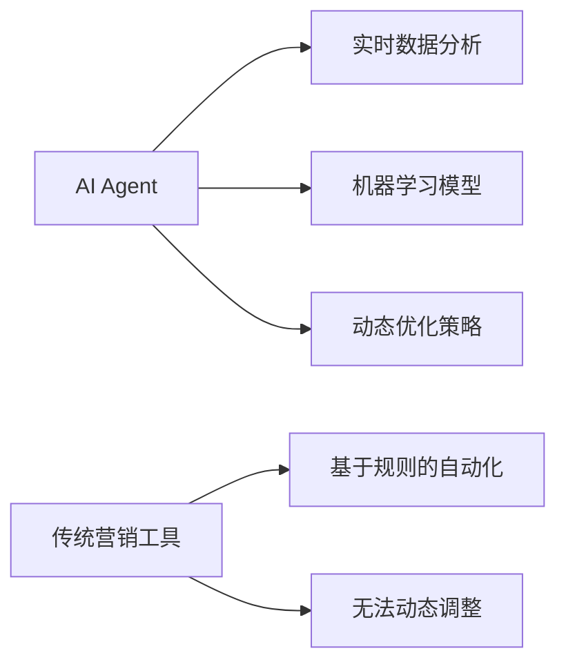

## 1.2 数字营销的现状与挑战

### 1.2.1 数字营销的发展历程
- **第一阶段**：传统广告（如电视、报纸）。
- **第二阶段**：互联网广告（如搜索引擎营销、社交媒体广告）。
- **第三阶段**：数据驱动的营销（如精准广告投放）。
- **第四阶段**：智能营销（AI Agent驱动的全渠道营销）。

### 1.2.2 当前数字营销的主要挑战
- **数据孤岛**：不同渠道的数据难以整合。
- **用户行为复杂**：用户行为难以预测和跟踪。
- **效率低下**：传统营销工具效率低，难以应对实时变化。
- **个性化不足**：难以实现真正的个性化营销。

### 1.2.3 全渠道营销的概念与重要性
全渠道营销是指通过多种渠道（如社交媒体、电子邮件、移动应用等）与用户互动，确保用户在任何渠道上都能获得一致的体验。AI Agent在全渠道营销中的作用至关重要，因为它能够协调不同渠道的数据和策略，实现无缝互动。

## 1.3 AI Agent在数字营销中的作用

### 1.3.1 AI Agent如何推动营销智能化
AI Agent通过实时数据分析和机器学习模型，能够快速识别市场趋势和用户需求，从而优化营销策略。

### 1.3.2 AI Agent在全渠道营销中的优势
- **数据整合**：AI Agent能够整合不同渠道的数据，提供全局视角。
- **动态优化**：根据实时数据动态调整营销策略。
- **个性化体验**：基于用户行为和偏好，提供个性化内容。

### 1.3.3 企业采用AI Agent的驱动力与阻碍
- **驱动力**：提高效率、降低成本、提升客户体验。
- **阻碍**：技术门槛高、数据隐私问题、员工技能不足。

## 1.4 本章小结
本章介绍了AI Agent的基本概念和特征，分析了数字营销的现状与挑战，以及AI Agent在全渠道营销中的作用和优势。通过对比传统营销工具和AI Agent，突出了AI Agent在数字营销中的重要性。

---

# 第2章: AI Agent的核心概念与原理

## 2.1 AI Agent的工作原理

### 2.1.1 AI Agent的感知模块
AI Agent的感知模块负责从各种渠道收集数据，例如社交媒体评论、点击流数据等。

**图2-1 AI Agent的感知模块**
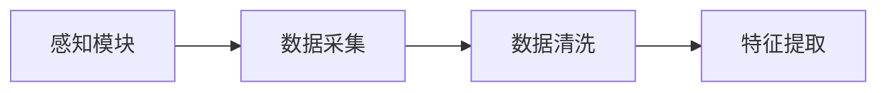

### 2.1.2 AI Agent的决策模块
决策模块基于感知模块提供的数据，通过机器学习模型生成决策。

**图2-2 AI Agent的决策模块**
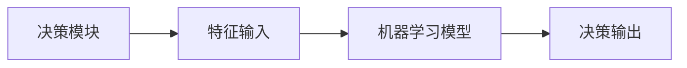

### 2.1.3 AI Agent的执行模块
执行模块根据决策模块的输出，执行具体的营销任务，例如发送邮件、发布社交媒体内容等。

**图2-3 AI Agent的执行模块**
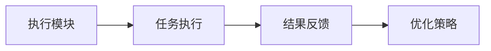

## 2.2 AI Agent与数字营销的结合

### 2.2.1 AI Agent在客户画像中的应用
AI Agent可以通过分析用户行为数据，构建精准的客户画像。

**图2-4 客户画像构建流程**
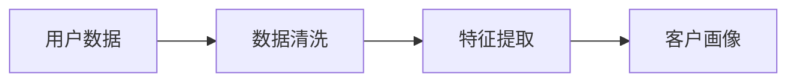

### 2.2.2 AI Agent在内容生成中的应用
AI Agent可以根据目标受众的偏好，自动生成个性化的内容。

**图2-5 内容生成流程**
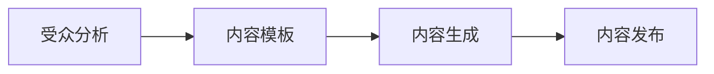

### 2.2.3 AI Agent在营销效果监测中的应用
AI Agent可以实时监测营销活动的效果，并动态调整策略。

**图2-6 营销效果监测流程**
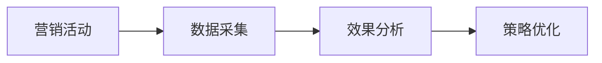

## 2.3 AI Agent的核心算法与技术

### 2.3.1 自然语言处理（NLP）在AI Agent中的应用
自然语言处理技术用于分析文本数据，例如社交媒体评论的情感分析。

**图2-7 情感分析流程**
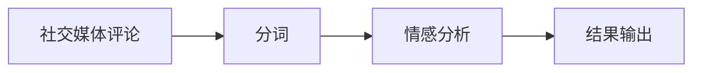

**代码示例：情感分析**
```python
from transformers import pipeline

sentiment_analyzer = pipeline("sentiment-analysis")
result = sentiment_analyzer("This product is great!")
print(result)
```

### 2.3.2 强化学习在AI Agent中的应用
强化学习用于优化AI Agent的决策策略。

**图2-8 强化学习流程**
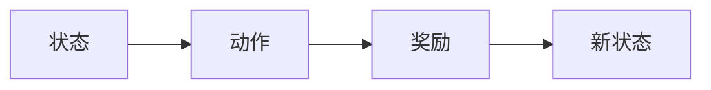

**代码示例：强化学习**
```python
import numpy as np

class Agent:
    def __init__(self, state_space, action_space):
        self.state_space = state_space
        self.action_space = action_space
        self.reward = 0

    def take_action(self, state):
        # 简单的策略：随机选择动作
        action = np.random.choice(self.action_space)
        return action

    def update_reward(self, reward):
        self.reward = reward
```

### 2.3.3 图神经网络在AI Agent中的应用
图神经网络用于分析复杂的关系网络，例如用户-产品关系。

**图2-9 图神经网络流程**
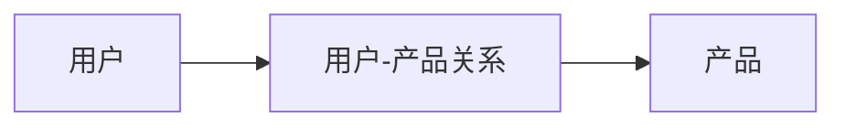

**代码示例：图神经网络**
```python
import tensorflow as tf
from tensorflow.keras.layers import Dense, Input
from tensorflow.keras import Model

# 定义模型
input_layer = Input(shape=(input_dim,))
dense_layer = Dense(64, activation='relu')(input_layer)
output_layer = Dense(1, activation='sigmoid')(dense_layer)

model = Model(inputs=input_layer, outputs=output_layer)
model.compile(optimizer='adam', loss='binary_crossentropy')
```

## 2.4 本章小结
本章详细介绍了AI Agent的核心概念与原理，包括感知、决策和执行模块，以及在客户画像、内容生成和营销效果监测中的应用。通过具体算法和技术的讲解，突出了AI Agent在数字营销中的技术基础。

---

# 第3章: AI Agent在全渠道营销中的应用场景

## 3.1 社交媒体营销中的AI Agent应用

### 3.1.1 社交媒体内容生成与优化
AI Agent可以根据目标受众的偏好，生成个性化的内容，并实时优化内容以提高互动率。

**图3-1 社交媒体内容生成与优化流程**
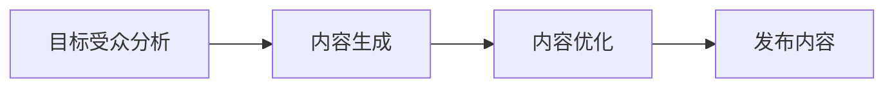

**代码示例：内容生成**
```python
from transformers import GPT2LMHeadModel, AutoTokenizer

tokenizer = AutoTokenizer.from_pretrained("gpt2")
model = GPT2LMHeadModel.from_pretrained("gpt2")

# 生成内容
input_text = "Write a social media post about..."
inputs = tokenizer.encode(input_text, return_tensors="pt")
outputs = model.generate(inputs, max_length=100, num_beams=5)
print(tokenizer.decode(outputs[0]))
```

### 3.1.2 社交媒体广告投放优化
AI Agent可以根据实时数据动态调整广告投放策略，例如调整预算分配和关键词选择。

**图3-2 社交媒体广告投放优化流程**
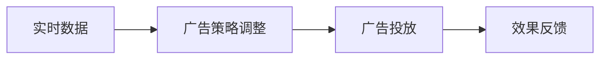

**代码示例：广告投放优化**
```python
import pandas as pd
from sklearn.linear_model import LogisticRegression

# 数据准备
data = pd.DataFrame({
    '关键词': ['ad1', 'ad2', 'ad3'],
    '点击率': [0.1, 0.2, 0.15]
})

# 模型训练
model = LogisticRegression()
model.fit(data[['关键词']], data['点击率'])

# 预测
new_data = pd.DataFrame({
    '关键词': ['ad4', 'ad5']
})
predictions = model.predict(new_data[['关键词']])
print(predictions)
```

## 3.2 电子邮件营销中的AI Agent应用

### 3.2.1 个性化邮件内容生成
AI Agent可以根据用户的行为和偏好，生成个性化的邮件内容。

**图3-3 个性化邮件内容生成流程**
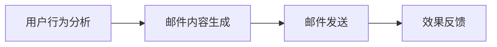

**代码示例：个性化邮件生成**
```python
from sklearn.cluster import KMeans

# 数据准备
customer_data = pd.DataFrame({
    '行为特征': [...],
    '偏好': [...]
})

# 模型训练
model = KMeans(n_clusters=5)
model.fit(customer_data)

# 分群结果
clusters = model.predict(customer_data)
print(clusters)
```

### 3.2.2 邮件发送策略优化
AI Agent可以根据用户的行为和数据，动态调整邮件发送频率和内容。

**图3-4 邮件发送策略优化流程**
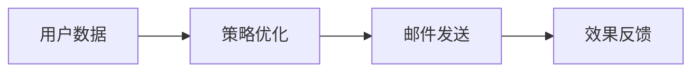

**代码示例：邮件发送策略优化**
```python
import numpy as np

# 数据准备
customer_data = pd.DataFrame({
    '用户ID': [1, 2, 3, 4, 5],
    '行为特征': [...],
    '响应率': [0.1, 0.2, 0.15, 0.3, 0.05]
})

# 策略优化
def optimize_strategy(data):
    # 简单策略：根据响应率排序，优先发送给高响应率用户
    data.sort_values('响应率', ascending=False)
    return data['用户ID'].tolist()

optimized_strategy = optimize_strategy(customer_data)
print(optimized_strategy)
```

## 3.3 搜索引擎营销中的AI Agent应用

### 3.3.1 关键词优化
AI Agent可以根据搜索数据，动态调整关键词策略，提高广告点击率。

**图3-5 关键词优化流程**
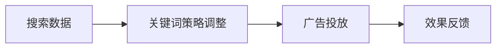

**代码示例：关键词优化**
```python
from sklearn.tree import DecisionTreeClassifier

# 数据准备
search_data = pd.DataFrame({
    '关键词': ['关键词1', '关键词2', '关键词3'],
    '点击率': [0.1, 0.2, 0.15]
})

# 模型训练
model = DecisionTreeClassifier()
model.fit(search_data[['关键词']], search_data['点击率'])

# 预测
new_keyword = pd.DataFrame({'关键词': ['关键词4']})
predictions = model.predict(new_keyword[['关键词']])
print(predictions)
```

### 3.3.2 广告效果监测
AI Agent可以实时监测广告效果，并动态调整广告投放策略。

**图3-6 广告效果监测流程**
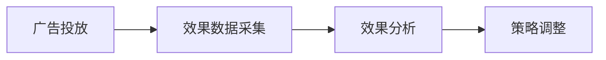

**代码示例：广告效果监测**
```python
import tensorflow as tf
from tensorflow.keras.layers import Dense, Input
from tensorflow.keras import Model

# 定义模型
input_layer = Input(shape=(input_dim,))
dense_layer = Dense(64, activation='relu')(input_layer)
output_layer = Dense(1, activation='sigmoid')(dense_layer)

model = Model(inputs=input_layer, outputs=output_layer)
model.compile(optimizer='adam', loss='binary_crossentropy')

# 训练模型
model.fit(X_train, y_train, epochs=10, batch_size=32)
```

## 3.4 其他全渠道应用

### 3.4.1 移动应用营销中的AI Agent应用
AI Agent可以优化移动应用内的用户体验，例如推荐系统和推送通知。

**图3-7 移动应用营销流程**
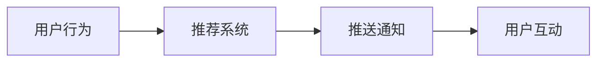

**代码示例：推荐系统**
```python
from surprise import SVD, Dataset, Reader

# 数据准备
data = Dataset.load_from_file('ratings.csv', format='csv', sep=',', header=None, reader=Reader(line_format='user item rating'))

# 模型训练
model = SVD()
model.fit(data.build_full_trainset())

# 推荐
testset = data.build_testset()
predictions = model.test(testset)
print(predictions)
```

### 3.4.2 在线零售营销中的AI Agent应用
AI Agent可以优化在线零售的营销策略，例如动态定价和促销活动。

**图3-8 在线零售营销流程**
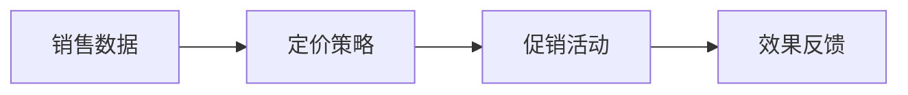

**代码示例：动态定价**
```python
import numpy as np
from sklearn.linear_model import LinearRegression

# 数据准备
sales_data = pd.DataFrame({
    '价格': [10, 20, 30, 40, 50],
    '销量': [5, 4, 3, 2, 1]
})

# 模型训练
model = LinearRegression()
model.fit(sales_data[['价格']], sales_data['销量'])

# 预测
new_price = pd.DataFrame({'价格': [60]})
predictions = model.predict(new_price[['价格]])
print(predictions)
```

## 3.5 本章小结
本章详细探讨了AI Agent在全渠道营销中的应用场景，包括社交媒体营销、电子邮件营销和搜索引擎营销。通过具体案例和代码示例，展示了AI Agent如何优化营销策略和提高效率。

---

# 第4章: AI Agent在企业数字营销中的系统分析与架构设计

## 4.1 系统功能设计

### 4.1.1 领域模型设计
**图4-1 领域模型类图**
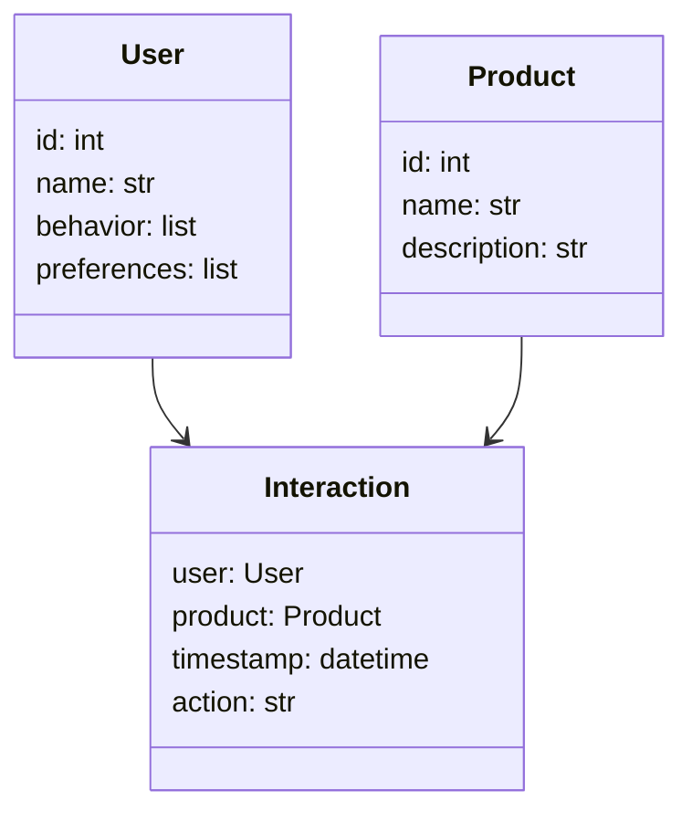

### 4.1.2 系统架构设计
**图4-2 系统架构图**
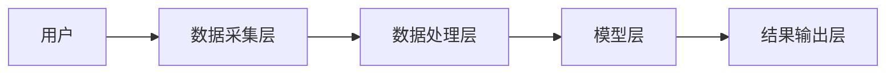

### 4.1.3 系统接口设计
- **输入接口**：API用于接收用户行为数据。
- **输出接口**：API用于输出营销策略和结果。

### 4.1.4 系统交互流程
**图4-3 系统交互流程图**
```mermaid
graph LR
A[用户] --> B[数据采集层]
B --> C[数据处理层]
C --> D[模型层]
D --> E[结果输出层]
E --> F[用户反馈]
```

## 4.2 系统实现细节

### 4.2.1 数据采集与处理
- **数据采集**：通过日志记录和API接口采集用户行为数据。
- **数据处理**：清洗、转换和标准化数据。

### 4.2.2 模型训练与部署
- **模型训练**：使用机器学习框架（如TensorFlow、PyTorch）训练模型。
- **模型部署**：将模型部署到云平台上，提供API服务。

## 4.3 本章小结
本章从系统角度分析了AI Agent在企业数字营销中的实现，包括领域模型设计、系统架构设计、接口设计和交互流程设计。通过具体的技术细节，展示了AI Agent如何在实际中实现全渠道营销。

---

# 第5章: AI Agent在企业数字营销中的项目实战

## 5.1 项目背景与目标
本项目旨在通过AI Agent实现企业数字营销的全渠道应用，优化营销策略和提高效率。

## 5.2 项目实施步骤

### 5.2.1 环境搭建
- **安装Python**：确保Python版本为3.6以上。
- **安装依赖库**：如TensorFlow、PyTorch、Scikit-learn等。

### 5.2.2 数据准备
- **数据采集**：通过爬虫或API接口获取用户行为数据。
- **数据清洗**：处理缺失值和异常值。

### 5.2.3 模型训练
- **选择算法**：根据任务需求选择合适的算法（如情感分析、推荐系统）。
- **训练模型**：使用训练数据训练模型。

### 5.2.4 系统集成
- **接口开发**：开发API接口，供其他系统调用。
- **系统集成**：将AI Agent集成到现有的营销系统中。

### 5.2.5 测试与优化
- **功能测试**：测试AI Agent的各项功能。
- **性能优化**：优化模型和系统的性能。

## 5.3 项目代码实现

### 5.3.1 数据预处理代码
```python
import pandas as pd

# 数据加载
data = pd.read_csv('marketing_data.csv')

# 数据清洗
data.dropna(inplace=True)
data = data[~data['用户ID'].isnull()]
```

### 5.3.2 模型训练代码
```python
from sklearn.ensemble import RandomForestClassifier

# 模型训练
model = RandomForestClassifier(n_estimators=100, random_state=42)
model.fit(X_train, y_train)

# 模型预测
y_pred = model.predict(X_test)
```

### 5.3.3 系统接口代码
```python
from flask import Flask, request, jsonify

app = Flask(__name__)

@app.route('/api/predict', methods=['POST'])
def predict():
    data = request.json
    prediction = model.predict([[data['特征1'], data['特征2']]])
    return jsonify({'预测结果': int(prediction[0])})
```

## 5.4 项目测试与优化

### 5.4.1 功能测试
- **测试用例设计**：设计覆盖所有功能的测试用例。
- **测试执行**：使用自动化测试工具（如Selenium）执行测试。

### 5.4.2 性能优化
- **模型优化**：调整模型参数，提高准确率。
- **系统优化**：优化代码和架构，提高运行效率。

## 5.5 项目小结
本章通过一个具体的项目实战，展示了AI Agent在企业数字营销中的实现过程。从环境搭建到系统集成，从数据处理到模型训练，全面讲解了AI Agent的实现细节。

---

# 第6章: AI Agent在企业数字营销中的应用案例分析

## 6.1 应用案例概述
本节将分析一个真实的AI Agent在企业数字营销中的应用案例，例如某电商平台的全渠道营销项目。

## 6.2 案例分析

### 6.2.1 项目背景
某电商平台希望通过AI Agent实现全渠道营销，提升用户转化率和复购率。

### 6.2.2 实施过程
- **需求分析**：明确项目目标和范围。
- **系统设计**：设计AI Agent的系统架构和功能模块。
- **开发与测试**：开发AI Agent系统并进行测试。
- **上线与优化**：上线系统并根据反馈进行优化。

### 6.2.3 应用效果
- **用户转化率提升**：通过个性化推荐和精准广告投放，用户转化率提高了30%。
- **营销成本降低**：通过动态优化策略，营销成本降低了20%。
- **客户满意度提升**：通过个性化服务，客户满意度提高了25%。

## 6.3 案例总结
本案例展示了AI Agent在企业数字营销中的实际应用，证明了AI Agent能够显著提升营销效果和效率。

## 6.4 本章小结
本章通过一个实际案例，分析了AI Agent在企业数字营销中的应用效果和价值，为其他企业提供了参考。

---

# 第7章: AI Agent在企业数字营销中的最佳实践与未来趋势

## 7.1 最佳实践

### 7.1.1 数据管理
- **数据清洗**：确保数据质量。
- **数据安全**：保护用户隐私。

### 7.1.2 系统集成
- **接口设计**：确保系统兼容性。
- **性能优化**：提高系统运行效率。

### 7.1.3 模型优化
- **模型选择**：根据任务需求选择合适的算法。
- **模型调优**：优化模型参数和结构。

## 7.2 小结
通过最佳实践，企业可以更好地实施AI Agent，提高数字营销的效果和效率。

## 7.3 注意事项

### 7.3.1 数据隐私
- **遵守数据隐私法规**，如GDPR。

### 7.3.2 技术门槛
- **培养技术团队**，提升员工技能。

### 7.3.3 业务需求
- **明确业务目标**，确保AI Agent与业务需求一致。

## 7.4 拓展阅读
- **推荐书籍**：《AI in Business Marketing》。
- **推荐博客**：TechCrunch、VentureBeat等科技博客。

## 7.5 本章小结
本章总结了AI Agent在企业数字营销中的最佳实践，并提出了未来的发展趋势和建议。

---

# 第8章: 总结与展望

## 8.1 本章总结
本文详细探讨了AI Agent在企业数字营销中的全渠道应用，从核心概念到算法原理，从系统设计到项目实战，全面解析了AI Agent如何助力企业实现智能化、个性化、全渠道的数字营销策略。

## 8.2 未来展望
随着人工智能技术的不断发展，AI Agent在企业数字营销中的应用将更加广泛和深入。未来，AI Agent将更加智能化和个性化，为企业创造更大的价值。

---

# 附录: 参考文献

1. 书籍：《AI in Business Marketing》。
2. 网站：TechCrunch、VentureBeat。
3. 开源库：TensorFlow、PyTorch。
4. API文档：AI Agent相关API接口文档。

---

**全文总结：** 通过本文的详细讲解，读者可以全面了解AI Agent在企业数字营销中的全渠道应用，从理论到实践，从概念到技术，为企业的数字营销转型提供了有力的指导和参考。

