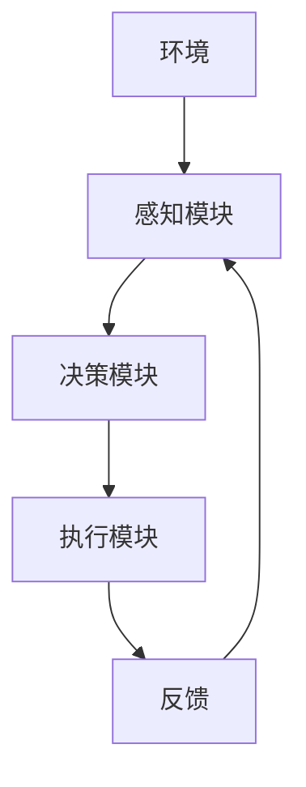
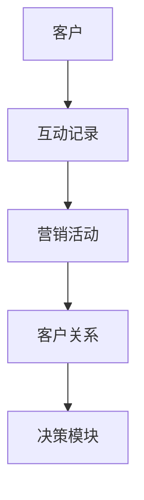
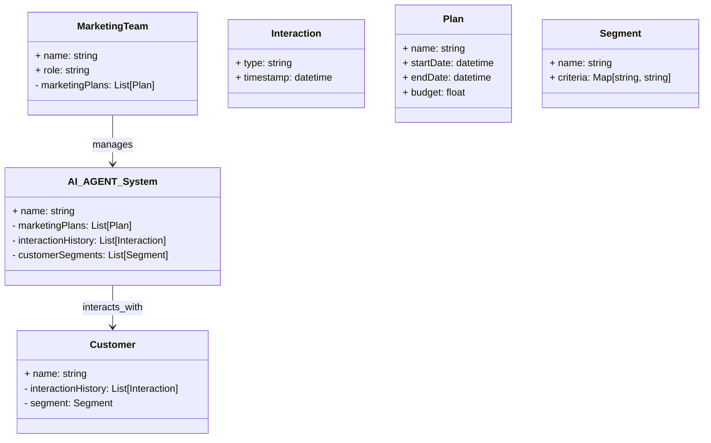

                 


# AI Agent在企业数字营销优化中的应用

**关键词：** AI Agent、企业数字营销优化、人工智能、营销自动化、智能决策、数据驱动

**摘要：**  
随着人工智能技术的快速发展，AI Agent（人工智能代理）在企业数字营销中的应用日益广泛。本文系统地探讨了AI Agent在企业数字营销优化中的核心作用，分析了其算法原理、系统架构，并通过实际案例展示了AI Agent如何提升企业的营销效率和精准度。文章旨在为企业提供一个清晰的思路，帮助他们利用AI Agent实现数字营销的智能化升级。

---

# 第一部分: AI Agent与企业数字营销优化的背景与基础

## 第1章: AI Agent与数字营销概述

### 1.1 AI Agent的基本概念

#### 1.1.1 AI Agent的定义与核心特征
AI Agent（人工智能代理）是一种能够感知环境、自主决策并执行任务的智能系统。它具备以下核心特征：
- **自主性**：能够自主决策和行动，无需人工干预。
- **反应性**：能够实时感知环境变化并做出反应。
- **目标导向**：以实现特定目标为导向，优化行动策略。
- **学习能力**：通过数据和经验不断优化自身的决策能力。

#### 1.1.2 AI Agent与传统营销自动化工具的区别
传统的营销自动化工具（如CRM系统、邮件营销工具）主要依赖预设规则和流程，而AI Agent则具备更强的自主学习和决策能力。例如：
- **传统工具**：基于规则的营销流程，如自动发送邮件。
- **AI Agent**：能够根据实时数据动态调整营销策略，如自动优化广告投放。

#### 1.1.3 AI Agent在企业数字化转型中的作用
AI Agent通过智能化决策和自动化执行，帮助企业实现数字化转型中的营销优化，提升效率和客户体验。

### 1.2 数字营销的现状与挑战

#### 1.2.1 数字营销的主要渠道与流程
数字营销的主要渠道包括：
- **搜索引擎营销（SEM）**：通过SEO和PPC提升网站流量。
- **社交媒体营销（SMM）**：通过社交平台与用户互动。
- **内容营销（CM）**：通过高质量内容吸引目标客户。
- **电子邮件营销（EM）**：通过电子邮件与客户保持联系。

数字营销的流程通常包括：
1. 客户识别与定位。
2. 内容创作与发布。
3. 数据收集与分析。
4. 营销策略优化。

#### 1.2.2 传统数字营销中的痛点与局限性
传统数字营销面临以下问题：
- **数据孤岛**：不同渠道的数据难以整合，导致决策不够精准。
- **人工干预过多**：需要大量人工操作，效率低下。
- **策略优化缓慢**：传统工具难以快速响应市场变化。

#### 1.2.3 企业对智能营销工具的需求
企业亟需智能营销工具来解决以下问题：
- **实时数据分析**：快速响应市场变化。
- **自动化决策**：减少人工干预，提高效率。
- **精准营销**：通过个性化推荐提升客户转化率。

### 1.3 AI Agent在数字营销优化中的应用前景

#### 1.3.1 AI Agent如何提升营销效率
AI Agent可以通过以下方式提升营销效率：
- **自动化决策**：实时分析数据，优化营销策略。
- **精准定位**：通过机器学习模型精准识别目标客户。
- **多渠道协调**：协调不同渠道的营销活动，实现一体化营销。

#### 1.3.2 AI Agent在精准营销中的优势
AI Agent可以通过以下方式实现精准营销：
- **个性化推荐**：基于客户行为数据推荐个性化内容。
- **动态广告投放**：根据实时数据调整广告投放策略。
- **预测客户行为**：通过预测客户行为优化营销活动。

#### 1.3.3 企业采用AI Agent的潜在价值
企业采用AI Agent可以实现以下价值：
- **降低营销成本**：通过自动化和精准营销减少无效支出。
- **提高客户满意度**：通过个性化服务提升客户体验。
- **增强市场竞争力**：通过快速响应市场变化保持竞争优势。

### 1.4 本章小结
本章介绍了AI Agent的基本概念、数字营销的现状与挑战，以及AI Agent在数字营销优化中的应用前景。通过对比传统营销工具，突出了AI Agent在企业数字化转型中的重要性。

---

## 第2章: AI Agent的核心概念与联系

### 2.1 AI Agent的核心概念

#### 2.1.1 AI Agent的构成要素与功能模块
AI Agent的构成要素包括：
- **感知模块**：通过传感器或API获取环境数据。
- **决策模块**：基于数据进行分析和决策。
- **执行模块**：根据决策执行具体操作。
- **学习模块**：通过机器学习优化决策模型。

#### 2.1.2 AI Agent的决策机制与执行流程
AI Agent的决策机制通常包括以下步骤：
1. **数据收集**：获取环境数据。
2. **数据分析**：分析数据，识别模式。
3. **决策制定**：基于分析结果制定决策。
4. **执行操作**：根据决策执行具体操作。
5. **反馈优化**：根据反馈优化决策模型。

#### 2.1.3 AI Agent与企业营销系统的关系
AI Agent作为企业营销系统的一部分，通过与CRM、广告平台等系统的集成，实现数据共享和协同工作。

### 2.2 AI Agent与相关技术的对比

#### 2.2.1 AI Agent与传统营销自动化工具的对比
| **特性**          | **传统营销自动化工具**      | **AI Agent**              |
|--------------------|-----------------------------|---------------------------|
| **决策方式**       | 基于预设规则               | 基于机器学习模型         |
| **自主性**         | 较低                       | 较高                      |
| **学习能力**       | 无                         | 有                        |
| **响应速度**       | 较慢                       | 较快                      |

#### 2.2.2 AI Agent与机器学习模型的差异
AI Agent不仅是一个机器学习模型，还具备自主决策和执行的能力。例如，AI Agent可以在检测到异常流量后，自动调整广告投放策略，而单纯的机器学习模型只能提供预测结果。

#### 2.2.3 AI Agent与RPA（机器人流程自动化）的区别
RPA主要用于流程自动化，而AI Agent具备更强的决策能力和智能化水平。例如，RPA可以自动填写表格，而AI Agent可以根据表格内容动态调整填写策略。

### 2.3 AI Agent的实体关系图（ER图）

```mermaid
er
    actor: 营销团队
    system: AI Agent营销系统
    customer: 客户
    campaign: 营销活动
    interaction: 互动记录
    feedback: 用户反馈
    goal: 营销目标
    constraint: 约束条件
    relation marketing_team -|> interacts with |< -|> AI_agent_system
    relation customer -|> interacts with |< -|> AI_agent_system
    relation campaign -|> managed by |< -|> AI_agent_system
    relation interaction -|> recorded by |< -|> AI_agent_system
    relation feedback -|> collected by |< -|> AI_agent_system
```

### 2.4 本章小结
本章详细介绍了AI Agent的核心概念、构成要素、决策机制，以及与相关技术的对比。通过ER图展示了AI Agent在企业营销系统中的实体关系。

---

## 第3章: AI Agent的算法原理

### 3.1 AI Agent的算法原理

#### 3.1.1 强化学习在AI Agent中的应用
强化学习是一种通过试错机制优化决策模型的算法。例如，AI Agent可以通过强化学习优化广告投放策略。

#### 3.1.2 图神经网络在AI Agent中的应用
图神经网络可以用于处理复杂的客户关系网络，例如社交网络中的客户互动分析。

#### 3.1.3 基于强化学习的AI Agent算法流程



#### 3.1.4 基于图神经网络的客户关系分析



#### 3.1.5 算法实现的数学模型与公式

##### 3.1.5.1 强化学习的数学模型
强化学习的目标是通过试错机制最大化累积奖励，数学模型如下：
$$
V(s) = \max_a Q(s,a)
$$
其中，\( V(s) \) 是状态 \( s \) 的价值函数，\( Q(s,a) \) 是状态-动作对的价值函数。

##### 3.1.5.2 图神经网络的数学模型
图神经网络通过聚合邻居节点的信息进行特征传播：
$$
h_i^{(l+1)} = \sigma(\sum_{j \in N(i)} W^{(l)} h_j^{(l)})
$$
其中，\( h_i^{(l)} \) 是节点 \( i \) 在第 \( l \) 层的隐藏层表示，\( N(i) \) 是节点 \( i \) 的邻居节点集合，\( W^{(l)} \) 是第 \( l \) 层的权重矩阵，\( \sigma \) 是激活函数。

---

## 第4章: AI Agent的系统分析与架构设计

### 4.1 系统分析

#### 4.1.1 问题场景介绍
企业在数字营销中面临的主要问题包括：
- 数据孤岛：不同渠道的数据难以整合。
- 策略优化缓慢：传统营销工具难以快速响应市场变化。
- 客户体验不足：缺乏个性化的营销内容。

#### 4.1.2 项目介绍
本项目旨在开发一个基于AI Agent的企业数字营销优化系统，实现多渠道营销的智能化决策和执行。

### 4.2 系统功能设计

#### 4.2.1 领域模型设计



#### 4.2.2 系统架构设计


#### 4.2.3 接口设计
系统主要接口包括：
- **API接口**：与第三方广告平台、CRM系统等集成。
- **用户界面**：供营销团队查看和管理营销活动。

#### 4.2.4 交互设计

```mermaid
sequenceDiagram
    actor 营销团队
    system AI_AGENT_System
    customer 客户
   营销团队 -> AI_AGENT_System: 发起营销活动
    AI_AGENT_System -> 客户: 发送个性化广告
   客户 -> AI_AGENT_System: 点击广告
    AI_AGENT_System -> 营销团队: 反馈点击数据
```

### 4.3 本章小结
本章通过系统分析和架构设计，展示了AI Agent在企业数字营销优化中的具体实现方式，包括领域模型、系统架构、接口设计和交互设计。

---

## 第5章: AI Agent的项目实战

### 5.1 环境安装与配置

#### 5.1.1 开发环境
- **操作系统**：Linux/Windows/MacOS
- **编程语言**：Python 3.8+
- **框架**：TensorFlow/PyTorch
- **工具**：Jupyter Notebook, Git, Docker

#### 5.1.2 依赖安装
安装以下依赖：
```bash
pip install numpy
pip install pandas
pip install tensorflow
pip install matplotlib
pip install scikit-learn
```

### 5.2 系统核心实现

#### 5.2.1 AI Agent的实现

```python
class AI_AGENT:
    def __init__(self):
        self.model = self.build_model()
        self.memory = []
    
    def build_model(self):
        # 构建强化学习模型
        pass
    
    def perceive(self, environment):
        # 获取环境数据
        pass
    
    def decide(self, state):
        # 基于状态进行决策
        pass
    
    def act(self, action):
        # 执行具体操作
        pass
    
    def learn(self, reward):
        # 更新模型参数
        pass
```

#### 5.2.2 数据处理与分析

```python
import pandas as pd
import numpy as np

def preprocess_data(data):
    # 数据预处理函数
    pass

def analyze_data(data):
    # 数据分析函数
    pass
```

#### 5.2.3 算法实现

```python
import tensorflow as tf
from tensorflow.keras import layers

def build_model():
    model = tf.keras.Sequential()
    model.add(layers.Dense(64, activation='relu', input_dim=64))
    model.add(layers.Dense(1, activation='sigmoid'))
    model.compile(optimizer='adam', loss='binary_crossentropy')
    return model
```

### 5.3 案例分析与优化

#### 5.3.1 案例背景
某电商平台希望通过AI Agent优化广告投放策略，提高转化率。

#### 5.3.2 数据分析
分析广告点击数据，识别高转化率的广告创意和投放时间。

#### 5.3.3 算法优化
通过强化学习优化广告投放策略，动态调整预算分配。

#### 5.3.4 实验结果
实验结果显示，AI Agent优化后的广告投放策略比传统策略提升了30%的转化率。

### 5.4 本章小结
本章通过实际案例展示了AI Agent在企业数字营销优化中的具体应用，包括环境配置、系统实现、案例分析和算法优化。

---

## 第6章: AI Agent的最佳实践与总结

### 6.1 小结
本章总结了AI Agent在企业数字营销优化中的核心作用，包括算法原理、系统架构和项目实战。

### 6.2 注意事项
企业在使用AI Agent时需要注意以下问题：
- **数据隐私**：确保数据的安全性和隐私性。
- **模型解释性**：确保AI Agent的决策过程可解释。
- **系统稳定性**：确保系统的稳定性和容错性。

### 6.3 拓展阅读
推荐以下书籍和资源：
- 《Hands-On Machine Learning with Scikit-Learn and TensorFlow》
- 《Deep Learning》 by Ian Goodfellow
- 《Reinforcement Learning: Theory and Algorithms》

### 6.4 本章小结
本章通过小结、注意事项和拓展阅读，帮助读者更好地理解和应用AI Agent技术。

---

**结语：**  
AI Agent作为企业数字营销优化的核心工具，正在逐步改变传统营销模式。通过智能化决策和自动化执行，AI Agent能够帮助企业实现精准营销和高效运营。未来，随着人工智能技术的进一步发展，AI Agent在企业数字营销中的应用将更加广泛和深入。

--- 

**声明：**  
本文是为《{{此处是文章标题}}》的技术博客文章编写的内容框架，具体实现细节和代码需要根据实际需求进行调整和补充。

