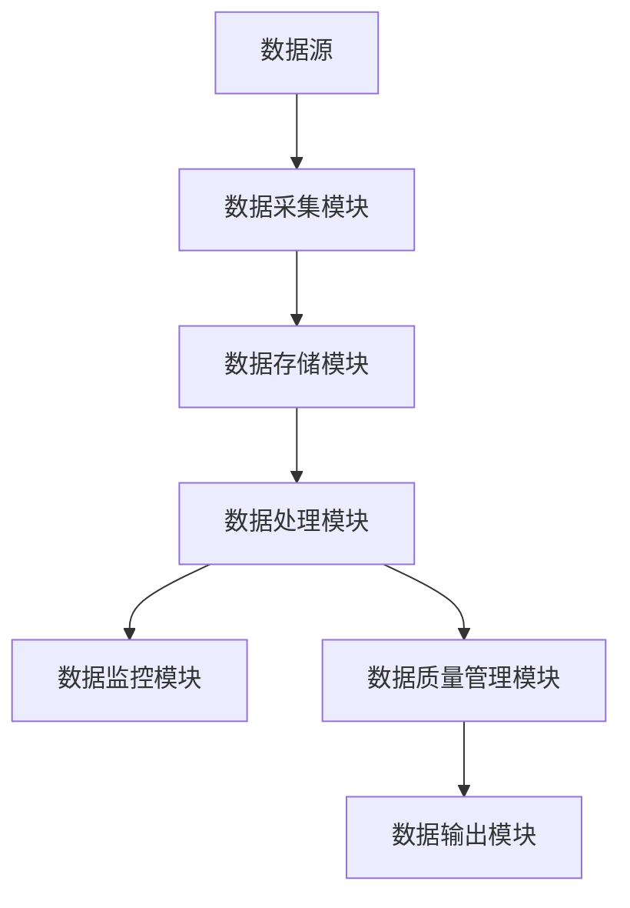

                 


# AI Agent在企业数据治理与质量管理中的应用

## 关键词：AI Agent，数据治理，数据质量管理，企业数据管理，智能化数据治理

## 摘要：  
随着企业数据规模的快速增长，数据治理与质量管理的重要性日益凸显。AI Agent作为一种智能化的代理技术，能够有效提升数据治理的效率和精准度。本文将详细探讨AI Agent在企业数据治理与质量管理中的应用，涵盖其核心概念、算法原理、系统架构设计以及实际案例分析，为企业在数据治理领域提供新的思路和解决方案。

---

# 第1章：AI Agent与数据治理的概述

## 1.1 AI Agent的基本概念  
AI Agent（人工智能代理）是指能够感知环境、自主决策并执行任务的智能实体。它具备以下核心特征：  
1. **自主性**：无需外部干预，能够独立完成任务。  
2. **反应性**：能够实时感知环境变化并做出相应调整。  
3. **目标导向**：以明确的目标为导向，优化决策和行动。  
4. **学习能力**：通过数据和经验不断优化自身性能。  

AI Agent与传统数据治理的区别主要体现在智能化和自动化方面。传统数据治理依赖人工操作，效率较低且容易出错，而AI Agent能够通过机器学习和自然语言处理等技术，实现数据治理的智能化和自动化。

## 1.2 数据治理的背景与挑战  
### 1.2.1 数据治理的背景  
随着企业数字化转型的推进，数据成为企业核心资产，数据治理的重要性日益凸显。数据治理的目标是确保数据的准确性、完整性和一致性，为企业决策提供可靠支持。  

### 1.2.2 数据治理的核心目标  
1. 确保数据质量：包括完整性、准确性、一致性等。  
2. 提升数据可用性：使数据能够被业务部门有效利用。  
3. 降低数据风险：通过规范数据管理流程，减少数据泄露和滥用的风险。  

### 1.2.3 数据治理的主要挑战  
1. 数据来源复杂：企业数据可能来自多个系统和渠道，导致数据清洗和整合难度大。  
2. 数据量庞大：海量数据的处理和分析需要高效的技术支持。  
3. 数据安全风险：数据泄露和滥用威胁企业信息安全。  

## 1.3 数据质量管理的定义与重要性  
### 1.3.1 数据质量管理的定义  
数据质量管理是指通过一系列技术和方法，确保数据的准确性、完整性和一致性。  

### 1.3.2 数据质量管理的关键维度  
1. **准确性**：数据反映真实情况的程度。  
2. **完整性**：数据是否包含所有必要信息。  
3. **一致性**：数据在不同系统中的表现是否统一。  
4. **及时性**：数据是否及时更新。  

### 1.3.3 数据质量管理对企业的重要性  
数据质量管理直接影响企业的决策质量和业务效率。高质量的数据能够提升企业竞争力，降低运营成本，并增强客户信任。

## 1.4 AI Agent在数据治理中的作用  
### 1.4.1 AI Agent如何提升数据治理效率  
AI Agent能够通过自动化技术快速识别和处理数据问题，显著提升数据治理效率。  

### 1.4.2 AI Agent在数据质量管理中的应用  
AI Agent可以通过机器学习算法自动清洗数据，识别异常值，并进行数据增强。  

### 1.4.3 AI Agent与数据治理的结合优势  
AI Agent的优势在于其智能化和自动化能力，能够显著降低数据治理的人力成本，并提高数据治理的精准度。

## 1.5 本章小结  
本章介绍了AI Agent的基本概念及其在数据治理中的作用，分析了数据治理和数据质量管理的背景与挑战，为后续章节奠定了基础。

---

# 第2章：数据治理与质量管理的背景分析

## 2.1 数据治理的背景  
### 2.1.1 数据治理的发展历程  
数据治理从早期的手工管理逐步发展到智能化管理，经历了多个阶段。  

### 2.1.2 数据治理的驱动因素  
1. **业务需求**：企业对数据依赖性增强，推动数据治理发展。  
2. **技术进步**：人工智能和大数据技术为数据治理提供了新工具。  
3. **法规要求**：数据隐私保护法规（如GDPR）对企业数据治理提出更高要求。  

### 2.1.3 数据治理的行业现状  
目前，数据治理在金融、医疗和制造等行业得到广泛应用，但仍面临技术与管理上的双重挑战。

## 2.2 数据质量管理的背景  
### 2.2.1 数据质量管理的演变  
数据质量管理从简单的数据清洗发展到智能化的数据增强和标准化。  

### 2.2.2 数据质量管理的挑战  
1. **数据多样性**：不同类型数据的处理难度不同。  
2. **数据动态性**：数据实时更新导致管理复杂性增加。  
3. **技术局限性**：现有技术在处理复杂数据问题时仍存在不足。  

### 2.2.3 数据质量管理的解决方案  
通过引入AI Agent技术，数据质量管理能够实现自动化和智能化，显著提升效率。

## 2.3 AI Agent技术的背景  
### 2.3.1 AI Agent技术的发展历程  
AI Agent技术经历了从简单规则驱动到复杂机器学习模型的演变。  

### 2.3.2 AI Agent技术的核心优势  
1. **智能化**：能够自主学习和优化。  
2. **高效性**：通过自动化技术快速处理任务。  
3. **适应性**：能够根据环境变化调整策略。  

### 2.3.3 AI Agent技术的未来趋势  
未来，AI Agent将更加注重人机协作，进一步提升其在数据治理中的应用潜力。

## 2.4 数据治理与AI Agent的结合背景  
### 2.4.1 数据治理与AI Agent的契合点  
AI Agent的智能化和自动化能力与数据治理的需求高度契合。  

### 2.4.2 数据治理与AI Agent的行业需求  
随着企业对数据质量要求的提高，市场对AI Agent驱动的数据治理解决方案需求日益增长。  

### 2.4.3 数据治理与AI Agent的技术融合  
通过技术融合，数据治理将更加高效和精准，为企业创造更大价值。

## 2.5 本章小结  
本章分析了数据治理与质量管理的背景，探讨了AI Agent技术的发展与应用，为后续章节的深入讨论奠定了基础。

---

# 第3章：AI Agent在数据治理中的核心概念

## 3.1 数据治理的核心概念  
### 3.1.1 数据治理的范围  
数据治理涵盖数据的全生命周期管理，包括数据采集、存储、处理和应用。  

### 3.1.2 数据治理的关键要素  
1. **数据架构**：数据的组织方式和存储结构。  
2. **数据安全**：数据的保护措施。  
3. **数据访问控制**：对数据访问权限的管理。  
4. **数据质量监控**：对数据质量的实时监控和优化。  

### 3.1.3 数据治理的实施步骤  
1. **需求分析**：明确数据治理的目标和范围。  
2. **架构设计**：设计数据治理体系结构。  
3. **工具选型**：选择合适的数据治理工具。  
4. **实施与优化**：逐步实施并持续优化。  

## 3.2 数据质量管理的核心概念  
### 3.2.1 数据质量管理的目标  
通过技术手段确保数据的准确性、完整性和一致性。  

### 3.2.2 数据质量管理的流程  
1. **数据清洗**：去除无效数据，修正错误数据。  
2. **数据增强**：补充缺失数据，提升数据质量。  
3. **数据标准化**：统一数据格式和规范。  

### 3.2.3 数据质量管理的工具与方法  
1. **数据清洗工具**：如Pandas、Excel等。  
2. **数据增强方法**：如插值法、回归分析等。  
3. **数据标准化技术**：如归一化、离散化等。  

## 3.3 AI Agent在数据治理中的核心概念  
### 3.3.1 AI Agent的数据治理能力  
AI Agent能够通过机器学习模型自动识别数据问题，并提出解决方案。  

### 3.3.2 AI Agent的数据质量管理能力  
AI Agent能够实现数据清洗、数据增强和数据标准化的自动化。  

### 3.3.3 AI Agent与数据治理的结合模式  
AI Agent作为数据治理的核心组件，与其他数据治理工具协同工作，形成智能化的数据治理体系。

## 3.4 本章小结  
本章详细阐述了数据治理和数据质量管理的核心概念，分析了AI Agent在数据治理中的能力与作用，为后续章节的具体应用提供了理论基础。

---

# 第4章：AI Agent在数据质量管理中的应用

## 4.1 数据清洗与AI Agent  
### 4.1.1 数据清洗的定义与挑战  
数据清洗是指识别和处理数据中的错误和不一致。挑战包括数据冗余、数据缺失和数据不一致等问题。  

### 4.1.2 AI Agent在数据清洗中的应用  
AI Agent能够通过聚类分析和异常检测算法自动识别错误数据，并提出清洗方案。  

## 4.2 数据增强与AI Agent  
### 4.2.1 数据增强的定义与方法  
数据增强是指通过技术手段补充或修改数据，提升数据质量。常用方法包括插值法、回归分析和数据合成等。  

### 4.2.2 AI Agent在数据增强中的应用  
AI Agent能够根据数据分布自动选择最优的数据增强方法，并生成高质量的数据。  

## 4.3 数据标准化与AI Agent  
### 4.3.1 数据标准化的定义与重要性  
数据标准化是指将数据转换为统一格式的过程，是确保数据一致性的关键步骤。  

### 4.3.2 AI Agent在数据标准化中的应用  
AI Agent能够通过机器学习模型自动识别数据格式问题，并进行标准化处理。  

## 4.4 案例分析：AI Agent在数据质量管理中的应用  
### 4.4.1 案例背景  
某企业面临数据来源多样化、数据质量参差不齐的问题，希望通过AI Agent提升数据质量管理效率。  

### 4.4.2 AI Agent的解决方案  
1. 数据清洗：识别并修正数据中的错误和冗余。  
2. 数据增强：补充缺失数据，提升数据完整性。  
3. 数据标准化：统一数据格式，确保数据一致性。  

### 4.4.3 实施效果  
通过AI Agent的应用，企业数据质量显著提升，数据处理效率提高，为企业决策提供了更可靠的支持。  

## 4.5 本章小结  
本章通过具体案例展示了AI Agent在数据质量管理中的应用，详细分析了数据清洗、数据增强和数据标准化的实现过程，证明了AI Agent在数据质量管理中的巨大潜力。

---

# 第5章：AI Agent驱动的数据治理系统架构设计

## 5.1 系统设计  
### 5.1.1 系统目标  
设计一个基于AI Agent的智能化数据治理系统，实现数据清洗、数据增强和数据标准化的自动化。  

### 5.1.2 系统功能需求  
1. 数据采集与存储：从多个数据源采集数据并存储。  
2. 数据处理：包括数据清洗、数据增强和数据标准化。  
3. 数据监控：实时监控数据质量，并自动调整处理策略。  

## 5.2 系统架构设计  
### 5.2.1 系统架构图  


### 5.2.2 核心模块设计  
1. **数据采集模块**：负责从多个数据源采集数据。  
2. **数据存储模块**：将采集到的数据存储到数据库中。  
3. **数据处理模块**：包括数据清洗、数据增强和数据标准化功能。  
4. **数据监控模块**：实时监控数据质量，并自动调整处理策略。  
5. **数据质量管理模块**：通过AI Agent技术优化数据质量。  

## 5.3 系统实现  
### 5.3.1 数据采集与存储  
使用Python的pandas库进行数据采集，并将数据存储到MySQL数据库中。  

### 5.3.2 数据处理  
通过机器学习算法实现数据清洗和数据增强，并使用正则表达式进行数据标准化。  

### 5.3.3 数据监控  
通过设置阈值，实时监控数据质量，并根据监控结果调整数据处理策略。  

## 5.4 系统优化  
### 5.4.1 性能优化  
通过分布式计算和并行处理提升数据处理效率。  

### 5.4.2 算法优化  
优化机器学习算法，提升数据清洗和数据增强的准确率。  

## 5.5 本章小结  
本章详细设计了基于AI Agent的智能化数据治理系统架构，并通过具体实现展示了系统的功能和优势。

---

# 第6章：AI Agent驱动的数据质量管理解决方案

## 6.1 数据质量管理解决方案概述  
通过引入AI Agent技术，数据质量管理能够实现自动化和智能化，显著提升数据质量。  

## 6.2 数据清洗解决方案  
### 6.2.1 数据清洗算法  
使用聚类分析和异常检测算法自动识别错误数据，并提出清洗方案。  

### 6.2.2 数据清洗实现  
通过Python的scikit-learn库实现异常检测，并自动修正错误数据。  

## 6.3 数据增强解决方案  
### 6.3.1 数据增强算法  
通过插值法和回归分析实现数据增强。  

### 6.3.2 数据增强实现  
使用Python的numpy库生成合成数据，并补充到原始数据中。  

## 6.4 数据标准化解决方案  
### 6.4.1 数据标准化算法  
通过归一化和离散化方法实现数据标准化。  

### 6.4.2 数据标准化实现  
使用Python的pandas库对数据进行标准化处理。  

## 6.5 案例分析：AI Agent驱动的数据质量管理  
### 6.5.1 案例背景  
某企业面临数据质量问题，希望通过AI Agent实现数据质量管理的自动化。  

### 6.5.2 AI Agent的解决方案  
1. 数据清洗：识别并修正错误数据。  
2. 数据增强：补充缺失数据，提升数据完整性。  
3. 数据标准化：统一数据格式，确保数据一致性。  

### 6.5.3 实施效果  
通过AI Agent的应用，企业数据质量显著提升，数据处理效率提高，为企业决策提供了更可靠的支持。  

## 6.6 本章小结  
本章详细介绍了AI Agent在数据质量管理中的具体解决方案，通过案例分析展示了其实际应用效果，为企业提供了宝贵的经验。

---

# 第7章：AI Agent驱动的数据治理项目实战

## 7.1 项目背景  
某企业面临数据来源多样化、数据质量参差不齐的问题，希望通过AI Agent提升数据治理效率。  

## 7.2 项目目标  
实现数据清洗、数据增强和数据标准化的自动化，提升数据质量。  

## 7.3 项目实施  
### 7.3.1 环境配置  
1. **安装Python**：版本3.8以上。  
2. **安装依赖库**：pandas、numpy、scikit-learn、mermaid。  

### 7.3.2 核心代码实现  
```python
import pandas as pd
from sklearn.cluster import KMeans
import numpy as np

# 数据清洗
def data_cleaning(df):
    # 删除重复数据
    df.drop_duplicates(inplace=True)
    # 处理缺失值
    df.fillna(method='ffill', inplace=True)
    return df

# 数据增强
def data_augmentation(df):
    # 插值法生成合成数据
    synthetic_data = pd.DataFrame()
    for col in df.columns:
        # 使用均值填充
        mean = df[col].mean()
        std = df[col].std()
        synthetic_data[col] = np.random.normal(mean, std, len(df))
    return synthetic_data

# 数据标准化
def data_normalization(df):
    # 归一化处理
    normalized_df = df.apply(lambda x: (x - x.min()) / (x.max() - x.min()))
    return normalized_df

# 主程序
if __name__ == "__main__":
    # 读取数据
    df = pd.read_csv('input.csv')
    # 数据清洗
    cleaned_df = data_cleaning(df)
    # 数据增强
    augmented_df = data_augmentation(cleaned_df)
    # 数据标准化
    normalized_df = data_normalization(cleaned_df)
    # 输出结果
    cleaned_df.to_csv('cleaned.csv', index=False)
    augmented_df.to_csv('augmented.csv', index=False)
    normalized_df.to_csv('normalized.csv', index=False)
```

### 7.3.3 代码解读  
1. **数据清洗**：删除重复数据并填充缺失值。  
2. **数据增强**：使用插值法生成合成数据。  
3. **数据标准化**：对数据进行归一化处理。  

### 7.3.4 实施效果  
通过上述代码实现数据清洗、数据增强和数据标准化的自动化，显著提升了数据质量，减少了人工干预，提高了数据治理效率。  

## 7.4 本章小结  
本章通过具体项目实战展示了AI Agent在数据治理中的应用，详细讲解了项目的实施过程和核心代码，为企业提供了可参考的实践方案。

---

# 第8章：总结与未来展望

## 8.1 总结  
本文详细探讨了AI Agent在企业数据治理与质量管理中的应用，分析了其核心概念、算法原理和系统架构设计，并通过具体案例展示了其实际应用效果。AI Agent的引入显著提升了数据治理的效率和精准度，为企业数据管理提供了新的思路和解决方案。

## 8.2 未来展望  
随着AI Agent技术的不断发展，其在数据治理中的应用将更加广泛和深入。未来，AI Agent将与区块链、物联网等技术结合，进一步提升数据治理的智能化和自动化水平，为企业创造更大的价值。

---

# 关键词：AI Agent，数据治理，数据质量管理，企业数据管理，智能化数据治理

# 结语  
AI Agent作为数据治理与质量管理的重要工具，正在改变企业数据管理的方式。通过本文的深入探讨和具体案例分析，我们相信AI Agent将在未来的数据治理中发挥更加重要的作用，为企业创造更大的竞争优势。

