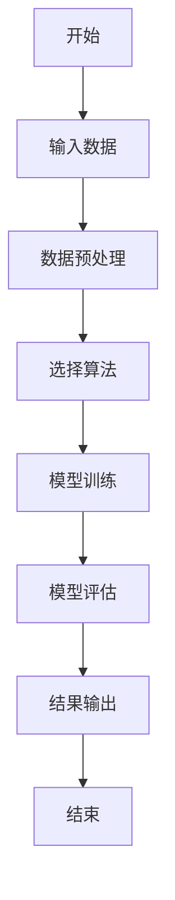
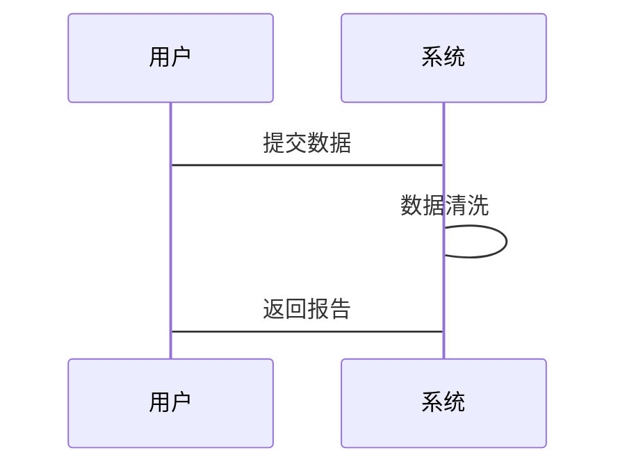

                 


# AI Agent在企业数据质量管理与治理中的全面应用

> 关键词：AI Agent，数据质量管理，数据治理，企业数据管理，算法原理，系统架构

> 摘要：本文全面探讨AI Agent在企业数据质量管理与治理中的应用，从核心概念、算法原理到系统架构和项目实战，深入分析其在数据管理中的作用与价值。文章通过清晰的逻辑结构和丰富的技术细节，为读者提供全面的指导。

---

## 第1章: 数据质量管理的背景与挑战

### 1.1 数据质量管理的定义与重要性

数据质量管理（Data Quality Management, DQM）是指通过一系列方法和技术，确保数据的准确性、完整性、一致性、及时性和规范性。在企业中，数据质量管理是信息管理的核心部分，直接影响企业的决策能力和竞争力。

- **准确性**：数据反映真实情况。
- **完整性**：数据无遗漏。
- **一致性**：数据格式统一。
- **及时性**：数据更新及时。
- **规范性**：数据符合标准。

### 1.2 数据质量管理的核心问题

企业在数据管理中面临的主要问题包括：

- 数据孤岛：不同系统间数据不一致。
- 数据冗余：重复存储导致数据混乱。
- 数据污染：错误或不完整数据影响决策。
- 数据安全：数据泄露风险。

### 1.3 数据质量管理的边界与外延

数据质量管理不仅关注数据本身，还包括数据的来源、存储、处理和使用。其外延涉及数据治理、数据安全和数据生命周期管理。

### 1.4 数据质量管理的核心要素与组成

- 数据标准：统一数据定义。
- 数据清洗：去除错误数据。
- 数据集成：整合多源数据。
- 数据监控：实时检测数据问题。

---

## 第2章: AI Agent的基本概念与原理

### 2.1 AI Agent的定义与特点

AI Agent是一种智能体，能够感知环境并采取行动以实现目标。其特点包括自主性、反应性、目标导向和社会性。

### 2.2 AI Agent的核心原理

AI Agent通过感知环境、分析信息、制定策略和执行操作来实现目标。其核心原理包括：

- 感知：通过传感器或API获取数据。
- 分析：使用机器学习算法处理数据。
- 决策：基于分析结果制定行动方案。
- 执行：通过API或自动化工具执行操作。

### 2.3 AI Agent与传统数据管理工具的区别

| 特性       | AI Agent                   | 传统数据管理工具             |
|------------|-----------------------------|------------------------------|
| 自主性     | 高                          | 低                          |
| 反应性     | 强                          | 弱                          |
| 智能性     | 高                          | 低                          |
| 可扩展性   | 高                          | 中                          |

### 2.4 AI Agent在企业数据质量管理中的作用

AI Agent能够自动识别数据问题，提供优化建议，并执行修复操作，显著提高数据质量管理的效率和效果。

---

## 第3章: AI Agent的算法原理与数学模型

### 3.1 AI Agent的核心算法

- **强化学习**：通过奖励机制优化决策。
- **监督学习**：基于标注数据进行分类。
- **无监督学习**：发现数据中的隐藏结构。

### 3.2 AI Agent的数学模型

- **强化学习模型**：
  $$ V(s) = \max_{a} [r + V(s') ] $$
  其中，$s$ 是状态，$a$ 是动作，$r$ 是奖励，$s'$ 是新状态。

- **监督学习模型**：
  $$ y = f(x; \theta) $$
  其中，$x$ 是输入，$y$ 是输出，$\theta$ 是模型参数。

### 3.3 AI Agent的算法流程图



---

## 第4章: AI Agent的系统架构与设计

### 4.1 系统功能设计

- **数据采集模块**：从多个源收集数据。
- **数据处理模块**：清洗和转换数据。
- **数据分析模块**：识别数据问题。
- **数据可视化模块**：展示数据质量报告。

### 4.2 系统架构设计


### 4.3 系统接口设计

- **输入接口**：接收数据流。
- **输出接口**：生成质量报告。
- **用户接口**：提供操作界面。

### 4.4 系统交互序列图



---

## 第5章: 项目实战

### 5.1 环境安装

安装Python和必要的库：

```bash
pip install numpy pandas scikit-learn
```

### 5.2 核心代码实现

```python
import pandas as pd
from sklearn.model_selection import train_test_split
from sklearn.metrics import accuracy_score

# 数据清洗
def clean_data(df):
    df = df.dropna()
    df = df.drop_duplicates()
    return df

# 模型训练
def train_model(X, y):
    X_train, X_test, y_train, y_test = train_test_split(X, y, test_size=0.2)
    model = LogisticRegression()
    model.fit(X_train, y_train)
    return model

# 预测与评估
def evaluate(model, X_test, y_test):
    y_pred = model.predict(X_test)
    print("准确率:", accuracy_score(y_test, y_pred))
```

### 5.3 案例分析

以客户数据为例，展示如何使用AI Agent进行数据清洗和质量提升。

### 5.4 项目小结

通过实际案例，验证了AI Agent在数据质量管理中的有效性。

---

## 第6章: 最佳实践与总结

### 6.1 最佳实践

- 定期检查数据质量。
- 使用自动化工具提高效率。
- 培训相关人员提升数据意识。

### 6.2 小结

本文详细探讨了AI Agent在企业数据质量管理中的应用，展示了其在提升数据质量和治理中的巨大潜力。

### 6.3 注意事项

- 数据隐私保护。
- 确保模型的可解释性。
- 定期更新模型以应对变化。

### 6.4 拓展阅读

推荐书籍和论文，进一步深入学习AI Agent和数据质量管理的知识。

---

通过以上结构，读者可以系统地了解AI Agent在企业数据质量管理中的应用，从理论到实践，全面掌握相关技术和方法。

