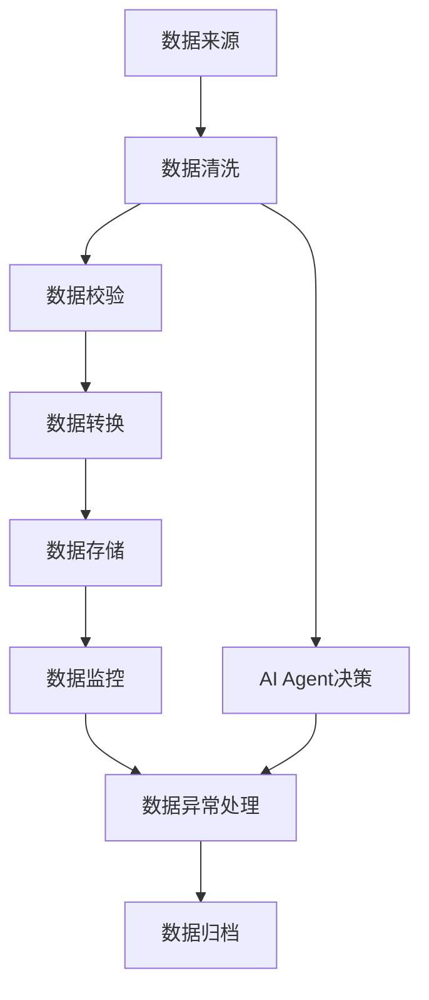
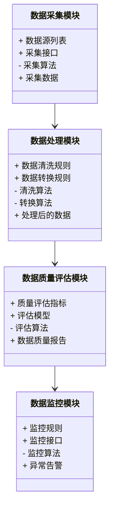

                 


# AI Agent在企业数据质量评估与自动化治理中的应用

## 关键词：AI Agent，数据质量管理，自动化治理，企业数据，数据治理

## 摘要：  
本文深入探讨了AI Agent在企业数据质量评估与自动化治理中的应用。通过分析数据质量管理的核心概念、AI Agent的智能决策机制，以及它们在企业数据治理中的结合，本文详细阐述了如何利用AI技术提升数据质量评估的效率与准确性。文章从背景、概念、算法、系统设计到项目实战，全面解析了AI Agent在数据治理中的应用，并通过具体案例展示了其实际价值。本文适合数据治理领域的技术专家、企业IT管理者以及对数据质量管理感兴趣的专业人士阅读。

---

# 第一部分: 背景与概念

## 第1章: 数据质量与AI Agent概述

### 1.1 数据质量管理的背景与挑战
数据是企业的核心资产，其质量直接关系到企业决策的准确性和业务的顺利运行。然而，随着企业数据规模的不断扩大，数据来源的多样化以及数据使用场景的复杂化，数据质量管理面临着以下挑战：

1. **数据来源多样**：企业数据可能来源于多个系统，如数据库、API接口、文件等，数据格式和内容的不一致增加了质量管理的难度。
2. **数据量大**：海量数据的处理需要高效的方法和工具，传统的人工检查方式已无法满足需求。
3. **数据更新频繁**：数据的实时性要求越来越高，传统的静态数据质量管理方法难以应对动态变化。
4. **数据隐私与安全**：数据治理过程中需要确保数据的安全性和隐私性，这对数据质量管理提出了更高的要求。

### 1.2 AI Agent的基本概念与特点
AI Agent（人工智能代理）是一种能够感知环境、执行任务并做出决策的智能体。其核心特点包括：

1. **自主性**：AI Agent能够独立执行任务，无需人工干预。
2. **反应性**：能够实时感知环境变化并做出响应。
3. **智能性**：通过机器学习、自然语言处理等技术，具备一定的推理和决策能力。
4. **协作性**：能够与其他系统或AI Agent协同工作，共同完成复杂任务。

### 1.3 数据质量评估与AI Agent的结合
数据质量评估是数据治理的重要环节，AI Agent通过其智能决策能力和自动化能力，能够显著提升数据质量管理的效率和效果。具体表现在以下几个方面：

1. **自动化数据清洗**：AI Agent可以根据预设规则或机器学习模型自动识别和修复数据中的错误。
2. **实时数据监控**：通过AI Agent实时监控数据质量，及时发现并处理数据异常。
3. **智能数据归档**：根据数据的重要性自动归档或清理低价值数据，节省存储空间。

---

## 第2章: 数据质量评估的核心概念

### 2.1 数据质量的维度与指标
数据质量可以从多个维度进行评估，常见的指标包括：

1. **完整性**：数据是否完整，是否存在缺失值。
2. **一致性**：数据在不同系统或字段中是否一致。
3. **准确性**：数据是否真实反映业务实际情况。
4. **及时性**：数据是否及时更新，是否符合业务需求的时效性。
5. **规范性**：数据是否符合预设的格式和规范。

| 数据质量维度 | 定义 | 示例 |
|----------------|------|------|
| 完整性 | 数据是否完整，无缺失值 | 检查用户信息表中是否所有字段都有数据 |
| 一致性 | 数据在不同系统或字段中是否一致 | 检查同一用户的姓名在不同系统中是否一致 |
| 准确性 | 数据是否真实反映业务实际情况 | 检查订单金额是否与实际交易金额一致 |
| 及时性 | 数据是否及时更新 | 检查库存数据是否与最新库存记录一致 |
| 规范性 | 数据是否符合预设格式 | 检查日期格式是否为YYYY-MM-DD |

### 2.2 数据质量管理的流程
数据质量管理通常包括以下几个步骤：

1. **数据收集**：从各个数据源获取数据。
2. **数据清洗**：去除重复数据、处理缺失值、纠正错误数据。
3. **数据转换**：将数据转换为适合后续处理的格式。
4. **数据存储**：将处理后的数据存储到目标数据库或数据仓库。
5. **数据监控**：实时监控数据质量，发现异常及时处理。

### 2.3 数据质量管理的工具与技术
常用的工具和技术创新：

1. **数据清洗工具**：如OpenRefine、DataCleaner等。
2. **数据校验工具**：如Apache Nifi、Talend等。
3. **数据可视化工具**：如Tableau、Power BI等。
4. **数据建模工具**：如Python的pandas库、R语言等。

---

## 第3章: AI Agent在数据治理中的核心概念

### 3.1 AI Agent的智能决策机制
AI Agent的智能决策机制主要包括以下三种类型：

1. **基于规则的决策**：根据预设的规则进行判断和决策。
2. **基于机器学习的决策**：通过训练模型，基于输入数据预测结果。
3. **基于自然语言处理的决策**：通过理解和分析文本内容，做出决策。

### 3.2 AI Agent的数据处理能力
AI Agent在数据治理中的数据处理能力包括：

1. **数据清洗与预处理**：自动识别和修复数据中的错误。
2. **数据异常检测**：通过机器学习算法发现数据中的异常值。
3. **数据关联分析**：分析数据之间的关联关系，发现潜在问题。

### 3.3 AI Agent的自动化能力
AI Agent的自动化能力体现在以下几个方面：

1. **自动化数据修复**：根据规则或模型自动修复数据错误。
2. **自动化数据归档**：根据数据价值自动归档或清理低价值数据。
3. **自动化数据监控**：实时监控数据质量，及时发现并处理异常。

### 3.4 数据质量评估与AI Agent的关系
数据质量评估与AI Agent之间存在密切关系，可以通过以下模型进行描述：

```mermaid
graph TD
    A[数据质量评估] --> B[数据来源]
    A --> C[数据格式]
    A --> D[数据内容]
    A --> E[数据使用场景]
    B --> F[数据完整性]
    C --> G[数据一致性]
    D --> H[数据准确性]
    E --> I[数据及时性]
    F, G, H, I --> J[数据质量管理]
    J --> K[AI Agent的决策]
```

---

## 第4章: 数据质量评估与AI Agent的结合模型

### 4.1 数据质量评估的核心要素
数据质量评估的核心要素包括：

1. **数据来源**：数据的来源是否可靠。
2. **数据格式**：数据是否符合预设格式。
3. **数据内容**：数据是否真实、准确。
4. **数据使用场景**：数据是否适用于特定场景。

### 4.2 AI Agent在数据治理中的角色
AI Agent在数据治理中的角色可以分为以下几种：

1. **数据质量管理的参与者**：作为数据治理团队的一部分，参与数据质量的评估和优化。
2. **数据治理工具的提供者**：提供基于AI的工具，帮助其他团队进行数据治理。
3. **数据治理流程的执行者**：通过自动化流程，执行数据清洗、监控等任务。

### 4.3 数据质量评估与AI Agent的结合模型
数据质量评估与AI Agent的结合可以通过以下模型进行描述：



---

## 第5章: 数据质量评估与AI Agent的算法原理

### 5.1 数据清洗与预处理
数据清洗是数据质量管理的第一步，主要包括以下步骤：

1. **去除重复数据**：通过哈希算法或唯一标识符识别重复数据。
2. **处理缺失值**：根据业务规则或机器学习模型填充缺失值。
3. **纠正错误数据**：通过正则表达式或分类模型修复错误数据。

### 5.2 数据异常检测
数据异常检测可以通过以下算法实现：

1. **基于统计的方法**：如Z-score、IQR等。
2. **基于机器学习的方法**：如Isolation Forest、One-Class SVM等。
3. **基于深度学习的方法**：如Autoencoder、GAN等。

### 5.3 数据增强
数据增强是通过技术手段提高数据质量的过程，常用的方法包括：

1. **数据填充**：使用均值、中位数等填充缺失值。
2. **数据转换**：将数据转换为更适合模型的格式。
3. **数据标准化**：将数据标准化到统一的范围内。

---

## 第6章: 数据质量评估与AI Agent的系统设计

### 6.1 系统功能设计
数据质量评估与AI Agent的系统功能设计包括：

1. **数据采集模块**：从多个数据源采集数据。
2. **数据处理模块**：进行数据清洗、转换等预处理。
3. **数据质量评估模块**：根据预设指标评估数据质量。
4. **数据监控模块**：实时监控数据质量，发现异常及时告警。

### 6.2 系统架构设计
系统的架构设计可以通过以下类图表示：



---

## 第7章: 项目实战

### 7.1 项目背景与需求分析
假设我们正在为一家电商公司设计数据质量管理方案。该公司存在以下问题：

1. **订单数据重复**：由于系统错误，部分订单数据被重复录入。
2. **客户信息不完整**：部分客户信息存在缺失值。
3. **数据更新不及时**：库存数据更新滞后，导致库存显示不准确。

### 7.2 系统设计与实现
#### 7.2.1 环境配置
- 操作系统：Linux
- 开发工具：Python、Jupyter Notebook
- 数据库：MySQL
- 机器学习框架：Scikit-learn

#### 7.2.2 核心代码实现
以下是数据清洗和异常检测的代码示例：

```python
import pandas as pd
from sklearn.ensemble import IsolationForest

# 数据加载
df = pd.read_csv('data.csv')

# 数据清洗
# 去除重复数据
df.drop_duplicates(inplace=True)

# 处理缺失值
df['missing_value'].fillna(df['missing_value'].mean(), inplace=True)

# 异常检测
model = IsolationForest(random_state=42)
model.fit(df)
outliers = model.predict(df)
normal_indices = outliers == 1
cleaned_df = df.iloc[normal_indices]
```

#### 7.2.3 项目小结
通过上述方案，我们成功解决了电商公司的数据质量问题，提高了数据的准确性和及时性。

---

## 第8章: 总结与展望

### 8.1 本章总结
本文详细探讨了AI Agent在企业数据质量评估与自动化治理中的应用，从背景、概念、算法到系统设计，全面解析了AI Agent在数据治理中的价值和实现方法。

### 8.2 未来展望
随着AI技术的不断发展，AI Agent在数据治理中的应用将更加广泛和深入。未来的研究方向包括：

1. **数据隐私保护**：在数据治理过程中如何保护数据隐私。
2. **模型可解释性**：如何提高AI Agent决策的可解释性。
3. **多模态数据处理**：如何处理文本、图像等多种数据类型。

### 8.3 最佳实践 Tips
- 在数据治理过程中，始终关注数据的隐私和安全问题。
- 定期对数据治理模型进行优化和更新，以适应业务需求的变化。
- 结合企业实际情况选择合适的数据治理工具和技术。

---

通过本文的分析与实践，我们可以看到AI Agent在企业数据质量评估与自动化治理中的巨大潜力。未来，随着技术的进一步发展，AI Agent将为企业数据治理带来更多的创新和突破。

