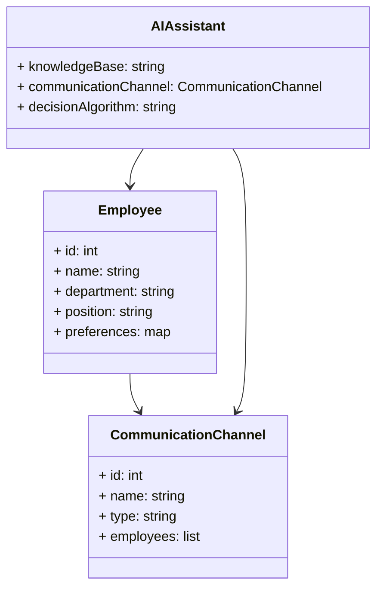
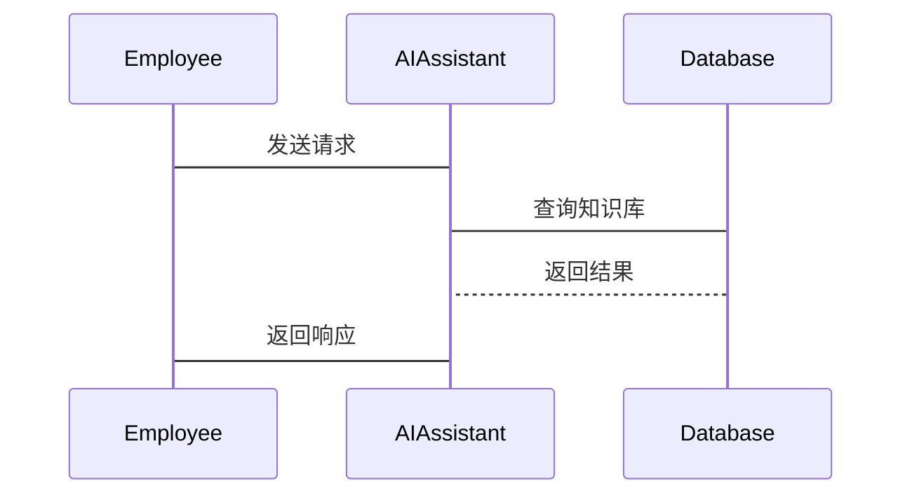

                 


# AI Agent在企业文化建设与内部沟通中的创新应用

> 关键词：AI Agent，企业文化，内部沟通，创新应用，人工智能，企业架构

> 摘要：本文探讨了AI Agent在企业文化建设与内部沟通中的创新应用，分析了AI Agent的核心概念、算法原理、系统架构，并通过具体案例展示了其在企业文化建设中的实际应用价值。文章还总结了最佳实践和未来发展趋势，为企业的数字化转型提供了新的思路。

---

## 第1章 AI Agent与企业文化建设的背景介绍

### 1.1 AI Agent的定义与优势

#### 1.1.1 AI Agent的基本定义
AI Agent（人工智能代理）是一种能够感知环境、执行任务并做出决策的智能系统。它通过数据驱动的方式，帮助企业实现自动化、智能化的目标。AI Agent的优势在于其学习能力、适应性和高效性，能够为企业内部沟通和文化建设提供强有力的支持。

#### 1.1.2 AI Agent在企业中的优势
AI Agent可以帮助企业实现以下目标：
1. 提高内部沟通效率，减少信息传递中的损耗。
2. 实现个性化员工体验，增强员工参与感。
3. 自动化处理企业文化建设中的重复性任务，降低人工成本。

#### 1.1.3 企业文化建设的必要性
企业文化是企业的灵魂，决定了企业的凝聚力和发展方向。在数字化转型的背景下，企业文化建设的重要性更加凸显。AI Agent作为技术工具，能够帮助企业更高效地传播文化、促进沟通、提升员工满意度。

---

### 1.2 企业内部沟通的挑战

#### 1.2.1 传统沟通方式的局限性
传统的企业内部沟通方式存在以下问题：
1. 信息传递效率低，容易出现信息孤岛。
2. 员工参与度低，难以实现双向互动。
3. 沟通内容难以个性化，难以满足不同员工的需求。

#### 1.2.2 数字化沟通的现状与问题
尽管数字化工具（如邮件、即时通讯工具）在企业内部沟通中得到广泛应用，但仍存在以下问题：
1. 数据孤岛现象严重，难以实现信息的统一管理。
2. 沟通工具缺乏智能化，难以提供个性化服务。
3. 员工对数字化工具的接受度不一，影响沟通效果。

#### 1.2.3 AI Agent在沟通中的潜在价值
AI Agent可以通过以下方式解决上述问题：
1. 实现信息的智能化分发，确保信息高效传递。
2. 提供个性化的员工体验，提升员工满意度。
3. 通过数据分析优化企业文化建设，推动企业目标的实现。

---

## 第2章 AI Agent的核心概念与工作原理

### 2.1 AI Agent的体系结构

#### 2.1.1 知识库的构建与管理
AI Agent的知识库是其工作的基础。知识库包括企业的核心价值观、文化理念、规章制度等内容。知识库的构建需要结合企业的实际情况，确保信息的准确性和完整性。

#### 2.1.2 感知模块的功能与实现
感知模块负责收集和分析企业内部的沟通数据，包括员工的行为数据、反馈数据等。通过这些数据，AI Agent能够了解员工的需求和偏好，从而提供个性化的服务。

#### 2.1.3 决策模块的算法与优化
决策模块是AI Agent的核心，负责根据感知模块提供的数据，结合预设的规则和模型，做出最优决策。决策模块的优化需要结合实际应用场景，不断调整算法参数，以提高决策的准确性和效率。

---

### 2.2 AI Agent的算法原理

#### 2.2.1 基于规则的决策算法
基于规则的决策算法是一种简单的AI Agent决策方式。它通过预设的规则和条件，判断输入数据的匹配程度，输出相应的决策结果。例如，在企业内部沟通中，AI Agent可以根据员工的职位和部门，自动分配相应的沟通内容。

#### 2.2.2 基于机器学习的预测算法
基于机器学习的预测算法是一种更高级的决策方式。它通过训练模型，预测员工的行为和需求，从而做出更加智能的决策。例如，AI Agent可以通过分析员工的历史行为数据，预测员工可能感兴趣的内容，并主动推送相关信息。

#### 2.2.3 算法选择的影响因素
在选择AI Agent的算法时，需要考虑以下因素：
1. 数据量：如果数据量较小，基于规则的算法可能更适合。
2. 数据质量：如果数据质量较高，可以考虑使用基于机器学习的算法。
3. 业务需求：不同的业务需求可能需要不同的算法。

---

## 第3章 AI Agent在企业文化建设中的创新应用

### 3.1 AI Agent在企业内部沟通中的角色

#### 3.1.1 作为员工沟通的辅助工具
AI Agent可以通过智能分发、个性化推荐等方式，帮助员工更高效地进行沟通。例如，AI Agent可以根据员工的岗位和兴趣，自动推送相关的政策法规、企业文化内容。

#### 3.1.2 作为企业文化传播的媒介
AI Agent可以作为企业文化传播的桥梁，通过智能化的方式，将企业的核心价值观和文化理念传递给每一位员工。例如，AI Agent可以通过互动问答、知识竞赛等方式，增强员工对企业文化的理解和认同。

#### 3.1.3 作为内部决策的智能支持
AI Agent可以通过数据分析，为企业文化建设提供决策支持。例如，AI Agent可以通过分析员工的反馈数据，识别企业文化中的薄弱环节，并提出改进建议。

---

### 3.2 AI Agent在企业文化建设中的实际应用

#### 3.2.1 智能化的企业文化传播
通过AI Agent，企业可以实现企业文化内容的智能化传播。例如，AI Agent可以根据员工的岗位和兴趣，自动推送相关的文化内容，确保每一位员工都能接收到适合自己需求的信息。

#### 3.2.2 个性化员工体验设计
AI Agent可以通过分析员工的行为数据，了解员工的需求和偏好，从而提供个性化的服务。例如，AI Agent可以根据员工的兴趣，推荐相关的培训课程或文化活动。

#### 3.2.3 数据驱动的企业文化优化
AI Agent可以通过数据分析，帮助企业识别企业文化中的问题，并提出优化建议。例如，AI Agent可以通过分析员工的反馈数据，识别员工满意度低的环节，并提出改进方案。

---

## 第4章 AI Agent的系统架构设计

### 4.1 问题场景介绍
本章将从一个具体的场景出发，介绍AI Agent在企业文化建设中的应用。例如，某企业希望通过AI Agent优化内部沟通，提升员工满意度。

### 4.2 项目介绍
本项目的目标是通过AI Agent实现企业内部沟通的智能化，提升员工满意度。项目包括以下几个阶段：
1. 需求分析与规划
2. 系统设计与开发
3. 测试与优化
4. 部署与推广

### 4.3 系统功能设计

#### 4.3.1 领域模型设计
领域模型是系统设计的重要组成部分。以下是领域模型的类图：



#### 4.3.2 系统架构设计
以下是系统架构的分层图：


#### 4.3.3 系统交互设计
以下是系统交互的序列图：



---

## 第5章 项目实战：AI Agent在企业文化建设中的应用

### 5.1 环境安装与配置
本项目需要以下环境：
1. Python 3.8+
2. TensorFlow 2.0+
3. Scikit-learn 0.20+
4. Jupyter Notebook

### 5.2 核心代码实现

#### 5.2.1 知识库构建
以下是知识库构建的代码示例：

```python
import json

# 知识库内容
knowledge_base = {
    "企业文化": {
        "核心价值观": "创新、协作、客户至上",
        "愿景": "成为行业领先的公司",
        "使命": "为客户创造价值"
    },
    "规章制度": {
        "考勤制度": "每天按时上下班",
        "请假流程": "提前申请"
    }
}

# 保存知识库
with open("knowledge_base.json", "w") as f:
    json.dump(knowledge_base, f)
```

#### 5.2.2 感知模块实现
以下是感知模块的代码示例：

```python
import json
import pandas as pd

# 加载知识库
with open("knowledge_base.json", "r") as f:
    knowledge_base = json.load(f)

# 感知模块函数
def感知员工需求（employee_id）：
    # 获取员工信息
    employee = get_employee_info（employee_id）
    # 分析员工需求
    preferences = employee["preferences"]
    # 返回相关知识库内容
    return knowledge_base["企业文化"][preferences]

```

#### 5.2.3 决策模块实现
以下是决策模块的代码示例：

```python
import json
import numpy as np
from sklearn.tree import DecisionTreeClassifier

# 加载数据集
data = pd.read_csv("employee_feedback.csv")

# 特征工程
X = data.drop(columns=["反馈"])
y = data["反馈"]

# 训练决策树模型
model = DecisionTreeClassifier()
model.fit(X, y)

# 预测员工需求
def预测员工需求（employee_info）：
    # 数据预处理
    X_test = preprocess_data（employee_info）
    # 预测结果
    prediction = model.predict（X_test）
    return prediction
```

### 5.3 项目小结
通过本项目，我们实现了AI Agent在企业文化建设中的应用。AI Agent能够根据员工的需求，提供个性化的沟通服务，从而提升员工的满意度和企业的凝聚力。

---

## 第6章 最佳实践与未来展望

### 6.1 最佳实践
1. **数据隐私保护**：在使用AI Agent时，必须重视员工数据的隐私保护，确保数据的安全性。
2. **用户教育与培训**：企业需要对员工进行AI Agent使用的培训，提高员工的接受度和使用效率。
3. **持续优化**：AI Agent的应用需要根据企业的实际需求，不断优化算法和系统架构，确保其适应企业的动态变化。

### 6.2 未来展望
随着人工智能技术的不断发展，AI Agent在企业文化建设中的应用将更加广泛。未来，AI Agent将更加智能化、个性化，为企业文化建设和内部沟通提供更强大的支持。

---

## 结语
AI Agent作为一项新兴技术，正在为企业文化的建设和内部沟通带来深远的影响。通过本文的分析，我们相信AI Agent将在未来的中国企业中发挥越来越重要的作用。

